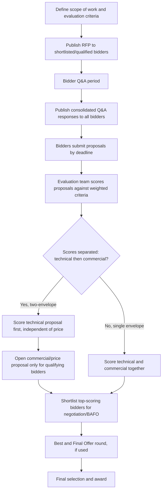

## Request for Proposal and Competitive Bidding Design

### Definition and Conceptual Basis

Request for Proposal (RFP) and competitive bidding design is the discipline of structuring a formal solicitation so that supplier responses are genuinely comparable, evaluation is defensible and bias-resistant, and the resulting process actually surfaces the best-fit supplier rather than merely the best-written proposal or the lowest headline price. This sits within Step 4 (sourcing process selection) of the broader strategic sourcing process, and its design choices — document structure, evaluation criteria, weighting, and bidding mechanism — directly determine whether the subsequent negotiation and selection step has good information to work with.

### RFI vs. RFP vs. RFQ: Selecting the Right Instrument

**Key Points**: Instrument selection should follow directly from how well-defined the requirement is and what differentiates suppliers in this specific category:

- **RFI (Request for Information)**: Appropriate when the buying organization needs to map supplier capability broadly before committing to a formal solicitation — output is qualitative capability information, not a bindable commercial offer.
- **RFP (Request for Proposal)**: Appropriate when the solution approach itself is not fully specified and suppliers are expected to propose *how* they would meet the requirement, not just *at what price* — common for complex services, strategic-quadrant categories, and situations where supplier methodology materially affects outcome quality.
- **RFQ (Request for Quotation)**: Appropriate when specifications are fully defined and the primary open variable is price — common for leverage and non-critical quadrant items with standardized, well-understood requirements.

Using an RFQ-style price-only solicitation for a strategic, methodology-dependent requirement (or conversely, running a lengthy RFP process for a fully commoditized item) is a frequent source of process misfit discussed further in the pitfalls section below.

### Core RFP Document Structure

A well-designed RFP document typically contains the following sections, each serving a distinct function in enabling comparable, evaluable responses:

- **Introduction and background**: Context on the buying organization, the business need driving the solicitation, and the category's strategic importance — calibrating supplier effort and proposal depth to the opportunity's actual significance.
- **Scope of work / requirements specification**: The detailed statement of what is being procured, written specifically enough to enable comparison but not so prescriptively that it forecloses legitimate alternative supplier approaches (over-specification is a common failure mode discussed below).
- **Instructions to bidders**: Submission format, required proposal sections, page limits, submission deadline and method, and rules governing bidder questions (typically funneled through a single Q&A period with answers shared with all bidders to preserve a level playing field).
- **Evaluation criteria and weighting**: Explicit disclosure of how proposals will be scored — the specific criteria, their relative weights, and (where used) minimum threshold requirements that must be met regardless of overall score.
- **Commercial terms**: Contract structure, payment terms, service level requirements, and any standard terms and conditions the buyer expects the eventual contract to incorporate.
- **Required supplier information**: Financial statements, references, certifications, and other qualification-stage documentation (overlapping directly with the supplier qualification criteria covered separately), often required even when formal qualification will occur as a separate subsequent step.

### RFP-to-Award Process Flow



### Evaluation Criteria and Weighted Scoring Design

**Key Points**:

- Evaluation criteria should be defined and weighted *before* proposals are received, not adjusted afterward to favor a particular outcome — pre-committing to a scoring rubric is the primary safeguard against evaluator bias and is frequently a hard requirement in public-sector and regulated procurement contexts.
- Common criteria categories include technical/solution quality, price/commercial terms, supplier capability and track record, implementation timeline and risk, and — increasingly — sustainability/ESG criteria, with relative weights set according to the category's Kraljic positioning (price-heavy weighting for leverage categories, capability- and continuity-heavy weighting for strategic categories, consistent with the qualification-weighting logic covered under supplier qualification).
- A **two-envelope process** — evaluating technical/solution quality completely before commercial pricing is even opened — is a common design specifically intended to prevent price from anchoring or unconsciously influencing the technical evaluation, particularly valuable for strategic-quadrant categories where solution quality differentiation is the primary decision driver.

### Weighted Scoring Model Example

```python
def evaluate_proposals(proposals, weights):
    """
    proposals: dict of bidder_name -> dict of criterion -> score (0-100)
    weights: dict of criterion -> weight (sums to 1.0)
    """
    results = {}
    for bidder, scores in proposals.items():
        weighted_total = sum(scores[criterion] * weights[criterion] for criterion in weights)
        results[bidder] = weighted_total
    return dict(sorted(results.items(), key=lambda x: x[1], reverse=True))

weights = {
    "technical_solution": 0.35,
    "price": 0.25,
    "implementation_capability": 0.20,
    "track_record": 0.15,
    "sustainability": 0.05
}

proposals = {
    "Bidder A": {"technical_solution": 90, "price": 70, "implementation_capability": 85,
                 "track_record": 80, "sustainability": 60},
    "Bidder B": {"technical_solution": 75, "price": 95, "implementation_capability": 70,
                 "track_record": 90, "sustainability": 75},
    "Bidder C": {"technical_solution": 85, "price": 80, "implementation_capability": 90,
                 "track_record": 70, "sustainability": 85},
}

ranked = evaluate_proposals(proposals, weights)
for bidder, score in ranked.items():
    print(f"{bidder}: {score:.2f}")
```

**Output**:

```plaintext
Bidder A: 82.50
Bidder C: 81.75
Bidder B: 80.50
```

**Key Points**: This result illustrates the core value of weighted multi-criteria scoring — Bidder B has the highest price score (lowest cost) but ranks last overall once technical solution quality, implementation capability, and track record are weighted in, which is precisely the outcome a price-only RFQ-style comparison would have missed.

### Bidding Mechanism Design

- **Sealed-bid (single-round)**: Bidders submit one final proposal with no further negotiation or revision opportunity — maximizes procedural fairness and is common in public-sector procurement, but forgoes the price/solution improvement that iterative processes can extract.
- **Best and Final Offer (BAFO)**: After an initial evaluation round, a shortlist of top bidders is invited to submit a revised, final proposal — commonly used to sharpen pricing or clarify solution details among finalists before final award, balancing competitive tension against process efficiency.
- **Reverse (electronic) auction**: Real-time, iterative competitive bidding, most appropriate for well-specified, commoditized RFQ-style categories (as noted under strategic sourcing process selection) where price is the dominant remaining variable and a sufficient number of qualified bidders exist to sustain genuine competitive dynamics.
- **Negotiated procurement**: A structured but more flexible process involving direct negotiation with one or a shortlist of bidders rather than a single-round formal comparison — most appropriate for strategic-quadrant, highly customized, or relationship-intensive categories where a rigid formal bid process would poorly capture the actual value drivers.

### Bidding Mechanism Selection Diagram

(svg_diagram)

<svg xmlns="http://www.w3.org/2000/svg" viewBox="0 0 800 300">
<text x="400" y="24" text-anchor="middle" font-size="16" font-weight="bold" fill="#111">Bidding Mechanism by Category Type (svg_diagram)</text>
<line x1="80" y1="250" x2="740" y2="250" stroke="#333" stroke-width="1.5" />
<text x="410" y="275" text-anchor="middle" font-size="12" fill="#333">Commoditization / Specification Clarity →</text>
<rect x="100" y="180" width="160" height="60" fill="#ffd6d6" stroke="#b03030" />
<text x="180" y="205" text-anchor="middle" font-size="11" fill="#111">Negotiated</text>
<text x="180" y="222" text-anchor="middle" font-size="11" fill="#111">Procurement</text>
<rect x="290" y="140" width="160" height="60" fill="#ffe9cc" stroke="#c07b1e" />
<text x="370" y="165" text-anchor="middle" font-size="11" fill="#111">Sealed-Bid</text>
<text x="370" y="182" text-anchor="middle" font-size="11" fill="#111">RFP</text>
<rect x="480" y="100" width="160" height="60" fill="#dceeff" stroke="#2a6fb0" />
<text x="560" y="125" text-anchor="middle" font-size="11" fill="#111">RFP with</text>
<text x="560" y="142" text-anchor="middle" font-size="11" fill="#111">BAFO round</text>
<rect x="600" y="50" width="120" height="60" fill="#c2f0c2" stroke="#2a8a2a" />
<text x="660" y="75" text-anchor="middle" font-size="11" fill="#111">Reverse</text>
<text x="660" y="92" text-anchor="middle" font-size="11" fill="#111">eAuction</text>

<text x="180" y="270" text-anchor="middle" font-size="10" fill="#555">Strategic</text>

<text x="660" y="270" text-anchor="middle" font-size="10" fill="#555">Leverage/Non-critical</text>

</svg>

### Governance and Fairness Safeguards

**Key Points**:

- A **single-source-of-truth Q&A process** — all bidder questions and buyer answers shared with every participating bidder simultaneously — prevents any single bidder from gaining an informational advantage through informal side-channel clarification.
- **Evaluator independence and conflict-of-interest disclosure** is a standard governance requirement, particularly in public-sector and regulated procurement, to ensure scoring reflects genuine merit assessment rather than pre-existing relationships.
- **Documented audit trail** of scoring rationale for each criterion and bidder is commonly required to defend award decisions against challenge, particularly relevant for strategic or high-value awards where an unsuccessful bidder may formally contest the outcome.

### Common Pitfalls

- Over-specifying the scope of work to the point that it effectively describes only one supplier's existing solution, artificially narrowing genuine competition and potentially exposing the process to legitimate fairness challenges from other bidders.
- Finalizing evaluation criteria and weights only after proposals have been received, allowing the scoring framework to be — consciously or unconsciously — shaped around a preferred outcome rather than set as a genuine, unbiased *ex ante* standard.
- Selecting a bidding mechanism mismatched to category type — running a full multi-round negotiated RFP process for a simple, well-specified leverage-category item wastes both buyer and supplier resources, while running a price-only reverse auction for a strategic, methodology-dependent requirement can select for the cheapest rather than the best-fit proposal.
- Allowing informal side-channel communication with individual bidders during the solicitation period, undermining both the fairness and the legal defensibility of the process, particularly in public-sector contexts subject to procurement challenge or protest procedures.

### Related Topics

- The Strategic Sourcing Process
- Supplier Identification, Qualification, and Onboarding
- Total Cost of Ownership (TCO) Analysis
- Kraljic Purchasing Portfolio Matrix and Category Segmentation
- Contract Negotiation Strategy and Structure
- Public Procurement Regulations and Bid Protest Procedures
- Single, Multiple, and Dual Sourcing Strategies