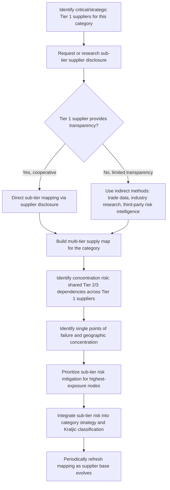

## Category Management Across Supplier Tiers

### Definition and Conceptual Basis

Category management is the organizational discipline of assigning ownership of a defined spend category — and, critically, of extending strategic visibility and management attention beyond the buyer's direct (Tier 1) suppliers into the deeper sub-tiers (Tier 2, Tier 3, and beyond) that ultimately supply those direct suppliers. Traditional procurement organizations frequently manage relationships only with Tier 1 suppliers, treating whatever happens further upstream as that supplier's own internal concern. Extending category management across tiers means the buying organization deliberately builds visibility into, and where warranted actively manages risk and performance within, the sub-tier structure underlying its critical categories — because a disruption, quality failure, or compliance breach at Tier 2 or Tier 3 can propagate directly into Tier 1 supply continuity regardless of how well the Tier 1 relationship itself is managed.

### Supply Chain Tier Structure

**Key Points**:

- **Tier 1 suppliers**: Suppliers with a direct commercial relationship and contract with the buying organization — the suppliers category managers traditionally focus on exclusively.
- **Tier 2 suppliers**: Suppliers to the buyer's Tier 1 suppliers — typically invisible to the buyer without deliberate mapping effort, since no direct contractual relationship exists.
- **Tier 3+ suppliers**: Suppliers further upstream still (raw material producers, sub-component manufacturers), often the true source of specialized inputs, critical materials, or concentrated supply risk that determines Tier 1 supply reliability.
- [Inference] Multi-tier visibility gaps are widely discussed in supply chain risk literature as a structural blind spot — a buying organization can conduct rigorous Tier 1 supplier qualification and still be fully exposed to a Tier 2 or Tier 3 disruption it had no visibility into, since standard qualification processes as covered separately typically focus on the direct Tier 1 relationship rather than that supplier's own upstream dependencies.

### Multi-Tier Supply Network Diagram

(svg_diagram)

<svg xmlns="http://www.w3.org/2000/svg" viewBox="0 0 850 340">
<text x="425" y="24" text-anchor="middle" font-size="16" font-weight="bold" fill="#111">Multi-Tier Supply Network Visibility (svg_diagram)</text>
<rect x="680" y="140" width="140" height="60" rx="6" fill="#dceeff" stroke="#2a6fb0" stroke-width="2" />
<text x="750" y="175" text-anchor="middle" font-size="12" fill="#111">Buying Org</text>
<rect x="460" y="80" width="140" height="55" rx="6" fill="#c2f0c2" stroke="#2a8a2a" stroke-width="2" />
<text x="530" y="112" text-anchor="middle" font-size="11" fill="#111">Tier 1 Supplier A</text>
<rect x="460" y="205" width="140" height="55" rx="6" fill="#c2f0c2" stroke="#2a8a2a" stroke-width="2" />
<text x="530" y="237" text-anchor="middle" font-size="11" fill="#111">Tier 1 Supplier B</text>
<rect x="240" y="40" width="140" height="50" rx="6" fill="#ffe9cc" stroke="#c07b1e" stroke-dasharray="4,3" />
<text x="310" y="69" text-anchor="middle" font-size="10" fill="#111">Tier 2 (mapped)</text>
<rect x="240" y="110" width="140" height="50" rx="6" fill="#ffe9cc" stroke="#c07b1e" stroke-dasharray="4,3" />
<text x="310" y="139" text-anchor="middle" font-size="10" fill="#111">Tier 2 (mapped)</text>
<rect x="30" y="75" width="140" height="50" rx="6" fill="#ffd6d6" stroke="#b03030" stroke-dasharray="2,3" />
<text x="100" y="95" text-anchor="middle" font-size="9" fill="#111">Tier 3</text>
<text x="100" y="112" text-anchor="middle" font-size="9" fill="#111">(often unmapped)</text>
<rect x="240" y="250" width="140" height="50" rx="6" fill="#e0e0e0" stroke="#888" stroke-dasharray="1,4" />
<text x="310" y="272" text-anchor="middle" font-size="9" fill="#333">Tier 2 (unmapped)</text>
<text x="310" y="288" text-anchor="middle" font-size="9" fill="#333">— blind spot</text>
<line x1="680" y1="165" x2="603" y2="115" stroke="#333" stroke-width="2" marker-end="url(#tierarrow)" />
<line x1="680" y1="185" x2="603" y2="230" stroke="#333" stroke-width="2" marker-end="url(#tierarrow)" />
<line x1="457" y1="100" x2="383" y2="80" stroke="#333" stroke-width="1.5" marker-end="url(#tierarrow)" />
<line x1="457" y1="120" x2="383" y2="140" stroke="#333" stroke-width="1.5" marker-end="url(#tierarrow)" />
<line x1="237" y1="70" x2="173" y2="92" stroke="#333" stroke-width="1.5" stroke-dasharray="3,2" marker-end="url(#tierarrow)" />
<line x1="457" y1="235" x2="383" y2="270" stroke="#888" stroke-width="1.5" stroke-dasharray="3,3" />

<text x="425" y="320" text-anchor="middle" font-size="10" fill="#555" font-style="italic">Dashed borders indicate no direct contractual relationship with the buying organization</text>

</svg>

### Why Multi-Tier Visibility Matters

**Key Points**:

- **Concentration risk detection**: A buyer may believe it has genuine dual or multiple sourcing at Tier 1 (per the sourcing strategy framework covered separately), while both Tier 1 suppliers actually depend on the same single Tier 2 or Tier 3 source — a common failure mode where apparent supply redundancy is illusory once the tier structure is actually mapped.
- **Cascading disruption propagation**: A disruption several tiers upstream (a raw material shortage, a sub-supplier facility fire, a regional disaster) can silently propagate forward, surfacing at Tier 1 as an unexplained lead-time extension or capacity constraint the buyer has no early warning of without upstream visibility.
- **Compliance and regulatory exposure**: Increasingly, regulatory frameworks (conflict minerals reporting, forced labor due diligence regulations, deforestation-linked supply chain laws) impose disclosure or due-diligence obligations that extend beyond Tier 1, making sub-tier visibility a compliance requirement rather than purely a risk-management best practice in many industries and jurisdictions.
- **Bullwhip and lead-time variability amplification**: Multi-tier chains are exactly the structure in which the bullwhip effect and lead-time variability compounding, covered elsewhere in this syllabus, occur — category managers with only Tier 1 visibility cannot diagnose whether an observed order or lead-time volatility originates at Tier 1 or is being inherited from further upstream.

### Multi-Tier Mapping Methodology

### Approaches to Building Multi-Tier Visibility

- **Direct supplier disclosure requirements**: Contractually requiring Tier 1 suppliers to disclose their own critical sub-suppliers for specific components or materials, sometimes formalized through supply chain mapping questionnaires as part of the qualification or contract renewal process.
- **Third-party supply chain risk intelligence platforms**: [Unverified] Specialized risk-monitoring services and platforms that aggregate corporate ownership data, trade flow records, and news/event monitoring to construct probabilistic multi-tier supply maps without requiring full supplier cooperation — specific vendor capabilities and coverage vary and should be evaluated directly against current documentation rather than assumed.
- **Industry consortium data sharing**: In some sectors, industry associations or consortia maintain shared sub-tier mapping data (particularly for conflict-minerals and similar compliance-driven disclosure regimes) that individual buying organizations can leverage rather than mapping independently from scratch.
- **Collaborative risk assessment with strategic Tier 1 partners**: For genuinely strategic-quadrant relationships (per the Kraljic framework), joint risk assessment workshops with the Tier 1 supplier — extending the collaborative planning ethos of VMI-style relationships upstream into supply chain risk mapping specifically.

### Category Strategy Integration Across Tiers

**Key Points**: Once sub-tier visibility exists, category strategy development (Step 3 of the strategic sourcing process) should incorporate multi-tier findings directly rather than treating them as a separate risk-management side process:

- A category initially classified as **leverage** (low supply risk, multiple viable Tier 1 suppliers) may warrant reclassification toward **bottleneck** if multi-tier mapping reveals that all viable Tier 1 alternatives ultimately depend on the same concentrated Tier 2 or Tier 3 source.
- Sourcing strategy decisions (single, dual, or multiple sourcing, covered separately) should be evaluated at the level where genuine independence actually exists in the supply network, not merely at the contractually visible Tier 1 level — true diversification requires diversification at the tier where the actual concentration risk resides.
- TCO and risk-cost modeling, covered under Total Cost of Ownership analysis, should incorporate sub-tier disruption probability where material, since the disruption-cost term in a TCO calculation is understated if it only accounts for Tier 1 failure modes.

### Organizational Structure for Cross-Tier Category Management

**Key Points**: [Inference] Organizations that formally extend category management across tiers commonly differentiate this effort by category criticality rather than applying deep multi-tier mapping uniformly across the entire spend base, given the substantial data-gathering and relationship effort involved — full multi-tier mapping is typically reserved for strategic and bottleneck-quadrant categories where the risk-mitigation value justifies the mapping investment, while leverage and non-critical categories are usually managed at Tier 1 visibility only, consistent with the broader principle (seen throughout this chapter) of scaling analytical and management effort to category risk and value rather than applying uniform depth everywhere.

### Common Pitfalls

- Assuming Tier 1 sourcing diversification (dual or multiple sourcing) automatically confers genuine supply resilience without verifying whether those Tier 1 suppliers share common upstream dependencies that would undermine the apparent redundancy.
- Treating multi-tier mapping as a one-time project rather than a periodically refreshed process, since sub-tier supplier relationships, capacity, and risk profiles evolve independently of — and largely invisibly to — the buying organization's own Tier 1 relationship management activities.
- Applying uniform, resource-intensive multi-tier mapping effort across the entire category portfolio regardless of criticality, diluting mapping resources away from the strategic and bottleneck categories where the risk-mitigation value is actually concentrated.
- Relying solely on Tier 1 supplier self-disclosure without independent verification or triangulation, particularly for categories with regulatory compliance implications where the buying organization may retain legal or reputational exposure regardless of what a Tier 1 supplier reported.

### Related Topics

- The Strategic Sourcing Process
- Single, Multiple, and Dual Sourcing Strategies
- Kraljic Purchasing Portfolio Matrix and Category Segmentation
- Supply Chain Risk Management and Business Continuity Planning
- Total Cost of Ownership (TCO) Analysis
- Bullwhip Effect Quantification and Multi-Tier Lead-Time Variability
- Supplier Identification, Qualification, and Onboarding