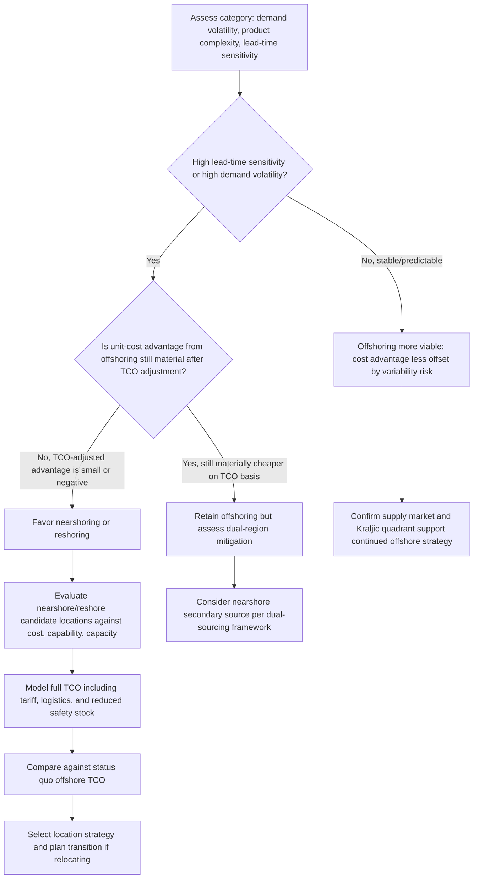

## Nearshoring, Offshoring, and Reshoring Decisions


### Definition and Conceptual Basis

Nearshoring, offshoring, and reshoring describe three distinct geographic sourcing postures a buying organization can adopt for its supply base, each representing a different point on the trade-off between labor/production cost arbitrage and proximity-driven responsiveness, risk, and control. **Offshoring** locates sourcing or production in a distant country, typically to capture significant labor or input-cost advantages. **Nearshoring** locates sourcing or production in a nearby country (often sharing a border, time zone, or trade agreement), trading some cost advantage for reduced lead time, lower logistics complexity, and easier oversight. **Reshoring** (also called onshoring or backshoring) brings previously offshored production back to the buying organization's home country, typically prioritizing supply chain resilience, quality control, or responsiveness over the labor-cost advantage that originally motivated the offshore move.

### Comparative Framework

| Dimension | Offshoring | Nearshoring | Reshoring |
| --- | --- | --- | --- |
| Labor/production cost | Typically lowest | Moderate | Typically highest |
| Lead time | Longest | Moderate | Shortest |
| Lead-time variability | Highest (customs, distance, geopolitical exposure) | Moderate | Lowest |
| Logistics/freight cost | Highest | Moderate | Lowest |
| Time zone alignment | Often poor | Often favorable | Favorable |
| Quality oversight ease | Hardest (distance, cultural/language gaps) | Easier | Easiest |
| IP protection risk | [Inference] Often cited as higher-risk in weaker-IP-enforcement jurisdictions, though this varies significantly by specific country and sector | Variable by country | Typically lowest |
| Inventory buffer required | Highest (per safety stock lead-time-variability formula) | Moderate | Lowest |
| Exposure to tariff/trade policy shifts | Often highest | Moderate (subject to regional trade agreements) | Lowest |

### The Cost-Responsiveness Trade-off

**Key Points**: The core analytical tension mirrors the JIT-versus-JIC and TCO frameworks covered elsewhere in this syllabus — offshoring's unit-cost advantage must be weighed against the fully loaded cost of the longer, more variable lead time it introduces, including the safety stock carrying cost required to buffer that variability, the risk of stockout or expediting cost during disruption, and the opportunity cost of slower responsiveness to demand shifts.

$$TC_{geo} = C_{unit} \cdot V + C_{logistics} + C_{tariff} + SS_{cost}(L, \sigma_L) + C_{oversight} + P_{disruption} \cdot C_{disruption}$$

where $SS_{cost}(L, \sigma_L)$ is the safety stock carrying cost directly derived from the combined demand-and-lead-time-variability formula covered under safety stock methodology — making explicit that a geographic sourcing decision is not just a unit-cost comparison but a total cost of ownership calculation with lead time and its variability as first-class inputs, not afterthoughts.

### Location Decision Trade-off Diagram

(svg_diagram)

<svg xmlns="http://www.w3.org/2000/svg" viewBox="0 0 780 320">
<text x="390" y="24" text-anchor="middle" font-size="16" font-weight="bold" fill="#111">Cost vs Responsiveness by Sourcing Geography (svg_diagram)</text>
<line x1="80" y1="270" x2="720" y2="270" stroke="#333" stroke-width="1.5" />
<line x1="80" y1="270" x2="80" y2="50" stroke="#333" stroke-width="1.5" />
<text x="400" y="295" text-anchor="middle" font-size="12" fill="#333">Unit/Labor Cost Advantage →</text>
<text x="40" y="160" text-anchor="middle" font-size="12" fill="#333" transform="rotate(-90 40 160)">Responsiveness / Control →</text>
<circle cx="620" cy="230" r="14" fill="#b03030" />
<text x="620" y="255" text-anchor="middle" font-size="11" fill="#111">Offshoring</text>
<circle cx="390" cy="150" r="14" fill="#c07b1e" />
<text x="390" y="175" text-anchor="middle" font-size="11" fill="#111">Nearshoring</text>
<circle cx="160" cy="80" r="14" fill="#2a8a2a" />
<text x="160" y="105" text-anchor="middle" font-size="11" fill="#111">Reshoring</text>
<line x1="620" y1="230" x2="390" y2="150" stroke="#888" stroke-width="1" stroke-dasharray="4,3" />
<line x1="390" y1="150" x2="160" y2="80" stroke="#888" stroke-width="1" stroke-dasharray="4,3" />
</svg>

### Drivers of Reshoring and Nearshoring Trends

**Key Points**: [Inference] Several converging factors are commonly cited in industry and academic commentary as having shifted the balance toward nearshoring and reshoring for a subset of categories over the past several years, though the magnitude and permanence of this shift varies substantially by industry, product category, and individual firm circumstances:

- **Rising offshore labor costs**: Narrowing wage differentials in historically low-cost manufacturing regions have reduced the pure labor-cost arbitrage advantage that originally motivated much offshoring.
- **Supply chain disruption exposure**: The COVID-19 pandemic, regional conflicts, and shipping-capacity disruptions exposed the resilience cost of long, geographically concentrated supply chains, directly connecting to the JIT-fragility discussion covered under Just-in-Time versus Just-in-Case Strategies.
- **Trade policy and tariff volatility**: Increased tariff uncertainty and trade-policy shifts between major trading blocs have raised the effective and risk-adjusted cost of long-distance offshored supply relative to nearer alternatives.
- **Automation reducing labor-cost sensitivity**: As production processes become more automated, the labor-cost differential that offshoring was designed to capture becomes a smaller share of total production cost, weakening the core economic rationale for distant offshoring in automatable categories specifically.
- **Sustainability and carbon-footprint considerations**: Growing attention to transportation-related emissions as part of ESG reporting and strategy is an additional, increasingly cited factor in geographic sourcing reconsideration, alongside the compliance and ESG assessment criteria covered under supplier qualification.

### Decision Framework



### Location Decision Modeling Approach

A structured geographic sourcing decision applies the TCO framework directly, with lead-time-driven safety stock cost as an explicit line item rather than an omitted factor:

```python
def geographic_sourcing_tco(unit_price, annual_volume, freight_per_unit, tariff_rate,
                             lead_time_days, lead_time_std_days, daily_demand_std,
                             daily_demand_mean, holding_cost_rate, oversight_cost, z=1.65):
    material_cost = unit_price * annual_volume
    freight_cost = freight_per_unit * annual_volume
    tariff_cost = material_cost * tariff_rate

    # Safety stock cost driven by lead time and its variability
    safety_stock_units = z * ((lead_time_days * daily_demand_std**2 +
                                daily_demand_mean**2 * lead_time_std_days**2) ** 0.5)
    inventory_cost = safety_stock_units * unit_price * holding_cost_rate

    total_cost = material_cost + freight_cost + tariff_cost + inventory_cost + oversight_cost
    return {
        "material_cost": material_cost,
        "freight_cost": freight_cost,
        "tariff_cost": tariff_cost,
        "safety_stock_units": safety_stock_units,
        "inventory_cost": inventory_cost,
        "oversight_cost": oversight_cost,
        "total_cost": total_cost,
        "tco_per_unit": total_cost / annual_volume
    }

offshore = geographic_sourcing_tco(
    unit_price=15.00, annual_volume=200000, freight_per_unit=1.80, tariff_rate=0.06,
    lead_time_days=45, lead_time_std_days=10, daily_demand_std=120, daily_demand_mean=550,
    holding_cost_rate=0.22, oversight_cost=40000
)

nearshore = geographic_sourcing_tco(
    unit_price=18.50, annual_volume=200000, freight_per_unit=0.60, tariff_rate=0.0,
    lead_time_days=10, lead_time_std_days=2, daily_demand_std=120, daily_demand_mean=550,
    holding_cost_rate=0.22, oversight_cost=15000
)

print(f"Offshore TCO per unit: ${offshore['tco_per_unit']:.2f}")
print(f"Nearshore TCO per unit: ${nearshore['tco_per_unit']:.2f}")
```

**Output**:

```plaintext
Offshore TCO per unit: $18.15
Nearshore TCO per unit: $19.31
```

**Key Points**: In this illustrative example, offshoring retains a modest TCO advantage ($18.15 vs $19.31 per unit) once tariff, freight, and lead-time-driven safety stock costs are included — a real decision would weigh this remaining ~6% cost gap against qualitative resilience, disruption-risk, and strategic factors not captured in the unit-cost model, and would re-run the comparison under stressed disruption-probability scenarios rather than relying on a single point estimate.

### Hybrid and Portfolio Approaches

**Key Points**: Rather than a binary all-or-nothing geographic choice, mature sourcing strategies frequently apply differentiated geographic positioning by category, mirroring the segmentation logic used throughout this chapter's frameworks (Kraljic quadrant, ABC-XYZ classification):

- **Dual-region sourcing**: Maintaining both an offshore primary source and a nearshore secondary source for the same item, directly applying the dual-sourcing framework covered separately but adding a geographic-diversification dimension to the risk-mitigation rationale.
- **Category-differentiated positioning**: Retaining offshore sourcing for stable, high-volume, low-criticality items (where lead-time variability risk is manageable and cost advantage is most valuable) while nearshoring or reshoring strategic, volatile, or safety-critical items — directly paralleling the Kraljic-quadrant-differentiated sourcing strategy logic.
- **Postponement as a partial substitute**: Where full reshoring is not economically justified, applying the postponement strategies covered under inventory positioning (holding generic offshore-produced subassemblies, but performing final configuration or finishing operations nearshore) can capture part of the responsiveness benefit without fully sacrificing the offshore cost advantage.

### Common Pitfalls

- Evaluating geographic sourcing decisions on unit price alone without incorporating the full TCO impact of lead time and its variability, particularly the safety stock carrying cost that a longer, more variable offshore lead time structurally requires.
- Applying a uniform reshoring or nearshoring policy across the entire portfolio in reaction to a single disruption event, rather than differentiating by category criticality and volatility as the Kraljic and ABC-XYZ frameworks would suggest.
- Underestimating the transition cost and risk of relocating production or sourcing — new-site qualification, requalification of the supply chain, potential quality or capability gaps during ramp-up — treating a reshoring decision as a simple location swap rather than effectively a new supplier onboarding process with its own attendant risk.
- Failing to periodically re-run the geographic TCO comparison as underlying inputs shift (labor cost convergence, tariff policy changes, freight rate volatility), since a location decision that was TCO-optimal at one point in time can become stale as these inputs evolve.

### Related Topics

- Total Cost of Ownership (TCO) Analysis
- Just-in-Time versus Just-in-Case Strategies
- Single, Multiple, and Dual Sourcing Strategies
- Safety Stock Under Demand and Lead-Time Variability
- Category Management Across Supplier Tiers
- Inventory Positioning and Decoupling Points (postponement linkage)
- Supply Chain Risk Management and Business Continuity Planning