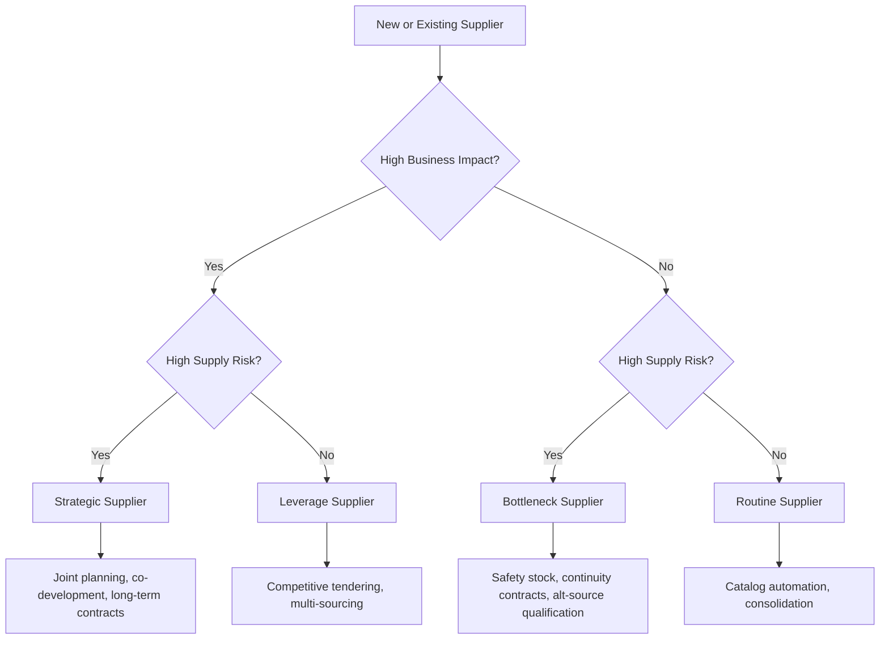

## Strategic, Leverage, Bottleneck, and Routine Supplier Categories

### Overview

These four categories form the standard supplier/item segmentation taxonomy derived from the Kraljic Matrix, applied specifically to **supplier relationships** rather than purchased items alone. While Kraljic's original model classifies purchase categories, mature procurement organizations extend this classification to define differentiated **supplier relationship management (SRM) treatment**, contract governance, KPIs, and resource allocation per supplier tier. "Routine" is the supplier-relationship-focused synonym most commonly used in place of "Non-Critical" when describing supplier tiers rather than item categories.

### Classification Dimensions

The same two axes apply:

- **Business/Profit Impact**: The value or criticality the supplier's goods/services contribute to the buyer's operations or financial performance.
- **Supply Risk**: The complexity, scarcity, or vulnerability associated with that supplier's market position, capacity, or capability.

### 1. Strategic Suppliers

**Key Points**

- High business impact, high supply risk.
- Typically few in number but represent a disproportionate share of value creation, innovation potential, or supply vulnerability.
- Often single-source or limited-source due to IP, capacity, or specialization constraints.

**Relationship Model**

- Joint business planning, executive-level relationship governance, shared roadmaps.
- Risk-sharing mechanisms: joint investment, co-development agreements, capacity reservation contracts.
- Deep integration: shared forecasting systems, EDI/API-level data exchange, sometimes vendor-managed inventory (VMI) or consignment stock.
- Long-term contracts (multi-year), often with performance-based or gain-sharing clauses.

**Governance & KPIs**

- Innovation contribution, joint cost-reduction roadmaps, supply continuity assurance, total cost of ownership (TCO) trend, strategic alignment reviews (typically quarterly or biannual executive-level business reviews).

**Example**: An automotive OEM's relationship with a battery cell manufacturer under a joint-venture or long-term offtake agreement, including co-investment in a gigafactory.

### 2. Leverage Suppliers

**Key Points**

- High business impact, low supply risk.
- Competitive supply market with multiple qualified alternatives.
- Buyer holds significant negotiating leverage due to available substitution options.

**Relationship Model**

- Competitive bidding, RFQ/RFP cycles, and periodic re-tendering to maintain price discipline.
- Multi-sourcing or dual-sourcing to preserve leverage and avoid dependency.
- Standardized contract terms; lower relationship investment than strategic suppliers.

**Governance & KPIs**

- Price competitiveness (benchmarked against market indices), delivery performance, contract compliance, cost savings realized per sourcing event.

**Example**: A packaging materials supplier where a manufacturer runs annual competitive tenders across 4–5 pre-qualified vendors to secure the best price-performance combination.

### 3. Bottleneck Suppliers

**Key Points**

- Low business impact, high supply risk.
- Often small-spend, niche, or highly specialized items where few or no alternative suppliers exist.
- Risk of operational disruption is disproportionate to the spend value.

**Relationship Model**

- Focus on supply assurance rather than cost negotiation: safety stock buffers, longer-term contracts with continuity clauses, contingency planning.
- Actively scout and qualify alternative suppliers to migrate the relationship toward "leverage" over time where feasible.
- Maintain adequate (not necessarily deep) relationship investment — enough to secure priority in allocation during shortages.

**Governance & KPIs**

- Supply continuity/on-time-in-full (OTIF) rate, lead time variability, buffer stock adequacy, alternative-supplier qualification progress.

**Example**: A specialized calibration component sourced from a single small manufacturer, where the buyer holds 3 months of safety stock and is actively qualifying a second source.

### 4. Routine (Non-Critical) Suppliers

**Key Points**

- Low business impact, low supply risk.
- High transaction volume relative to value; administrative/process efficiency is the dominant concern rather than price or risk.

**Relationship Model**

- Automation-first: e-procurement catalogs, purchase cards, self-service ordering portals.
- Consolidation of supplier base to reduce the number of transactional relationships and administrative overhead.
- Minimal individualized contract negotiation; standard terms and framework agreements.

**Governance & KPIs**

- Process cost per transaction, catalog compliance rate ("maverick spend" reduction), order-to-delivery cycle time.

**Example**: Office supplies or standard MRO consumables procured through an automated punch-out catalog integrated with the buyer's procure-to-pay system.

### Comparative Summary Table

| Category | Business Impact | Supply Risk | Sourcing Focus | Relationship Depth | Typical Contract Length |
| --- | --- | --- | --- | --- | --- |
| Strategic | High | High | Partnership & innovation | Deep, executive-level | Multi-year |
| Leverage | High | Low | Competitive price optimization | Moderate, transactional | Annual, re-tendered |
| Bottleneck | Low | High | Supply continuity assurance | Moderate, risk-focused | Continuity-driven, variable |
| Routine | Low | Low | Process efficiency | Minimal, automated | Framework/blanket |

### Migration Between Categories

Suppliers are not permanently fixed in a quadrant. Common migration patterns include:

$$\text{Bottleneck} \xrightarrow{\text{qualify 2nd source}} \text{Leverage}$$

$$\text{Strategic} \xrightarrow{\text{IP commoditized / new entrants}} \text{Leverage}$$

$$\text{Leverage} \xrightarrow{\text{supplier consolidation in market}} \text{Bottleneck or Strategic}$$

Tracking these transitions is itself a strategic sourcing activity, since supply markets, technology, and competitive dynamics evolve continuously.

### Diagram: Supplier Tiering Decision Flow

### Resource Allocation Implications

A common failure mode in procurement organizations is allocating **uniform buyer attention** across all suppliers regardless of tier. Mature category management practice explicitly reallocates scarce sourcing/category-manager time toward strategic and bottleneck suppliers (where risk and value concentration are highest), while routine suppliers are shifted toward self-service and automation to free capacity.

[Inference: The specific percentage allocation of buyer time across tiers (e.g., "80% of strategic sourcing time on 20% of suppliers") is a commonly cited heuristic in practitioner literature but is not a universally validated empirical constant — actual allocation should be calibrated to each organization's spend profile.]

### Common Pitfalls

- **Static or one-time tiering**: Not revisiting classifications as market conditions or internal strategy shift.
- **Treating bottleneck as low-priority**: Confusing low spend with low importance; bottleneck disruptions can halt production despite minimal financial value.
- **Applying leverage tactics to strategic suppliers**: Aggressive competitive bidding on a strategic supplier can damage a relationship needed for innovation or continuity, undermining long-term value.
- **Under-investing in bottleneck risk mitigation**: Because spend is low, these suppliers are often overlooked in risk management processes despite high disruption potential.

### Related Topics

- Kraljic Purchasing Portfolio Matrix (parent framework)
- Supplier Relationship Management (SRM) governance models
- Category management and spend analysis (ABC/Pareto)
- Dual-sourcing and supply continuity planning
- Total Cost of Ownership (TCO) vs. unit price optimization
- Vendor-Managed Inventory (VMI) and consignment stock models
- Supplier risk scoring and market concentration analysis