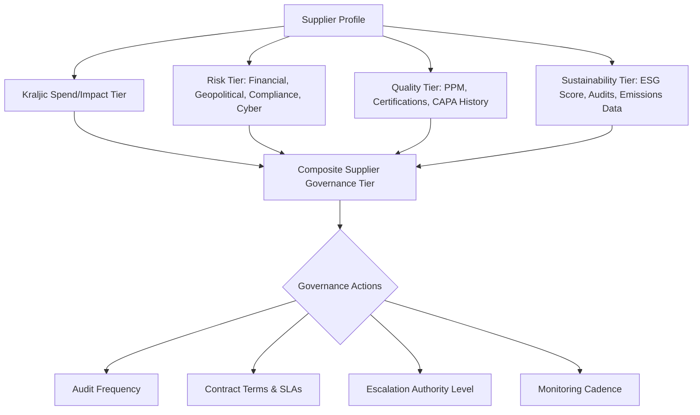

## Tiering Suppliers for Risk, Quality, and Sustainability Management

### Overview

Beyond the classic Kraljic-derived spend/risk tiering (Strategic, Leverage, Bottleneck, Routine), organizations increasingly apply **multi-dimensional tiering** to manage suppliers across risk exposure, quality performance, and sustainability/ESG (Environmental, Social, Governance) criteria. This approach recognizes that a supplier's spend-based tier does not necessarily correlate with its risk, quality, or sustainability profile — a low-spend "routine" supplier can carry high compliance or reputational risk, and a "strategic" supplier can still have significant quality or ESG gaps. Modern supplier segmentation frameworks therefore layer independent tiering axes on top of the spend/impact matrix.

### Why Multi-Dimensional Tiering Is Necessary

**Key Points**

- A single risk/spend matrix conflates distinct exposure types: financial impact, supply continuity risk, quality/compliance risk, and sustainability/reputational risk are not perfectly correlated.
- Regulatory frameworks (e.g., EU Corporate Sustainability Due Diligence Directive, German Supply Chain Due Diligence Act (LkSG), UK Modern Slavery Act) increasingly require due diligence proportional to *risk*, not spend — making risk-based tiering a compliance necessity, not just a sourcing optimization.
- Quality failures and sustainability incidents at low-spend suppliers (e.g., a sub-tier raw material supplier) can generate disproportionate brand, legal, and continuity damage, independent of dollar value.

### Dimension 1: Risk-Based Tiering

**Common Risk Factors**

- **Financial risk**: Supplier's financial health, credit rating, bankruptcy probability.
- **Geopolitical/geographic risk**: Concentration in politically unstable, sanctioned, or disaster-prone regions.
- **Operational risk**: Single-site dependency, capacity constraints, labor disputes.
- **Cybersecurity risk**: Especially relevant for suppliers with system/data integration (e.g., EDI, API access to buyer systems).
- **Compliance/regulatory risk**: Export control, anti-corruption, data privacy, and labor law exposure.

**Typical Risk Tier Structure**

| Tier | Description | Due Diligence Depth |
| --- | --- | --- |
| Tier 1 (Critical Risk) | High financial/operational/compliance exposure or high spend concentration | Full audits, on-site assessments, continuous monitoring |
| Tier 2 (Moderate Risk) | Moderate exposure, some dependency or compliance sensitivity | Periodic self-assessment questionnaires (SAQs), desk-based review |
| Tier 3 (Low Risk) | Low exposure, easily substitutable, minimal compliance sensitivity | Standard onboarding checks only |

**Methodology**: Risk scoring typically combines a weighted composite index:

$$R_{supplier} = w_1 F + w_2 G + w_3 O + w_4 C$$

where $F$ = financial risk score, $G$ = geopolitical risk score, $O$ = operational risk score, $C$ = compliance risk score, and $w_i$ are organization-specific weights normalized such that $\sum w_i = 1$.

[Inference: Specific weighting schemes vary substantially by industry and are typically calibrated through internal risk committees rather than derived from a universal formula; the equation above represents a standard structural pattern, not a fixed industry standard.]

### Dimension 2: Quality-Based Tiering

**Common Quality Metrics**

- **PPM (Parts Per Million) defect rate**: Standard in manufacturing supply chains, especially automotive (IATF 16949) and electronics.
- **First Pass Yield / Right First Time (RFT)**: Percentage of delivered goods passing inspection without rework.
- **Corrective Action Response Time**: Speed and effectiveness of 8D/CAPA (Corrective and Preventive Action) processes.
- **Certification status**: ISO 9001, IATF 16949, AS9100 (aerospace), ISO 13485 (medical devices), etc.

**Typical Quality Tier Structure**

- **Preferred/Certified Suppliers**: Consistently meet or exceed quality targets, may qualify for reduced incoming inspection (skip-lot inspection) or self-certification of shipments.
- **Approved Suppliers**: Standard qualification status, subject to routine incoming quality control (IQC).
- **Conditional/Probationary Suppliers**: Recent quality escapes or audit findings requiring a formal corrective action plan (CAP) and increased inspection frequency before reinstatement to full approved status.
- **Disqualified Suppliers**: Removed from the approved vendor list (AVL) pending re-qualification or permanently, following repeated failures or a critical safety incident.

**Example**: An automotive Tier 1 supplier tracks each sub-supplier's PPM defect rate monthly; a supplier exceeding a 500 PPM threshold for two consecutive quarters is moved to Probationary status, triggering a mandatory process audit and increased incoming inspection sampling rate (e.g., from AQL-based sampling to 100% inspection).

### Dimension 3: Sustainability/ESG-Based Tiering

**Common ESG Assessment Areas**

- **Environmental**: Carbon footprint (Scope 1, 2, and increasingly Scope 3 emissions), water usage, waste management, chemical compliance (e.g., REACH, RoHS).
- **Social**: Labor practices, human rights (forced/child labor screening), health and safety records, working conditions in sub-tier facilities.
- **Governance**: Anti-bribery/anti-corruption policies, board diversity, supply chain transparency, conflict minerals reporting (e.g., Section 1502 Dodd-Frank / OECD Due Diligence Guidance).

**Common Assessment Tools/Platforms**

- EcoVadis scorecards, CDP (Carbon Disclosure Project) submissions, Sedex/SMETA audits, supplier self-assessment questionnaires (SAQs) mapped to frameworks like the UN Global Compact.

**Typical Sustainability Tier Structure**

- **Tier A (Leading)**: Verified strong ESG performance, proactive disclosure, science-based emissions targets.
- **Tier B (Developing)**: Adequate baseline compliance, improvement plans in progress.
- **Tier C (High Concern)**: Significant gaps or unverified practices; requires remediation plan and monitoring, potential sourcing restriction pending improvement.

**Example**: A consumer goods company requires all suppliers above a defined spend threshold to complete an EcoVadis assessment; suppliers scoring below a set percentile are placed into a mandatory improvement program with a 12-month re-assessment cycle, and continued non-compliance triggers phased sourcing reduction.

### Integrated Multi-Axis Tiering Model

Rather than treating spend/impact (Kraljic), risk, quality, and sustainability as separate silos, mature procurement organizations often maintain a **composite supplier scorecard** combining all axes into a unified supplier tier used for governance decisions (audit frequency, contract renewal, escalation authority).

### Governance Cadence by Composite Tier

| Composite Tier | Audit Frequency | Monitoring | Escalation Authority |
| --- | --- | --- | --- |
| Critical (high on any axis) | Annual on-site + continuous monitoring | Real-time risk feeds, quarterly ESG review | Executive/C-level sign-off for changes |
| Elevated | Biennial audit or desk review | Semi-annual SAQ refresh | Category manager + compliance sign-off |
| Standard | Initial qualification only, periodic spot-check | Annual SAQ refresh | Buyer-level approval |

### Practical Implementation Considerations

- **Data sourcing**: Risk and ESG data increasingly draw from third-party platforms (e.g., Dun & Bradstreet for financial risk, EcoVadis/Sedex for ESG, Interos/Resilinc for supply chain mapping) rather than manual assessment alone, particularly for sub-tier (Tier 2/Tier 3) supply chain visibility.
- **Sub-tier visibility**: A key challenge is extending tiering beyond direct (Tier 1) suppliers into sub-tier suppliers, since raw material and component-level risks often originate several tiers upstream. [Inference: The degree of achievable sub-tier visibility varies significantly by industry maturity and is often incomplete even in well-resourced programs, given the practical difficulty of mapping multi-tier supply networks.]
- **Dynamic re-tiering**: Unlike static annual reviews, leading practice increasingly incorporates continuous or event-triggered re-tiering (e.g., automatic escalation upon a negative news event, natural disaster in a supplier's region, or a quality escape).

### Common Pitfalls

- **Treating spend tier as a proxy for risk tier**: Assuming low-spend suppliers require minimal oversight, missing compliance or continuity exposure hidden in low-value but high-risk categories.
- **Siloed ownership**: Procurement, quality, and sustainability/CSR teams maintaining separate, unreconciled supplier assessments, leading to duplicated effort and inconsistent governance decisions.
- **Static assessment cycles**: Annual-only reviews failing to capture fast-moving risk events (geopolitical shifts, financial distress, regulatory changes).
- **Self-reported data over-reliance**: Depending solely on supplier self-assessment questionnaires without independent verification or audit, particularly for sustainability claims (a factor increasingly scrutinized under anti-greenwashing regulation).

### Related Topics

- Kraljic Purchasing Portfolio Matrix and Strategic/Leverage/Bottleneck/Routine categories
- Supply chain due diligence regulations (LkSG, CSDDD, UFLPA)
- Supplier scorecards and balanced scorecard methodology in procurement
- Conflict minerals and responsible sourcing due diligence
- Supplier audit methodologies (SMETA, ISO 9001/IATF 16949 audits)
- Sub-tier supply chain mapping and n-tier visibility platforms
- Scope 3 emissions accounting in supplier sustainability programs