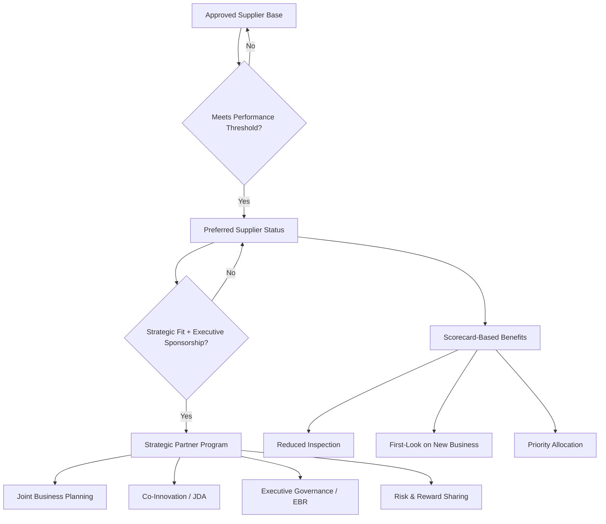

## Preferred Supplier and Strategic Partner Programs

### Overview

Preferred Supplier and Strategic Partner Programs are formal governance structures that procurement organizations establish to identify, reward, and deepen relationships with their highest-performing and most strategically important suppliers. While supplier tiering (Kraljic-based or multi-dimensional) *classifies* suppliers, these programs represent the *operational mechanisms* through which classification translates into differentiated treatment, incentives, and collaborative structures. They sit at the top of the supplier relationship hierarchy, typically drawing membership from the Strategic and top-performing Leverage supplier categories.

### Program Hierarchy and Positioning

Most mature organizations structure supplier status into a tiered progression, distinct from but informed by the Kraljic classification:

| Status Level | Typical Population | Basis for Entry |
| --- | --- | --- |
| Approved Supplier | All qualified vendors | Passes onboarding/qualification criteria |
| Preferred Supplier | Subset of Leverage/Strategic suppliers | Sustained performance above threshold (quality, delivery, cost, responsiveness) |
| Strategic Partner | Small subset of Strategic suppliers | Preferred status + joint value-creation, deep integration, executive sponsorship |

### Preferred Supplier Programs

**Key Points**

- Designed to reward consistent operational excellence with tangible commercial and process benefits.
- Typically driven by measurable scorecard performance rather than subjective relationship assessment alone.
- Serves as a retention and continuous-improvement incentive mechanism within competitive (Leverage) categories especially.

**Common Entry Criteria**

- Sustained scorecard performance above a defined threshold (e.g., 95%+ on-time-in-full, quality PPM below target, responsiveness/service metrics) over a defined period (commonly 2–4 consecutive quarters).
- Financial stability verification (credit rating, D&B risk score).
- Compliance certification currency (ISO, industry-specific standards, code-of-conduct acknowledgment).
- No unresolved critical corrective actions or compliance findings.

**Typical Benefits Extended**

- **Reduced administrative friction**: Streamlined PO approval, extended payment terms negotiation priority, or conversely faster payment terms as a goodwill incentive.
- **First-look/right-of-first-refusal** on new sourcing opportunities before competitive tendering is opened to the broader supplier base.
- **Reduced inspection burden**: Skip-lot or reduced-sampling incoming quality inspection based on demonstrated quality history.
- **Priority allocation**: During capacity constraints or shortages, preferred suppliers commit to prioritizing the buyer's orders, often formalized in the supply agreement.
- **Marketing/reputational recognition**: Public "preferred supplier" designation, award ceremonies, or case study features — increasingly leveraged by suppliers in their own sales/marketing.

**Example**: A retailer's preferred supplier program grants vendors maintaining a 98%+ OTIF score and zero critical quality escapes over four consecutive quarters automatic renewal of annual contracts without re-tendering, plus priority access to new product line RFPs.

### Strategic Partner Programs

**Key Points**

- Reserved for the smallest, most select group of suppliers where the relationship extends beyond transactional performance into **joint value creation, co-innovation, and shared risk/reward**.
- Typically involves executive-level (C-suite or VP-level) sponsorship on both sides, not just category manager engagement.
- Distinguished from Preferred status by depth of integration and forward-looking collaboration rather than backward-looking performance measurement alone.

**Common Structural Elements**

**1. Joint Business Planning (JBP)**

- Formal annual or biannual joint planning cycles aligning demand forecasts, capacity investments, and technology roadmaps between buyer and supplier.
- Often includes shared multi-year volume commitments or capacity reservation agreements in exchange for preferential pricing or dedicated capacity.

**2. Co-Innovation and Joint Development Agreements (JDAs)**

- Structured mechanisms for suppliers to participate in early-stage product/process design (Early Supplier Involvement, ESI), sharing technical risk and intellectual property under defined governance (e.g., joint patent ownership clauses, NDAs, technology-sharing frameworks).
- May include co-located engineering resources or dedicated cross-functional teams.

**3. Executive Governance Structures**

- Quarterly or biannual executive business reviews (EBRs) involving senior leadership from both organizations, distinct from operational-level QBRs (Quarterly Business Reviews) run by category managers.
- Steering committees with defined escalation paths for strategic issues (capacity disputes, technology roadmap misalignment).

**4. Risk and Reward Sharing**

- Gain-sharing clauses tied to jointly achieved cost reductions or productivity improvements.
- Capacity investment co-funding (e.g., buyer providing capital or long-term offtake guarantees to fund supplier capacity expansion).
- Contractual continuity commitments (minimum volume guarantees) in exchange for supplier-side dedicated capacity or preferential allocation during shortages.

**5. Information and System Integration**

- Deep data-sharing arrangements: shared demand forecasts, inventory visibility (VMI - Vendor Managed Inventory), API/EDI-level system integration.
- Sometimes extends to shared risk-monitoring platforms or joint supply chain control towers.

**Example**: A semiconductor buyer establishes a strategic partnership with a foundry involving a multi-year capacity reservation agreement, co-investment in a new fabrication line, joint technology roadmap alignment meetings at the VP level, and a dedicated cross-functional engineering liaison team embedded at the supplier's facility.

### Governance Structure Diagram

### Selection and Exit Criteria

**Selection Process**

- Typically initiated through annual supplier segmentation review, combining Kraljic quadrant position, scorecard performance history, and strategic alignment assessment.
- Requires cross-functional sign-off (procurement, quality, engineering, and often finance/legal) before formal designation, particularly for Strategic Partner status given the resource commitment involved.

**Exit/Demotion Criteria**

- Performance degradation below defined thresholds for a sustained period.
- Critical quality or compliance incidents (safety recalls, ethics violations, ESG failures).
- Strategic realignment (e.g., buyer's technology roadmap shift making the partnership less relevant, or supplier's market position change reducing dependency).
- Programs typically define formal probationary steps before full demotion, mirroring the quality tiering CAPA process, rather than abrupt status removal.

### Measuring Program Effectiveness

Common KPIs used to evaluate the health and ROI of preferred/strategic partner programs include:

$$\text{Program ROI} = \frac{\text{Cost Savings} + \text{Innovation Value} + \text{Risk Avoidance Value}}{\text{Program Administration Cost}}$$

- **Cost savings**: Realized through gain-sharing, joint cost-reduction initiatives, or reduced total cost of ownership (TCO).
- **Innovation value**: Number of supplier-originated innovations adopted, time-to-market improvement from early supplier involvement.
- **Risk avoidance value**: Estimated impact of avoided supply disruptions due to priority allocation commitments.
- **Relationship health scores**: Often measured via structured supplier satisfaction/perception surveys (reverse scorecards), acknowledging that strategic partnerships are bidirectional — the supplier must also view the buyer as a preferred customer for the partnership to be sustainable. [Inference: Quantifying "innovation value" and "risk avoidance value" in ROI calculations typically involves estimation methodologies that vary by organization, since these are inherently counterfactual (avoided cost) measures rather than directly observed transactions.]

### Common Pitfalls

- **Status without substance**: Granting "preferred" or "strategic partner" designation as a relationship gesture without corresponding measurable benefits or performance requirements, diluting program credibility.
- **One-sided perception**: Buyer considers a supplier "strategic" while the supplier does not reciprocally prioritize the buyer (addressed via supplier preference/power matrix assessment — see reverse-Kraljic analysis).
- **Insufficient exit governance**: Lack of clear demotion criteria leading to "strategic partner" status persisting despite performance decline, for political or relationship-continuity reasons rather than objective assessment.
- **Program proliferation without differentiation**: Too many suppliers granted preferred status, eroding the exclusivity and administrative value the designation is meant to provide.
- **Neglecting mid-tier suppliers**: Concentrating all relationship investment in top-tier partners while leverage/bottleneck suppliers with latent strategic potential receive no pathway to advance into the program.

### Related Topics

- Kraljic Purchasing Portfolio Matrix and Strategic/Leverage/Bottleneck/Routine categories
- Supplier scorecards and performance measurement systems
- Joint Business Planning (JBP) methodology
- Early Supplier Involvement (ESI) in product development
- Vendor-Managed Inventory (VMI) and consignment models
- Supplier relationship management (SRM) maturity models
- Reverse/supplier-preference matrix (buyer attractiveness assessment)
- Gain-sharing and risk-sharing contract structures