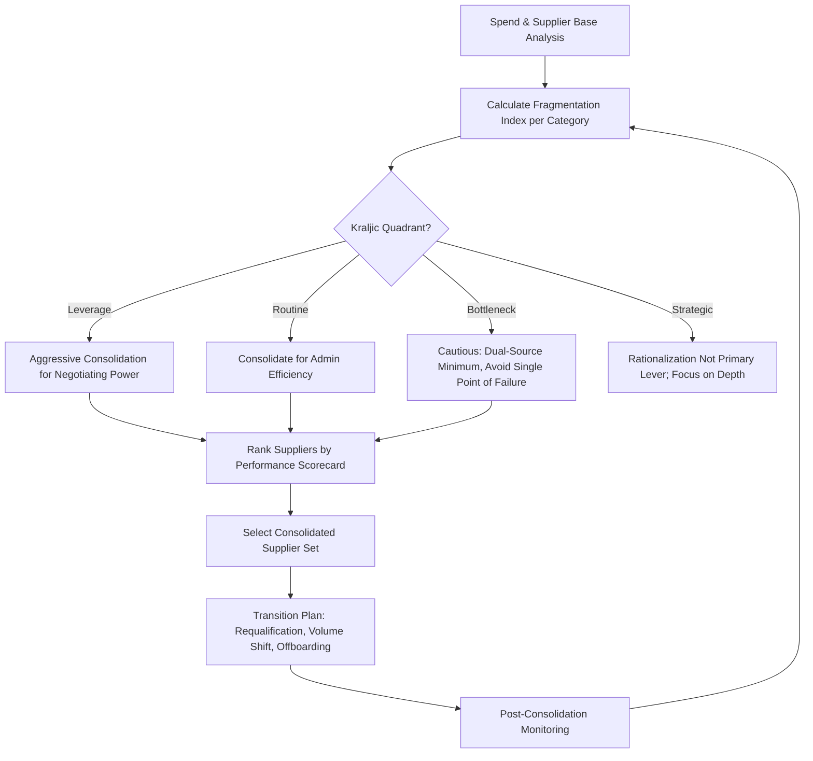

## Supplier Consolidation and Base Rationalization

### Overview

Supplier Consolidation and Base Rationalization refers to the systematic reduction and optimization of an organization's active supplier count, concentrating spend among fewer, higher-performing suppliers per category. This is a core lever within supplier segmentation strategy: an unrationalized supplier base fragments spend leverage, multiplies administrative overhead, and dilutes the organization's ability to apply differentiated tiering strategies effectively. Rationalization is typically pursued most aggressively within Leverage and Routine/Non-Critical categories, while Strategic and Bottleneck categories require more cautious, risk-aware consolidation given continuity and dependency concerns.

### Why Rationalization Matters

**Key Points**

- **Administrative cost reduction**: Each active supplier relationship carries fixed transaction costs — onboarding, invoicing, compliance verification, contract management — regardless of spend volume.
- **Leverage concentration**: Consolidating volume with fewer suppliers increases negotiating power (directly relevant to Leverage category strategy under Kraljic).
- **Risk visibility**: A smaller, better-understood supplier base is easier to monitor for financial, compliance, and continuity risk.
- **Quality consistency**: Fewer suppliers per part/category reduces variability in incoming quality and simplifies specification control.

**Counter-Consideration**: Excessive consolidation increases concentration risk — over-reliance on a small supplier base raises vulnerability to single points of failure, a tension the rationalization process must explicitly balance against resilience objectives (see Common Pitfalls).

### The Rationalization Process

**1. Spend and Supplier Base Analysis**

- Conduct a full spend-under-management audit categorized by commodity/category, typically using ABC/Pareto analysis to identify categories with the highest supplier fragmentation relative to spend concentration.
- Calculate the **supplier-to-spend ratio** per category:

$$\text{Fragmentation Index} = \frac{\text{Number of Active Suppliers in Category}}{\text{Total Category Spend}}$$

- Categories with a high fragmentation index (many suppliers, low spend concentration per supplier) are prime rationalization candidates.

**2. Category-Level Segmentation Overlay**

- Cross-reference fragmentation analysis against the Kraljic quadrant of each category:
  - **Leverage categories** with high fragmentation: strongest rationalization candidates — consolidating volume directly increases negotiating power.
  - **Routine categories** with high fragmentation: consolidate primarily for administrative efficiency (e.g., moving from 50 office supply vendors to 2–3 with catalog integration).
  - **Bottleneck categories**: rationalization approached cautiously; may involve qualifying a second source rather than reducing to a single supplier, to avoid trading administrative savings for continuity risk.
  - **Strategic categories**: rationalization is rarely the primary lever; focus remains on relationship depth rather than supplier count reduction.

**3. Performance-Based Supplier Ranking**

- Score remaining candidate suppliers per category against standardized criteria: cost competitiveness, quality history (PPM, audit results), delivery performance (OTIF), financial stability, and compliance/ESG standing.
- Suppliers scoring in the bottom percentile within a fragmented category become primary candidates for exit or volume reduction.

**4. Transition Planning and Execution**

- Develop phased transition plans for volume shifts, including requalification of consolidated suppliers at higher volumes (capacity verification, updated PPAP/APQP processes in manufacturing contexts).
- Formal supplier offboarding process: contract wind-down, final invoice reconciliation, IP/tooling return where applicable, and documentation for audit trail purposes.

**5. Monitoring and Recalibration**

- Post-consolidation performance monitoring to confirm anticipated savings and service levels materialize; rationalization is not a one-time event but a periodic (commonly annual) category review cycle.

### Diagram: Rationalization Decision Flow

### Common Consolidation Strategies

**1. Category-Level Consolidation**

Reducing the number of suppliers within a single commodity category (e.g., from 12 packaging suppliers to 3).

**2. Cross-Category Bundling**

Combining previously separate categories under a single supplier capable of serving multiple needs (e.g., a single logistics provider handling both warehousing and freight, previously split across separate vendors), increasing that supplier's strategic value and negotiating scale.

**3. Regional/Geographic Consolidation**

Standardizing suppliers across previously fragmented regional operations (common in multi-site or multi-country organizations where local sites historically sourced independently), often paired with a "glocal" sourcing strategy — global framework agreements with regional execution flexibility.

**4. Preferred Supplier Migration**

Directing volume from underperforming or marginal suppliers toward existing Preferred Supplier Program members, leveraging established performance track records rather than qualifying entirely new suppliers.

### Example Scenario

A manufacturer's spend analysis reveals 45 active suppliers for indirect MRO (maintenance, repair, operations) items, representing only 4% of total spend but 30% of total purchase order transaction volume — a classic Routine-category fragmentation pattern. The rationalization initiative consolidates this to 3 suppliers via a managed catalog program, reducing PO processing volume by an estimated 80% while maintaining service levels through supplier-managed inventory replenishment agreements. [Inference: The specific percentage outcomes cited here are illustrative of typical rationalization results reported in practitioner case studies, not universal benchmarks applicable to every organization.]

### Metrics for Tracking Rationalization Progress

| Metric | Purpose |
| --- | --- |
| Active Supplier Count (by category) | Tracks raw reduction progress |
| Spend Concentration Ratio (e.g., % spend with top 5 suppliers) | Measures leverage consolidation |
| Transaction Cost per PO | Captures administrative efficiency gains |
| Maverick Spend Percentage | Tracks off-contract/off-catalog purchasing that undermines rationalization |
| Supplier Onboarding/Offboarding Volume | Monitors churn and program activity level |

### Common Pitfalls

- **Over-consolidation creating single points of failure**: Reducing a Bottleneck or Strategic category to a sole supplier purely for administrative simplicity, increasing disruption risk without adequate contingency planning — this directly contradicts sound Kraljic-based risk management.
- **Ignoring switching costs**: Underestimating the cost and risk of requalification, tooling transfer, or process validation when consolidating manufacturing suppliers, particularly in regulated industries (automotive, aerospace, medical device) where requalification can be lengthy and costly.
- **Local/regional resistance**: Multi-site organizations often encounter internal resistance from regional teams accustomed to local supplier relationships, requiring change management alongside the sourcing initiative.
- **Static rationalization without recalibration**: Treating consolidation as a one-time project rather than an ongoing category management discipline, allowing supplier base fragmentation to re-emerge over time ("supplier base creep").
- **Sacrificing innovation access**: Aggressive consolidation in categories with fast-evolving technology can inadvertently cut off access to smaller, innovative suppliers who may not yet meet volume/scale criteria but offer future strategic value.

### Related Topics

- Kraljic Purchasing Portfolio Matrix and category-specific sourcing strategy
- Preferred Supplier and Strategic Partner Programs
- Spend analysis and ABC/Pareto categorization
- Maverick spend and procurement compliance management
- Dual-sourcing vs. single-sourcing risk trade-offs
- Supplier onboarding and offboarding process design
- Category management framework and sourcing strategy playbooks