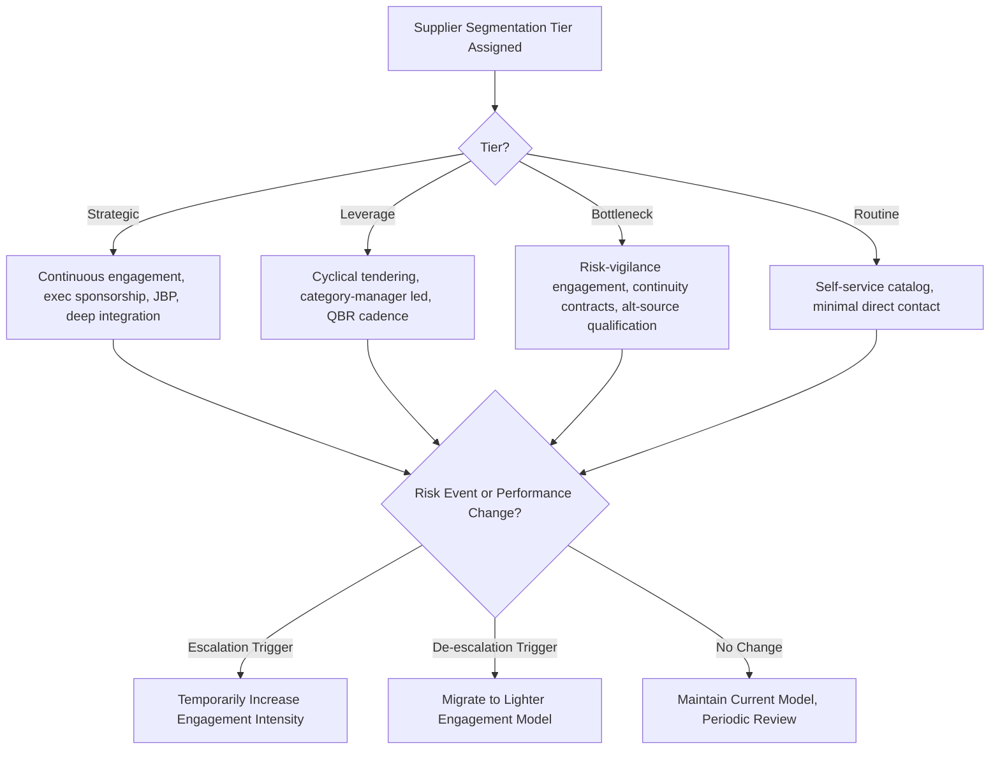

## Differentiated Engagement Models by Tier

### Overview

Differentiated Engagement Models by Tier is the operating discipline that translates supplier segmentation (Kraljic quadrant, risk/quality/ESG tier, or preferred/strategic program status) into concrete, tier-specific patterns of interaction: who engages the supplier, how frequently, through what channels, under what governance structure, and with what resource intensity. This is the practical closure of the segmentation process — classification without differentiated engagement is analytically complete but operationally inert. This item synthesizes the engagement mechanics that sit underneath the strategic categories already established (Strategic, Leverage, Bottleneck, Routine) and the preferred/partner programs layered on top of them.

### Core Principle: Resource Allocation Follows Segmentation

**Key Points**

- Buyer/category-manager time, executive attention, system integration investment, and contract complexity are finite resources that must scale with a supplier's tier — not be applied uniformly.
- The engagement model defines four interacting design variables per tier: **engagement frequency**, **organizational level involved**, **communication/data channel**, and **governance formality**.
- Misallocation in either direction is costly: over-engaging Routine suppliers wastes scarce category-manager capacity; under-engaging Strategic or Bottleneck suppliers exposes the organization to relationship or continuity risk.

### Engagement Model by Tier

**1. Strategic Tier Engagement**

- **Frequency**: Continuous relationship management; formal touchpoints monthly to quarterly, with real-time contact for operational issues.
- **Organizational level**: Multi-level engagement — category manager for operational cadence, but with mandatory executive/VP-level sponsorship for Executive Business Reviews (EBRs), typically biannual or quarterly.
- **Channel/integration**: Deep system integration (API/EDI-level data sharing, joint forecasting platforms, sometimes VMI or shared control-tower visibility); dedicated cross-functional account team (procurement, engineering, quality, sometimes co-located resources).
- **Governance formality**: Joint Business Planning (JBP) cycles, joint steering committees, formal escalation paths reaching senior leadership, contractually defined governance cadence (not ad hoc).
- **Resource intensity**: Highest per-supplier investment in the portfolio; justified because a small number of Strategic suppliers typically represent disproportionate business or continuity impact.

**2. Leverage Tier Engagement**

- **Frequency**: Periodic and cyclical rather than continuous — driven by re-tendering cycles (typically annual) and quarterly performance reviews.
- **Organizational level**: Category manager/buyer-led; escalation to management only for major commercial disputes or re-sourcing decisions.
- **Channel/integration**: Standardized digital channels — e-sourcing/e-tendering platforms, supplier portals for RFQ management; lower depth of system integration than Strategic tier since substitutability reduces the value of deep integration investment.
- **Governance formality**: Formal but templated contract structures; Quarterly Business Reviews (QBRs) at the operational level, focused on price benchmarking, delivery performance, and compliance rather than joint innovation.
- **Resource intensity**: Moderate — concentrated around competitive events (tenders) rather than continuous relationship-building.

**3. Bottleneck Tier Engagement**

- **Frequency**: Lower routine contact frequency than Strategic, but with heightened vigilance around continuity indicators (capacity, lead time, financial health) rather than commercial negotiation.
- **Organizational level**: Category manager or dedicated risk/continuity owner; the engagement emphasis shifts from commercial buyer skills toward supply risk and contingency planning expertise.
- **Channel/integration**: Priority allocation agreements, safety stock/buffer arrangements formalized in contract; monitoring of supplier health signals (financial risk scores, capacity utilization) often via third-party risk platforms rather than deep bilateral system integration.
- **Governance formality**: Contractual continuity clauses (minimum notice periods for discontinuation, priority-of-supply commitments), active alternative-source qualification programs run in parallel to reduce future dependency.
- **Resource intensity**: Disproportionately high relative to spend value — the engagement model here is justified by risk exposure, not transaction size, which is a frequent point of internal resource-allocation friction (see Common Pitfalls).

**4. Routine Tier Engagement**

- **Frequency**: Minimal direct relationship management; interaction is largely transactional and system-mediated.
- **Organizational level**: Requisitioner/end-user self-service wherever possible; category manager involvement limited to periodic catalog curation and consolidated supplier reviews (e.g., annual).
- **Channel/integration**: E-procurement catalogs, purchase cards (P-cards), punch-out integrations; minimal customized data exchange.
- **Governance formality**: Standardized framework agreements/blanket POs; compliance monitored via maverick-spend and catalog-adherence metrics rather than individualized supplier reviews.
- **Resource intensity**: Lowest per-supplier investment; efficiency and automation are the explicit design objectives.

### Comparative Summary Table

| Dimension | Strategic | Leverage | Bottleneck | Routine |
| --- | --- | --- | --- | --- |
| Engagement Frequency | Continuous | Cyclical (tender-driven) | Vigilance-driven, event-triggered | Minimal, transactional |
| Organizational Level | Executive + operational | Category manager | Category manager / risk owner | Requisitioner self-service |
| Primary Channel | Deep system integration, JBP | E-sourcing/RFQ platforms | Risk monitoring + contingency contracts | E-catalog / P-card |
| Governance Formality | Joint steering committee, EBR | QBR, templated contracts | Continuity clauses, escalation triggers | Framework agreement only |
| Resource Intensity | Highest | Moderate | Disproportionate to spend | Lowest |

### Engagement Escalation and De-escalation Triggers

Engagement intensity is not static; specific events should trigger a temporary or permanent shift in engagement model regardless of a supplier's baseline tier:

$$\text{Engagement Level}_{t+1} = f(\text{Engagement Level}_t, \text{Risk Event}, \text{Performance Trend})$$

**Escalation triggers** (moving toward more intensive engagement):

- Sustained performance decline (quality, delivery) in a Leverage or Routine supplier, warranting temporary Bottleneck-like vigilance.
- A negative risk event (financial distress signal, geopolitical disruption in the supplier's region, cybersecurity incident) at any tier.
- Emergence of new strategic dependency (e.g., a Leverage supplier developing a proprietary capability that reduces substitutability, migrating it toward Strategic).

**De-escalation triggers** (moving toward lighter-touch engagement):

- Successful qualification of an alternative source for a Bottleneck supplier, permitting migration toward Leverage-style engagement.
- Commoditization of a previously Strategic capability as the supply market matures and more qualified suppliers enter.

### Diagram: Engagement Model Selection Flow

### Operationalizing the Model: Governance Cadence Example

| Tier | Review Type | Frequency | Typical Attendees |
| --- | --- | --- | --- |
| Strategic | Executive Business Review (EBR) | Quarterly/Biannual | VP/C-level + category manager + engineering |
| Strategic | Operational Review | Monthly | Category manager + supplier account manager |
| Leverage | Quarterly Business Review (QBR) | Quarterly | Category manager + supplier commercial lead |
| Bottleneck | Continuity Review | Triggered + Quarterly | Risk/continuity owner + category manager |
| Routine | Consolidated Category Review | Annual | Category manager (batch review across suppliers) |

### Example Scenario

A global electronics manufacturer applies differentiated engagement: its display-panel supplier (Strategic) receives quarterly EBRs with VP-level attendance and a dedicated joint engineering team; its passive-component suppliers (Leverage) go through annual competitive tendering with quarterly QBRs run entirely by category managers; a single-source connector supplier (Bottleneck) is monitored monthly via a third-party financial risk platform despite representing under 1% of total spend, with an active second-source qualification underway; and its office/facilities suppliers (Routine) are managed through an automated procurement portal with only an annual consolidated review. [Inference: This scenario illustrates a typical differentiated-engagement structure synthesized from common industry practice rather than a specific documented case.]

### Common Pitfalls

- **Uniform engagement despite differentiated classification**: Completing a Kraljic or multi-dimensional tiering exercise but failing to change actual buyer behavior — the most common gap between segmentation theory and practice.
- **Under-resourcing Bottleneck engagement**: Because spend is low, Bottleneck suppliers are frequently starved of the risk-monitoring attention their supply-risk profile requires, since organizational resourcing models often allocate attention by spend rather than risk.
- **Engagement model rigidity**: Failing to build in escalation/de-escalation triggers, so a supplier's engagement model lags behind its actual current risk or strategic profile.
- **Executive fatigue on Strategic tier**: Over-populating the Strategic tier (see Preferred Supplier and Strategic Partner Programs) dilutes the executive engagement model to the point where EBRs become perfunctory rather than substantive.
- **Channel mismatch**: Applying heavy system-integration investment (built for Strategic-tier depth) to Leverage suppliers who will be re-tendered next cycle, creating switching costs that undermine the leverage strategy's core premise of substitutability.

### Related Topics

- Kraljic Purchasing Portfolio Matrix and Strategic/Leverage/Bottleneck/Routine categories
- Preferred Supplier and Strategic Partner Programs
- Supplier scorecards and Quarterly/Executive Business Review (QBR/EBR) design
- Joint Business Planning (JBP) methodology
- Supplier risk monitoring platforms and continuity contingency planning
- Category management resource allocation models
- Tiering Suppliers for Risk, Quality, and Sustainability Management