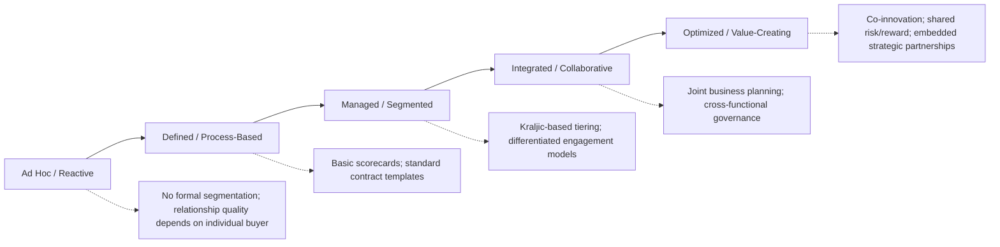
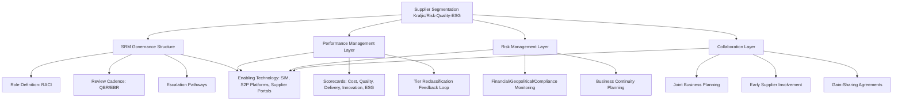

## Supplier Relationship Management Frameworks

### Overview

Supplier Relationship Management (SRM) Frameworks provide the structural methodologies organizations use to systematically manage, govern, and derive value from supplier relationships across their entire base. Where supplier segmentation and tiering (Kraljic, risk/quality/ESG tiers) determine *which category a supplier belongs to*, and differentiated engagement models determine *how intensively to interact*, SRM frameworks provide the *organizational architecture, process methodology, and enabling systems* through which relationship management is executed consistently, measured, and matured over time. SRM sits alongside the wider discipline of Supply Chain Management (SCM) but is distinguished by its explicit focus on relationship value creation, governance, and collaborative performance improvement rather than transactional procurement execution alone.

### SRM vs. Related Disciplines

**Key Points**

- **Procurement/Purchasing**: Focused on the transaction — sourcing, negotiating, and placing orders.
- **Supply Chain Management (SCM)**: Focused on the end-to-end flow of goods, information, and finances across the network.
- **Supplier Relationship Management (SRM)**: Focused specifically on the *relationship* — governance structure, joint performance management, risk management, and collaborative value creation with individual suppliers or supplier segments over time.
- SRM is often described as the supplier-facing counterpart to Customer Relationship Management (CRM), applying analogous relationship-management discipline to the upstream side of the value chain.

### Foundational SRM Framework Components

**1. Segmentation (Input Layer)**

- SRM frameworks universally begin with supplier segmentation as a prerequisite — typically the Kraljic Matrix or an extended multi-dimensional (risk/quality/ESG) model — since differentiated relationship investment requires a classification basis.

**2. Governance Structure**

- Defines organizational roles: Supplier Relationship Managers/Owners (typically assigned to Strategic-tier suppliers), category managers (Leverage/Routine), and risk/continuity owners (Bottleneck).
- Establishes review cadences (QBRs, EBRs) and escalation pathways, as detailed under differentiated engagement models.
- Often formalized through a **RACI matrix** (Responsible, Accountable, Consulted, Informed) defining decision rights across procurement, category management, quality, engineering, and executive sponsors for each supplier tier.

**3. Performance Management**

- Standardized supplier scorecards measuring cost, quality, delivery, innovation, responsiveness, compliance, and (increasingly) sustainability performance.
- Regular scorecard review cycles feeding into tier reclassification, preferred/strategic status decisions, and corrective action processes.

**4. Risk Management**

- Continuous or periodic risk monitoring (financial, geopolitical, compliance, cybersecurity) integrated with the risk-tiering approach.
- Contingency and business continuity planning, particularly for Strategic and Bottleneck suppliers.

**5. Collaboration and Value Creation**

- Structured mechanisms for joint innovation, cost-reduction initiatives, and process improvement — Joint Business Planning (JBP), Early Supplier Involvement (ESI), and gain-sharing arrangements.

**6. Technology and Data Enablement**

- Supplier information management (SIM) systems, supplier portals, e-sourcing platforms, and increasingly integrated Source-to-Pay (S2P) suites that unify sourcing, contract management, and performance data in a single system of record.

### Prominent SRM Framework Models

**1. State of Flux SRM Maturity Model**

A widely referenced practitioner framework (from State of Flux's annual SRM research) that assesses organizational SRM maturity across dimensions including strategy, governance, people/capability, process, and technology, typically scored across maturity levels from ad hoc/reactive to fully embedded/value-optimizing practice. [Unverified: exact maturity level naming and scoring methodology should be confirmed against the current published research, as consulting-firm frameworks are periodically revised.]

**2. CIPS (Chartered Institute of Procurement & Supply) SRM Guidance**

Professional body guidance framing SRM around segmentation, relationship differentiation, and structured performance/relationship review cycles, integrated with broader category management competency frameworks.

**3. Vested Outsourcing / Vested SRM Model**

An academic-practitioner framework (developed at the University of Tennessee) emphasizing outcome-based, "win-win" relationship structures for highly strategic, complex outsourcing relationships — shifting away from transactional vendor management toward shared-value business models, particularly relevant for Strategic-tier supplier relationships involving significant outsourcing.

**4. APQC/Industry Process Classification Frameworks**

Process-benchmarking frameworks (e.g., APQC's Process Classification Framework) that define standardized SRM sub-processes for benchmarking maturity and performance against industry peers — segmentation, performance measurement, risk management, and relationship development as distinct measurable process areas.

### SRM Maturity Progression Model

Most SRM maturity frameworks describe a broadly similar progression:

**Level Characteristics**

| Maturity Level | Segmentation | Governance | Performance Management | Collaboration |
| --- | --- | --- | --- | --- |
| Ad Hoc/Reactive | None/informal | Individual buyer discretion | Inconsistent, undocumented | None structured |
| Defined | Basic spend-based | Standard templates/policies | Scorecards exist but underused | Limited |
| Managed | Kraljic/risk-based tiering | RACI-defined roles, review cadence | Regular scorecards drive decisions | QBRs established |
| Integrated | Multi-dimensional (risk/quality/ESG) | Cross-functional governance, executive sponsorship for Strategic tier | Scorecards feed tier reclassification | JBP, ESI active |
| Optimized | Continuously recalibrated, predictive | Embedded joint governance structures | Predictive analytics, leading indicators | Co-innovation, gain-sharing, shared risk models |

### Organizational Structure Patterns

**Centralized SRM**

- A dedicated SRM function/team owns relationship management for Strategic-tier suppliers across the enterprise, providing consistency but potentially distancing category-level operational knowledge.

**Decentralized/Embedded SRM**

- Category managers own SRM responsibilities within their category scope; offers closer operational context but risks inconsistent methodology across categories.

**Hybrid Model** (most common in mature organizations)

- A central SRM Center of Excellence (CoE) defines methodology, tools, and governance standards, while category managers and dedicated Strategic-tier relationship owners execute within that framework — balancing consistency with category-specific expertise.

### Diagram: SRM Framework Architecture

### Technology Enablement in SRM

**Common System Categories**

- **Supplier Information Management (SIM)**: Centralized supplier master data, certifications, compliance documents, and onboarding records.
- **Source-to-Pay (S2P) Suites**: Integrated platforms (e.g., SAP Ariba, Coupa, Jaggaer, Ivalua) unifying sourcing, contract management, invoicing, and often supplier performance modules.
- **Supplier Risk Monitoring Platforms**: Third-party risk intelligence feeds (financial, geopolitical, ESG) increasingly integrated into SRM dashboards for continuous monitoring rather than periodic manual review.
- **Supplier Portals**: Self-service interfaces enabling suppliers to update compliance documentation, view scorecards, and collaborate on forecasts or corrective actions — reducing administrative burden on category managers, particularly valuable for Leverage/Routine tier scale.

[Inference: Specific platform capabilities and market positioning evolve rapidly; organizations should verify current feature sets and integration capabilities against vendor documentation rather than relying on generalized platform descriptions, as the S2P software market undergoes frequent product and vendor consolidation.]

### Measuring SRM Program Success

Common enterprise-level SRM effectiveness indicators include:

$$\text{SRM Value Realized} = \sum_{i=1}^{n} \left( \text{Cost Savings}_i + \text{Risk Mitigation Value}_i + \text{Innovation Value}_i \right)$$

- **Coverage metrics**: Percentage of Strategic-tier spend under active SRM governance (target typically near 100% for true Strategic suppliers).
- **Process adherence**: Percentage of scheduled QBRs/EBRs actually conducted, scorecard completion rates.
- **Outcome metrics**: Realized cost savings, reduction in supply disruptions, number of supplier-originated innovations implemented, and supplier-side satisfaction/perception scores (reflecting SRM's inherently bidirectional nature).

### Common Pitfalls

- **Framework without discipline**: Adopting a named SRM framework or maturity model on paper without embedding the corresponding process discipline (missed QBRs, unused scorecards), producing "SRM theater" rather than actual capability improvement.
- **Technology-first implementation**: Deploying an S2P/SRM platform expecting it to create relationship management discipline, rather than first defining governance processes the technology should support.
- **Segmentation-engagement disconnect**: Maintaining sophisticated segmentation analysis (see Kraljic and multi-dimensional tiering) without a corresponding change in actual engagement behavior — the most frequently cited implementation gap in SRM maturity assessments.
- **Undervaluing the supplier's perspective**: Designing SRM purely around buyer-side value extraction, neglecting the reciprocal relationship health measurement (supplier preference/satisfaction) needed to sustain genuinely collaborative Strategic-tier relationships.
- **Underinvestment in SRM capability/training**: Assuming category managers can execute sophisticated relationship governance without dedicated SRM skill development, since SRM competencies (relationship management, cross-functional facilitation) differ meaningfully from transactional sourcing skills.

### Related Topics

- Kraljic Purchasing Portfolio Matrix and supplier segmentation
- Differentiated Engagement Models by Tier
- Preferred Supplier and Strategic Partner Programs
- Supplier scorecards and performance measurement design
- Source-to-Pay (S2P) technology architecture
- Supplier risk management and business continuity planning
- Joint Business Planning (JBP) and Early Supplier Involvement (ESI)