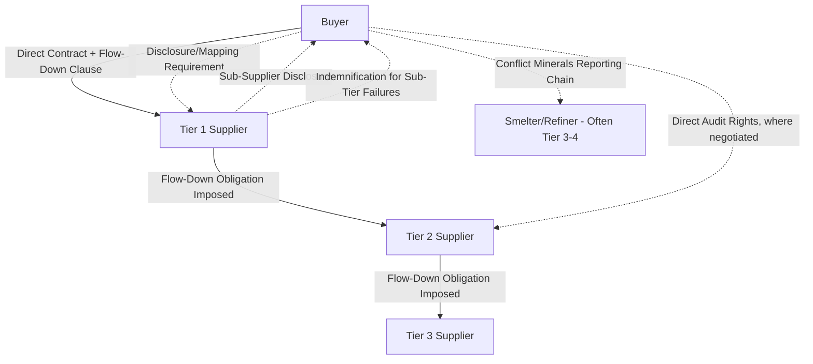

## Contract Design for Multi-Tier Networks

### Overview

Contract Design for Multi-Tier Networks addresses how procurement and legal functions structure contractual instruments to govern supply relationships that extend beyond direct (Tier 1) suppliers into Tier 2, Tier 3, and deeper sub-tier suppliers. Traditional bilateral contracts govern only the buyer's direct counterparty, leaving upstream risk, quality, and compliance obligations dependent on that Tier 1 supplier's own contractual discipline with its sub-suppliers. Multi-tier contract design deliberately extends visibility, obligations, and enforcement mechanisms deeper into the supply network — a discipline that has become significantly more important given regulatory due-diligence requirements (e.g., LkSG, CSDDD, UFLPA) that hold the buying organization accountable for sub-tier conduct it does not directly contract with.

### The Multi-Tier Visibility Problem

**Key Points**

- A buyer's direct contract binds only its Tier 1 supplier; Tier 2+ suppliers are typically invisible to the buyer both operationally and legally unless specific contractual mechanisms are used to extend reach.
- Risk, quality failures, and compliance violations (labor practices, environmental violations, conflict minerals) frequently originate in sub-tiers, yet liability, reputational damage, and regulatory exposure increasingly attach to the buying organization regardless of contractual privity.
- Multi-tier contract design is the mechanism by which segmentation-driven risk tiering (see Tiering Suppliers for Risk, Quality, and Sustainability Management) is made contractually enforceable beyond the immediate supplier relationship.

### Core Contractual Mechanisms for Multi-Tier Governance

**1. Flow-Down Clauses**

- Contractual provisions requiring the Tier 1 supplier to impose equivalent obligations (quality standards, code of conduct, ESG requirements, audit rights) on its own sub-suppliers, effectively "flowing down" the buyer's requirements through the chain.
- Common in regulated industries (aerospace, automotive, defense) where certification standards (AS9100, IATF 16949) explicitly require flow-down of applicable requirements to sub-tier suppliers as a condition of Tier 1 certification.
- **Limitation**: Flow-down clauses are only as effective as the Tier 1 supplier's own enforcement discipline; the buyer typically has no direct enforcement right against Tier 2+ suppliers unless additional mechanisms (below) are included.

**2. Direct Audit and Inspection Rights**

- Clauses granting the buyer (or buyer-appointed third-party auditor) the right to conduct audits not only at the Tier 1 supplier's facilities but at named or reasonably identified sub-tier facilities, subject to advance notice and scope limitations.
- Increasingly standard in sustainability-sensitive categories (apparel, electronics, food) where sub-tier labor and environmental practices carry high reputational risk.

**3. Sub-Supplier Disclosure and Mapping Obligations**

- Requirements for the Tier 1 supplier to disclose its own sub-supplier base for specific components, materials, or processes, enabling the buyer to build supply chain maps (n-tier visibility) rather than relying solely on Tier 1 attestation.
- Often tied to specific regulatory triggers — conflict minerals reporting (tin, tantalum, tungsten, gold — "3TG") under Dodd-Frank Section 1502/OECD guidance requires disclosure through the smelter/refiner level, which frequently sits several tiers upstream of the direct contractual relationship.

**4. Direct Beneficiary / Third-Party Rights Provisions**

- In some jurisdictions and contract structures, provisions can be drafted granting the buyer limited direct enforcement rights against named sub-tier suppliers (e.g., through direct agreements, tripartite contracts, or guarantee structures), though this is legally more complex and jurisdiction-dependent than standard bilateral flow-down.

**5. Joint and Several Liability / Indemnification Structures**

- Allocating liability for sub-tier failures (quality defects, compliance violations, IP infringement originating upstream) between the buyer and Tier 1 supplier, often via indemnification clauses that shift financial responsibility for sub-tier-caused losses back to the Tier 1 supplier who selected and manages that sub-supplier relationship.

**6. Code of Conduct Incorporation by Reference**

- Buyer's supplier code of conduct (covering labor standards, anti-corruption, environmental compliance) incorporated by reference into the Tier 1 contract, with an explicit requirement that the Tier 1 supplier obtain equivalent contractual commitment from its sub-suppliers — a specific application of the flow-down mechanism focused on ESG/compliance content.

### Diagram: Multi-Tier Contractual Reach

### Contract Design by Supplier Tier (Kraljic-Linked)

Multi-tier contract complexity is not applied uniformly; it should scale with the Kraljic/risk classification of the category, mirroring the differentiated engagement principle:

| Kraljic Tier | Multi-Tier Contract Emphasis | Typical Mechanisms Used |
| --- | --- | --- |
| Strategic | Deepest multi-tier visibility and control | Full sub-supplier disclosure, direct audit rights, joint risk-mapping exercises, co-managed sub-tier qualification |
| Bottleneck | Continuity-focused multi-tier awareness | Sub-supplier disclosure for single-source dependencies, contingency/alternative-source clauses extending to Tier 2 |
| Leverage | Standardized flow-down, less individualized | Code-of-conduct flow-down, standard audit rights, less bespoke sub-tier mapping |
| Routine | Minimal multi-tier contract customization | Basic code-of-conduct incorporation only; sub-tier visibility rarely pursued given low risk/impact |

### Regulatory Drivers Requiring Multi-Tier Contract Provisions

**Key Regulations** (illustrative, not exhaustive — verify current requirements against primary sources given the evolving regulatory landscape):

- **EU Corporate Sustainability Due Diligence Directive (CSDDD)**: Requires in-scope companies to conduct human rights and environmental due diligence extending across their "chain of activities," which explicitly includes indirect (sub-tier) business partners, not merely direct contractual counterparties.
- **German Supply Chain Due Diligence Act (LkSG)**: Imposes risk-based due diligence obligations that extend to indirect suppliers where the company has "substantiated knowledge" of a violation risk, creating contractual incentive to build sub-tier visibility mechanisms proactively.
- **US Uyghur Forced Labor Prevention Act (UFLPA)**: Creates a rebuttable presumption that goods from the Xinjiang region involve forced labor, requiring importers to demonstrate supply chain traceability often reaching well beyond Tier 1 to raw material origin.
- **Dodd-Frank Section 1502 (Conflict Minerals)**: Requires disclosure reaching to the smelter/refiner level for 3TG minerals, a canonical example of regulation driving contractual sub-tier disclosure requirements regardless of Kraljic classification.

[Unverified: Specific regulatory thresholds, scope triggers (e.g., company size/revenue thresholds for CSDDD applicability), and enforcement timelines are subject to ongoing legislative and regulatory refinement; current applicability should be verified against official regulatory guidance or legal counsel rather than this synthesis alone.]

### Standard Multi-Tier Contract Clause Structure (Illustrative Template)

A typical multi-tier flow-down and disclosure clause structure includes:

1. **Definitions**: "Sub-Supplier," "Sub-Tier," "Applicable Standards" clearly defined to avoid ambiguity in flow-down scope.
2. **Flow-Down Obligation**: Supplier shall impose substantially equivalent [quality/ESG/compliance] obligations on any Sub-Supplier engaged in the performance of this Agreement.
3. **Disclosure Requirement**: Supplier shall, upon request, disclose the identity and location of Sub-Suppliers providing [specified critical components/materials/processes].
4. **Audit Rights**: Buyer, or its designated third party, reserves the right to audit Sub-Supplier facilities with [X days'] notice, subject to reasonable confidentiality protections.
5. **Indemnification**: Supplier shall indemnify Buyer against losses arising from Sub-Supplier non-compliance with flowed-down obligations.
6. **Termination/Remediation Rights**: Buyer may require remediation or termination of a specific Sub-Supplier relationship where a material compliance violation is identified and not cured within a defined period.

### Practical Implementation Challenges

**Key Points**

- **Verification difficulty**: Flow-down clauses create contractual obligation but not automatic assurance; verifying actual sub-tier compliance typically requires either Tier 1 self-attestation (weaker) or independent audit programs (stronger but costlier) — a trade-off procurement organizations must explicitly manage.
- **Commercial sensitivity**: Tier 1 suppliers often resist disclosing their sub-supplier base, viewing it as competitively sensitive sourcing information; contract negotiation may require confidentiality carve-outs or limiting disclosure to specific high-risk categories rather than blanket requirements.
- **Enforcement asymmetry**: Larger buyers have more negotiating leverage to impose multi-tier contract terms; smaller buyers within a supplier's customer base may lack the commercial leverage to secure equivalent provisions, a factor connected to the reverse-Kraljic/supplier-preference dynamic.
- **Jurisdictional variation**: The legal enforceability of direct third-party rights against sub-tier suppliers varies significantly by jurisdiction and governing law selection, requiring legal counsel input specific to the contract's governing law.

### Common Pitfalls

- **Flow-down without verification**: Including flow-down language as contractual boilerplate without any corresponding audit or verification mechanism, creating a false sense of risk mitigation ("paper compliance").
- **Uniform multi-tier requirements regardless of risk tier**: Imposing costly sub-tier disclosure and audit requirements uniformly across the entire supplier base rather than concentrating multi-tier contract rigor on Strategic/Bottleneck/high-risk categories, wasting negotiation capital and supplier goodwill on low-risk Routine relationships.
- **Static contract language in a dynamic regulatory environment**: Drafting multi-tier clauses against current regulatory requirements without renewal/amendment mechanisms to adapt as due-diligence regulation evolves (a live legislative area).
- **Ignoring the sub-tier supplier's incentive structure**: Assuming Tier 1 suppliers will diligently enforce flow-down obligations without recognizing that sub-tier suppliers, having no direct commercial relationship with the buyer, have weaker incentive to comply absent Tier 1's own active enforcement.
- **Conflating disclosure with control**: Obtaining sub-supplier identity disclosure is a visibility mechanism, not a control mechanism; buyers sometimes overestimate their actual risk mitigation from disclosure-only clauses lacking audit or remediation rights.

### Related Topics

- Tiering Suppliers for Risk, Quality, and Sustainability Management
- Supply chain due diligence regulations (CSDDD, LkSG, UFLPA)
- Conflict minerals and responsible sourcing due diligence
- Supplier Relationship Management Frameworks
- Sub-tier supply chain mapping and n-tier visibility platforms
- Indemnification and liability allocation in supply contracts
- Code of conduct and ESG contractual incorporation mechanisms