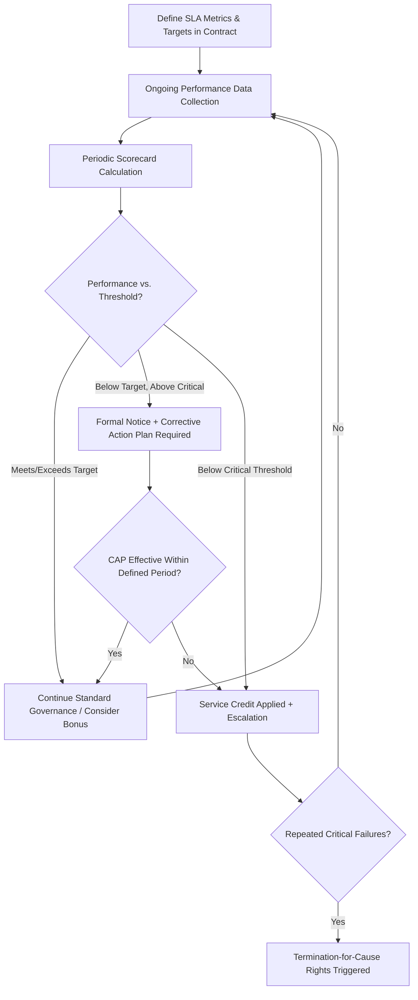

## Service Level Agreements and Performance Clauses

### Overview

Service Level Agreements (SLAs) and Performance Clauses are the contractual instruments that translate expected supplier performance into measurable, enforceable obligations. Where SRM frameworks establish the governance architecture for managing supplier relationships and multi-tier contract design extends obligations upstream, SLAs and performance clauses provide the operational backbone within the direct (Tier 1) contract: they define *what* performance is expected, *how* it is measured, and *what consequences* follow when performance falls short or exceeds expectations. SLA design should be differentiated by Kraljic tier — the rigor, metric complexity, and remedy structure appropriate for a Strategic supplier differs substantially from that of a Routine one.

### Core Components of an SLA

**1. Service/Performance Definitions**

- Precise, unambiguous definitions of the deliverable being measured (e.g., "On-Time Delivery" defined as receipt within the agreed delivery window, not merely dispatch within that window).
- Ambiguity in definitions is the most common source of SLA disputes; well-drafted SLAs eliminate interpretive gaps rather than relying on "reasonable efforts" language for measurable deliverables.

**2. Metrics and Measurement Methodology**

- Specific, quantifiable Key Performance Indicators (KPIs) with defined calculation formulas, data sources, and measurement periods.
- Common categories: **quality** (defect rate/PPM, first-pass yield), **delivery** (on-time-in-full/OTIF, lead time adherence), **responsiveness** (response time to inquiries, issue resolution time), **availability** (uptime for service-based suppliers), and increasingly **sustainability** (emissions reporting timeliness, compliance documentation currency).

**3. Performance Targets and Thresholds**

- Defined target levels (e.g., 98% OTIF) alongside tiered threshold bands that distinguish "meets expectations," "below expectations," and "critical failure" performance zones, since binary pass/fail structures often fail to capture degrees of underperformance meaningfully.

**4. Reporting and Review Cadence**

- Frequency and format of performance reporting (e.g., monthly scorecards, quarterly business reviews), specifying who is responsible for data collection, calculation, and dispute resolution if the buyer's and supplier's data diverge.

**5. Remedies and Consequences**

- **Service credits/penalties**: Financial deductions applied when performance falls below defined thresholds, typically structured as a percentage of the affected period's invoice value or a fixed fee scaled to severity.
- **Earn-back provisions**: Mechanisms allowing suppliers to recover previously assessed penalties through sustained subsequent over-performance, incentivizing continuous improvement rather than punitive-only relationships.
- **Escalation and termination rights**: Defined thresholds (e.g., three consecutive months below critical threshold) triggering formal escalation, corrective action plan (CAP) requirements, or ultimately termination-for-cause rights.
- **Service level bonuses**: Positive incentive structures rewarding sustained over-performance, particularly relevant in Strategic-tier relationships where gain-sharing philosophy applies.

### SLA Design Differentiated by Kraljic Tier

**Key Points**

- SLA complexity and remedy structure should scale with the supplier's segmentation tier, mirroring the differentiated engagement principle rather than applying uniform templates across the supplier base.

| Kraljic Tier | SLA Emphasis | Typical Remedy Structure |
| --- | --- | --- |
| Strategic | Joint KPIs reflecting shared value creation (innovation delivery, TCO trend) alongside operational metrics; collaborative remediation over punitive penalties | Gain-sharing/earn-back oriented; penalties used sparingly to preserve partnership dynamics |
| Leverage | Standardized, benchmarkable metrics (price competitiveness, delivery, quality) enabling comparison across competing suppliers | Service credits tied to clear thresholds; re-tendering itself often serves as the ultimate performance consequence |
| Bottleneck | Continuity-focused metrics (lead time reliability, capacity commitment adherence, communication responsiveness during disruption) | Contractual priority-of-supply obligations more heavily weighted than financial penalties, given limited alternative-source leverage |
| Routine | Simple, automatable metrics (catalog compliance, invoice accuracy, standard delivery windows) | Minimal bespoke remedy structure; often governed by standard framework agreement terms applied uniformly |

### Common SLA Metric Formulas

**On-Time-In-Full (OTIF)**

$$\text{OTIF} = \frac{\text{Orders Delivered On Time AND In Full}}{\text{Total Orders}} \times 100\%$$

**Defect Rate (Parts Per Million)**

$$\text{PPM} = \frac{\text{Number of Defective Units}}{\text{Total Units Shipped}} \times 1{,}000{,}000$$

**Service Credit Calculation (illustrative structure)**

$$\text{Service Credit} = \text{Affected Invoice Value} \times \text{Penalty Percentage} \times \left(1 - \frac{\text{Actual Performance}}{\text{Target Performance}}\right)$$

[Inference: The specific service credit formula structure varies significantly by contract and industry convention; the formula above illustrates a common proportional-shortfall structure rather than a universal standard, since some contracts use flat per-incident penalties instead of proportional scaling.]

### SLA Governance Lifecycle

### Corrective Action Process Integration

SLA breaches typically trigger a structured corrective action process rather than immediate penalty application alone, particularly for Strategic and Bottleneck suppliers where relationship preservation matters:

- **8D Problem-Solving Methodology** (common in manufacturing): An eight-step structured process — Team Formation, Problem Description, Containment, Root Cause Analysis, Corrective Action, Implementation & Validation, Preventive Action, Team Recognition — often contractually referenced as the required response methodology for quality-related SLA breaches.
- **CAPA (Corrective and Preventive Action)**: Broader quality management terminology (common in ISO 9001, medical device, and pharmaceutical contexts) requiring both immediate correction and systemic preventive measures to avoid recurrence.

### Drafting Considerations for Enforceability

**Key Points**

- **Measurability**: Every SLA metric must be objectively measurable from agreed data sources; subjective or unmeasurable targets ("supplier shall use best efforts to ensure quality") are difficult to enforce as performance clauses.
- **Data source agreement**: Contracts should specify whether the buyer's system, the supplier's system, or an independent third party is the authoritative data source, preempting disputes over conflicting performance calculations.
- **Force majeure carve-outs**: SLA penalty provisions typically exclude performance failures caused by defined force majeure events, though the scope of such carve-outs (and whether pandemic-related or geopolitical disruptions qualify) has become a more actively negotiated area following recent global supply chain disruptions.
- **Liquidated damages vs. penalty doctrine**: In many common-law jurisdictions, service credit/penalty clauses must be structured as a genuine pre-estimate of loss ("liquidated damages") rather than a punitive deterrent, or risk being deemed unenforceable as a penalty; this is a jurisdiction-specific legal consideration requiring counsel review rather than a universal drafting rule. [Unverified: The liquidated damages/penalty distinction and its enforceability varies materially by jurisdiction and should be confirmed with qualified legal counsel for the specific governing law of any given contract.]

### Example SLA Structure (Illustrative — Logistics Services Contract)

| Metric | Target | Measurement | Below-Target Remedy |
| --- | --- | --- | --- |
| On-Time Delivery | ≥97% | Monthly, buyer's TMS data | 1% invoice credit per 1% shortfall below target |
| Damage/Loss Rate | <0.5% | Monthly, claims data | Full replacement cost + CAP required if >2 consecutive months |
| Invoice Accuracy | ≥99% | Monthly, AP reconciliation | Escalation meeting if below 3 consecutive months |
| Response Time (service issues) | <4 business hours | Ticketing system timestamp | Automatic escalation to account manager if breached twice in a month |

### Common Pitfalls

- **Metric overload**: Defining excessive numbers of SLA metrics dilutes management attention from the few that materially matter; leading practice favors a focused set of critical KPIs per tier rather than comprehensive but unmanageable dashboards.
- **Penalty-only structures without earn-back or collaborative remediation**: Purely punitive SLA regimes can damage Strategic-tier relationships and disincentivize transparent problem reporting by the supplier (suppliers may hide issues to avoid penalties rather than proactively disclosing them).
- **Uniform SLA templates across all tiers**: Applying identical, complex SLA structures to Routine suppliers wastes administrative capacity without commensurate risk/value justification.
- **Ambiguous metric definitions**: Failing to precisely define calculation methodology and data sources, leading to recurring disputes over whether a breach actually occurred.
- **Static SLAs in dynamic relationships**: Failing to build in periodic SLA review/renegotiation mechanisms, allowing targets to become either obsolete (too easy, providing no improvement incentive) or unrealistic (misaligned with changed market or operational conditions) over the contract term.

### Related Topics

- Kraljic Purchasing Portfolio Matrix and differentiated engagement models
- Supplier Relationship Management Frameworks
- Contract Design for Multi-Tier Networks
- Supplier scorecards and performance measurement systems
- 8D Problem-Solving and CAPA methodology
- Liquidated damages and penalty clause enforceability
- Gain-sharing and risk-sharing contract structures