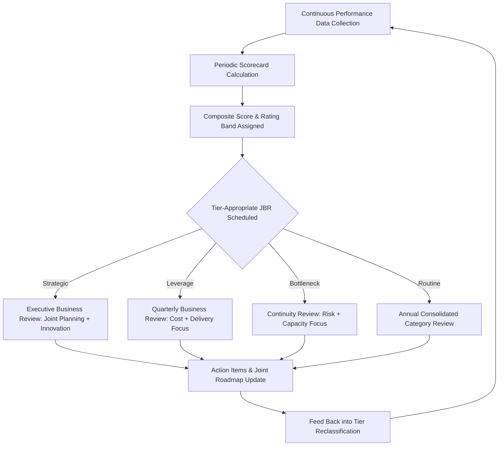

## Supplier Scorecards and Joint Business Reviews

### Overview

Supplier Scorecards and Joint Business Reviews (JBRs) are the operational instruments through which SLA-defined performance metrics and SRM governance structures are actually surfaced, discussed, and acted upon in practice. The scorecard is the *measurement artifact* — a structured, recurring summary of supplier performance against agreed KPIs. The Joint Business Review is the *governance forum* — the meeting cadence and structure through which scorecard data is reviewed jointly by buyer and supplier, translated into action items, and connected to broader relationship and strategic planning. Together they form the feedback loop that keeps segmentation-driven engagement models grounded in actual, current performance data rather than static classification.

### Supplier Scorecards

**Key Points**

- A scorecard consolidates multiple SLA/KPI metrics (quality, delivery, cost, responsiveness, innovation, compliance, ESG) into a single, typically visual, performance summary for a given supplier over a defined period.
- Scorecards serve dual purposes: **internal** (informing tier reclassification, preferred/strategic status decisions, sourcing decisions) and **external** (shared with the supplier as a transparent basis for joint performance discussion).
- Scorecard design should mirror Kraljic/tier differentiation — Strategic suppliers warrant multi-dimensional scorecards including innovation and relationship-health metrics, while Routine suppliers need only a minimal compliance/delivery scorecard, if any individualized scorecard at all.

### Standard Scorecard Dimensions

| Dimension | Example Metrics | Typical Weighting Emphasis by Tier |
| --- | --- | --- |
| Quality | PPM defect rate, first-pass yield, CAPA closure time | Higher weight: Strategic, Bottleneck |
| Delivery | OTIF, lead time adherence, capacity flexibility | Higher weight: Bottleneck, Leverage |
| Cost | Price competitiveness index, cost-reduction contribution, TCO trend | Higher weight: Leverage |
| Responsiveness | Issue resolution time, communication quality | Consistent across tiers, higher scrutiny for Bottleneck |
| Innovation | New ideas submitted/implemented, R&D collaboration | Higher weight: Strategic only |
| Compliance/ESG | Certification currency, audit findings, ESG assessment score | Increasing weight across all tiers given regulatory drivers |
| Relationship Health | Executive engagement quality, dispute frequency, supplier-reported satisfaction | Higher weight: Strategic |

### Composite Scorecard Calculation

Scorecards typically aggregate weighted category scores into a composite index:

$$\text{Composite Score} = \sum_{i=1}^{n} w_i \times S_i$$

where $S_i$ is the normalized score (e.g., 0–100) for dimension $i$, and $w_i$ is that dimension's weight, with $\sum w_i = 1$. Weights are typically tier-differentiated — for example, a Leverage-tier scorecard might weight cost at 40% and quality at 30%, while a Strategic-tier scorecard might weight innovation and relationship health more heavily (e.g., 20% combined) at the expense of a lower cost weighting.

[Inference: Specific weighting schemes are organization- and category-specific design choices calibrated through internal governance rather than derived from a fixed external standard; the example weights above are illustrative, not prescriptive.]

### Scorecard Rating Bands

Most scorecards translate composite scores into qualitative rating tiers to drive consistent governance action:

| Rating Band | Composite Score Range (Illustrative) | Typical Governance Action |
| --- | --- | --- |
| Preferred/Excellent | 90–100 | Eligible for Preferred Supplier Program consideration, reduced inspection, first-look on new business |
| Approved/Good | 75–89 | Standard governance continues, no special action |
| Conditional/Watch | 60–74 | Formal corrective action plan (CAP) required, increased review frequency |
| Probationary/Critical | Below 60 | Sourcing freeze, intensive remediation, potential requalification or exit consideration |

### Joint Business Reviews (JBRs)

**Key Points**

- JBRs (often called Quarterly Business Reviews/QBRs at the operational level, or Executive Business Reviews/EBRs at senior leadership level) are the structured meeting cadence where scorecard results are jointly reviewed with the supplier, distinguishing SRM practice from purely internal, unilateral supplier evaluation.
- The "joint" element is deliberate: effective JBRs are bidirectional discussions, not one-way buyer report-outs — suppliers should have the opportunity to present their own performance narrative, raise buyer-side issues (e.g., forecast accuracy, payment timeliness), and contribute to joint improvement planning.

### JBR Structure by Tier

**Strategic Tier — Executive Business Review (EBR)**

- **Frequency**: Quarterly or biannual.
- **Attendees**: VP/C-level sponsors from both organizations, category manager, relevant functional leads (engineering, quality).
- **Agenda focus**: Scorecard review, joint business planning updates, innovation pipeline, capacity/investment alignment, strategic risk discussion, relationship health assessment.
- **Outputs**: Updated joint roadmap, escalated strategic decisions, renewed executive sponsorship commitments.

**Leverage Tier — Quarterly Business Review (QBR)**

- **Frequency**: Quarterly.
- **Attendees**: Category manager, supplier commercial/account lead.
- **Agenda focus**: Scorecard review (cost, delivery, quality), market pricing benchmarks, upcoming tender/renewal timeline discussion.
- **Outputs**: Action items for performance gaps, input into re-tendering decisions.

**Bottleneck Tier — Continuity Review**

- **Frequency**: Quarterly, with event-triggered ad hoc reviews.
- **Attendees**: Risk/continuity owner, category manager, supplier operations lead.
- **Agenda focus**: Capacity utilization, lead time trends, alternative-source qualification progress, early warning indicators.
- **Outputs**: Updated contingency plans, adjusted safety stock levels.

**Routine Tier — Consolidated Category Review**

- **Frequency**: Annual, often batched across multiple suppliers in the category rather than per-supplier.
- **Attendees**: Category manager only (no dedicated supplier-side meeting in most cases).
- **Agenda focus**: Aggregate catalog compliance, transaction volume trends, consolidation opportunities.
- **Outputs**: Category strategy adjustments, potential rationalization candidates.

### Diagram: Scorecard-to-JBR Feedback Loop

### Preparing an Effective JBR

**1. Pre-Read Distribution**

- Scorecard and agenda shared with the supplier in advance (typically 3–5 business days), allowing the supplier to prepare responses rather than reacting live to data for the first time — a practice that improves discussion quality and reduces defensive posturing.

**2. Balanced Agenda**

- Effective JBRs allocate agenda time to both supplier performance *and* buyer-side performance (forecast accuracy, payment terms adherence, specification clarity), reinforcing the bidirectional relationship principle central to mature SRM practice.

**3. Action Item Tracking**

- Structured follow-up log carried forward meeting-to-meeting, ensuring commitments from prior JBRs are visibly tracked to closure rather than re-discussed without resolution.

**4. Escalation Pathway Clarity**

- Clear criteria for when an issue identified in a QBR should be escalated to an EBR or executive sponsor, preventing unresolved operational issues from persisting indefinitely at the working level.

### Example Scenario

A contract manufacturer's Strategic-tier connector supplier receives a quarterly scorecard showing 96% OTIF (against a 98% target) and a quality PPM slightly above threshold following a raw material substitution. Rather than immediately applying SLA-defined service credits, the EBR agenda includes a joint root-cause review, resulting in a shared corrective action plan with the supplier committing to enhanced incoming inspection at their raw material stage and the buyer agreeing to provide 60-day (rather than 30-day) forecast visibility to reduce the substitution pressure that contributed to the issue. [Inference: This scenario illustrates the collaborative remediation approach characteristic of Strategic-tier JBR practice rather than a specific documented case.]

### Common Pitfalls

- **Scorecard fatigue**: Producing overly complex scorecards with excessive metrics that neither buyer nor supplier can meaningfully act upon, diluting focus from the few KPIs that matter most for that tier.
- **One-way reporting disguised as "joint" review**: Conducting JBRs as buyer-only presentations of supplier shortcomings without genuine two-way dialogue or buyer-side accountability discussion, undermining the collaborative intent and supplier engagement.
- **Inconsistent cadence**: Allowing scheduled JBRs to be cancelled or deprioritized during busy periods, particularly for Strategic suppliers, eroding the governance discipline that SRM frameworks depend on (a frequently cited SRM maturity gap).
- **Scorecard-reality lag**: Using stale or infrequently updated data sources, causing scorecard discussions to focus on outdated issues while current performance problems go unaddressed until the next cycle.
- **No linkage to consequences or rewards**: Conducting scorecard reviews and JBRs as a purely informational exercise disconnected from actual governance actions (CAP triggers, Preferred Supplier eligibility, sourcing decisions), reducing the process to administrative overhead rather than a genuine performance management lever.
- **Uniform JBR investment regardless of tier**: Applying Strategic-tier-level JBR rigor and frequency to Leverage or Routine suppliers, misallocating scarce category-manager time inconsistent with differentiated engagement principles.

### Related Topics

- Service Level Agreements and Performance Clauses
- Differentiated Engagement Models by Tier
- Supplier Relationship Management Frameworks
- Preferred Supplier and Strategic Partner Programs
- Corrective Action Plans (CAP) and 8D/CAPA methodology
- Kraljic Purchasing Portfolio Matrix and supplier segmentation