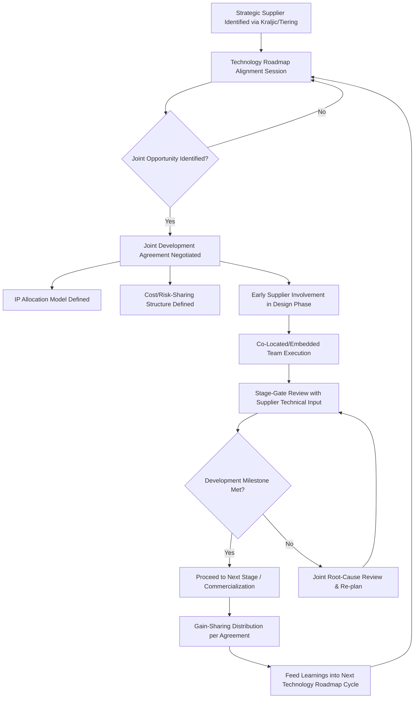

## Collaborative Innovation with Strategic Suppliers

### Overview

Collaborative Innovation with Strategic Suppliers is the practice of formally integrating select suppliers into an organization's product, process, or technology development activities, treating supplier expertise as an extension of internal R&D capability rather than a purely transactional input source. This represents the highest-value expression of Strategic-tier supplier relationships within the Kraljic framework: where SLAs and scorecards govern operational performance and JBRs provide the review cadence, collaborative innovation is the forward-looking, value-creation dimension that distinguishes a true Strategic Partnership from a merely well-managed high-spend, high-risk supplier relationship.

### Strategic Rationale

**Key Points**

- Suppliers, particularly in technology-intensive categories, often possess deeper domain expertise in their specific component, material, or process than the buying organization itself — capturing that expertise early in development can generate innovation value unavailable through arm's-length transactional sourcing.
- Co-innovation shifts the supplier relationship from cost-center management (minimizing price) to value-creation partnership (jointly expanding the total value pool), which is the defining characteristic separating Strategic-tier engagement from Leverage-tier competitive tendering.
- Effective collaborative innovation requires deliberate structural investment — it does not emerge organically from standard purchasing relationships and must be intentionally designed into the SRM governance model for selected suppliers.

### Core Mechanisms

**1. Early Supplier Involvement (ESI)**

- Engaging strategic suppliers during the concept and design phase of new product/process development, rather than after specifications are finalized.
- Allows suppliers to contribute manufacturability insights, cost-optimization suggestions, and technical alternatives before design lock-in makes changes costly (a principle closely related to Design for Manufacturability/DFM practices).
- Requires structural changes to the traditional stage-gate development process to formally include supplier technical representatives at defined review gates.

**2. Joint Development Agreements (JDAs)**

- Formal contractual structures governing collaborative development work, addressing intellectual property ownership, cost-sharing, resource commitments, and exclusivity terms.
- **IP allocation models** commonly include: buyer retains all IP (supplier compensated via development fees), joint ownership of resulting IP, or supplier retains IP with buyer receiving licensed/preferential commercial terms — the appropriate model depends on which party contributes the foundational technology and the strategic value of exclusivity to each party.
- Often includes exclusivity or first-right-of-refusal provisions, particularly where the buyer has funded or co-funded the underlying development investment.

**3. Technology Roadmap Alignment**

- Structured, recurring sessions (typically integrated into Executive Business Reviews) where buyer and supplier share forward-looking technology and capacity plans, identifying convergence points where joint investment could accelerate mutual objectives.
- Enables suppliers to proactively develop capabilities aligned with the buyer's future needs rather than reactively responding to fully specified RFQs after the buyer's own roadmap is finalized.

**4. Co-Located and Embedded Resources**

- Dedicated cross-functional teams, sometimes physically co-located at either party's facility, accelerating iteration cycles and informal knowledge transfer beyond what periodic formal meetings can achieve.
- Common in industries with tight design-manufacturing feedback loops (automotive, aerospace, semiconductor) where iteration speed materially affects time-to-market.

**5. Innovation Pipeline and Idea Management Processes**

- Formal mechanisms (sometimes software-supported via S2P platform innovation modules) through which suppliers can submit improvement ideas, cost-reduction proposals, or new technology suggestions, with defined evaluation and implementation tracking — converting supplier innovation from ad hoc suggestions into a governed pipeline with measurable throughput.

**6. Gain-Sharing and Risk-Sharing Arrangements**

- Commercial structures where cost savings or value gains from joint innovation are shared between buyer and supplier according to a predefined formula, aligning financial incentives with collaborative outcomes rather than the buyer capturing all benefit unilaterally (which can suppress supplier willingness to propose value-generating ideas that reduce their own revenue).

### Diagram: Collaborative Innovation Governance Flow

### Governance Integration with Broader SRM Structure

Collaborative innovation activities should not exist as a parallel, disconnected process from standard SRM governance; leading practice integrates innovation metrics directly into the Strategic-tier scorecard and EBR agenda (see Supplier Scorecards and Joint Business Reviews):

| SRM Element | Innovation Integration |
| --- | --- |
| Scorecard | Dedicated innovation dimension: ideas submitted, ideas implemented, R&D collaboration quality rating |
| EBR Agenda | Standing innovation pipeline review alongside operational performance |
| JDA | Formalizes specific collaborative projects arising from EBR-level roadmap alignment |
| Preferred/Strategic Partner Program | Sustained innovation contribution often an explicit criterion for maintaining Strategic Partner status |

### Measuring Collaborative Innovation Value

Common metrics used to track and justify continued investment in collaborative innovation programs:

$$\text{Innovation Value Contribution} = \sum_{i=1}^{n} \left( \text{Cost Savings}_i + \text{Revenue Impact}_i + \text{Time-to-Market Acceleration Value}_i \right)$$

- **Idea throughput**: Number of supplier-submitted ideas evaluated, approved, and implemented per period.
- **Time-to-market impact**: Reduction in development cycle time attributable to Early Supplier Involvement versus historical baseline without ESI.
- **Cost avoidance/reduction**: Value of design or process improvements originating from supplier input, particularly Design for Manufacturability (DFM) suggestions during ESI phases.
- **Patent/IP output**: Number of jointly filed patents or proprietary process improvements, where applicable to the industry.

[Inference: Precisely attributing revenue impact or time-to-market acceleration specifically to supplier collaboration (versus other concurrent internal initiatives) involves estimation and counterfactual reasoning that varies in rigor across organizations; these are inherently harder to isolate than direct cost metrics like PPM or OTIF.]

### Example Scenario

An electronics manufacturer establishes a Joint Development Agreement with its Strategic-tier display panel supplier to co-develop a next-generation display technology. The agreement specifies joint IP ownership for resulting patents, a co-located engineering team embedded at the supplier's R&D facility for the 18-month development window, and a gain-sharing clause allocating 60% of resulting per-unit cost savings to the buyer and 40% to the supplier as a volume-commitment incentive. Technology roadmap alignment sessions, held biannually as part of the existing EBR structure, identified this collaboration opportunity two years before development began. [Inference: This scenario synthesizes typical structural elements of high-value collaborative innovation partnerships in technology-intensive industries rather than describing a specific documented case.]

### Organizational Prerequisites for Effective Collaboration

**Key Points**

- **Cross-functional integration**: Collaborative innovation cannot be procurement-led alone; it requires active engineering, R&D, and often finance/legal participation from the buyer's side, structurally different from standard category management staffing.
- **Trust and information-sharing culture**: Deep collaboration requires sharing forward-looking roadmaps and sometimes proprietary technical information, which requires a trust foundation typically built through sustained operational performance (evidenced via scorecards/JBRs) before expanding into higher-risk collaborative territory.
- **Executive sponsorship continuity**: Given multi-year development timelines common in co-innovation projects, sustained executive sponsorship (surviving personnel changes on either side) is a frequently cited success factor.

### Common Pitfalls

- **Innovation theater without structural investment**: Declaring "innovation partnership" status without the accompanying process changes (ESI integration into stage-gate processes, dedicated resources, IP framework) needed to actually enable collaborative development.
- **Unbalanced value capture**: Structuring gain-sharing or IP agreements that capture disproportionate value for the buyer, reducing supplier incentive to propose their best ideas or allocate top talent to the collaboration over time.
- **Over-extension of Strategic Partner population**: Attempting collaborative innovation programs with too many suppliers simultaneously, exceeding the organization's cross-functional bandwidth to genuinely support deep collaboration (see Preferred Supplier and Strategic Partner Programs pitfalls on program dilution).
- **IP ambiguity**: Entering collaborative development without clearly negotiated IP allocation terms upfront, leading to disputes over ownership of jointly developed innovations after the fact.
- **Innovation disconnected from commercialization pathway**: Generating promising joint R&D outputs without a clear pre-agreed pathway to commercial adoption (volume commitments, pricing framework), leaving supplier investment unrewarded and damaging future collaboration willingness.

### Related Topics

- Preferred Supplier and Strategic Partner Programs
- Supplier Scorecards and Joint Business Reviews
- Kraljic Purchasing Portfolio Matrix and Strategic tier characteristics
- Contract Design for Multi-Tier Networks (IP and JDA structuring)
- Design for Manufacturability (DFM) and Early Supplier Involvement (ESI)
- Gain-sharing and risk-sharing contract structures
- Supplier Relationship Management Frameworks