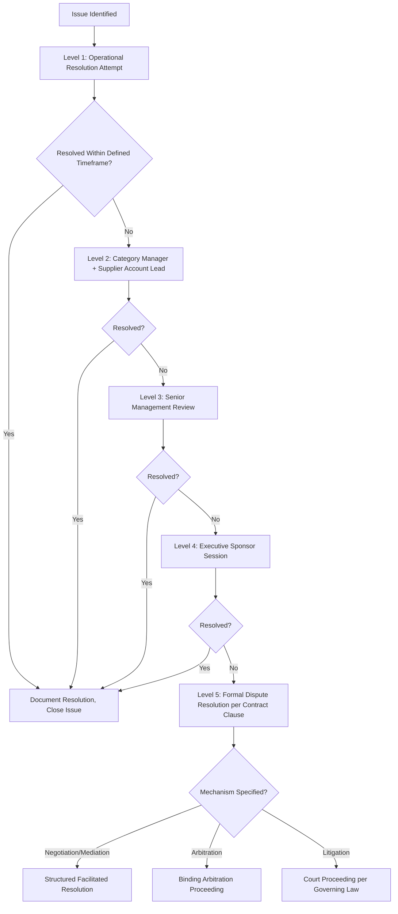

## Dispute Resolution and Escalation Structures

### Overview

Dispute Resolution and Escalation Structures define the formal mechanisms through which disagreements, performance breaches, and conflicts between buyer and supplier are surfaced, addressed, and — where necessary — resolved through progressively more formal channels. Where SLAs and scorecards define expected performance and JBRs provide the routine governance forum for discussing it, dispute resolution structures address what happens when routine governance fails to resolve a disagreement: escalating from operational-level discussion toward management, executive, and ultimately legal/contractual remedies. Well-designed escalation structures protect the relationship (particularly for Strategic and Bottleneck suppliers where continuity matters) by resolving issues at the lowest effective level, reserving costly formal dispute mechanisms for genuinely intractable conflicts.

### The Escalation Ladder Principle

**Key Points**

- Mature dispute resolution design follows a **tiered escalation ladder**: issues should be resolved at the lowest organizational level capable of addressing them, with automatic escalation triggers preventing unresolved issues from stalling indefinitely at an ineffective level.
- Escalation ladders typically mirror the SRM governance structure already in place (operational → category manager → executive), rather than introducing a separate parallel structure — reinforcing consistency between day-to-day relationship management and dispute handling.
- The objective of a well-designed ladder is **issue resolution speed and relationship preservation**, not simply providing a path to litigation; formal legal mechanisms represent the ladder's final rung, engaged only when internal escalation has been exhausted.

### Standard Escalation Ladder Structure

| Level | Typical Trigger | Participants | Timeframe (Illustrative) |
| --- | --- | --- | --- |
| Level 1: Operational | Routine performance issue, minor SLA breach, delivery/quality discrepancy | Buyer/supplier operational contacts (planners, quality engineers) | Immediate to 5 business days |
| Level 2: Category/Account Management | Unresolved Level 1 issue, recurring performance pattern, moderate SLA breach | Category manager + supplier account/commercial lead | 5–15 business days |
| Level 3: Senior Management | Unresolved Level 2 issue, significant financial/commercial dispute, contract interpretation disagreement | Procurement director/VP + supplier senior management | 15–30 business days |
| Level 4: Executive | Strategic relationship risk, major contract dispute, potential termination consideration | C-suite/executive sponsors from both organizations | 30+ business days, often via scheduled executive session |
| Level 5: Formal Dispute Resolution | Executive-level resolution fails or is inapplicable given dispute nature | Legal counsel, external mediators/arbitrators as applicable | Governed by contractual dispute resolution clause timeline |

[Inference: Specific timeframes vary considerably by contract, industry, and dispute severity; the figures above represent a common illustrative structure rather than a fixed standard applicable to every agreement.]

### Diagram: Escalation Ladder Flow

### Contractual Dispute Resolution Mechanisms

**1. Good Faith Negotiation Clauses**

- Contractual requirement that designated senior representatives from both parties meet and negotiate in good faith for a defined period before either party may pursue more formal mechanisms — typically the mandatory precursor step before mediation or arbitration under most well-drafted commercial contracts.

**2. Mediation**

- Non-binding, facilitated negotiation using a neutral third-party mediator to help parties reach a mutually acceptable resolution.
- Generally faster and less costly than arbitration or litigation, and preserves relationship continuity better than adversarial mechanisms — often preferred for Strategic-tier disputes where the buyer intends to continue the relationship post-resolution.

**3. Arbitration**

- Binding resolution by one or more neutral arbitrators, governed by rules of a specified arbitral institution (e.g., ICC, AAA, LCIA, SIAC depending on jurisdiction and contract).
- Contract must specify: governing arbitration rules, seat/location of arbitration, number of arbitrators, and language of proceedings.
- Commonly preferred over litigation in international/cross-border supplier relationships due to easier cross-border enforceability of arbitral awards (under instruments such as the New York Convention) compared to foreign court judgments.

**4. Litigation**

- Formal court proceedings under the contract's specified governing law and jurisdiction; typically the mechanism of last resort given cost, duration, and public exposure, and often explicitly excluded in favor of arbitration for cross-border commercial contracts.

**5. Expert Determination**

- For narrowly technical disputes (e.g., disagreement over whether a product meets a specification, or calculation methodology disputes under an SLA), some contracts provide for binding determination by an independent technical expert rather than full arbitration — faster and more cost-effective for disputes that are factual/technical rather than legal in nature.

### Standard Dispute Resolution Clause Structure (Illustrative)

1. **Step 1 — Direct Negotiation**: Operational representatives attempt resolution within [X] business days.
2. **Step 2 — Escalated Negotiation**: If unresolved, designated senior executives from each party meet within [Y] business days to negotiate in good faith.
3. **Step 3 — Mediation (Optional/Mandatory)**: If Step 2 fails, parties [shall/may] engage a mutually agreed mediator within [Z] days.
4. **Step 4 — Final Resolution Mechanism**: If mediation fails or is not pursued, disputes shall be resolved by [binding arbitration under (institution) rules / litigation in the courts of (jurisdiction)].
5. **Carve-Outs**: Provisions preserving either party's right to seek injunctive relief (e.g., for IP infringement or confidentiality breaches) without exhausting the full escalation ladder, since some harms require immediate court intervention rather than a multi-step negotiation process.

### Escalation Structures by Kraljic Tier

**Key Points**

- The formality and executive involvement in dispute escalation should scale with supplier tier, consistent with differentiated engagement principles applied elsewhere in SRM practice.

| Kraljic Tier | Escalation Approach |
| --- | --- |
| Strategic | Full multi-level ladder with strong preference for negotiation/mediation over adversarial mechanisms; executive sponsors actively engaged before disputes reach Level 4, given relationship preservation priority |
| Leverage | Standard escalation ladder; disputes that reach Level 3+ often accelerate a re-tendering decision rather than prolonged relationship-preservation effort, given supplier substitutability |
| Bottleneck | Escalation prioritizes rapid resolution to protect supply continuity; may bypass extended negotiation steps in favor of faster expert determination or executive intervention given limited alternative-source leverage |
| Routine | Minimal individualized escalation structure; disputes typically handled via standard terms and conditions with limited executive involvement, given low relationship value |

### Early Warning and Prevention Mechanisms

**Key Points**

- The most effective dispute resolution structures emphasize *prevention* through early detection, connecting directly to the SRM scorecard and JBR feedback loop.
- **Trend-based triggers**: Automatic escalation review when a scorecard shows a sustained negative trend (e.g., three consecutive periods of decline) rather than waiting for a single catastrophic breach.
- **Root-cause-first approach**: Structuring the Level 1–2 escalation stages around joint root-cause analysis (e.g., 8D methodology) rather than immediately assigning blame or penalty, reducing the likelihood that operational issues calcify into formal disputes.

### Example Scenario

A Bottleneck-tier component supplier experiences a capacity constraint that threatens a delivery commitment. Level 1 operational contacts fail to resolve an allocation disagreement within the standard timeframe; the issue escalates to Level 2, where the category manager and supplier's account lead negotiate a temporary priority-allocation adjustment. Because the contract's continuity clauses designate Bottleneck-category disputes for expedited handling, the parties bypass an extended Level 3 process and proceed directly to an executive call under an expedited provision, resolving the allocation dispute within 5 business days rather than following the full standard ladder timeline. [Inference: This scenario illustrates a tier-differentiated expedited escalation pattern rather than a specific documented case.]

### Common Pitfalls

- **Skipping levels or bypassing structure informally**: Allowing disputes to escalate directly to executive level without documented attempts at lower-level resolution, undermining the ladder's efficiency purpose and potentially violating contractual notice requirements for formal remedies.
- **No defined timeframes**: Escalation clauses lacking specific time limits at each level allow disputes to stall indefinitely at an ineffective level, particularly damaging for Bottleneck-tier continuity risks.
- **Adversarial default posture**: Treating every scorecard shortfall as an immediate formal dispute rather than routing it through the standard corrective-action-first governance process (see Supplier Scorecards and Joint Business Reviews), unnecessarily escalating relationship friction.
- **Jurisdiction/governing law ambiguity**: Failing to clearly specify governing law, arbitration seat, and language in cross-border contracts, creating costly preliminary disputes over procedure before the substantive issue can even be addressed.
- **Uniform escalation rigor regardless of tier**: Applying the same formal, multi-level escalation process to a Routine-tier dispute as to a Strategic-tier one, consuming disproportionate management time relative to the relationship's actual importance.
- **Neglecting relationship repair after resolution**: Treating dispute closure as purely transactional (remedy applied, case closed) without a structured relationship-repair step for Strategic/Bottleneck suppliers, leaving residual trust damage that undermines future collaboration.

### Related Topics

- Service Level Agreements and Performance Clauses
- Supplier Scorecards and Joint Business Reviews
- Contract Design for Multi-Tier Networks
- Supplier Relationship Management Frameworks
- Differentiated Engagement Models by Tier
- 8D Problem-Solving and root-cause analysis methodology
- Arbitration and cross-border commercial dispute enforcement (New York Convention)