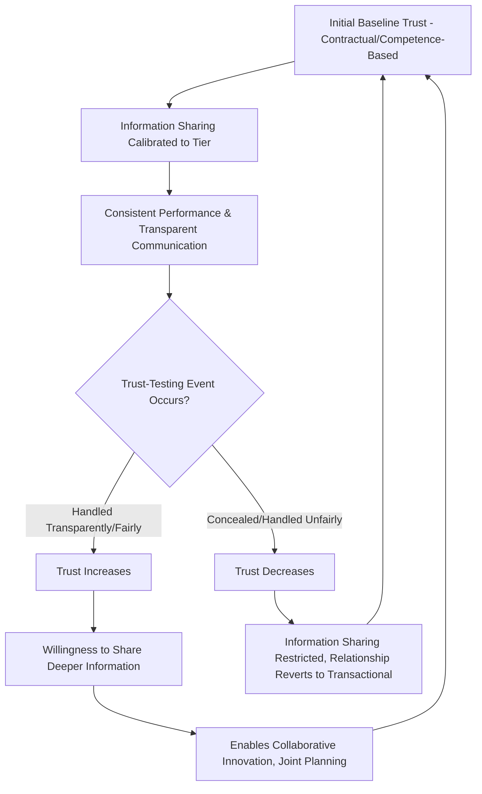

## Building Trust and Information Sharing Across Tiers

### Overview

Building Trust and Information Sharing Across Tiers addresses the relational and informational foundation underlying every mechanism covered elsewhere in supplier relationship governance — SLAs, scorecards, JBRs, collaborative innovation, and dispute resolution all function more effectively, and sometimes only function at all, when a baseline of trust and appropriate information transparency exists between buyer and supplier. This topic examines how trust is systematically built (rather than assumed) and how information-sharing depth should be deliberately calibrated by supplier tier, balancing the value of transparency against legitimate confidentiality, competitive, and risk concerns on both sides.

### Why Trust Is a Structural, Not Incidental, Variable

**Key Points**

- Trust directly affects the *quality* of information suppliers are willing to share (forecasts, cost structures, capacity constraints, emerging problems) and the *speed* at which problems surface — low-trust relationships incentivize suppliers to conceal issues until they become unavoidable, while high-trust relationships enable early warning and joint problem-solving.
- Trust is not a fixed relationship attribute; it is built or eroded incrementally through repeated interactions, particularly how each party behaves during difficult moments (a missed delivery, a forecast error, a dispute) rather than during routine, low-stakes exchanges.
- Academic supply chain literature commonly distinguishes **competence-based trust** (confidence in the other party's capability to perform) from **goodwill-based trust** (confidence in the other party's intentions and willingness to act fairly, especially when not contractually compelled to) — mature Strategic-tier relationships require both, while Leverage/Routine relationships may function adequately on competence-based trust alone.

### Trust-Building Mechanisms

**1. Consistency and Predictability**

- Reliable adherence to commitments (payment terms, forecast accuracy, timely communication) builds competence-based trust incrementally; inconsistency — even when contractually excused — erodes trust faster than outright failures that are promptly and transparently addressed.

**2. Transparency During Failure**

- How a party behaves when something goes wrong is disproportionately influential on trust trajectory compared to behavior during success. A supplier that proactively discloses an emerging capacity problem before it causes a missed delivery builds more trust than one that conceals the issue until failure occurs, even though the underlying operational risk is identical.

**3. Reciprocal Vulnerability**

- Trust-building is bidirectional: a buyer sharing sensitive forecast or strategic roadmap information signals trust in the supplier and typically invites reciprocal openness; asymmetric information demands (buyer requiring full supplier cost transparency while sharing minimal forecast visibility in return) tend to suppress reciprocal trust-building.

**4. Fair Dealing in Asymmetric Situations**

- How a buyer treats a supplier during a demand downturn (canceling orders unilaterally versus proactively communicating and sharing the burden), or how a supplier treats a buyer during a supply shortage (transparent allocation versus favoring other customers without notice), are high-visibility trust events given the power asymmetry typically present in these situations.

**5. Structural Investment Signals**

- Actions requiring genuine commitment — co-located resources, multi-year volume commitments, joint capital investment — function as credible trust signals precisely because they are costly to reverse, distinguishing genuine partnership intent from rhetorical relationship-building.

### Information-Sharing Depth by Tier

**Key Points**

- Information sharing should be deliberately calibrated to supplier tier and the relationship's strategic value, mirroring the differentiated engagement principle — indiscriminate maximum transparency with all suppliers is neither necessary nor advisable, while insufficient sharing with Strategic suppliers undermines the collaborative value the tier is meant to enable.

| Information Type | Strategic | Leverage | Bottleneck | Routine |
| --- | --- | --- | --- | --- |
| Demand Forecasts | Extended horizon (12+ months), high granularity | Standard horizon (3–6 months) | Extended horizon, prioritizing continuity planning | Minimal/aggregate only |
| Technology/Product Roadmaps | Shared proactively for joint planning | Rarely shared | Shared where relevant to capacity/continuity planning | Not shared |
| Cost Structure Data | Often bidirectionally shared for should-cost modeling and gain-sharing | Buyer-side benchmarking only; supplier cost structure rarely disclosed | Selectively shared where relevant to continuity investment decisions | Not applicable |
| Capacity/Constraint Data | Full transparency, jointly monitored | Standard performance reporting only | Critical — actively monitored, often via dedicated risk platforms | Not tracked individually |
| Financial Health Data | Mutual disclosure common in deep partnerships | Buyer monitors supplier financial risk unilaterally | Buyer monitors supplier financial risk unilaterally, high priority | Minimal monitoring |

### Diagram: Trust-Information Reinforcing Cycle

### Structural Enablers of Information Sharing

**1. Confidentiality and Data Protection Frameworks**

- Robust Non-Disclosure Agreements (NDAs) and clearly scoped data-sharing agreements are prerequisite infrastructure for deeper information exchange, since suppliers (and buyers) are understandably reluctant to share sensitive data absent clear legal protection and defined usage boundaries.
- Particularly important where forecast, cost, or technology roadmap data could be commercially damaging if it reached the sharing party's competitors, including — in some cases — the buyer's or supplier's own other business relationships.

**2. System and Data Integration**

- Technical infrastructure (EDI, API integration, shared forecasting platforms, VMI systems) operationalizes information sharing beyond periodic manual exchange, reducing both the friction and the perceived risk of ongoing disclosure since access can be scoped and monitored systematically.

**3. Governance Forum Consistency**

- Regular, well-run JBRs and EBRs (see Supplier Scorecards and Joint Business Reviews) provide the structured, recurring context within which trust-building interactions occur; ad hoc or inconsistent engagement undermines the incremental trust accumulation that regular cadence enables.

**4. Reciprocal Metrics and Accountability**

- Buyer-side performance metrics (forecast accuracy, payment timeliness, specification stability) tracked and shared alongside supplier scorecards signal genuine bidirectional accountability rather than one-sided evaluation, reinforcing the goodwill-trust dimension.

### Managing the Confidentiality-Collaboration Tension

**Key Points**

- Deeper collaboration inherently requires sharing more sensitive information, creating an unavoidable tension with confidentiality and competitive risk management — particularly acute where a supplier also serves the buyer's direct competitors.
- Common mitigation approaches:
  - **Scoped disclosure**: Sharing only the specific data category relevant to the collaboration (e.g., component-level cost data for a specific part number rather than full supplier cost structure).
  - **Clean team structures**: Designating specific individuals with access to sensitive shared data, walled off from broader commercial teams who might use the information competitively (common in situations involving potential future competitive bidding).
  - **Tiered NDA structures**: Escalating confidentiality protection and information access rights as the relationship matures from standard supplier to Preferred to Strategic Partner status, rather than granting maximum access at initial qualification.

### Example Scenario

A consumer electronics manufacturer's relationship with a Strategic-tier semiconductor supplier evolves over several years: initial engagement involves standard confidentiality terms and quarterly forecast sharing typical of the Leverage tier. Following consistent delivery performance and transparent handling of a component shortage (where the supplier proactively disclosed capacity constraints months in advance rather than waiting for missed shipments), the buyer extends forecast-sharing horizon to 18 months and begins sharing early-stage product roadmap information, enabling the supplier to proactively align capacity investment — a transition that itself becomes a basis for elevating the supplier from Leverage to Strategic tier classification. [Inference: This scenario illustrates a typical trust-trajectory pattern described in relationship management literature rather than a specific documented case.]

### Common Pitfalls

- **Assuming trust is a byproduct of tenure alone**: Treating a long-standing supplier relationship as automatically high-trust without examining whether transparency and fair-dealing behaviors have actually been demonstrated, particularly during difficult periods.
- **Asymmetric transparency demands**: Requiring extensive supplier disclosure (cost structures, capacity data) while providing minimal reciprocal forecast or roadmap visibility, which tends to suppress rather than build genuine trust and collaborative willingness.
- **Uniform maximum transparency regardless of tier**: Sharing sensitive strategic information with Leverage or Routine suppliers where the relationship's transactional nature does not warrant the confidentiality risk, or conversely, under-sharing with Strategic suppliers in ways that constrain the collaborative value the tier is meant to enable.
- **Punishing transparency**: Responding to a supplier's proactive disclosure of a problem with immediate penalty application (per SLA terms) rather than collaborative remediation, teaching suppliers that transparency carries cost — a behavior pattern that predictably reduces future proactive disclosure.
- **Neglecting information security governance**: Establishing deep data-sharing arrangements without adequate cybersecurity and access-control infrastructure, creating risk exposure disproportionate to the collaborative benefit gained (particularly relevant given increasing supply-chain-vector cybersecurity incidents).
- **Treating a single trust-breach as relationship-ending without proportionality assessment**: Overreacting to an isolated transparency lapse in an otherwise strong relationship, versus recognizing patterns of behavior — proportional response calibrated to severity and pattern, rather than binary trust/no-trust judgments, better reflects mature relationship management.

### Related Topics

- Supplier Relationship Management Frameworks
- Differentiated Engagement Models by Tier
- Collaborative Innovation with Strategic Suppliers
- Supplier Scorecards and Joint Business Reviews
- Dispute Resolution and Escalation Structures
- Confidentiality agreements and data-sharing governance in supply contracts
- Preferred Supplier and Strategic Partner Programs