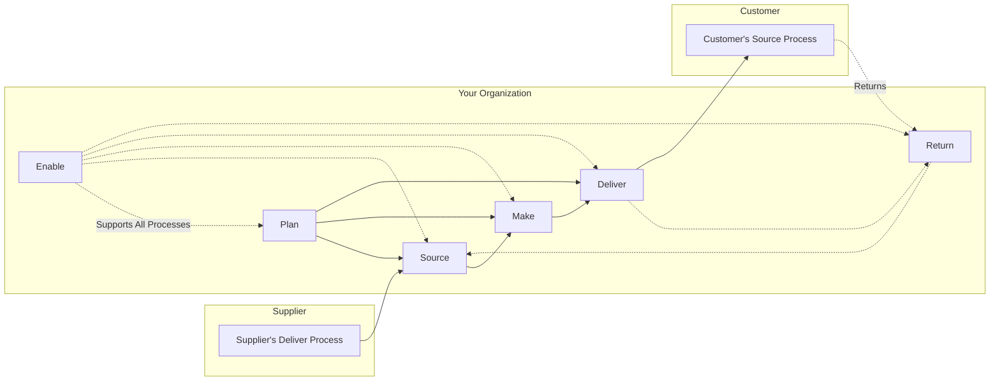
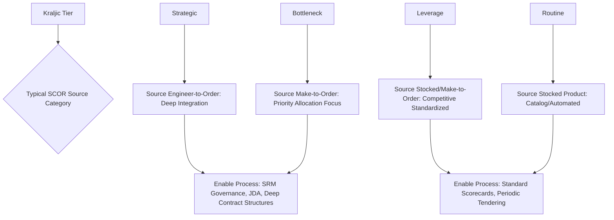

## The SCOR Model: Plan, Source, Make, Deliver, Return, Enable

### Overview

The Supply Chain Operations Reference (SCOR) model is a standardized, cross-industry process reference framework for describing, measuring, and benchmarking supply chain activities. Developed and maintained by the Association for Supply Chain Management (ASCM, following its merger with APICS and the original Supply Chain Council which created SCOR), it provides a common language and structure that allows organizations to map their supply chain processes consistently, benchmark performance against industry peers, and identify improvement opportunities using standardized metrics. Unlike relationship-focused frameworks (SRM) or portfolio-classification tools (Kraljic), SCOR is a **process reference model** — it decomposes the end-to-end supply chain into six core management processes and provides standardized process definitions, performance metrics, and best-practice associations for each.

### The Six Core SCOR Processes

**1. Plan**

- Processes that balance aggregate demand and supply to develop a course of action that best meets sourcing, production, and delivery requirements.
- Encompasses demand/supply planning, inventory planning, distribution requirements planning, and capacity planning across the supply chain network.
- **Sub-processes**: Plan Supply Chain (strategic-level balancing), Plan Source, Plan Make, Plan Deliver, Plan Return (each aligning planning activity to its corresponding execution process).

**2. Source**

- Processes that procure goods and services to meet planned or actual demand.
- Encompasses supplier scheduling, receiving, verifying, and transferring product, as well as supplier agreement management — this is where supplier segmentation and tiering strategy (Kraljic, differentiated engagement models) directly operationalizes within the SCOR framework.
- **Sub-processes**: Source Stocked Product, Source Make-to-Order Product, Source Engineer-to-Order Product — differentiated by the procurement trigger and product customization level.

**3. Make**

- Processes that transform product into a finished state to meet planned or actual demand, including production scheduling, manufacturing execution, and quality testing.
- **Sub-processes**: Make-to-Stock, Make-to-Order, Engineer-to-Order — mirroring the Source sub-process structure and reflecting the fundamental production strategy trade-off between inventory carrying cost and responsiveness.

**4. Deliver**

- Processes that provide finished goods and services to meet planned or actual demand, typically including order management, warehousing, transportation, and installation.
- **Sub-processes**: Deliver Stocked Product, Deliver Make-to-Order Product, Deliver Engineer-to-Order Product, and Deliver Retail Product (added in later SCOR versions to address retail-specific flows).

**5. Return**

- Processes associated with returning or receiving returned products for any reason, extending both backward (returning defective/excess supply to suppliers) and forward (receiving customer returns) — this is SCOR's explicit inclusion of reverse logistics as a core process rather than an afterthought.
- **Sub-processes**: Source Return (Defective, MRO, Excess) and Deliver Return (Defective, MRO, Excess), reflecting that returns occur at both the supply-side and demand-side interfaces.

**6. Enable**

- Processes associated with managing, maintaining, and monitoring information, relationships, resources, assets, contracts, and regulatory compliance required to operate the supply chain — added as a formal top-level process in later SCOR revisions to capture cross-cutting enabling activities that support all other processes.
- Encompasses business rule management, performance management, data/information management, resource management, contract management, and network configuration management. Supplier Relationship Management activities and multi-tier contract governance conceptually reside within this process category.

### Diagram: SCOR Process Flow

### SCOR's Hierarchical Structure (Process Decomposition Levels)

**Key Points**

- SCOR uses a nested hierarchical structure to move from strategic-level process definition down to implementation-specific detail:

| Level | Description | Example |
| --- | --- | --- |
| Level 1: Process Types | The six core processes (Plan, Source, Make, Deliver, Return, Enable) defining overall scope and content | "Source" as a top-level process category |
| Level 2: Process Categories | Process strategy variants within each Level 1 process (e.g., Stocked, Make-to-Order, Engineer-to-Order) | "Source Stocked Product" |
| Level 3: Process Elements | Detailed process steps, inputs/outputs, and associated standard metrics within each Level 2 category | "Schedule Product Deliveries," "Receive Product," "Verify Product" |
| Level 4: Implementation | Organization-specific implementation practices and system configurations, outside SCOR's standardized scope | Specific ERP/WMS configuration steps (industry/company-specific, not standardized by SCOR) |

[Unverified: SCOR's precise version-to-version structural changes (e.g., the formal addition of "Enable" as a sixth process, retail-specific process additions) have evolved across major revisions; the framework has undergone multiple version updates since its original release, and organizations should verify which version's structure and metric definitions apply to their reference materials, as exact terminology and metric taxonomies have been refined over successive releases.]

### SCOR Performance Metrics Framework

SCOR defines standardized performance attributes and associated metrics enabling cross-organizational benchmarking:

| Performance Attribute | Definition Focus | Example Metrics |
| --- | --- | --- |
| Reliability | Ability to perform tasks as expected | Perfect Order Fulfillment, On-Time Delivery |
| Responsiveness | Speed of task performance | Order Fulfillment Cycle Time |
| Agility | Ability to respond to external changes | Upside/Downside Supply Chain Flexibility and Adaptability |
| Costs | Cost of operating the supply chain | Total Supply Chain Management Cost, Cost of Goods Sold |
| Asset Management Efficiency | Effectiveness in managing assets to support demand | Cash-to-Cash Cycle Time, Return on Supply Chain Fixed Assets |

**Perfect Order Fulfillment** (a widely referenced composite SCOR metric):

$$\text{Perfect Order Fulfillment} = \frac{\text{Orders Delivered On Time, In Full, Damage-Free, With Accurate Documentation}}{\text{Total Orders}} \times 100\%$$

This composite metric requires all constituent conditions to be simultaneously satisfied, making it a stricter measure than any single component metric (such as OTIF alone) — an order that is on-time and in-full but has documentation errors would still fail the Perfect Order standard.

### SCOR and Supplier Segmentation Integration

**Key Points**

- The Source process is where Kraljic-based segmentation and differentiated engagement models directly map into SCOR's standardized structure: Strategic and Bottleneck suppliers typically align with Source Engineer-to-Order or complex Make-to-Order sub-processes requiring closer integration, while Routine suppliers align with simpler Source Stocked Product flows amenable to automation.
- SCOR's Enable process provides the natural home for SRM governance activities (scorecards, JBRs, contract management, risk management) described elsewhere in this material — SCOR positions these as cross-cutting enabling capabilities rather than isolated procurement activities.

### Diagram: SCOR Level 2 Process Category Mapping to Segmentation

### SCOR Application Use Cases

**1. Supply Chain Diagnostic/Benchmarking**

- Organizations map their current-state processes to SCOR's standard taxonomy, then benchmark performance metrics against industry peer data (historically compiled by APICS/ASCM and partner benchmarking services) to identify gaps against best-in-class performance.

**2. Process Standardization Across Business Units**

- Multinational or multi-division organizations use SCOR's common language to standardize process definitions and metrics across otherwise disparate regional or product-line supply chain operations, enabling consistent performance comparison.

**3. Supply Chain Redesign and Technology Selection**

- SCOR's structured process decomposition supports systematic redesign initiatives and provides a framework for defining functional requirements when selecting or configuring ERP/SCM technology systems.

**4. Supply Chain Risk and Maturity Assessment**

- SCOR-based maturity assessments evaluate an organization's process sophistication across each of the six core processes, identifying which areas (e.g., Enable/governance maturity, or Return/reverse-logistics maturity) lag behind others.

### Common Pitfalls

- **Treating SCOR as a prescriptive operating model rather than a reference/diagnostic tool**: SCOR describes standardized process definitions and metrics for comparison purposes; it does not prescribe a specific organizational structure, system architecture, or implementation approach (that detail lives at Level 4, explicitly outside SCOR's standardized scope).
- **Superficial process mapping without genuine metric adoption**: Mapping processes to SCOR terminology for documentation purposes without adopting the standardized metric definitions needed for genuine benchmarking comparability, undermining the framework's core value proposition.
- **Neglecting the Enable process**: Historically treating Plan-Source-Make-Deliver-Return as the "real" supply chain and Enable as an afterthought, despite Enable capturing critical governance, risk, and relationship management capabilities (including SRM) that materially affect performance in the other five processes.
- **Version confusion**: Referencing outdated SCOR version terminology or metric definitions when the framework has undergone structural revisions across releases, leading to benchmarking comparisons against inconsistent baselines.
- **Underestimating Return process complexity**: Treating reverse logistics as a minor addendum rather than resourcing it with the same process rigor as forward flows, despite Return's explicit standing as a full core process in the SCOR structure.

### Related Topics

- Kraljic Purchasing Portfolio Matrix and supplier segmentation
- Supplier Relationship Management Frameworks
- Reverse logistics and returns management processes
- Total Supply Chain Management Cost and asset efficiency metrics
- Demand and supply planning (S&OP) methodology
- Make-to-Stock, Make-to-Order, and Engineer-to-Order production strategies
- Supply chain benchmarking and maturity assessment methodologies