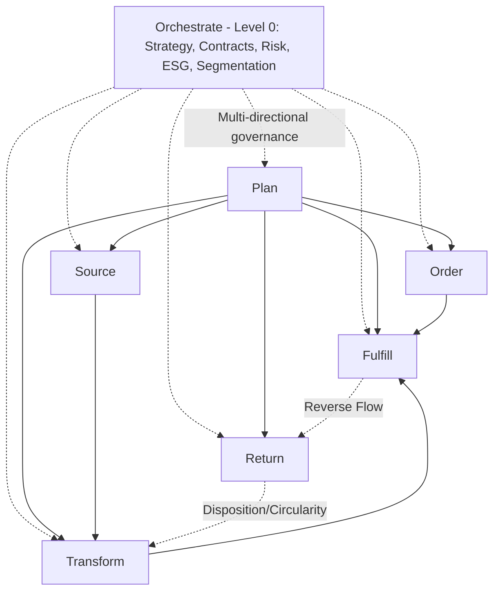

## The SCOR Digital Standard: Orchestrate, Plan, Order, Source, Transform, Fulfill, Return

### Overview

The SCOR Digital Standard (SCOR DS) is the modernized evolution of the classic Supply Chain Operations Reference model, released by the Association for Supply Chain Management (ASCM) in September 2022 as the most significant update since the inception of SCOR in 1996, with a further update in 2022 refining the framework to better describe dynamic, asynchronous digital supply chains, rather than the linear system presented by previous versions of the model. Where the classic SCOR model organized supply chain activity into six linear processes (Plan, Source, Make, Deliver, Return, Enable), SCOR DS restructures this into a non-linear, network-oriented model built around one Level-0 orchestrating process and six Level-1 execution processes: Orchestrate, which focuses on the major activities required to connect the supply chain externally to suppliers and customers, as well as to internal stakeholders, and six Level-1 processes that represent the key activities of the supply chain: Plan, Order, Source, Transform, Fulfill, and Return. [ASCM Releases New SCOR Digital Standard +2](https://www.prnewswire.com/news-releases/ascm-releases-new-scor-digital-standard-301626710.html)

### Why SCOR Was Restructured

**Key Points**

- The classic SCOR model's linear Plan→Source→Make→Deliver→Return sequence was designed around traditional, largely unidirectional trading-partner relationships. The new SCOR DS moves end-to-end supply chain thinking from a linear, trading partner orientation to a dynamic, asynchronous supply network that focuses on market drivers, visibility, and collaboration. [PR Newswire](https://www.prnewswire.com/news-releases/ascm-releases-new-scor-digital-standard-301626710.html)
- The redesign explicitly targeted several structural gaps in the classic model: no longer linear, outside in, infinitely in motion; overhauled Source; added Orchestrate to multi-directionally link supply chain strategy to Plan and the rest of the processes; formalized Warehouse and Transportation Planning; separated Deliver into Order and Fulfill to better represent omni-channel, transportation, and warehouse management; expanded Make to Transform and updated Return to include services. [Ascm](https://www.ascm.org/globalassets/documents--files/corporate-transformation/Public-Call-for-Comment-Content-SCORDS.pdf)
- The model visually represents this shift through interlocking loop structures rather than a left-to-right flow: SCOR DS pits two infinity loops together — the first focused on the bi-directional orchestration of supply and demand, addressing constraints and disruptions on both ends of the equation at the same time, and the second orchestrating the synchronization of a regenerative supply chain, considering product development, material changes, and transportation. [Kinaxis](https://www.kinaxis.com/en/blog/transform-your-supply-chain-using-ascms-scor-ds-model-peter-bolstorff)

### Mapping Classic SCOR to SCOR DS

| Classic SCOR (12.0) Process | SCOR DS Equivalent | Nature of Change |
| --- | --- | --- |
| Plan | Plan | Largely retained, now explicitly planning across all five execution processes |
| Source | Source | Substantially overhauled (see Source restructuring below) |
| Make | Transform | Make has changed to Transform, to signify the relevance of supply chain processes for service industries in addition to manufacturing |
| Deliver | Order + Fulfill | The old Deliver step has been split into Order and Fulfill, to enable more focus on multichannel commerce |
| Return | Return | Retained, with expanded scope: updated Return to include services |
| Enable | Orchestrate (Level-0) | Elevated and expanded: an Orchestrate step has been added to recognize the importance of strategy, business rules, technology and human resources that provide an overarching direction to build a more efficient supply chain |

### The Seven SCOR DS Processes in Detail

**0. Orchestrate (Level-0)**

- The sole Level-0 process, sitting above and connecting all Level-1 processes rather than functioning as a peer process: though there are six Level-1 processes (plan, order, source, transform, fulfill, and return) sitting above them as the only Level-0 process is orchestrate. [Kinaxis](https://www.kinaxis.com/en/blog/transform-your-supply-chain-using-ascms-scor-ds-model-peter-bolstorff)
- Scope: Orchestrate describes the activities associated with the integration and enablement of supply chain strategies. This includes business rules and enterprise business planning; human resources; network design and technology; data analytics; contracts and agreements; regulations and compliance; risk mitigation; environment, social, and governance initiatives; circular supply chain activities; performance management; and more. [Ascm](https://www.ascm.org/corporate-solutions/standards-tools/scor-ds/)
- This is a direct expansion of the classic model's Enable process, now formally elevated to govern the whole model rather than sitting as one of six co-equal processes — the natural home for the SRM governance, contract design, and multi-tier risk management practices covered elsewhere in this material.
- Twelve proposed Orchestrate categories were defined during development: Supply Chain Strategy, Business Rules, Performance and Continuous Improvement, Data/Information and Technology, Human Resources, Contracts and Agreements, Network, Regulatory and Compliance, Risk, Environment/Social and Governance (including CSR), Enterprise Business Planning, Segmentation, Circular Supply Chain Management. [Ascm](https://www.ascm.org/globalassets/documents--files/corporate-transformation/Public-Call-for-Comment-Content-SCORDS.pdf)

**1. Plan**

- Scope: Plan describes the activities associated with developing road maps to operate the supply chain. Planning is executed for the Order, Source, Transform, Fulfill and Return processes, including determining requirements; gathering information about available resources; balancing requirements and resources to determine planned capabilities and gaps in demand or resources; and identifying actions to correct these gaps. [Ascm](https://www.ascm.org/corporate-solutions/standards-tools/scor-ds/)
- Level-2 categories: Plan Supply Chain, Plan Order, Plan Source, Plan Transform, Plan Fulfill, Plan Return. [Ascm](https://www.ascm.org/globalassets/documents--files/corporate-transformation/Public-Call-for-Comment-Content-SCORDS.pdf)

**2. Order**

- One of the two processes created by splitting classic Deliver, focused specifically on customer order-side activity across channels.
- Level-2 categories: Order B2C, Order B2B, Order Intra-company — explicitly distinguishing consumer, business-to-business, and internal/intercompany order flows, reflecting the omnichannel emphasis behind the Order/Fulfill split. [Ascm](https://www.ascm.org/globalassets/documents--files/corporate-transformation/Public-Call-for-Comment-Content-SCORDS.pdf)

**3. Source**

- The most substantially "overhauled" process in the redesign, moving beyond the classic Source Stocked/Make-to-Order/Engineer-to-Order structure toward a strategy-differentiated structure.
- Level-2 categories: Strategic Source, Direct Procure, Indirect Procure, Source Return. [Ascm](https://www.ascm.org/globalassets/documents--files/corporate-transformation/Public-Call-for-Comment-Content-SCORDS.pdf)
- This restructuring directly reflects supplier segmentation practice: "Strategic Source" as a distinct category formally acknowledges Kraljic-style Strategic-tier sourcing (deep supplier relationship management, joint planning) as structurally different work from routine Direct/Indirect procurement execution, rather than treating all sourcing as variations of a single generic process.

**4. Transform**

- The expanded successor to classic Make, broadened to cover service delivery and maintenance activity, not manufacturing alone.
- Level-2 categories: Transform Product, Transform Service, Transform MRO — the addition of Transform Service and Transform MRO (Maintenance, Repair, Operations) as distinct categories is the structural expression of the relevance of supply chain processes for service industries in addition to manufacturing. [Ascm](https://www.ascm.org/globalassets/documents--files/corporate-transformation/Public-Call-for-Comment-Content-SCORDS.pdf)[New Horizon](https://www.newhorizon.ai/industry-insights/ascm-revamps-scor-model-with-new-digital-standard/)

**5. Fulfill**

- The second half of the classic Deliver split, focused on physical/logistical order execution.
- Scope: Fulfill describes the activities associated with executing customer orders or services, including scheduling order deliver[y, picking, packing, shipping, assembling, installing, commissioning, and invoicing] describes the activities associated with fulfilling customer orders for products, including scheduling order delivery, picking, packing, shipping, assembling, installing, commissioning, and invoicing. [Ascm](https://www.ascm.org/corporate-solutions/standards-tools/scor-ds/)[Ascm](https://scor.ascm.org/)

**6. Return**

- Retained as a core Level-1 process with expanded scope beyond the classic model.
- Scope: The Return process describes the activities associated with the reverse flow of goods, services, and/or any service components from a customer back through a supply/service chain to diagnose condition, evaluate entitlement, disposition back into Transform or other circular activities. [Ascm](https://scor.ascm.org/)
- The explicit inclusion of "services" and disposition into circular/regenerative activities reflects the framework's broader sustainability and circularity emphasis (see Performance Attribute Expansion below).

### Diagram: SCOR DS Process Architecture

### Hierarchical Process Levels in SCOR DS

The nested Level 1 → Level 2 → Level 3 decomposition structure carries forward from classic SCOR, with updated coding conventions:

- **Level 1** (the seven processes above): Transform, Fulfill and Return are Level-1 processes and are well-known and widely adopted, alongside Orchestrate, Plan, Order, and Source. [Ascm](https://www.ascm.org/globalassets/ascm_website_assets/docs/scor/intro-and-front-matter-scor-digital-standard-2025.pdf)
- **Level 2** (process categories within each Level 1 process): Level-2 process categories determine the capabilities within the level-1 processes, such as the Plan and Source categories detailed above. [Ascm](https://www.ascm.org/globalassets/ascm_website_assets/docs/scor/intro-and-front-matter-scor-digital-standard-2025.pdf)
- **Level 3** (detailed process steps): Level-3 processes are process steps that are performed in a certain sequence within each Level-2 category. [Ascm](https://www.ascm.org/globalassets/ascm_website_assets/docs/scor/intro-and-front-matter-scor-digital-standard-2025.pdf)
- **Coding convention**: Most level-2 processes add a period and a number, such as in F.1 for Fulfill B2C and P.3 for Plan Source. Level-3 processes add a period followed by a unique number, such as in F1.1 for Receive Order Signal and F1.2 [for subsequent steps]. [Ascm](https://www.ascm.org/globalassets/ascm_website_assets/docs/scor/intro-and-front-matter-scor-digital-standard-2025.pdf)

### Expanded Performance Attributes

SCOR DS broadens the classic model's five performance attributes to explicitly incorporate resilience, economic, and sustainability dimensions: Expanded SCOR attributes: customer facing to resilience; internal facing to economic; added sustainability; updated SCORmark benchmark to mirror new SCOR metrics; added sustainability (circularity) practices, metrics, skills, competencies to all processes. This directly reflects the new SCOR DS modernizes the open access framework to include resilience, economic, and sustainability metrics and benchmarks; process changes supporting retail, omnichannel, strategic sourcing; and overall orchestration of supply chain strategy. [Ascm](https://www.ascm.org/globalassets/documents--files/corporate-transformation/Public-Call-for-Comment-Content-SCORDS.pdf)[PR Newswire](https://www.prnewswire.com/news-releases/ascm-releases-new-scor-digital-standard-301626710.html)

### The Four Components of SCOR DS

Beyond process structure alone, the standard is organized around four integrated components: processes, performance, practices and people. The "people" component reflects a competency/skill maturity dimension applied across roles: a beginner performs the work with limited situational perception; a competent employee understands the work and can determine priorities to reach goals; an expert has intuitive understanding and can apply experience patterns to new situations. Practices are similarly standardized and cross-referenced: all SCOR practices have been mapped to one or more classifications; SCOR recognizes twenty-one classifications, which help identify practices by focus area, such as inventory management, organized against pillars covering Process, and Organization [dimensions], which help identify where a given practice has the most impact. [Quick Reference Guide +4](https://www.ascm.org/globalassets/documents--files/corporate-transformation/scor-ds-digital-guide_final.pdf)

### SCOR DS and Supplier Segmentation Integration

**Key Points**

- The formal creation of "Strategic Source" as a distinct Level-2 category (separate from Direct Procure and Indirect Procure) gives Kraljic-based Strategic-tier supplier management explicit structural standing within SCOR DS that it lacked as an undifferentiated sub-category in classic SCOR's Source process.
- The elevation of Enable into the governing Orchestrate process — explicitly including Contracts and Agreements, Risk, ESG, and Segmentation as named categories — positions the entire supplier segmentation, tiering, SRM governance, and multi-tier contract design discipline covered throughout this material as a first-class, strategy-level orchestrating function rather than a peer-level operational process alongside Plan/Source/Make/Deliver.
- Direct Procure and Indirect Procure as separate Level-2 categories map cleanly onto the direct-material/indirect-material distinction long used in category management, providing a standardized vocabulary bridge between SCOR DS and existing spend-classification practice.

### Common Pitfalls

- **Conflating SCOR DS terminology with classic SCOR without translation**: Referencing "Deliver" or "Make" in an organization that has adopted SCOR DS terminology creates confusion, since these map to two distinct processes (Order/Fulfill) or a renamed and expanded process (Transform) respectively.
- **Treating Orchestrate as equivalent to the old Enable**: While Orchestrate is Enable's structural successor, its elevation to the sole Level-0 process with explicit multi-directional governance authority over all Level-1 processes represents a conceptual shift beyond a simple rename — treating it as "Enable with a new name" understates its role in the redesigned model's non-linear architecture.
- **Applying SCOR DS structure without updating benchmark baselines**: The updated SCORmark benchmark was designed to mirror new SCOR metrics, so benchmarking against legacy SCOR 12.0 metric definitions after adopting SCOR DS terminology produces inconsistent comparisons. [Ascm](https://www.ascm.org/globalassets/documents--files/corporate-transformation/Public-Call-for-Comment-Content-SCORDS.pdf)
- **Underusing the "Strategic Source" category distinction**: Continuing to manage all sourcing activity uniformly despite SCOR DS's explicit structural separation of Strategic Source from Direct/Indirect Procure undermines the framework's intent to formally differentiate strategic supplier engagement from transactional procurement.
- **Assuming SCOR DS fully replaces classic SCOR in all reference materials**: Because Transform, Fulfill and Return are Level-1 processes and are well-known and widely adopted while adoption of the full SCOR DS framework is still expanding across industries, organizations may encounter both classic SCOR and SCOR DS terminology in current practice and literature, requiring clarity on which version any given reference material or benchmarking dataset uses. [Ascm](https://www.ascm.org/globalassets/ascm_website_assets/docs/scor/intro-and-front-matter-scor-digital-standard-2025.pdf)

### Related Topics

- The SCOR Model: Plan, Source, Make, Deliver, Return, Enable (classic/predecessor framework)
- Kraljic Purchasing Portfolio Matrix and Strategic Source category alignment
- Supplier Relationship Management Frameworks (Orchestrate/Contracts and Agreements alignment)
- Circular supply chain management and reverse logistics (Return process)
- ESG and sustainability metrics in supply chain performance frameworks
- Direct vs. indirect procurement category management
- Omnichannel order management and fulfillment architecture