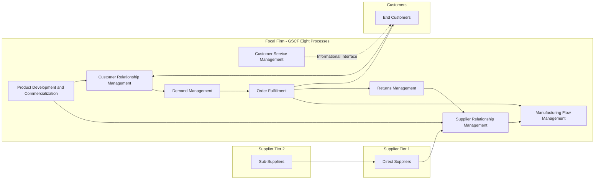

## The Global Supply Chain Forum Process Framework

### Overview

The Global Supply Chain Forum (GSCF) Process Framework is an academic-industry supply chain management reference model developed through the collaborative research of the Global Supply Chain Forum — a consortium of academics (notably Douglas M. Lambert and colleagues at Ohio State University) and practicing supply chain executives. Unlike SCOR/SCOR DS, which structures supply chain activity as internal operational processes (Plan, Source, Make/Transform, Deliver/Fulfill, Return), the GSCF framework defines supply chain management around eight standardized **cross-functional business processes** that span organizational boundaries, explicitly integrating and managing relationships across the network from end customer through original supplier. It is frequently positioned in academic and practitioner literature as the leading relationship-and-process-integration counterpart to SCOR's operations-and-metrics orientation.

### Conceptual Foundation

**Key Points**

- The GSCF framework defines supply chain management as the integration of key business processes from end user through original suppliers that provides products, services, and information that add value for customers and other stakeholders — emphasizing cross-functional, cross-firm process integration rather than functional silos (procurement, logistics, manufacturing operating independently).
- Where SCOR decomposes the supply chain by *what activity is performed* (plan, source, make, deliver), GSCF decomposes it by *what business process must be managed end-to-end*, treating relationship management (with both customers and suppliers) as a structurally equal process to operational execution rather than a supporting or enabling function.
- The framework explicitly distinguishes three types of process links between supply chain member firms — **managed process links** (fully integrated and actively managed), **monitored process links** (periodically audited but not actively managed day-to-day), and **not-managed/non-member process links** — providing a structured basis for deciding which supplier and customer relationships warrant deep integration versus lighter oversight, conceptually parallel to Kraljic-based differentiated engagement.

### The Eight GSCF Processes

**1. Customer Relationship Management (CRM)**

- Provides the structure for how relationships with customers are developed and maintained, identifying key customer accounts and customer teams that tailor product/service agreements to meet the needs of key accounts and segments of other customers.
- Functions as the demand-side structural counterpart to Supplier Relationship Management, applying analogous segmentation and differentiated-engagement logic to the customer base.

**2. Customer Service Management (CSM)**

- The firm's source of customer information, providing a single source of customer information, such as product availability, shipping dates, and order status, and administering product/service agreements developed by customer teams as part of the CRM process.
- Distinguished from CRM by its more operational/transactional nature: CRM focuses on relationship strategy and account planning, while CSM manages the ongoing informational and service interface with customers.

**3. Demand Management**

- Balances customer requirements with supply chain capabilities, including forecasting demand and synchronizing it with production, procurement, and distribution capacity — the GSCF process most directly analogous to SCOR's Plan process, but framed explicitly as balancing demand-side and supply-side capability rather than as an internal planning activity alone.

**4. Order Fulfillment**

- Includes all activities necessary to define customer requirements, design a network, and enable a firm to meet customer requests while minimizing the total delivered cost — requiring integration of the firm's manufacturing, logistics, and marketing plans, and partnering with key supply chain members to meet customer requirements while reducing total delivered cost to customers.

**5. Manufacturing Flow Management**

- Includes all activities necessary to move products through the plants and to obtain, implement, and manage manufacturing flexibility, extending the scope beyond internal production scheduling to explicitly include the flexibility needed to serve the target markets — treating manufacturing agility as a supply-chain-wide capability rather than a purely internal production concern.

**6. Supplier Relationship Management (SRM)**

- The GSCF-defined counterpart to CRM: provides the structure for how relationships with suppliers are developed and maintained, closely mirroring CRM's structure — key suppliers are identified and a supplier team develops tailored product/service agreements, directly paralleling the Kraljic-based supplier segmentation and differentiated engagement models covered elsewhere in this material, but framed within GSCF's broader end-to-end process integration structure rather than as a standalone procurement discipline.

**7. Product Development and Commercialization**

- Provides the structure for developing and bringing to market new products jointly with customers and suppliers, explicitly requiring coordination with CRM to identify customer-articulated needs, selecting materials and suppliers in conjunction with the Supplier Relationship Management process, and developing production technology in conjunction with the Manufacturing Flow Management process to integrate into the best supply chain flow — directly corresponding to Early Supplier Involvement (ESI) and collaborative innovation practices in Strategic-tier supplier relationships.

**8. Returns Management**

- Includes all activities related to returns, reverse logistics, gatekeeping, and avoidance, allowing the firm to manage reverse product flows efficiently, identify productivity improvement opportunities, and discover breakthrough projects — structurally analogous to SCOR's Return process but framed as an end-to-end managed process rather than solely an operational flow.

### Diagram: GSCF Cross-Functional Process Architecture

### GSCF Process Link Classification

**Key Points**

- A distinguishing structural feature of the GSCF framework is its explicit typology for how deeply a firm should integrate with each supply chain partner, providing a formal decision structure parallel to but distinct from Kraljic's spend/risk segmentation:

| Link Type | Description | Typical Application |
| --- | --- | --- |
| Managed Process Links | Links the firm considers important to integrate and actively manage; typically involves the firm's own direct partners | Strategic suppliers/customers requiring joint process integration (analogous to Kraljic Strategic tier) |
| Monitored Process Links | Links not as critical to the firm but important enough to ensure they are integrated and managed properly between other member firms; the firm audits or monitors periodically rather than actively managing | Leverage or Bottleneck-tier relationships where oversight matters but daily active management is not warranted |
| Not-Managed Process Links | Links the firm does not actively engage in nor is critical enough to warrant resources for monitoring; trusted to be managed by the other member firms involved | Routine-tier or distant sub-tier relationships outside direct engagement priority |
| Non-Member Process Links | Links with businesses that are not members of the focal firm's supply chain but can affect its performance | Competitor supply chains or non-contracted market actors whose actions still create externalities |

### Comparative Positioning: GSCF vs. SCOR

| Dimension | SCOR / SCOR DS | GSCF |
| --- | --- | --- |
| Primary Orientation | Internal operational process and metrics standardization | Cross-functional, cross-firm relationship and process integration |
| Unit of Analysis | Discrete operational activities (Plan, Source, Transform, Fulfill, Return) | End-to-end business processes spanning firm boundaries (CRM, SRM, Order Fulfillment) |
| Relationship Treatment | Positioned within Orchestrate/Enable as a governance category | Positioned as two of the eight co-equal core processes (CRM and SRM) |
| Benchmarking Emphasis | Strong — standardized metrics (SCORmark) enable cross-industry performance comparison | Weaker standardized benchmarking; framework emphasizes process design over metric standardization |
| Origin | Industry consortium (Supply Chain Council, now ASCM) | Academic-industry research consortium (Ohio State University Global Supply Chain Forum) |
| Best Fit For | Process diagnostics, technology selection, operational benchmarking | Organizational design, relationship governance structure, cross-functional process alignment |

### GSCF and Supplier Segmentation Integration

**Key Points**

- The GSCF's Supplier Relationship Management process explicitly requires identifying key suppliers and developing team-based, tailored product/service agreements — structurally requiring the same segmentation logic (Kraljic Matrix, differentiated engagement models) as a prerequisite input, even though GSCF does not itself prescribe a specific segmentation methodology.
- The managed/monitored/not-managed process link typology provides a complementary lens to Kraljic: while Kraljic classifies suppliers by spend impact and supply risk, the GSCF link typology asks the more structural question of *how much active process integration* a given relationship warrants — the two frameworks are often used together in practice, with Kraljic informing tier classification and GSCF link typology informing the resulting process integration design.
- The explicit coupling of Product Development and Commercialization with Supplier Relationship Management formalizes the collaborative innovation practices (Early Supplier Involvement, Joint Development Agreements) covered under Strategic-tier engagement as a named, standard cross-functional process rather than an ad hoc initiative.

### Practical Implementation Considerations

**Key Points**

- Because GSCF processes are explicitly cross-functional, effective implementation requires structural organizational change — process owners and cross-functional teams spanning sales, marketing, logistics, manufacturing, and procurement — rather than simply renaming existing functional department activities.
- The framework's academic origin means it is more commonly encountered in supply chain management education, strategic supply chain design consulting, and organizational process redesign initiatives than in day-to-day operational benchmarking, where SCOR/SCOR DS's standardized metrics are more widely operationalized.
- [Inference: The relative adoption prevalence of GSCF versus SCOR in industry practice is not precisely quantifiable from available public data; GSCF is more prominently represented in academic supply chain management curricula and process-design literature, while SCOR/SCOR DS has more extensive industry benchmarking infrastructure (SCORmark) — this reflects a difference in typical use case rather than a strict superiority of one framework over the other.]

### Common Pitfalls

- **Treating GSCF as a competing alternative to SCOR rather than a complementary lens**: The two frameworks address different questions (cross-functional process integration versus operational activity standardization) and are frequently used together rather than as mutually exclusive choices.
- **Naming processes without structural change**: Labeling existing procurement and sales functions as "Supplier Relationship Management" and "Customer Relationship Management" without the actual cross-functional team structure and process integration the framework specifies, producing terminology adoption without capability change.
- **Applying uniform managed-link treatment to all partners**: Failing to differentiate managed, monitored, and not-managed process links — attempting to actively manage every supplier and customer relationship with the same intensity, which is neither feasible nor advisable given finite organizational integration capacity.
- **Underinvesting in the Product Development and Commercialization process**: Treating new product development as isolated from SRM and Manufacturing Flow Management, missing the framework's explicit intent that these processes operate in coordination — directly paralleling the "innovation theater without structural investment" pitfall noted in collaborative innovation practice.
- **Assuming GSCF prescribes a segmentation methodology**: The framework defines process link types (managed/monitored/not-managed) but does not itself provide the classification methodology (such as Kraljic) needed to decide which suppliers belong in which category — organizations must pair GSCF with a segmentation framework rather than expecting GSCF alone to answer that question.

### Related Topics

- The SCOR Model: Plan, Source, Make, Deliver, Return, Enable
- The SCOR Digital Standard: Orchestrate, Plan, Order, Source, Transform, Fulfill, Return
- Kraljic Purchasing Portfolio Matrix and supplier segmentation
- Supplier Relationship Management Frameworks
- Collaborative Innovation with Strategic Suppliers
- Customer Relationship Management (CRM) and demand-side segmentation
- Cross-functional process integration in supply chain organizational design