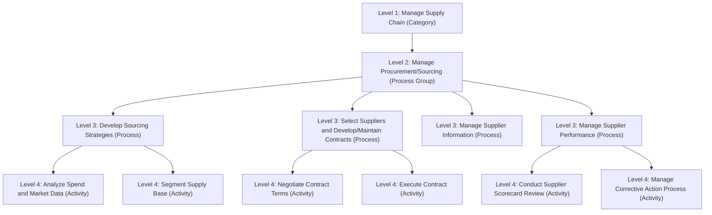

## The APQC Process Classification Framework

### Overview

The APQC Process Classification Framework (PCF) is a cross-industry, open-standard taxonomy for classifying business processes at a horizontal, enterprise-wide level, developed and maintained by the American Productivity & Quality Center (APQC), a nonprofit benchmarking and best-practices research organization. Unlike SCOR/SCOR DS (operations-focused) or GSCF (relationship-and-integration-focused), which are supply-chain-specific reference models, the PCF is a **general-purpose enterprise process taxonomy** spanning all major business functions — of which supply chain and procurement processes form one significant branch. It is widely used as a common process language for benchmarking, process improvement initiatives, and organizational process documentation across industries, independent of any single functional domain.

### Structural Philosophy

**Key Points**

- The PCF is explicitly designed as a taxonomy, not a prescriptive process model — it provides a standardized way to *name and categorize* what a process is, enabling consistent classification and cross-organizational benchmarking comparison, without dictating *how* that process should be executed or structured internally.
- This taxonomy-first (as opposed to reference-architecture-first) design philosophy distinguishes it structurally from SCOR, which combines classification with prescribed process definitions, standard metrics, and best-practice associations.
- The PCF is organized hierarchically, moving from broad Category-level groupings down to granular Task-level detail, and is maintained as an evolving, versioned open-content standard, periodically updated (including industry-specific variants) to reflect changing business practice — organizations should verify they are referencing a current version given periodic revisions. [Unverified: exact current version number and revision cadence should be checked against APQC's published materials at time of use, since taxonomy frameworks of this kind are periodically updated and specific version details fall outside reliably static knowledge.]

### PCF Hierarchical Structure

| Level | Description | Example |
| --- | --- | --- |
| Level 1: Category | Broadest grouping of related business activity | "Manage Supply Chain" or "Deliver Products and Services" |
| Level 2: Process Group | Major sub-division within a category | "Manage Procurement/Sourcing" |
| Level 3: Process | Specific process within a process group | "Develop Sourcing Strategies" |
| Level 4: Activity | Discrete activity within a process | "Analyze spend and market data" |
| Level 5: Task | Most granular, task-level detail | Specific transactional or operational steps within an activity |

### The Cross-Industry PCF: 13 Level-1 Categories (Illustrative Structure)

The APQC Cross-Industry PCF is organized around a set of Level-1 categories spanning both **operating processes** and **management and support services**:

**Operating Processes** (illustrative, following standard PCF structure):

1. Develop Vision and Strategy
2. Develop and Manage Products and Services
3. Market and Sell Products and Services
4. Deliver Physical Products
5. Deliver Services
6. Manage Customer Service

**Management and Support Services** (illustrative, following standard PCF structure):

7. Manage Human Capital

8. Manage Information Technology

9. Manage Financial Resources

10. Acquire, Construct, and Manage Assets

11. Manage Enterprise Risk, Compliance, Remediation, and Resiliency

12. Manage External Relationships

13. Develop and Manage Business Capabilities

[Unverified: The precise naming, numbering, and count of Level-1 categories has been refined across PCF versions and industry-specific variants; the structure above reflects the framework's standard organizing logic rather than a guaranteed exact match to the current published version, which should be verified directly against APQC's current materials for authoritative category names and numbering.]

### Supply Chain and Procurement Placement Within the PCF

**Key Points**

- Supply chain and sourcing/procurement activity is typically addressed both within a dedicated supply-chain-oriented Level-1 category (often titled around "Manage Supply Chain" or distributed across "Deliver Physical Products" and related categories, depending on PCF version) and cross-referenced within supporting categories such as Manage External Relationships (supplier and partner relationship governance) and Manage Enterprise Risk (supply chain risk and compliance).
- Within the supply-chain-oriented category, typical Level-2 process groups include: Plan for and align supply chain resources, Procure materials and services, Produce/manufacture/deliver product, Manage logistics and warehousing, Manage supply chain returns — a structure that maps conceptually to SCOR's Plan/Source/Make/Deliver/Return decomposition, though organized under PCF's distinct taxonomic numbering and definitional conventions rather than SCOR's process-reference metric structure.
- Sourcing and supplier-related processes at the Level 3/4 detail commonly include activities such as: develop sourcing strategies, select suppliers and develop/maintain contracts, manage supplier information, appraise and certify suppliers, negotiate contracts, manage supplier relationships and performance — directly paralleling the Kraljic segmentation, SLA/scorecard, and SRM governance practices covered throughout this material, now expressed in PCF's standardized taxonomic vocabulary.

### Diagram: PCF Hierarchical Decomposition (Illustrative — Procurement Branch)

### PCF vs. SCOR/SCOR DS vs. GSCF: Comparative Positioning

| Dimension | APQC PCF | SCOR / SCOR DS | GSCF |
| --- | --- | --- | --- |
| Scope | Whole-enterprise, all business functions | Supply chain operations specifically | Supply chain cross-functional relationships specifically |
| Primary Purpose | Common process taxonomy for classification and benchmarking | Operational process reference model with standard metrics | Cross-firm process integration and relationship structure |
| Prescriptiveness | Taxonomy — names/classifies, does not prescribe execution | Reference model — includes standard process definitions and metrics | Framework — defines process types and required cross-functional structure, less metric-prescriptive |
| Metrics Association | Linked to APQC's Open Standards Benchmarking (OSB) database for cross-industry metric comparison | SCORmark benchmark tightly integrated with process definitions | Weaker standardized metric linkage |
| Typical Use Case | Enterprise-wide process documentation, benchmarking against APQC's broad cross-industry database | Supply-chain-specific diagnostic, technology selection, operational benchmarking | Organizational design for cross-functional/cross-firm process integration |

### Open Standards Benchmarking (OSB) Integration

**Key Points**

- The PCF's primary practical value proposition is enabling participation in APQC's Open Standards Benchmarking (OSB) program, wherein organizations map their internal processes to standardized PCF categories to then compare performance metrics (cost, cycle time, staffing ratios, process efficiency) against a large cross-industry benchmarking database.
- This differs from SCOR's SCORmark in scope breadth: because the PCF spans all enterprise functions, its benchmarking database allows comparison not only within supply chain/procurement but across functions such as finance, HR, and IT — useful for organizations conducting broad enterprise process maturity assessments rather than supply-chain-specific diagnostics alone.
- For procurement and supply chain specifically, common OSB benchmark metrics include cost of the procurement function as a percentage of total spend under management, procurement cycle time, and headcount ratios relative to spend volume or transaction count — providing an external reference point for evaluating whether an organization's procurement operating model (including its supplier segmentation and SRM governance investment) is appropriately resourced relative to peers.

### Practical Applications

**1. Enterprise Process Documentation Standardization**

- Large organizations, particularly those spanning multiple business units or having grown through acquisition, use the PCF as a common taxonomy to standardize how disparate divisions describe and document their processes, enabling consistent internal comparison even where SCOR's supply-chain-specific structure would not apply enterprise-wide.

**2. Cross-Functional Benchmarking**

- Because the PCF is not limited to supply chain, it enables organizations to benchmark procurement/supply chain function costs and efficiency against not only industry peers' supply chain functions specifically, but against a broader enterprise-process database, useful when justifying resourcing decisions in cross-functional budget discussions.

**3. Complementary Use with SCOR**

- Organizations frequently use the PCF for broad enterprise process documentation and benchmarking while using SCOR/SCOR DS for the detailed operational modeling, metric standardization, and best-practice association specific to supply chain execution — the two are commonly deployed together rather than as competing choices, given their different levels of specificity and prescriptiveness.

**4. Process Improvement Initiative Scoping**

- The PCF's hierarchical structure provides a standard vocabulary for scoping process improvement or technology implementation projects (e.g., clearly defining that a project addresses "Select Suppliers and Develop/Maintain Contracts" at Level 3 rather than the broader "Manage Procurement/Sourcing" Level 2 group), reducing scope ambiguity in cross-functional initiatives.

### Common Pitfalls

- **Mistaking the PCF for a prescriptive process model**: Expecting the PCF to specify *how* a process such as supplier segmentation or contract negotiation should be executed, when its purpose is classification and naming, not process design — organizations still need frameworks like Kraljic, SCOR, or GSCF for the actual methodological content.
- **Inconsistent mapping across business units**: Different divisions mapping similar activities to different PCF categories or levels due to interpretive ambiguity, undermining the cross-organizational comparability the taxonomy is meant to provide — requiring a governance function (often within a Center of Excellence) to arbitrate consistent mapping.
- **Benchmarking without normalizing for context**: Comparing raw OSB benchmark metrics without accounting for differences in company size, industry, geographic scope, or business model between the benchmarked organization and its peer set, leading to misleading performance conclusions.
- **Version drift in large organizations**: Different business units or acquired entities referencing different PCF versions (given periodic framework updates), creating internal comparability issues even before external benchmarking is attempted.
- **Treating taxonomy adoption as process improvement**: Completing a PCF mapping exercise and considering the improvement initiative complete, without following through with the actual process redesign, technology change, or governance improvement that the classification exercise was meant to enable analysis of.

### Related Topics

- The SCOR Model: Plan, Source, Make, Deliver, Return, Enable
- The SCOR Digital Standard: Orchestrate, Plan, Order, Source, Transform, Fulfill, Return
- The Global Supply Chain Forum Process Framework
- Kraljic Purchasing Portfolio Matrix and supplier segmentation
- Category management and spend analysis (ABC/Pareto)
- Enterprise benchmarking methodologies and Open Standards Benchmarking (OSB)
- Supplier Relationship Management Frameworks