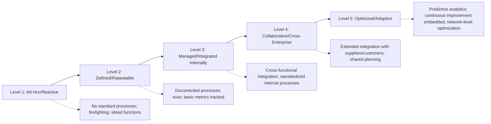
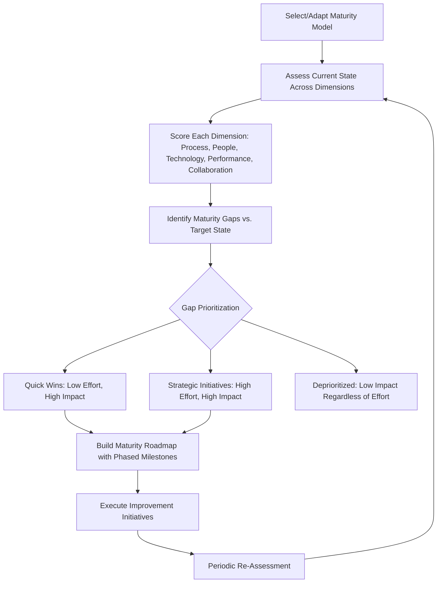

## Supply Chain Maturity Models

### Overview

Supply Chain Maturity Models provide structured frameworks for assessing an organization's current level of supply chain process sophistication, capability, and integration, and for defining a progression pathway toward more advanced practice. Where SCOR/SCOR DS, GSCF, and the APQC PCF define *what* processes and taxonomy should exist, maturity models answer the complementary question of *how well-developed* those processes currently are — providing a diagnostic and roadmap tool rather than a process reference structure. Maturity models are frequently applied as an overlay assessment across the process frameworks already covered: an organization might use SCOR to define its process scope, then apply a maturity model to assess how developed each SCOR process actually is in practice.

### Core Structural Pattern Across Maturity Models

**Key Points**

- Nearly all supply chain maturity models share a common underlying structure regardless of the specific model or its origin: a series of ordered maturity **levels or stages** (typically 4–6), each level is characterized across multiple **dimensions** (process, technology, people/organization, data/metrics, collaboration), and progression is generally assumed to move from reactive/fragmented practice toward proactive/integrated/optimized practice.
- This structural similarity means maturity models are broadly comparable in intent even when their specific terminology, level count, or dimensional emphasis differs — the SRM maturity progression introduced under Supplier Relationship Management Frameworks (Ad Hoc → Defined → Managed → Integrated → Optimized) follows this same general pattern, applied specifically to the supplier relationship domain.

### Generic Maturity Progression Model

### Common Maturity Dimensions Assessed

| Dimension | What It Measures |
| --- | --- |
| Process | Degree of standardization, documentation, and consistency of execution across the organization |
| Organization/People | Clarity of roles, cross-functional structure, skill/competency development, executive sponsorship |
| Technology | Degree of system integration, automation, and data/analytics sophistication supporting the process |
| Performance Management | Existence and use of standardized metrics/scorecards to drive decisions (rather than track data passively) |
| Collaboration/Integration | Depth of process integration extending beyond internal functions to suppliers, customers, and network partners |
| Strategic Alignment | Degree to which supply chain strategy is explicitly connected to overall business strategy rather than operating as a purely tactical/operational function |

### Notable Supply Chain Maturity Model Families

**1. Capability Maturity Model Integration (CMMI)-Derived Supply Chain Models**

- Adapted from the original CMMI framework (developed for software/systems engineering process maturity by the Software Engineering Institute), applying its five-level structure — Initial, Managed, Defined, Quantitatively Managed, Optimizing — to supply chain process contexts.
- Distinguished by its emphasis on **quantitative process management** at higher maturity levels: Level 4 (Quantitatively Managed) requires statistical/quantitative techniques to control process performance, a more rigorous quantitative bar than most native supply chain maturity models require at equivalent stages.

**2. Supply Chain Council / SCOR-Associated Maturity Assessments**

- Maturity assessment methodologies designed to overlay directly onto the SCOR process structure, evaluating how developed an organization's Plan, Source, Make/Transform, Deliver/Fulfill, and Return processes are individually, often identifying process-specific maturity gaps (e.g., mature Make process but immature Return/reverse-logistics process) rather than producing a single enterprise-wide score.

**3. Gartner Supply Chain Maturity Models**

- Industry analyst-developed maturity frameworks (Gartner has published multiple iterations over time, including models emphasizing the progression from cost-efficiency-focused supply chains toward demand-driven and increasingly autonomous/AI-enabled supply chain operations) used heavily in strategic supply chain technology investment planning and vendor selection contexts. [Unverified: Specific current Gartner maturity model naming, level structure, and terminology should be verified against Gartner's current published research, as analyst-firm frameworks are revised periodically and specific proprietary content requires licensed access to confirm precisely.]

**4. State of Flux SRM Maturity Model**

- As introduced under Supplier Relationship Management Frameworks, a practitioner-research-based model specifically scoped to supplier relationship management maturity rather than end-to-end supply chain maturity broadly, illustrating that maturity models can be scoped narrowly to a specific sub-domain (SRM) rather than only applied at the whole-supply-chain level.

**5. Academic/APICS-Origin Supply Chain Maturity Models**

- Various academic and professional-body models (some associated with APICS/ASCM's broader body of knowledge) assess maturity across dimensions closely aligned with SCOR process categories, often used in conjunction with SCOR-based process mapping for combined diagnostic and maturity assessment engagements.

[Unverified: Given the proliferation of maturity model variants published by consulting firms, analyst firms, and academic researchers, this list is illustrative of common model families rather than an exhaustive catalog; specific model names, level structures, and current status should be verified against the originating organization's current published materials.]

### Illustrative Five-Level Maturity Structure Applied to Supply Chain Segmentation Practice

Applying the generic maturity pattern specifically to supplier segmentation and SRM practice (the throughline of this material) illustrates how maturity assessment connects concretely to the frameworks already covered:

| Maturity Level | Segmentation Practice | Engagement Model | Technology/Data |
| --- | --- | --- | --- |
| 1: Ad Hoc | No formal segmentation; supplier treatment depends on individual buyer relationships | Uniform, relationship-dependent engagement | Spreadsheet-based or no systematic tracking |
| 2: Defined | Basic spend-based (ABC) categorization exists | Some differentiation by spend tier, inconsistently applied | Basic ERP/procurement system with limited reporting |
| 3: Managed | Kraljic-based segmentation formally adopted and applied | Differentiated engagement models (per this material's earlier coverage) systematically applied | Supplier scorecards tracked in dedicated system; regular QBR/EBR cadence |
| 4: Integrated | Multi-dimensional tiering (risk, quality, ESG) layered onto Kraljic base | Cross-functional governance; JBP for Strategic tier; multi-tier contract provisions in place | Integrated S2P platform; risk monitoring feeds; predictive scorecard trending |
| 5: Optimized | Continuous, dynamic re-segmentation responsive to market/risk signal changes | Co-innovation embedded for Strategic tier; network-level risk and resilience optimization | AI/analytics-driven risk prediction; real-time n-tier visibility; prescriptive sourcing recommendations |

### Diagram: Maturity Assessment and Roadmap Process

### Practical Applications of Maturity Assessment

**1. Investment Prioritization and Business Case Development**

- Maturity gap analysis provides a structured basis for prioritizing where to invest limited transformation budget — distinguishing, for example, whether an organization's most pressing gap is in Technology (fragmented systems) versus Process (undocumented, inconsistent practice) versus Collaboration (no supplier-side integration), since the appropriate remediation differs substantially by dimension.

**2. Technology Selection and Sequencing**

- Organizations at lower maturity levels (Ad Hoc/Defined) are generally advised against attempting to implement advanced technology (predictive analytics, AI-driven sourcing recommendations) before foundational process and data maturity exists, since sophisticated technology built on immature underlying process and data discipline tends to underperform or fail to gain adoption — maturity assessment provides an evidence base for this sequencing decision.

**3. Benchmarking and External Positioning**

- Some maturity models (particularly those associated with major consulting or analyst firms) provide peer benchmarking data, allowing organizations to understand their maturity level relative to industry peers, which is often more persuasive for securing executive investment than an internally-generated maturity score alone.

**4. Organizational Change Management Framing**

- A maturity roadmap provides a structured narrative for change management communication, framing a multi-year transformation as a series of defined stage progressions with clear milestones rather than an undifferentiated, open-ended improvement mandate.

### Common Pitfalls

- **Treating maturity assessment as a one-time scoring exercise**: Conducting a maturity assessment, producing a report, and failing to translate it into an actively managed improvement roadmap with accountability — the assessment itself creates no value without follow-through execution.
- **Chasing the highest maturity level uniformly across all processes/suppliers**: Assuming maximum maturity (Level 5/Optimized) is the appropriate target for every process or every supplier relationship, when Routine-tier supplier engagement, for example, may be efficiently and appropriately managed at a lower maturity level (heavy automation, minimal customization) without warranting the investment required for Strategic-tier-level co-innovation maturity.
- **Selecting a maturity model mismatched to organizational scope**: Applying an enterprise-wide, generic supply chain maturity model when the actual need is a narrowly scoped assessment (e.g., specifically SRM maturity, or specifically Return/reverse-logistics maturity), leading to a diffuse assessment that fails to surface actionable, domain-specific gaps.
- **Overreliance on self-assessment without independent validation**: Maturity scores derived purely from internal self-assessment (without external benchmarking or independent audit) are prone to optimism bias, particularly at higher maturity levels where organizations may overestimate the actual robustness of their more advanced-sounding capabilities.
- **Underestimating the people/organization dimension**: Focusing maturity improvement investment disproportionately on technology and process documentation while neglecting the organizational capability, skill development, and cross-functional structural change genuinely required to operate at higher maturity levels — mirroring the SRM Frameworks pitfall of technology-first implementation without corresponding process and capability investment.
- **Static target-state definition in a changing environment**: Defining a fixed maturity target based on current best practice without accounting for how quickly leading-edge practice itself evolves (particularly in technology-enabled dimensions like predictive analytics and AI-driven decision support), risking that a multi-year maturity roadmap becomes outdated before completion.

### Related Topics

- Supplier Relationship Management Frameworks (SRM-specific maturity progression)
- The SCOR Model: Plan, Source, Make, Deliver, Return, Enable
- The SCOR Digital Standard: Orchestrate, Plan, Order, Source, Transform, Fulfill, Return
- The APQC Process Classification Framework and Open Standards Benchmarking
- The Global Supply Chain Forum Process Framework
- Kraljic Purchasing Portfolio Matrix and supplier segmentation maturity
- Digital supply chain transformation and predictive analytics adoption