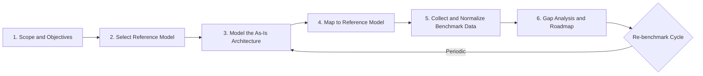
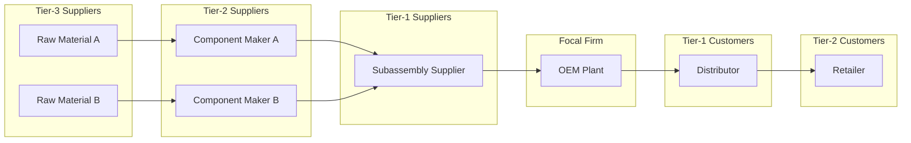
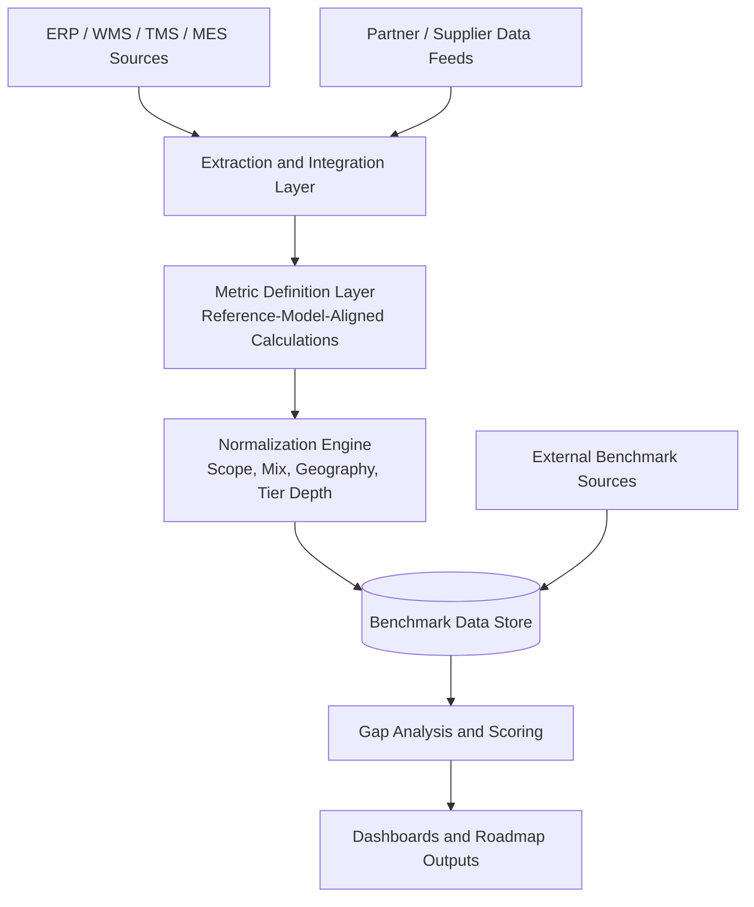

## Benchmarking Architecture Against Reference Models


### Overview

Benchmarking a supply chain architecture against reference models is the disciplined practice of comparing an organization's *as-is* (or *to-be*) network structure, tier configuration, processes, information flows, and performance metrics against a recognized, vendor-neutral model. The reference model supplies a common vocabulary, a standard process decomposition, a curated metric hierarchy, and a library of best practices. The benchmark exercise then quantifies the gap between the organization and that standard (or a peer group), and converts the gap into a prioritized roadmap.

In the context of **Supply Chain Architecture & Tiered Structures**, benchmarking answers questions such as:

- Is the tier structure (Tier-1, Tier-2, Tier-N suppliers; Tier-1, Tier-2 customers) modeled consistently with how a reference model decomposes the chain?
- Are the process flows at each tier expressed at comparable levels of abstraction (Plan, Source, Make, Deliver, Return, Enable)?
- Do visibility, planning cadence, inventory positioning, and lead times compare favorably with peers?
- Which architectural attributes (agility, cost, reliability, resilience, asset efficiency) are behind par, and what structural changes would close the gap?

**Key Points**

- A reference model is a *lens*, not a blueprint. It standardizes description and measurement; it does not prescribe a single "correct" design.
- Benchmarking has two distinct dimensions: **model conformance** (does our architecture map cleanly onto the model?) and **performance comparison** (do our metric values compare with peers or best-in-class?).
- Both dimensions must be normalized for scope, product mix, geography, and tier depth or the comparison is invalid.
- Benchmarking outputs should feed architectural decisions: network redesign, tier consolidation, sourcing strategy, integration priorities, and digital investment.

---

### Reference Models Commonly Used for Benchmarking

| Reference Model | Steward / Origin | Primary Focus | Typical Benchmark Use |
| --- | --- | --- | --- |
| **SCOR** (Supply Chain Operations Reference) | APICS / ASCM (originally Supply Chain Council) | End-to-end process decomposition and performance attributes | Process mapping, KPI comparison, gap analysis |
| **SCOR Digital Standard (SCOR DS)** | ASCM | Digital-era update: process, performance, practices, people, risk | Benchmarking digital maturity, resilience, and sustainability alongside classic metrics |
| **GSCF** (Global Supply Chain Forum) framework | Ohio State University | Relationship management and eight cross-functional processes | Benchmarking partner relationship structure across tiers |
| **CSCMP Supply Chain Process Standards** | CSCMP | Process standards with performance metrics | Process-level benchmarking |
| **VRM / VCOR** (Value Reference Model) | VCG (now under ASCM) | Product development, customer, and supply chain value chains | Extended value-chain benchmarking |
| **DCOR** (Design Chain Operations Reference) | Supply Chain Council / ASCM | Design and product-development processes | Benchmarking engineering-supply chain integration |
| **APQC Process Classification Framework (PCF)** | APQC | Cross-industry process taxonomy with open benchmarking data | Process cost and cycle-time benchmarking against large peer databases |
| **Gartner Supply Chain Maturity Model** | Gartner | Staged maturity progression | Capability and maturity positioning |
| **Supply Chain Resilience frameworks** (e.g., ISO 28002-style guidance, WEF/industry resilience models) | Various | Risk and disruption readiness | Tier-N visibility and resilience benchmarking |

[Inference] Exact model names, version numbers, and stewardship arrangements have changed over time (particularly SCOR's move from the Supply Chain Council to APICS/ASCM and the introduction of SCOR DS), so verify current versions before starting a formal engagement.

---

### Why Benchmark Architecture, Not Just KPIs

Many organizations benchmark only outcome KPIs (on-time delivery, inventory turns). Architecture benchmarking goes further because architectural choices *cause* KPI outcomes:

| Architectural Choice | KPI Effect |
| --- | --- |
| Number of tiers between OEM and raw material | Lead time, bullwhip amplification, visibility |
| Single vs. multi-echelon inventory positioning | Inventory days, service level, responsiveness |
| Centralized vs. distributed planning | Plan stability, cycle time, forecast accuracy |
| Direct vs. distributor-mediated fulfillment | Cost-to-serve, delivery reliability |
| Supplier concentration at Tier-1/Tier-2 | Risk exposure, negotiating leverage |
| Integration depth (EDI, API, shared platforms) | Order cycle time, error rate, planning latency |

Benchmarking only the KPI while ignoring the architecture tends to produce local fixes (e.g., expediting) rather than structural corrections.

---

### The Benchmarking Framework

The end-to-end approach can be expressed as six phases.



#### Phase 1: Scope and Objectives

Define what is being benchmarked and why.

- **Boundary:** Which product families, business units, geographies, and tiers are in scope?
- **Depth:** How many tiers upstream and downstream will be modeled (for example, Tier-1 and Tier-2 suppliers only, or down to raw material)?
- **Purpose:** Cost reduction, resilience, digital transformation readiness, M&A integration, or compliance.
- **Comparison target:** Parity with peers, median, top quartile, or best-in-class.

**Example scope statement:**

> Benchmark the North America finished-goods supply chain for Product Family A, including Tier-1 and Tier-2 suppliers, two manufacturing sites, three distribution centers, and Tier-1 customers, against SCOR Level 2 processes and the Reliability, Responsiveness, Agility, and Cost attributes.

#### Phase 2: Select the Reference Model

Selection criteria:

1. **Fit with business type** (discrete manufacturing, process industry, retail, services).
2. **Availability of benchmark data** (published peer datasets, consortium data, or paid databases).
3. **Granularity needed** (process-level versus relationship-level versus maturity-level).
4. **Organizational familiarity** and existing tooling.

Combining models is common: SCOR for process and metrics, GSCF for relationship structure, and a maturity model for capability positioning.

#### Phase 3: Model the As-Is Architecture

Capture the architecture in a form that can be mapped to the model. A useful minimum set of artifacts:

- **Network topology:** nodes (suppliers, plants, DCs, customers) and edges (material, information, and financial flows), annotated by tier.
- **Process inventory:** who performs plan, source, make, deliver, and return at each node.
- **Information architecture:** systems of record, integration mechanisms, data latency.
- **Governance:** planning cadence, contract types, service-level agreements, collaboration forums.
- **Metrics baseline:** current values for the KPIs to be compared.

#### Phase 4: Map to the Reference Model

Translate the as-is architecture into the model's vocabulary. For SCOR, this typically means:

- **Level 1 (Scope):** Plan, Source, Make, Deliver, Return, and Enable at the supply-chain level.
- **Level 2 (Configuration):** Choose process categories per product/channel, for example Source Stocked Product (S1), Source Make-to-Order (S2), Source Engineer-to-Order (S3), Make-to-Stock (M1), Make-to-Order (M2), Engineer-to-Order (M3), Deliver Stocked Product (D1), Deliver Make-to-Order (D2), Deliver Engineer-to-Order (D3), Deliver Retail Product (D4).
- **Level 3 (Process Element):** Detailed process elements, inputs, outputs, and metrics.

Mapping produces a **conformance matrix**: for each reference process, record whether the organization performs it, how, at which tier, and by which party.

**Example conformance matrix (excerpt):**

| SCOR Process | Performed? | Owner | Tier / Node | Comment |
| --- | --- | --- | --- | --- |
| P2 Plan Source | Yes | Corporate Planning | Focal firm | Monthly S&OP cycle |
| S1 Source Stocked Product | Yes | Procurement | Focal firm ↔ Tier-1 | Vendor-managed inventory for 30% of SKUs |
| S2 Source MTO | Partial | Plant procurement | Focal firm ↔ Tier-1 | Manual quoting process |
| M1 Make-to-Stock | Yes | Plant A | Focal firm | High-volume lines |
| D1 Deliver Stocked Product | Yes | Logistics | Focal firm ↔ Tier-1 customers | Third-party logistics |
| SR1 Source Return Defective | No | None | n/a | Gap: no structured returns flow |

Blank or "Partial" rows identify architectural gaps immediately, even before any numeric benchmarking.

#### Phase 5: Collect and Normalize Benchmark Data

Sources of comparison data:

- Consortium or paid benchmarking databases (for example, models with published peer percentiles).
- Industry associations and published research.
- Internal cross-site benchmarking (comparing plants or regions against one another).
- Partner or customer-supplied data through collaborative agreements.

**Normalization** is essential. Adjust for:

- Product complexity and SKU count.
- Customer mix and order profile (lines per order, order size).
- Geography and lane length.
- Revenue scale and capital intensity.
- Tier depth (a chain with four tiers cannot be compared naively with a chain with two).
- Definition alignment (what counts as "on-time," "perfect order," or "inventory").

#### Phase 6: Gap Analysis and Roadmap

Quantify gaps, diagnose causes, and prioritize architectural interventions (detailed below).

---

### Performance Attributes and Metrics

SCOR organizes performance into five customer-facing and internal-facing attributes. Benchmarking compares Level 1 metrics and diagnoses through Level 2 and Level 3 metrics.

| Attribute | Perspective | Representative Level 1 Metric |
| --- | --- | --- |
| **Reliability** | Customer-facing | Perfect Order Fulfillment |
| **Responsiveness** | Customer-facing | Order Fulfillment Cycle Time |
| **Agility** | Customer-facing | Upside Supply Chain Flexibility, Upside Adaptability, Downside Adaptability, Overall Value at Risk |
| **Cost** | Internal-facing | Total Cost to Serve |
| **Asset Management Efficiency** | Internal-facing | Cash-to-Cash Cycle Time, Return on Fixed Assets, Return on Working Capital |

Key formulas commonly used in the benchmark:

**Perfect Order Fulfillment** (a compounded metric, so each component multiplies):

$$POF = \%OnTime \times \%InFull \times \%DamageFree \times \%DocumentationAccurate$$

**Cash-to-Cash Cycle Time:**

$$C2C = DIO + DSO - DPO$$

where $DIO$ is days inventory outstanding, $DSO$ is days sales outstanding, and $DPO$ is days payables outstanding.

**Inventory Days of Supply:**

$$DIO = \frac{\text{Average Inventory Value}}{\text{Cost of Goods Sold}} \times 365$$

**Return on Working Capital:**

$$ROWC = \frac{\text{Supply Chain Revenue} - \text{Supply Chain Cost}}{\text{Inventory} + \text{Accounts Receivable} - \text{Accounts Payable}}$$

**Gap as a percentage of benchmark:**

$$Gap\% = \frac{V_{benchmark} - V_{actual}}{V_{benchmark}} \times 100$$

For metrics where lower is better (cycle time, cost), invert the numerator to keep sign conventions consistent.

**Key Points**

- Perfect Order Fulfillment is multiplicative: four components each at 95% yield only about 81.5% overall. Benchmarks that hide this compounding cause underestimation of the improvement needed.
- Always confirm the benchmark provider's *exact* metric definitions before comparing.

---

### Benchmarking the Tiered Structure Specifically

Tiered structure is the distinguishing architectural dimension. Reference models describe processes generically; tier benchmarking requires applying the model *repeatedly* along the chain and comparing tier-level characteristics.

#### Tier-Level Dimensions to Compare

| Dimension | Question | Typical Indicator |
| --- | --- | --- |
| **Depth** | How many tiers separate the focal firm from the origin of raw material? | Tier count per critical component |
| **Breadth** | How many suppliers at each tier per component? | Supplier count, concentration (for example, Herfindahl-Hirschman Index) |
| **Visibility** | How far upstream and downstream can demand, inventory, and risk be seen? | Percent of spend visible to Tier-2 and Tier-N |
| **Integration** | How tightly are tiers connected operationally and digitally? | Share of orders via electronic integration; planning data shared |
| **Collaboration** | Are forecasts, capacity, and inventory jointly managed? | Percent of volume under collaborative planning |
| **Lead-time profile** | How does cumulative lead time build across tiers? | Cumulative lead time versus sum of tier lead times |
| **Risk concentration** | Are critical inputs single-sourced at deep tiers? | Number of single-source Tier-2/3 dependencies |

Supplier concentration can be quantified with the Herfindahl-Hirschman Index:

$$HHI = \sum_{i=1}^{n} s_i^2$$

where $s_i$ is the share of spend (or volume) with supplier $i$. Higher values indicate greater concentration.

#### Tier Benchmark Illustration



Applying SCOR-style thinking to this diagram means describing each link as a Source-Make-Deliver triplet (the focal firm's Source connects to the supplier's Deliver, and the focal firm's Deliver connects to the customer's Source), which is precisely how SCOR represents a multi-tier chain as a *chain of linked process loops*.

#### The Bullwhip Diagnostic

A tier benchmark should include an amplification test. The bullwhip ratio at a tier compares order variability to demand variability:

$$BW_k = \frac{\mathrm{Var}(Orders_k)}{\mathrm{Var}(Demand_k)}$$

A ratio above 1 indicates amplification. Compare $BW$ across tiers and against peers; steep growth upstream signals weak information sharing or batching behavior in the architecture. [Inference] Typical magnitudes vary widely by industry and planning policy, so peer comparison rather than an absolute threshold is the more defensible use.

---

### Maturity-Based Benchmarking

Where quantitative peer data is unavailable, maturity models provide a structured qualitative benchmark. A generic five-stage scale:

| Stage | Description | Architectural Signature |
| --- | --- | --- |
| 1. Ad hoc | Reactive, siloed | Undocumented tiers, no shared planning |
| 2. Defined | Documented functional processes | Tier-1 mapped, basic KPIs |
| 3. Integrated | Cross-functional coordination | S&OP in place, Tier-1 data sharing |
| 4. Extended | Collaboration beyond Tier-1 | Multi-tier visibility, joint planning |
| 5. Optimized / Adaptive | Predictive, self-correcting | End-to-end digital twin, dynamic reconfiguration |

Score each architectural domain (planning, sourcing, manufacturing, logistics, returns, risk, data and technology, governance) and plot on a radar chart for visual comparison against target stage.

**Example scoring sheet:**

| Domain | Current | Target | Gap |
| --- | --- | --- | --- |
| Planning | 3 | 4 | 1 |
| Sourcing | 2 | 4 | 2 |
| Manufacturing | 3 | 3 | 0 |
| Logistics | 3 | 4 | 1 |
| Returns | 1 | 3 | 2 |
| Risk and Resilience | 2 | 4 | 2 |
| Data and Technology | 2 | 4 | 2 |

---

### Worked Example: Gap Analysis

**Scenario:** A consumer-electronics manufacturer benchmarks its supply chain against SCOR Level 1 metrics and a peer median. Values are illustrative.

| Metric | Actual | Peer Median | Best-in-Class | Direction |
| --- | --- | --- | --- | --- |
| Perfect Order Fulfillment | 82% | 90% | 96% | Higher better |
| Order Fulfillment Cycle Time | 14 days | 10 days | 6 days | Lower better |
| Total Cost to Serve (% of revenue) | 11.5% | 9.8% | 8.0% | Lower better |
| Cash-to-Cash Cycle Time | 68 days | 52 days | 30 days | Lower better |
| Upside Supply Chain Flexibility | 45 days | 30 days | 14 days | Lower better |

**Gap to peer median (using sign convention where positive means the organization is behind):**

- Perfect Order Fulfillment: $\frac{90 - 82}{90} \times 100 \approx 8.9\%$ behind.
- Order Fulfillment Cycle Time: $\frac{14 - 10}{10} \times 100 = 40\%$ behind.
- Total Cost to Serve: $\frac{11.5 - 9.8}{9.8} \times 100 \approx 17.3\%$ behind.
- Cash-to-Cash Cycle Time: $\frac{68 - 52}{52} \times 100 \approx 30.8\%$ behind.
- Upside Flexibility: $\frac{45 - 30}{30} \times 100 = 50\%$ behind.

**Diagnosis linking metrics to architecture:**

| Symptom | Likely Architectural Cause | Candidate Intervention |
| --- | --- | --- |
| Long upside flexibility | Long, single-threaded Tier-2 supply of a key component, no buffer stock | Dual-source Tier-2; strategic buffer at Tier-1 |
| High cash-to-cash | Inventory positioned centrally with long replenishment loops | Re-position inventory; adopt vendor-managed inventory with Tier-1 |
| Low Perfect Order | Manual order handoffs between focal firm and Tier-1 customers | API or EDI integration; unified order status |
| High cost to serve | Fragmented logistics across too many carriers and DCs | Network consolidation; carrier rationalization |

**Prioritization** should weigh value at stake, effort, risk, and dependency. A simple scoring approach:

$$Priority = \frac{Value \times Confidence}{Effort}$$


---

### Implementation: Automating the Benchmark Computation

The following Python example demonstrates a reusable gap-analysis routine that handles both "higher is better" and "lower is better" metrics.

**Example**

```python
from dataclasses import dataclass
from typing import Literal

@dataclass
class Metric:
    name: str
    actual: float
    peer_median: float
    best_in_class: float
    direction: Literal["higher", "lower"]

def gap_percent(actual: float, target: float, direction: str) -> float:
    """
    Positive result means the organization is behind the target.
    """
    if target == 0:
        raise ValueError("Target cannot be zero for percentage gap.")
    if direction == "higher":
        return (target - actual) / target * 100.0
    if direction == "lower":
        return (actual - target) / target * 100.0
    raise ValueError("direction must be 'higher' or 'lower'")

def analyze(metrics: list[Metric]) -> list[dict]:
    rows = []
    for m in metrics:
        rows.append({
            "metric": m.name,
            "actual": m.actual,
            "gap_to_median_pct": round(gap_percent(m.actual, m.peer_median, m.direction), 1),
            "gap_to_best_pct": round(gap_percent(m.actual, m.best_in_class, m.direction), 1),
        })
    return sorted(rows, key=lambda r: r["gap_to_median_pct"], reverse=True)

if __name__ == "__main__":
    data = [
        Metric("Perfect Order Fulfillment (%)", 82, 90, 96, "higher"),
        Metric("Order Fulfillment Cycle Time (days)", 14, 10, 6, "lower"),
        Metric("Total Cost to Serve (% revenue)", 11.5, 9.8, 8.0, "lower"),
        Metric("Cash-to-Cash Cycle Time (days)", 68, 52, 30, "lower"),
        Metric("Upside Flexibility (days)", 45, 30, 14, "lower"),
    ]
    for row in analyze(data):
        print(row)
```

**Output**

```plaintext
{'metric': 'Upside Flexibility (days)', 'actual': 45, 'gap_to_median_pct': 50.0, 'gap_to_best_pct': 221.4}
{'metric': 'Order Fulfillment Cycle Time (days)', 'actual': 14, 'gap_to_median_pct': 40.0, 'gap_to_best_pct': 133.3}
{'metric': 'Cash-to-Cash Cycle Time (days)', 'actual': 68, 'gap_to_median_pct': 30.8, 'gap_to_best_pct': 126.7}
{'metric': 'Total Cost to Serve (% revenue)', 'actual': 11.5, 'gap_to_median_pct': 17.3, 'gap_to_best_pct': 43.8}
{'metric': 'Perfect Order Fulfillment (%)', 'actual': 82, 'gap_to_median_pct': 8.9, 'gap_to_best_pct': 14.6}
```

The sorted output ranks metrics by gap to median, giving an immediate priority signal for diagnosis.

---

### Conformance Benchmarking: Checking the Architecture Model Itself

Beyond metrics, benchmark the *model of the architecture* for completeness and consistency with the reference.

**Conformance checklist:**

1. **Process coverage:** Every Level 2 process category relevant to the business is identified and owned.
2. **Flow completeness:** Material, information, and financial flows are documented between every adjacent pair of nodes.
3. **Tier consistency:** Each tier is described at the same level of abstraction. Avoid describing Tier-1 at Level 3 detail while Tier-3 is a single box.
4. **Boundary clarity:** The focal-firm boundary and the extent of influence versus mere awareness are explicit.
5. **Metric traceability:** Each metric maps to a named process and an owner.
6. **Data lineage:** Benchmark values trace to a defined calculation and data source.
7. **Enable-process coverage:** Governance, compliance, risk, technology, and human-resource enablers are represented.

A **conformance score** can be computed as:

$$Conformance = \frac{\text{Processes correctly mapped}}{\text{Processes applicable}} \times 100$$


---

### Data Architecture for Benchmarking

A sustainable benchmarking capability requires an intentional data layer rather than one-off spreadsheets.



**Design principles:**

- **Single metric dictionary:** One authoritative definition per metric, versioned, and aligned to the reference model's definitions.
- **Tier tagging:** Every transaction and entity carries a tier attribute so metrics can be sliced by tier.
- **Lineage and auditability:** Each benchmark value is traceable to source records and transformation rules.
- **Period alignment:** Compare like periods (trailing twelve months, seasonality-adjusted).

**Example metric dictionary entry (YAML):**

```yaml
metric_id: RL.1.1
name: Perfect Order Fulfillment
attribute: Reliability
reference_model: SCOR
components:
  - on_time
  - in_full
  - damage_free
  - documentation_accurate
formula: on_time * in_full * damage_free * documentation_accurate
unit: percent
direction: higher_is_better
grain: order_line
scope_filters:
  - product_family
  - customer_tier
  - region
data_sources:
  - erp.sales_orders
  - tms.shipments
  - wms.pick_confirm
owner: Logistics Analytics
```

[Inference] Identifier schemes such as `RL.1.1` mirror SCOR's coding convention, but you should confirm the exact codes against the model version your organization licenses.

---

### Common Pitfalls and Mitigations

| Pitfall | Consequence | Mitigation |
| --- | --- | --- |
| Comparing non-normalized data | Misleading gaps, wrong investments | Normalize for mix, scale, geography, tier depth |
| Mismatched metric definitions | False sense of parity or shortfall | Reconcile definitions before comparing |
| Benchmarking against the wrong peer group | Unattainable or trivial targets | Choose peers by business model, not only industry label |
| Model worship | Forcing the organization into a template that does not fit | Treat the model as a vocabulary and diagnostic tool |
| Ignoring deep-tier realities | Hidden risk concentrations | Extend mapping to critical Tier-2/Tier-N nodes |
| One-time exercise | Stale insights | Institutionalize a re-benchmark cadence |
| Gap without cause | Unactionable output | Link each gap to an architectural driver |
| Data quality neglect | Unreliable comparisons | Establish data governance and validation rules |

---

### Governance and Cadence

- **Ownership:** A supply chain architecture or transformation office owns the benchmark, with metric owners across functions.
- **Cadence:** Annual full benchmark, quarterly metric refresh, event-triggered re-benchmark (M&A, network redesign, major disruption).
- **Decision linkage:** Benchmark findings feed capital planning, sourcing strategy, and digital roadmap reviews.
- **Confidentiality:** When sharing data with peers or consortia, apply anonymization and antitrust-compliant data handling.

---

### Extending the Benchmark: Digital, Risk, and Sustainability

Modern reference models broaden beyond classic operational metrics. Additional benchmark dimensions include:

| Dimension | Example Indicators |
| --- | --- |
| **Digital maturity** | Percent of transactions automated, data latency, use of control-tower visibility, predictive analytics adoption |
| **Resilience** | Time to recover, time to survive, share of spend with alternate qualified sources, multi-tier disruption exposure |
| **Sustainability** | Emissions per unit shipped, supplier compliance coverage, circularity rate |
| **People and skills** | Planner productivity, analytics skill coverage |

The resilience pair *time-to-recover* (TTR) and *time-to-survive* (TTS) supports a simple structural test: a node is a critical exposure when

$$TTR_{node} > TTS_{node}$$

meaning the chain cannot sustain operations for as long as recovery would take. [Inference] Whether this specific formulation appears in any given reference model version should be verified, but the concept is widely used in resilience analysis.

---

### Step-by-Step Execution Checklist

1. Confirm objectives, scope, and comparison target with sponsors.
2. Select the reference model(s) and confirm licensing and version.
3. Assemble the as-is architecture artifacts: topology, process inventory, systems, governance.
4. Map processes and nodes to the reference model; build the conformance matrix.
5. Define and reconcile metric definitions with the benchmark source.
6. Extract, clean, and normalize internal metric data.
7. Acquire peer or best-in-class comparison data.
8. Compute gaps at Level 1, then drill into Level 2 and Level 3 diagnostics.
9. Attribute each material gap to an architectural driver (tiering, positioning, integration, governance).
10. Prioritize interventions by value, confidence, and effort.
11. Build the roadmap and business case; secure ownership.
12. Establish the re-benchmark cadence and monitoring dashboards.

---

**Conclusion**

Benchmarking architecture against reference models converts subjective impressions of supply chain quality into a structured, comparable, and actionable assessment. Its strength lies in combining three lenses: *conformance* (does the architecture map onto the reference process structure), *performance* (do the metrics compare favorably after normalization), and *tier-aware diagnosis* (do depth, breadth, visibility, and integration across tiers explain the gaps). Done well, it links every measured shortfall to a specific architectural driver and produces a prioritized roadmap. Done poorly, it degenerates into a KPI league table that invites local fixes and misses structural causes.

**Related Topics**

- SCOR Model Levels, Process Categories, and Metric Hierarchy
- SCOR Digital Standard: Practices, People, and Risk Extensions
- GSCF Framework and Relationship-Based Tier Management
- APQC Process Classification Framework and Open Benchmarking
- Supply Chain Maturity Models and Capability Assessment
- Multi-Tier Visibility and Sub-Tier Mapping Techniques
- Bullwhip Effect Measurement Across Tiers
- Network Redesign and Inventory Positioning Optimization
- Supplier Concentration and Risk Benchmarking
- Digital Twins and Control Towers for Continuous Benchmarking
- Metric Dictionaries, Data Governance, and Lineage for Supply Chain Analytics
- Resilience Metrics: Time-to-Recover and Time-to-Survive Analysis