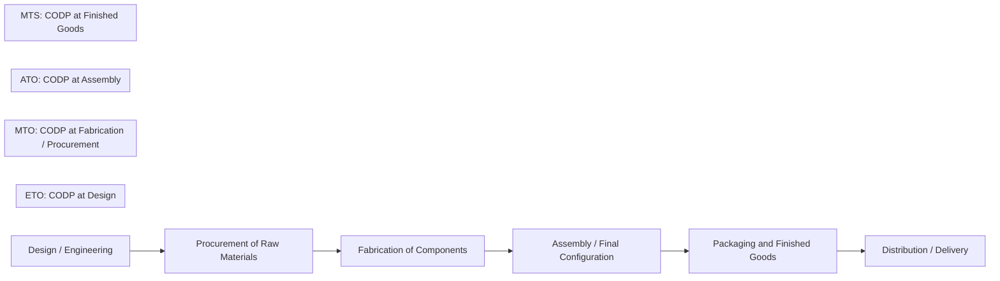
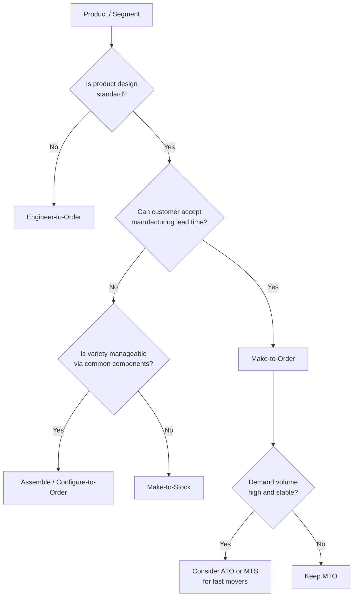
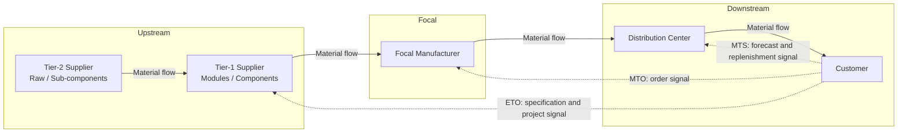

## Make-to-Stock, Make-to-Order, and Engineer-to-Order Models


### Overview

Make-to-Stock (MTS), Make-to-Order (MTO), and Engineer-to-Order (ETO) are the three foundational **production fulfillment strategies** that determine how a manufacturing network responds to demand. Each strategy answers a single architectural question: *at what point in the value chain does production commitment become tied to a specific customer order?*

That point is called the **Customer Order Decoupling Point (CODP)**, also written as the *order penetration point*. Everything upstream of the CODP is driven by forecasts and plans (push logic). Everything downstream is driven by actual customer orders (pull logic).

In the context of **Supply Chain Architecture & Tiered Structures**, the choice of MTS, MTO, or ETO shapes:

- Which tier holds inventory, and in what form (raw material, components, semi-finished, finished goods).
- How far upstream customer demand signals must propagate (and therefore how much Tier-1 and Tier-2 supplier visibility is required).
- How the network is configured: number of plants, location of distribution centers, postponement capability.
- The planning cadence, systems, and contract structures between tiers.
- The cost, service, and risk profile of the entire chain.

**Key Points**

- MTS, MTO, and ETO are points on a continuum, not isolated categories. Assemble-to-Order (ATO), Configure-to-Order (CTO), and Make-to-Engineer hybrids sit between them.
- A single company routinely runs multiple strategies at once, segmented by product family, customer, or region.
- The CODP is the central architectural design variable. Moving it upstream improves responsiveness and raises inventory risk; moving it downstream reduces inventory risk and lengthens customer lead time.
- Each strategy maps to specific SCOR process categories (for example, S1/M1/D1 for MTS; S2/M2/D2 for MTO; S3/M3/D3 for ETO).

---

### The Customer Order Decoupling Point

The CODP separates forecast-driven activity from order-driven activity. Its position along the chain defines the strategy.



| Strategy | CODP Position | Upstream of CODP | Downstream of CODP |
| --- | --- | --- | --- |
| **Make-to-Stock (MTS)** | Finished goods / distribution | Everything through packaging (forecast-driven) | Only delivery (order-driven) |
| **Assemble-to-Order (ATO)** | Final assembly | Component fabrication (forecast-driven) | Assembly, packaging, delivery |
| **Make-to-Order (MTO)** | Fabrication or procurement | Raw material stocking (forecast-driven) | Fabrication, assembly, delivery |
| **Engineer-to-Order (ETO)** | Design / engineering | Little to none (some generic capacity and standard materials) | Design, procurement, manufacture, delivery |

---

### Make-to-Stock (MTS)

#### Definition

In MTS, products are manufactured against a **demand forecast** and held as finished-goods inventory. Customer orders are fulfilled directly from stock. Production is decoupled from individual orders, so customer lead time is essentially the pick, pack, and ship time.

#### Characteristics

- High-volume, standardized, low-variety products.
- Stable, predictable demand or demand that can be forecast with acceptable error.
- Short delivery lead time expected by customers (often days or same day).
- Economies of scale through long production runs and level loading.
- Inventory is the buffer against forecast error.

#### Typical Industries and Examples

- Consumer packaged goods (beverages, toiletries, packaged food).
- Commodity chemicals and building materials.
- Standard electronics and small appliances.
- Fasteners, bearings, and standard industrial components.

#### Planning Logic

MTS is driven by **Sales and Operations Planning (S&OP)**, statistical forecasting, Master Production Schedule (MPS), and Distribution Requirements Planning (DRP).

Key inventory equations:

**Safety stock** under normal demand and constant lead time:

$$SS = z \times \sigma_d \times \sqrt{L}$$

where $z$ is the service-level factor, $\sigma_d$ is the standard deviation of demand per period, and $L$ is the replenishment lead time in periods.

**Safety stock** with variable demand and variable lead time:

$$SS = z \times \sqrt{L \cdot \sigma_d^2 + \bar{d}^2 \cdot \sigma_L^2}$$

where $\bar{d}$ is mean demand per period and $\sigma_L$ is the standard deviation of lead time.

**Reorder point:**

$$ROP = \bar{d} \times L + SS$$

**Economic order (or production) quantity:**

$$EOQ = \sqrt{\frac{2DS}{H}}$$

where $D$ is annual demand, $S$ is setup or ordering cost per run, and $H$ is annual holding cost per unit. For finite production rates, the Economic Production Quantity applies:

$$EPQ = \sqrt{\frac{2DS}{H\left(1 - \frac{d}{p}\right)}}$$

where $d$ is the demand rate and $p$ is the production rate.

#### Architectural Implications

| Dimension | MTS Pattern |
| --- | --- |
| **Inventory position** | Finished goods held at plants and forward distribution centers; multi-echelon buffers |
| **Network design** | Centralized or regional plants with multi-tier distribution; emphasis on transport cost and DC placement |
| **Supplier tiering** | Tier-1 suppliers deliver against forecasts and blanket orders; Tier-2 visibility is often limited |
| **Information flow** | Forecast sharing, point-of-sale data, replenishment signals |
| **Planning cadence** | Monthly S&OP, weekly MPS, daily replenishment |
| **Primary risk** | Forecast error leading to obsolescence, markdowns, or stockouts |
| **Primary KPI emphasis** | Fill rate, inventory turns, forecast accuracy, cost per unit |

#### Advantages and Limitations

| Advantages | Limitations |
| --- | --- |
| Fast delivery and high service availability | Inventory holding cost and obsolescence risk |
| Economies of scale and level production | Poor fit for high-variety or customized demand |
| Simple order fulfillment process | Exposure to forecast error and bullwhip amplification |
| Predictable capacity utilization | Working capital tied up in stock |

---

### Make-to-Order (MTO)

#### Definition

In MTO, production begins **after receipt of a confirmed customer order**. The product design is standard or pre-defined, but manufacturing is triggered by the order. Raw materials and common components may be stocked on a forecast basis; finished goods are not.

#### Characteristics

- Moderate to high variety, lower volume per variant.
- Customers accept a delivery lead time that includes manufacturing time.
- Products are configured from existing designs, not newly engineered.
- Finished-goods inventory is minimal or zero, reducing obsolescence risk.
- Lead-time quoting and capacity availability become critical service factors.

#### Typical Industries and Examples

- Industrial machinery with standard model options.
- Furniture and mattresses built to customer specification.
- Custom apparel and footwear programs.
- Specialty chemicals and packaging produced per order.
- Computer systems configured to order (often blended with ATO).

#### Planning Logic

MTO replaces the forecast-driven MPS with **order-driven scheduling**, capable-to-promise (CTP) and available-to-promise (ATP) logic, and finite-capacity scheduling.

**Delivery lead time** decomposes as:

$$LT_{delivery} = LT_{order\ processing} + LT_{procurement} + LT_{manufacturing} + LT_{shipping}$$

The procurement term drops out when the required materials are already stocked at the CODP. This is the central lever: **stocking common raw materials or components shortens quoted lead time without holding finished goods.**

**Capacity utilization and queuing effects** matter greatly in MTO. Using the Kingman approximation for a single-server queue with general arrival and service distributions:

$$W_q \approx \left(\frac{\rho}{1-\rho}\right) \left(\frac{c_a^2 + c_s^2}{2}\right) \tau$$

where $W_q$ is expected wait in queue, $\rho$ is utilization, $c_a$ and $c_s$ are the coefficients of variation of inter-arrival and service times, and $\tau$ is mean service time. The $\frac{\rho}{1-\rho}$ term shows why lead times rise nonlinearly as utilization approaches 100%, so MTO systems typically run at lower utilization than MTS systems to protect promised lead times.

#### Architectural Implications

| Dimension | MTO Pattern |
| --- | --- |
| **Inventory position** | Raw materials and common components stocked; finished goods minimal |
| **Network design** | Flexible plants with quick changeover; proximity to customers valued when lead time is tight |
| **Supplier tiering** | Tier-1 suppliers must respond quickly; vendor-managed inventory and consignment stock are common tools |
| **Information flow** | Order-status visibility, real-time capacity and material availability |
| **Planning cadence** | Daily or continuous scheduling; weekly material planning |
| **Primary risk** | Capacity bottlenecks, long or unreliable lead times, material shortages |
| **Primary KPI emphasis** | Order fulfillment cycle time, on-time delivery to promise date, schedule adherence |

#### Advantages and Limitations

| Advantages | Limitations |
| --- | --- |
| Low finished-goods inventory and obsolescence | Longer customer lead time than MTS |
| High customization within a defined design space | Capacity and lead-time volatility |
| Better match to actual demand | Smaller batches raise unit cost and changeover burden |
| Lower forecast dependence at the finished-goods level | Requires responsive upstream supply |

---

### Engineer-to-Order (ETO)

#### Definition

In ETO, each customer order triggers **product design and engineering** in addition to procurement and manufacturing. The product is unique or highly customized, and the specification is often developed collaboratively with the customer. The CODP sits at the design stage, so almost nothing except generic capacity and common materials is committed in advance.

#### Characteristics

- Very low volume, very high variety, often one-of-a-kind or small-batch projects.
- Long lead times measured in months or years.
- Project-based management with milestones, change orders, and customer approvals.
- Significant engineering effort and design uncertainty.
- Supply chain (long-lead components, specialized sub-tier suppliers) is often selected per project.
- Contracts frequently include progress payments, penalties, and warranty terms.

#### Typical Industries and Examples

- Shipbuilding and offshore structures.
- Power generation equipment (turbines, transformers, switchgear).
- Aerospace structures and special-purpose aircraft.
- Custom industrial plants, process equipment, and heavy machinery.
- Large-scale infrastructure equipment (bridges, rail systems).

#### Planning Logic

ETO relies on **project management** disciplines: work breakdown structures (WBS), critical path scheduling, resource-constrained project scheduling, and configuration management. A Bill of Materials evolves during the project, moving from engineering BOM (EBOM) to manufacturing BOM (MBOM).

**Project duration** is governed by the critical path:

$$T_{project} = \max_{p \in P} \sum_{i \in p} t_i$$

where $P$ is the set of paths through the activity network and $t_i$ is the duration of activity $i$. Long-lead procurement items frequently sit on the critical path, so ETO firms must order them before design is complete, accepting design-change risk.

**Cost estimation** uncertainty is high. A common practice is to apply contingency or reserve:

$$Bid\ Price = (Base\ Cost + Contingency) \times (1 + Margin)$$

where contingency reflects design and execution risk. [Inference] Typical contingency percentages vary considerably by industry, project maturity, and contract type, so treat any specific figure as project-dependent.

#### Architectural Implications

| Dimension | ETO Pattern |
| --- | --- |
| **Inventory position** | Little to no stock; only standard materials or long-lead placeholders |
| **Network design** | Project-oriented; fabrication sites, assembly yards, and delivery logistics chosen per project |
| **Supplier tiering** | Deep multi-tier collaboration; early supplier involvement in design; qualified supplier panels |
| **Information flow** | Shared design data (CAD/PLM), change-control workflows, milestone status |
| **Planning cadence** | Project schedule reviews (weekly), design reviews at gates |
| **Primary risk** | Design change, schedule slippage, cost overruns, supplier failures on critical items |
| **Primary KPI emphasis** | Schedule adherence, margin versus estimate, engineering change count, on-time milestone completion |

#### Advantages and Limitations

| Advantages | Limitations |
| --- | --- |
| Exact fit to customer requirements | Very long lead time |
| No finished-goods inventory | High cost and estimation uncertainty |
| High margin potential for differentiated solutions | Heavy dependency on engineering capacity |
| Strong customer relationships and lock-in | Difficult to standardize or scale |

---

### Comparative Analysis

| Attribute | MTS | MTO | ETO |
| --- | --- | --- | --- |
| **CODP** | Finished goods | Fabrication / procurement | Design |
| **Demand driver** | Forecast | Customer order | Customer project / contract |
| **Product variety** | Low | Medium to high | Very high (unique) |
| **Volume per variant** | High | Low to medium | Very low (often one) |
| **Customer lead time** | Days | Weeks | Months to years |
| **Finished-goods inventory** | High | Minimal or none | None |
| **Raw material / component inventory** | Moderate | Moderate to high (common parts) | Low; project-specific |
| **Forecast dependence** | Very high | Medium (materials) | Low |
| **Design authority** | Supplier | Supplier (standard design) | Shared or customer-driven |
| **Production system** | Flow / repetitive | Batch / job shop | Project / job shop |
| **Cost per unit** | Lowest | Medium | Highest |
| **Planning tools** | S&OP, MPS, DRP | ATP/CTP, finite scheduling | Project management, PLM |
| **Main risk** | Obsolescence, forecast error | Capacity, lead time | Design change, overruns |
| **SCOR process categories** | S1, M1, D1 | S2, M2, D2 | S3, M3, D3 |

The relationship among inventory risk, lead time, and customization can be visualized as follows.

<svg xmlns="http://www.w3.org/2000/svg" viewBox="0 0 760 360" width="760" height="360" font-family="Arial, Helvetica, sans-serif">
<title>CODP Position by Strategy (svg_diagram)</title>
<text x="380" y="28" text-anchor="middle" font-size="18" font-weight="bold">CODP Position by Strategy (svg_diagram)</text>

<g font-size="13" text-anchor="middle">
<rect x="30" y="60" width="110" height="46" fill="#dbeafe" stroke="#1e3a8a" />
<text x="85" y="88">Design</text>
<rect x="160" y="60" width="110" height="46" fill="#dbeafe" stroke="#1e3a8a" />
<text x="215" y="88">Procure</text>
<rect x="290" y="60" width="110" height="46" fill="#dbeafe" stroke="#1e3a8a" />
<text x="345" y="88">Fabricate</text>
<rect x="420" y="60" width="110" height="46" fill="#dbeafe" stroke="#1e3a8a" />
<text x="475" y="88">Assemble</text>
<rect x="550" y="60" width="90" height="46" fill="#dbeafe" stroke="#1e3a8a" />
<text x="595" y="88">Stock</text>
<rect x="650" y="60" width="90" height="46" fill="#dbeafe" stroke="#1e3a8a" />
<text x="695" y="88">Deliver</text>
</g>


<text x="30" y="150" font-size="13" font-weight="bold">ETO</text>

<rect x="30" y="160" width="710" height="22" fill="`#fecaca`" stroke="`#991b1b`" />

<text x="385" y="176" font-size="12" text-anchor="middle">All stages order-driven (CODP at Design)</text>


<text x="30" y="210" font-size="13" font-weight="bold">MTO</text>

<rect x="30" y="220" width="130" height="22" fill="`#bbf7d0`" stroke="`#166534`" />

<text x="95" y="236" font-size="11" text-anchor="middle">Forecast-driven</text>

<rect x="160" y="220" width="580" height="22" fill="`#fecaca`" stroke="`#991b1b`" />

<text x="450" y="236" font-size="12" text-anchor="middle">Order-driven (CODP at Procure / Fabricate)</text>


<text x="30" y="270" font-size="13" font-weight="bold">ATO</text>

<rect x="30" y="280" width="390" height="22" fill="`#bbf7d0`" stroke="`#166534`" />

<text x="225" y="296" font-size="12" text-anchor="middle">Forecast-driven components</text>

<rect x="420" y="280" width="320" height="22" fill="`#fecaca`" stroke="`#991b1b`" />

<text x="580" y="296" font-size="12" text-anchor="middle">Order-driven (CODP at Assembly)</text>


<text x="30" y="330" font-size="13" font-weight="bold">MTS</text>

<rect x="30" y="340" width="610" height="16" fill="`#bbf7d0`" stroke="`#166534`" />

<text x="335" y="352" font-size="11" text-anchor="middle">Forecast-driven through finished goods</text>

<rect x="650" y="340" width="90" height="16" fill="`#fecaca`" stroke="`#991b1b`" />

<text x="695" y="352" font-size="10" text-anchor="middle">Order-driven</text>

</svg>

---

### Hybrid and Intermediate Strategies

Pure MTS, MTO, and ETO are endpoints. Real networks use hybrids to balance responsiveness against inventory cost.

#### Assemble-to-Order (ATO) and Configure-to-Order (CTO)

Common modules and components are built to forecast and stocked. Final assembly or configuration is triggered by the order. This is the dominant pattern for products with high external variety but limited internal component variety (for example, computers, automobiles with option packages, and modular furniture).

The **postponement benefit** can be expressed through the risk-pooling effect. If $n$ end-item variants each have independent demand with standard deviation $\sigma$, holding safety stock at the finished-item level requires total safety stock proportional to $n \cdot \sigma$. Holding stock at a common component level, where demands aggregate, requires only proportional to $\sqrt{n} \cdot \sigma$ (assuming independent, identical demands):

$$\frac{SS_{aggregated}}{SS_{disaggregated}} = \frac{\sqrt{n}\,\sigma}{n\,\sigma} = \frac{1}{\sqrt{n}}$$

So with 9 variants, aggregating the buffer at the common component reduces required safety stock to roughly one third of the disaggregated level. This assumes independence and equal variability; correlated demand reduces the benefit.

#### Make-to-Engineer and Modify-to-Order

A standard platform is modified with limited engineering per order. This reduces design lead time compared with full ETO while preserving customization.

#### Segmented (Mixed-Mode) Strategy

Different product families, customer segments, or lifecycle stages use different strategies. A common practice is **ABC-XYZ segmentation**:

| Segment | Volume (ABC) | Demand Variability (XYZ) | Typical Strategy |
| --- | --- | --- | --- |
| High volume, stable | A | X | MTS |
| High volume, variable | A | Y | MTS with higher safety stock or ATO |
| Low volume, stable | C | X | MTO with periodic stock |
| Low volume, erratic | C | Z | MTO or ETO; avoid holding stock |

A decision aid:



---

### Strategy Selection Framework

The choice depends on the interaction of **market requirements** and **operational capability**.

| Factor | Pushes Toward MTS | Pushes Toward MTO | Pushes Toward ETO |
| --- | --- | --- | --- |
| **Customer lead-time tolerance** | Very short | Moderate | Long |
| **Demand predictability** | High | Medium | Low |
| **Product variety** | Low | Medium to high | Very high / unique |
| **Product value and holding cost** | Low to moderate | Moderate to high | Very high |
| **Obsolescence risk** | Low | High | Very high |
| **Production lead time** | Short | Moderate | Long |
| **Scale economies** | Strong | Moderate | Weak |
| **Customer involvement in design** | None | Selection among options | Co-design |

A useful ratio is the comparison of the **demand lead time** (customer's acceptable wait, $D$) with the **cumulative supply lead time** ($P$):

$$\text{If } D \ge P \Rightarrow \text{ order-driven (MTO/ETO) is feasible}$$


$$\text{If } D < P \Rightarrow \text{ some portion must be built ahead to forecast (MTS/ATO)}$$

The CODP is then positioned at the point along the chain where the remaining downstream lead time fits within $D$.

---

### Tiered Supply Chain Implications

The chosen strategy determines how demand signals and inventory are distributed across tiers.



| Tier Concern | MTS | MTO | ETO |
| --- | --- | --- | --- |
| **Signal depth** | Forecast shared with Tier-1 | Order signal reaches focal firm and Tier-1 | Project needs reach Tier-1 and often Tier-2 early |
| **Supplier lead-time expectation** | Steady replenishment | Short response to stocked materials | Long-lead items pre-ordered against milestones |
| **Inventory ownership** | Held mainly at focal firm and DCs | Materials at focal firm or Tier-1 (consignment / VMI) | Project-specific; often customer-funded progress payments |
| **Contract type** | Volume commitments, blanket orders | Framework agreements with call-offs | Project contracts, milestone payments |
| **Collaboration** | Joint forecasting (CPFR) | Capacity reservation and rapid response | Co-design, joint risk management |
| **Bullwhip exposure** | Highest | Lower at finished-goods level, present in material tiers | Low volume amplification, high schedule risk |

**Key Points**

- Under MTS, uncertainty is absorbed by inventory, so upstream tiers see amplified variability unless information is shared.
- Under MTO, uncertainty is absorbed by lead time and flexible capacity, so upstream tiers must be responsive rather than merely cost-efficient.
- Under ETO, uncertainty is absorbed by contingency in schedule and cost, so early supplier involvement and risk-sharing contracts matter most.

---

### Worked Example: Segmenting a Product Portfolio

**Scenario:** A manufacturer of industrial pumps sells three product groups.

| Product Group | Annual Volume | Variants | Customer Lead-Time Tolerance | Design Status |
| --- | --- | --- | --- | --- |
| Standard utility pump | 50,000 units | 8 | 2 days | Fixed |
| Configurable process pump | 3,000 units | 120 (option combinations) | 4 weeks | Fixed platform with options |
| Custom high-pressure system | 20 units | Unique per order | 9 months | New design per order |

**Strategy assignment:**

1. **Standard utility pump:** MTS. The lead-time tolerance (2 days) is shorter than production lead time, volume is high, and variety is low. Stock finished goods at regional DCs.
2. **Configurable process pump:** ATO or MTO. With 120 combinations, holding finished stock for every variant is wasteful. Stock common casings, impellers, and motors; assemble to order within the 4-week window.
3. **Custom high-pressure system:** ETO. Design is order-specific and lead time is long. Manage as a project with early supplier involvement for forgings and specialty alloys.

**Safety stock illustration for the utility pump** (single variant, weekly basis): assume mean weekly demand $\bar{d} = 96$ units, standard deviation $\sigma_d = 20$ units, replenishment lead time $L = 4$ weeks, and a 95% service level ($z \approx 1.645$).

$$SS = 1.645 \times 20 \times \sqrt{4} = 1.645 \times 20 \times 2 = 65.8 \approx 66\ \text{units}$$


$$ROP = 96 \times 4 + 66 = 450\ \text{units}$$

**Postponement benefit for the configurable pump:** if the 120 variants were served from common sub-assemblies grouped into, say, 10 core module types, the pooling ratio for safety stock at the module level relative to the finished-item level is approximately $\frac{1}{\sqrt{12}} \approx 0.29$ (since 120 variants aggregate into 10 modules, an average of 12 variants per module, under the independence assumption). [Inference] Actual savings depend on demand correlation and module commonality.

---

### Implementation: Strategy Classification Logic

The following Python example encodes a rule-based classifier that assigns a fulfillment strategy from product and market attributes. It is a simplified decision aid, not a substitute for detailed network analysis.

**Example**

```python
from dataclasses import dataclass

@dataclass
class Product:
    name: str
    annual_volume: int
    variants: int
    demand_cv: float               # coefficient of variation of demand
    customer_lead_time_days: float # how long the customer will wait (D)
    supply_lead_time_days: float   # cumulative production + procurement (P)
    design_is_standard: bool
    common_component_ratio: float  # 0..1 share of components common across variants

def classify(p: Product) -> str:
    # ETO: design is not standard
    if not p.design_is_standard:
        return "ETO"

    # Customer will wait for full supply lead time -> order-driven
    if p.customer_lead_time_days >= p.supply_lead_time_days:
        return "MTO"

    # Customer will not wait. Can variety be handled via common components?
    if p.variants > 20 and p.common_component_ratio >= 0.6:
        return "ATO"

    # Otherwise build to forecast, but flag risky demand
    if p.demand_cv > 0.6:
        return "MTS (high buffer / review demand risk)"
    return "MTS"

portfolio = [
    Product("Utility Pump", 50000, 8, 0.21, 2, 20, True, 0.9),
    Product("Process Pump", 3000, 120, 0.45, 28, 45, True, 0.75),
    Product("High-Pressure System", 20, 20, 0.90, 270, 240, False, 0.1),
]

for p in portfolio:
    print(f"{p.name}: {classify(p)}")
```

**Output**

```plaintext
Utility Pump: MTS
Process Pump: ATO
High-Pressure System: ETO
```

The results match the manual segmentation above. In production use, the classifier would be extended with cost-to-serve, margin, capacity, and risk inputs, and validated by simulation.

---

### KPI Framework by Strategy

| KPI | MTS | MTO | ETO |
| --- | --- | --- | --- |
| **Fill rate / service level** | Primary | Secondary | Not applicable |
| **Inventory turns / days of supply** | Primary | Secondary (materials) | Low relevance |
| **Forecast accuracy (for example, MAPE, bias)** | Primary | Secondary (materials) | Low relevance |
| **Order fulfillment cycle time** | Secondary | Primary | Primary (project duration) |
| **On-time to promise date** | Secondary | Primary | Primary (milestones) |
| **Schedule adherence** | Moderate | Primary | Primary |
| **Capacity utilization** | Primary (level loading) | Balanced against lead time | Resource loading against projects |
| **Engineering change count / design cycle time** | Not applicable | Low | Primary |
| **Margin versus estimate** | Low | Moderate | Primary |
| **Obsolescence / write-off** | Primary | Low | Low |

Forecast accuracy measures commonly used in MTS:

$$MAPE = \frac{1}{n}\sum_{t=1}^{n}\left|\frac{A_t - F_t}{A_t}\right| \times 100$$


$$Bias = \frac{1}{n}\sum_{t=1}^{n}\left(F_t - A_t\right)$$

where $A_t$ is actual demand and $F_t$ is forecast in period $t$.

---

### Technology and Systems Considerations

| System Capability | MTS | MTO | ETO |
| --- | --- | --- | --- |
| **Demand planning / S&OP** | Core | Supportive | Limited |
| **MRP / MPS** | Core | Core (order-driven) | Project-integrated |
| **ATP / CTP** | Basic ATP | Core CTP | Not typical |
| **Advanced planning and scheduling (APS)** | Useful | Core (finite capacity) | Project scheduling tools |
| **Product configurators (CPQ)** | Limited | Important | Rare; replaced by engineering |
| **PLM / CAD / change control** | Moderate | Moderate | Core |
| **Project management systems** | Not typical | Occasional | Core |
| **Supplier collaboration portals** | Forecast sharing | Order and capacity visibility | Design and milestone collaboration |
| **MES / shop-floor control** | Repetitive / flow | Job-shop / batch | Project-based work orders |

---

### Common Pitfalls and Mitigations

| Pitfall | Consequence | Mitigation |
| --- | --- | --- |
| Applying one strategy to all products | Excess inventory on slow items, stockouts on fast items | Segment portfolio; assign strategy per segment |
| MTO with insufficient capacity buffer | Lead times explode as utilization rises (queuing effect) | Cap planned utilization; use capable-to-promise |
| MTS with poor forecast discipline | Obsolescence and markdowns | Forecast accuracy governance; demand sensing; postponement |
| ETO pre-ordering long-lead items before design freeze | Rework and scrap when design changes | Staged commitment; supplier flexibility clauses |
| Ignoring sub-tier capacity in ETO | Critical-path delays from Tier-2/Tier-3 | Early supplier involvement; multi-tier schedule visibility |
| CODP set by habit, not analysis | Suboptimal cost-service tradeoff | Periodically re-evaluate CODP against demand and lead-time data |
| Confusing ATO with MTO | Mis-set inventory locations and planning logic | Explicitly define which components are stocked and which are order-driven |
| Underestimating bullwhip in MTS chains | Amplified upstream variability | Share POS and inventory data; reduce order batching |

[Inference] The magnitude of each pitfall's impact varies by industry, product life cycle, and network configuration, and should be validated with company-specific data or simulation.

---

### Step-by-Step Strategy Design Checklist

1. Segment the portfolio by volume, variability, variety, value, and lifecycle stage.
2. Measure customer-acceptable lead time ($D$) and cumulative supply lead time ($P$) per segment.
3. Identify common components and modules that enable postponement.
4. Choose the target CODP for each segment and confirm feasibility against $D$ and $P$.
5. Define inventory positions (raw, component, semi-finished, finished) by tier and location.
6. Align planning processes (S&OP, MPS, CTP, project scheduling) to the CODP.
7. Configure supplier arrangements by tier (blanket orders, VMI, consignment, milestone contracts).
8. Select and configure supporting systems (APS, CPQ, PLM, project tools).
9. Establish KPIs appropriate to each strategy and define target values.
10. Run scenario or simulation analysis for demand shocks and capacity constraints.
11. Review CODP placement periodically as demand, variety, and lead times evolve.

---

**Conclusion**

MTS, MTO, and ETO are best understood as positions of the Customer Order Decoupling Point along a chain that runs from design to delivery. MTS buys speed with inventory, MTO buys flexibility with lead time and capacity, and ETO buys exact fit with time, cost, and engineering effort. Hybrid strategies such as ATO and modify-to-order move the CODP to capture the benefits of both ends, particularly through postponement and risk pooling. Because the CODP determines where inventory sits, how far customer signals travel, and how tightly tiers must integrate, the choice is a core architectural decision that should be made per product segment, verified against lead-time and variability data, and revisited as conditions change.

**Related Topics**

- Customer Order Decoupling Point Optimization and Postponement Strategies
- Assemble-to-Order, Configure-to-Order, and Modular Product Architecture
- Sales and Operations Planning (S&OP) and Master Production Scheduling
- Available-to-Promise and Capable-to-Promise Logic
- Multi-Echelon Inventory Optimization and Safety Stock Placement
- Vendor-Managed Inventory, Consignment, and Collaborative Planning (CPFR)
- Project-Based Supply Chains and Early Supplier Involvement in ETO
- Product Lifecycle Management and Engineering-to-Manufacturing BOM Handoff
- Bullwhip Effect Across Tiers and Information-Sharing Remedies
- Production System Types: Flow, Batch, Job Shop, and Project
- SCOR Process Categories for Stocked, Make-to-Order, and Engineer-to-Order Products
- Lead-Time Quoting, Queuing Theory, and Capacity Buffering