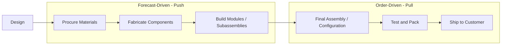
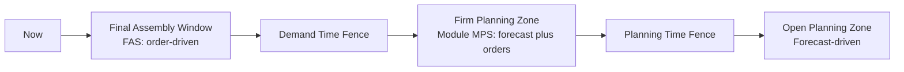
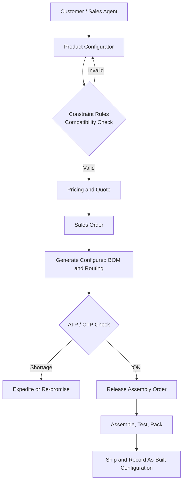
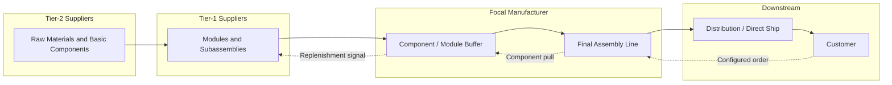

## Assemble-to-Order and Configure-to-Order Strategies


### Overview

Assemble-to-Order (ATO) and Configure-to-Order (CTO) are **hybrid production fulfillment strategies** that place the Customer Order Decoupling Point (CODP) at or near final assembly. Common components, modules, and subassemblies are produced and stocked against a forecast (push), while the final product is assembled or configured only after a customer order arrives (pull). The result is a network that can present high external variety to the customer while keeping internal variety, and therefore inventory, low.

The two terms are closely related and frequently used interchangeably, but they describe different points on the flexibility spectrum:

| Aspect | Assemble-to-Order (ATO) | Configure-to-Order (CTO) |
| --- | --- | --- |
| **Core idea** | Pre-built components are assembled into a final product after an order | The customer selects from a defined set of options, rules, and constraints; the product is then assembled or built to that configuration |
| **Customer interaction** | Order specifies the end item or its options | Order is generated through a configurator (rules, compatibility checks, pricing) |
| **Variety source** | Combinations of stocked modules | Combinations of options constrained by rules |
| **Bill of Materials** | Final-assembly BOM with stocked components | Configurable (super) BOM resolved into a customer-specific BOM per order |
| **Typical tooling** | MRP with planning BOMs, ATP on components | Product configurator (CPQ), rule engine, dynamic BOM generation |
| **Typical examples** | Computer systems, automotive option packages, modular office furniture | Enterprise servers, industrial equipment with option catalogs, custom bicycles |

[Inference] Different industries and ERP vendors define ATO and CTO boundaries differently (some treat CTO as a subtype of ATO, others as a distinct strategy), so confirm the definitions used by your organization or software platform before mapping processes.

In the context of **Supply Chain Architecture & Tiered Structures**, ATO/CTO shapes:

- Where inventory sits in the network (component and module buffers rather than finished goods).
- How much responsibility Tier-1 suppliers carry (module supply, sequencing, in-plant or near-plant assembly).
- How planning is split between forecast-driven component supply and order-driven final assembly.
- How information (configuration data, order status, component availability) must flow across tiers.

**Key Points**

- ATO/CTO decouples *external variety* (what the customer can order) from *internal variety* (the number of distinct components that must be stocked).
- The strategy trades a short final-assembly lead time for forecast risk concentrated at the component and module level, where risk pooling reduces it.
- The CODP is fixed at final assembly, but the *postponement point* for differentiation can be moved upstream or downstream to tune cost and responsiveness.
- Product architecture (modularity, commonality, standard interfaces) is a prerequisite: ATO/CTO fails without a product designed for late differentiation.

---

### Position on the Fulfillment Continuum



The buffer is held at the **module/component level** (between steps D and E). Compared with the neighboring strategies:

| Strategy | CODP | Stocked Item | Lead Time to Customer | Variety Handling |
| --- | --- | --- | --- | --- |
| **MTS** | Finished goods | Finished goods | Shortest (ship time) | Limited |
| **ATO / CTO** | Final assembly | Components and modules | Short (assembly plus ship) | High external variety, low internal variety |
| **MTO** | Fabrication or procurement | Raw materials | Medium to long | High |
| **ETO** | Design | Almost nothing | Longest | Unique |

---

### Foundations: Why ATO/CTO Works

#### Risk Pooling and Aggregation

The financial logic of ATO/CTO rests on aggregation. Consider $n$ end-item variants with independent demand, each with standard deviation $\sigma$ and mean $\mu$, all built from one common component.

Holding safety stock at the finished-item level requires buffering each variant separately:

$$SS_{finished} = z \cdot n \cdot \sigma$$

Holding it at the common-component level, where demands aggregate, requires:

$$SS_{component} = z \cdot \sqrt{n} \cdot \sigma$$

The ratio is:

$$\frac{SS_{component}}{SS_{finished}} = \frac{1}{\sqrt{n}}$$

For nine variants sharing a component, the required buffer falls to one third. This assumes independent, identically distributed demand and equal usage; positively correlated demand reduces the benefit, and negatively correlated demand increases it. [Inference] Real portfolios rarely meet the independence assumption exactly, so treat the square-root result as an upper bound on pooling benefit.

For correlated demand with pairwise correlation $\rho$ among $n$ items of equal variance, the standard deviation of aggregate demand is:

$$\sigma_{agg} = \sigma\sqrt{n + n(n-1)\rho}$$

Setting $\rho = 0$ recovers $\sigma\sqrt{n}$; setting $\rho = 1$ gives $n\sigma$, meaning no pooling benefit.

#### Delayed Differentiation (Postponement)

Postponement defers the step that makes a product unique until as late as possible. Three forms are commonly distinguished:

| Form | Description | Example |
| --- | --- | --- |
| **Form postponement** | Delay manufacturing or assembly steps that set product identity | Install processor, memory, and storage after the order |
| **Time postponement** | Delay shipment or production until orders are received | Build after order, ship from a central site |
| **Place postponement** | Hold inventory centrally and defer distribution to local markets | Central stock, ship direct to customer |

ATO/CTO is principally form postponement.

#### Product Architecture Prerequisites

| Design Principle | Meaning | Benefit |
| --- | --- | --- |
| **Modularity** | Product is decomposed into functional modules with well-defined interfaces | Modules can be combined freely and built independently |
| **Commonality** | Shared components across variants | Higher aggregation, lower inventory |
| **Standardized interfaces** | Physical and electrical interfaces do not vary across options | Any compatible module fits any base |
| **Late-point differentiation** | Differentiating features are added last | Short order-driven segment |
| **Design for assembly and test** | Simple assembly, fast test | Short final-assembly time |

---

### Assemble-to-Order in Detail

#### Definition

In ATO, the manufacturer holds stocked components, subassemblies, or modules and assembles the final product when an order is received. The product structure is largely fixed, and the customer selects among a manageable set of variants or option combinations.

#### Process Flow

1. Demand plan forecasts demand for **modules and components** (not for every finished variant).
2. Components and modules are produced or procured against the plan and held in inventory.
3. Customer order is received and checked against available-to-promise (ATP) for the required components.
4. Final assembly is scheduled and executed.
5. Product is tested, packed, and shipped.

#### Planning Mechanics

**Planning bill of materials (planning BOM):** ATO products commonly use a planning BOM (also called a super BOM or percentage BOM) in which an end-item family is exploded into option components using **planning percentages** derived from historical or forecast option take rates.

For a product family forecast of $F$ units and an option $j$ with take rate $p_j$:

$$F_j = F \times p_j$$

where $F_j$ is the forecast for the component that supports option $j$.

If options within a mutually exclusive group have take rates that sum to 1, forecast error at the component level is typically lower than at the variant level, but option take rates themselves drift over time and must be monitored.

**Two-level master scheduling:** A common ATO planning structure uses two master schedules:

| Level | Object | Driver |
| --- | --- | --- |
| **Master Production Schedule (MPS)** | Modules, options, components | Forecast (through planning BOM) |
| **Final Assembly Schedule (FAS)** | Finished configurations | Actual customer orders |

The FAS operates inside the **assembly lead time** and is frozen or firmed to protect stability. MPS decisions extend beyond the cumulative procurement and build lead time.

#### Time Fence Logic



- **Inside the demand time fence:** planning is driven by actual orders; forecast is ignored.
- **Between the fences:** forecast and orders are combined (typically the greater of the two, or a consumption-based blend).
- **Beyond the planning time fence:** planning is forecast-driven and changes are flexible.

#### Available-to-Promise for ATO

ATP for a configured product is limited by the *scarcest required component*:

$$ATP_{config} = \min_{i \in C}\left(ATP_i / q_i\right)$$

where $C$ is the set of components required for the configuration, $ATP_i$ is available-to-promise quantity for component $i$, and $q_i$ is the quantity of component $i$ per finished unit.

Promise date for an order is the later of component availability and assembly capacity availability:

$$T_{promise} = \max\left(\max_{i \in C} T_i^{avail},\; T^{assembly\ slot}\right) + T^{assembly} + T^{ship}$$

This is often called **capable-to-promise (CTP)** when assembly capacity is included, which is the more accurate logic for ATO/CTO environments.

---

### Configure-to-Order in Detail

#### Definition

In CTO, the customer (or a sales agent) specifies a product by choosing options from a **rule-governed catalog**. A configurator validates compatibility, calculates price, and generates a customer-specific order and BOM. The manufacturer then assembles the configuration from stocked components (and possibly a small number of made-to-order elements).

#### Process Flow

1. Customer or sales agent enters selections in a **product configurator** (often part of CPQ: Configure, Price, Quote).
2. Configurator applies constraint rules, checks compatibility, and prices the configuration.
3. Configuration is converted into a **sales order** and a **configured BOM and routing**.
4. Material availability and capacity are checked (ATP/CTP), and a promise date is returned.
5. Production order is released for final assembly and test.
6. Product is delivered, and the as-built configuration is recorded for service and warranty.



#### Configuration Data Model

A configurator depends on structured product knowledge:

| Element | Description | Example |
| --- | --- | --- |
| **Feature / characteristic** | An attribute the customer chooses | Processor, memory size, color |
| **Option / value** | Allowed value of a feature | 16 GB, 32 GB, 64 GB |
| **Constraint / rule** | Compatibility or dependency logic | 64 GB memory requires Board Rev C |
| **Default and recommended values** | Pre-selections that speed ordering | 16 GB default |
| **Pricing rules** | Base price, option surcharges, discounts | +$200 for 32 GB |
| **BOM mapping** | Which components each option consumes | 32 GB option maps to 2 DIMM part numbers |
| **Routing mapping** | Which operations each option triggers | Add cooling assembly step |

**Example: constraint rules (pseudo-declarative)**

```yaml
product: EnterpriseServer
features:
  cpu: [A100, A200, A300]
  memory_gb: [16, 32, 64]
  storage: [ssd_1tb, ssd_2tb, hdd_4tb]
  board_rev: [B, C]

constraints:
  - name: high_memory_requires_rev_c
    if: { memory_gb: 64 }
    then: { board_rev: C }
  - name: a300_requires_liquid_cooling
    if: { cpu: A300 }
    then: { add_component: LIQUID_COOL_KIT }
  - name: hdd_incompatible_with_rev_b
    if: { storage: hdd_4tb }
    then: { board_rev: C }
```

The number of *theoretical* configurations is the product of option counts:

$$N_{config} = \prod_{k=1}^{K} m_k$$

where $K$ is the number of features and $m_k$ is the number of options for feature $k$. In the example above, $N = 3 \times 3 \times 3 \times 2 = 54$ before constraints. Constraints reduce the count of *valid* configurations, and the number of stocked components grows only additively:

$$N_{components} = \sum_{k=1}^{K} m_k$$

Here $N_{components} = 3 + 3 + 3 + 2 = 11$. This contrast, 54 variants versus 11 components, shows the core economic leverage of ATO/CTO: variety grows multiplicatively while stocked inventory grows additively.

#### Dynamic BOM Generation

Two common approaches:

| Approach | Description | Trade-off |
| --- | --- | --- |
| **Variant BOM (pre-defined)** | All valid configurations exist as pre-built BOMs | Simple to plan, does not scale with high variety |
| **Configurable BOM (rule-based)** | BOM is generated per order from the super BOM and rule set | Scales to very high variety; requires robust configurator and master data governance |

---

### ATO vs. CTO: Selecting Between Them

| Decision Factor | Favors ATO | Favors CTO |
| --- | --- | --- |
| **Number of option combinations** | Manageable (tens to low hundreds) | Very large (thousands to millions) |
| **Order entry channel** | Catalog or fixed variants | Guided selling, e-commerce configurator, dealer tools |
| **Constraint complexity** | Low | High (interdependent options) |
| **Pricing complexity** | Fixed variant pricing | Option-level and rule-based pricing |
| **Master data maturity** | Moderate | High; requires disciplined rule governance |
| **Customer expectation of personalization** | Moderate | High |

Many firms operate both: standard variants under ATO and highly personalized offerings under CTO, sharing the same module inventory.

---

### Network and Tiered Architecture Implications

#### Where to Hold Inventory



The primary buffer is the **component/module buffer** at or near final assembly. Its size is governed by module-level demand variability and replenishment lead time from Tier-1.

#### Supplier Integration Patterns

| Pattern | Description | Typical Use |
| --- | --- | --- |
| **Vendor-managed inventory (VMI)** | Tier-1 supplier monitors and replenishes module stock at the focal firm | High-volume, stable modules |
| **Consignment stock** | Modules held on site, owned by supplier until consumption | Expensive or fast-changing modules |
| **Supplier-integrated assembly** | Tier-1 performs module assembly near or inside the focal plant | Complex modules (seats, cockpits, cable harnesses) |
| **In-sequence supply (JIS)** | Modules delivered in the exact order of assembly | Automotive final assembly with option-specific modules |
| **Kanban / pull replenishment** | Consumption triggers replenishment | Common components with steady usage |

#### Assembly Network Configurations

| Configuration | Description | Strengths | Limitations |
| --- | --- | --- | --- |
| **Centralized final assembly** | One plant assembles all configurations | Scale, uniform quality, lowest inventory | Longer delivery distance and lead time to distant markets |
| **Regional final assembly** | Assembly sites per region, supplied with modules | Shorter delivery lead time, local customization | Duplicated assembly capacity and buffers |
| **Distribution-center assembly (postponed assembly at DC)** | Final configuration at DCs or service hubs | Very late differentiation, close to customer | Requires skilled labor, testing capability, and spare modules at each site |
| **Contract or partner assembly** | Third-party logistics or contract manufacturer performs final assembly | Flexibility, variable cost | Coordination and quality control burden |

The choice is a trade-off between the **cost of duplicated assembly capability** and the **lead-time and transport benefits of proximity**. [Inference] The break-even point depends on transport costs, volume per region, and configuration complexity, and should be established through network modeling rather than rules of thumb.

#### Information Flows Across Tiers

| Information | Direction | Purpose |
| --- | --- | --- |
| Module-level forecast | Focal firm to Tier-1 | Capacity and material planning |
| Option take-rate data | Sales and marketing to planning | Refine planning BOM percentages |
| Consumption signals (kanban, VMI data) | Focal firm to Tier-1 | Replenishment |
| Configured-order sequence | Focal firm to Tier-1 (JIS) | Sequence-specific module delivery |
| Engineering change notices | Focal firm to all tiers | Keep module specifications synchronized |
| Component availability and lead-time updates | Tier-1 to focal firm | Accurate promise dates |

---

### Inventory Modeling

#### Module-Level Safety Stock

For a module with mean demand per period $\bar{d}$, demand standard deviation $\sigma_d$, replenishment lead time $L$, and lead-time standard deviation $\sigma_L$:

$$SS = z\sqrt{L\sigma_d^2 + \bar{d}^2\sigma_L^2}$$

#### Two-Stage (Component and Assembly) Service Considerations

In ATO, the customer sees service performance determined by the *joint availability* of all required components. If a configuration needs $m$ components, each independently available with probability $\alpha_i$ (component fill rate), the probability that all are available is:

$$P_{all} = \prod_{i=1}^{m}\alpha_i$$

This compounding effect is a critical ATO design pitfall. Five components each at 95% availability yield only about 77.4% joint availability:

$$0.95^5 \approx 0.774$$

To reach a target order-level service $S$ with $m$ equally weighted components, each must be held at:

$$\alpha = S^{1/m}$$

For $S = 0.95$ and $m = 5$: $\alpha = 0.95^{0.2} \approx 0.9898$. Component-level service targets therefore need to be substantially higher than the order-level target. [Inference] In practice, differing component costs and criticality lead to non-uniform targets, with more expensive or longer-lead components set at lower targets and cheaper components set higher to reach the overall order-level goal cost-effectively.

#### Optimizing Buffer Placement

Buffer positions are chosen to minimize total holding cost subject to service and lead-time constraints. A simplified guaranteed-service formulation places safety stock at nodes to satisfy:

$$S_{i}^{in} + T_i - S_i^{out} \le \text{net replenishment time of node } i$$

with the objective:

$$\min \sum_i h_i \, z \, \sigma_i \sqrt{\tau_i}$$

where $h_i$ is the holding cost at node $i$, $\sigma_i$ is demand standard deviation at node $i$, and $\tau_i$ is the net replenishment time (inbound service time plus processing time minus outbound service time). This is the structure used in multi-echelon guaranteed-service models. [Inference] Exact model formulations vary across the academic and software literature.

---

### Worked Example: Configurable Laptop Program

**Scenario:** A manufacturer sells a laptop line with the following options.

| Feature | Options | Count |
| --- | --- | --- |
| Processor | P1, P2, P3 | 3 |
| Memory | 8 GB, 16 GB, 32 GB | 3 |
| Storage | 256 GB, 512 GB, 1 TB, 2 TB | 4 |
| Display | HD, QHD | 2 |
| Color | Silver, Black | 2 |

**Variety analysis**

$$N_{config} = 3 \times 3 \times 4 \times 2 \times 2 = 144$$


$$N_{components} = 3 + 3 + 4 + 2 + 2 = 14$$

Holding 144 finished variants would require 144 separate safety stock positions. Holding 14 component or module positions is far more economical.

**Forecast and take-rate planning**

Assume a monthly family forecast of $F = 10{,}000$ units and the following memory take rates.

| Memory Option | Take Rate $p_j$ | Forecast $F_j = F \times p_j$ |
| --- | --- | --- |
| 8 GB | 0.30 | 3,000 |
| 16 GB | 0.55 | 5,500 |
| 32 GB | 0.15 | 1,500 |

The planning BOM drives module-level purchase and build plans from the family forecast, not from 144 separate variant forecasts.

**Module safety stock (16 GB memory)**

Assume mean weekly demand $\bar{d} = 1{,}270$ units, $\sigma_d = 200$ units, lead time $L = 3$ weeks with $\sigma_L = 0.5$ weeks, and $z = 1.645$.

$$SS = 1.645\sqrt{3 \times 200^2 + 1270^2 \times 0.5^2}$$


$$SS = 1.645\sqrt{120{,}000 + 403{,}225} = 1.645\sqrt{523{,}225} \approx 1.645 \times 723.4 \approx 1{,}190\ \text{units}$$

The lead-time variability term ($403{,}225$) is larger than the demand variability term ($120{,}000$), which shows that supplier reliability, not only forecast accuracy, drives buffer size in this example. This makes lead-time reduction and supplier performance management high-leverage actions.

**Order-level service across components**

Suppose a configuration draws on five stocked components (processor, memory, storage, display, chassis) each at a 98% availability:

$$P_{all} = 0.98^5 \approx 0.904$$

Only about 90.4% of orders would find every component in stock, well short of a 98% order-level target. Reaching 98% order-level service with five components would require each at approximately $0.98^{0.2} \approx 0.9960$, so component-level availability targets must be raised or key components buffered more heavily.

---

### Implementation: Configuration Validation and ATP Check

The following Python example demonstrates a minimal configurator with rule validation, BOM resolution, and a component ATP check.

**Example**

```python
from dataclasses import dataclass, field

# --- Master data ---------------------------------------------------------
FEATURES = {
    "cpu": ["P1", "P2", "P3"],
    "memory": ["8GB", "16GB", "32GB"],
    "storage": ["256GB", "512GB", "1TB", "2TB"],
    "display": ["HD", "QHD"],
    "color": ["Silver", "Black"],
}

# Feature=value -> list of (component, qty per unit)
BOM_MAP = {
    ("cpu", "P1"): [("CPU-P1", 1)],
    ("cpu", "P2"): [("CPU-P2", 1)],
    ("cpu", "P3"): [("CPU-P3", 1), ("COOL-KIT", 1)],
    ("memory", "8GB"): [("DIMM-8", 1)],
    ("memory", "16GB"): [("DIMM-8", 2)],
    ("memory", "32GB"): [("DIMM-16", 2)],
    ("storage", "256GB"): [("SSD-256", 1)],
    ("storage", "512GB"): [("SSD-512", 1)],
    ("storage", "1TB"): [("SSD-1T", 1)],
    ("storage", "2TB"): [("SSD-2T", 1)],
    ("display", "HD"): [("LCD-HD", 1)],
    ("display", "QHD"): [("LCD-QHD", 1)],
    ("color", "Silver"): [("CASE-SIL", 1)],
    ("color", "Black"): [("CASE-BLK", 1)],
}

# Compatibility rules: if condition holds, config must satisfy requirement
RULES = [
    {
        "name": "p3_requires_qhd",
        "if": {"cpu": "P3"},
        "then": {"display": "QHD"},
    },
    {
        "name": "2tb_requires_32gb_or_16gb",
        "if": {"storage": "2TB"},
        "then_in": {"memory": ["16GB", "32GB"]},
    },
]

# Available-to-promise quantity by component
ATP = {
    "CPU-P1": 500, "CPU-P2": 400, "CPU-P3": 120,
    "COOL-KIT": 150,
    "DIMM-8": 900, "DIMM-16": 300,
    "SSD-256": 800, "SSD-512": 600, "SSD-1T": 300, "SSD-2T": 90,
    "LCD-HD": 700, "LCD-QHD": 350,
    "CASE-SIL": 800, "CASE-BLK": 800,
}

# --- Logic ---------------------------------------------------------------
def validate(config: dict) -> list[str]:
    errors = []
    for feat, val in config.items():
        if val not in FEATURES.get(feat, []):
            errors.append(f"Invalid option {feat}={val}")
    for r in RULES:
        if all(config.get(k) == v for k, v in r["if"].items()):
            if "then" in r:
                for k, v in r["then"].items():
                    if config.get(k) != v:
                        errors.append(f"Rule {r['name']}: requires {k}={v}")
            if "then_in" in r:
                for k, allowed in r["then_in"].items():
                    if config.get(k) not in allowed:
                        errors.append(f"Rule {r['name']}: {k} must be in {allowed}")
    return errors

def resolve_bom(config: dict) -> dict:
    bom = {}
    for feat, val in config.items():
        for comp, qty in BOM_MAP[(feat, val)]:
            bom[comp] = bom.get(comp, 0) + qty
    return bom

def max_promisable_units(bom: dict) -> int:
    # ATP for configuration limited by scarcest component
    return min(ATP[c] // q for c, q in bom.items())

order = {"cpu": "P3", "memory": "16GB", "storage": "2TB",
         "display": "QHD", "color": "Black"}

errs = validate(order)
print("Validation errors:", errs if errs else "none")
if not errs:
    bom = resolve_bom(order)
    print("Resolved BOM:", bom)
    print("Max promisable units:", max_promisable_units(bom))
```

**Output**

```plaintext
Validation errors: none
Resolved BOM: {'CPU-P3': 1, 'COOL-KIT': 1, 'DIMM-8': 2, 'SSD-2T': 1, 'LCD-QHD': 1, 'CASE-BLK': 1}
Max promisable units: 90
```

The configuration passes validation, resolves to a six-line BOM, and is limited to 90 promisable units by the 2 TB SSD (the scarcest component). A production configurator would add pricing, capacity-aware CTP, reservation logic, and persistence, and would handle rule conflicts and multi-level BOM explosion.

---

### KPI Framework

| KPI | Definition | Why It Matters in ATO/CTO |
| --- | --- | --- |
| **Order-level fill rate (configured)** | Percentage of orders for which all components were available at release | Exposes the compounding-availability problem |
| **Component fill rate** | Availability of each stocked module or component | Drives order-level service |
| **Final assembly lead time** | Order release to assembly complete | Core responsiveness metric |
| **Order fulfillment cycle time** | Order receipt to delivery | Customer-facing lead time |
| **Promise-date reliability** | Percentage of orders delivered on or before promised date | Quality of ATP/CTP logic |
| **Module inventory days of supply** | Stock relative to consumption | Working capital control |
| **Forecast accuracy at module level (MAPE, bias)** | Error against actual module consumption | Measures planning BOM quality |
| **Take-rate drift** | Deviation of actual option mix from planned percentages | Early warning of stale planning percentages |
| **Configuration error rate** | Orders rejected or reworked due to invalid configuration | Configurator and master data quality |
| **Assembly and test yield / first-pass yield** | Proportion passing without rework | Directly affects lead time and cost |
| **Obsolescence and write-off of modules** | Value of stranded modules | Risk of engineering change and lifecycle shifts |

---

### Systems and Technology Landscape

| Capability | Role in ATO/CTO |
| --- | --- |
| **Product configurator / CPQ** | Rule-based option selection, validation, pricing, quote generation |
| **Product data management / PLM** | Modular product structure, engineering change, configuration management |
| **ERP with configurable BOM support** | Variant configuration, dynamic BOM and routing generation, order management |
| **Advanced planning and scheduling (APS)** | Two-level scheduling, CTP, finite-capacity assembly planning |
| **Demand planning at module level** | Planning BOM percentages, option take-rate forecasting |
| **Supplier collaboration platform** | Forecast sharing, VMI, ASN, engineering change communication |
| **Manufacturing execution system (MES)** | Configuration-specific work instructions, build verification, traceability |
| **Warehouse and line-side logistics systems** | Kitting, sequencing, and line-side replenishment |
| **Digital twin or network simulation** | Buffer placement, assembly site selection, disruption testing |

[Inference] Feature availability and terminology differ across ERP, CPQ, and APS vendors, so verify capability claims against current vendor documentation during selection.

---

### Common Pitfalls and Mitigations

| Pitfall | Consequence | Mitigation |
| --- | --- | --- |
| Ignoring compounding component availability | Order-level service far below component targets | Set component service targets from the order-level goal ($\alpha = S^{1/m}$); prioritize critical and long-lead parts |
| Product not modular | Late differentiation impossible; assembly time inflates | Invest in modular design and standardized interfaces before adopting ATO/CTO |
| Uncontrolled option proliferation | Inventory and complexity grow faster than revenue | Governance for new options; retire low-take-rate options; cost each option's complexity |
| Stale planning percentages | Module shortages and surpluses | Track take-rate drift; recalibrate frequently; apply demand sensing |
| Configurator rule errors | Un-buildable orders, rework, delays | Rule testing and versioning; master data governance; validation in both sales and manufacturing |
| Assembly capacity ignored in promising | Missed promise dates even with parts in stock | Use CTP rather than ATP-only logic |
| Long-lead or single-source modules | Lead-time variability dominates buffer size | Dual sourcing, supplier development, safety buffer at critical modules |
| Engineering changes stranding modules | Obsolescence and write-offs | Phase-in/phase-out planning; synchronized change control across tiers |
| Over-centralizing assembly for distant markets | Long delivery lead times | Evaluate regional or DC-level final assembly |
| Treating ATO as a purely manufacturing decision | Sales, planning, and supplier processes misaligned | Cross-functional design of order entry, planning, and supplier processes |

---

### Step-by-Step Design Checklist

1. Segment products and confirm suitability: sufficient variety, demand for short lead time, and feasible modular architecture.
2. Define the **customer-acceptable lead time** ($D$) and compare it with the final assembly plus delivery lead time.
3. Redesign or confirm product architecture for modularity, commonality, and standard interfaces.
4. Define the feature and option catalog, constraint rules, and pricing rules; establish master data ownership.
5. Build the planning BOM with option take rates; establish a process to monitor and update them.
6. Determine the **buffer positions** (module and component levels) and set service targets using the compounding-availability relationship.
7. Design the network: centralized, regional, or DC-level final assembly; define supplier integration patterns by tier (VMI, consignment, JIS).
8. Configure two-level planning (MPS and FAS), time fences, and CTP logic.
9. Select and integrate systems: configurator or CPQ, ERP variant configuration, APS, MES, supplier collaboration tools.
10. Establish KPIs, dashboards, and alerts (order-level fill rate, take-rate drift, module days of supply).
11. Pilot with a product family; validate configurator rules, BOM generation, and promise-date accuracy.
12. Scale, and institute periodic reviews of option portfolio, buffer levels, and CODP placement.

---

**Conclusion**

Assemble-to-Order and Configure-to-Order strategies place the decoupling point at final assembly, letting a firm offer high external variety while stocking only a modest number of common components and modules. Their economics rest on risk pooling and postponement: variety grows multiplicatively at the customer interface but inventory grows only additively at the module level. ATO emphasizes a stocked-module, fixed-structure approach, while CTO adds a rule-governed configurator that generates customer-specific BOMs and prices at scale. Success depends on modular product architecture, disciplined master data and rule governance, module-level planning through planning BOMs, careful management of compounding component availability, and tight tier-level integration through VMI, consignment, or sequenced supply. Network design choices (centralized, regional, or DC-level assembly) and supplier integration patterns then determine how much of the potential lead-time and inventory benefit is realized.

**Related Topics**

- Postponement and Delayed Differentiation Strategies
- Modular Product Architecture and Component Commonality
- Product Configurators, CPQ, and Variant Configuration
- Planning Bills of Material and Two-Level Master Scheduling
- Available-to-Promise and Capable-to-Promise Logic
- Multi-Echelon Inventory and Guaranteed-Service Buffer Placement
- Vendor-Managed Inventory, Consignment, and In-Sequence Supply
- Risk Pooling and Demand Aggregation
- Final Assembly Network Design and Regional Assembly
- Mass Customization and Mixed-Model Assembly Lines
- Engineering Change Management Across Supply Tiers
- Option Complexity Cost and Portfolio Rationalization