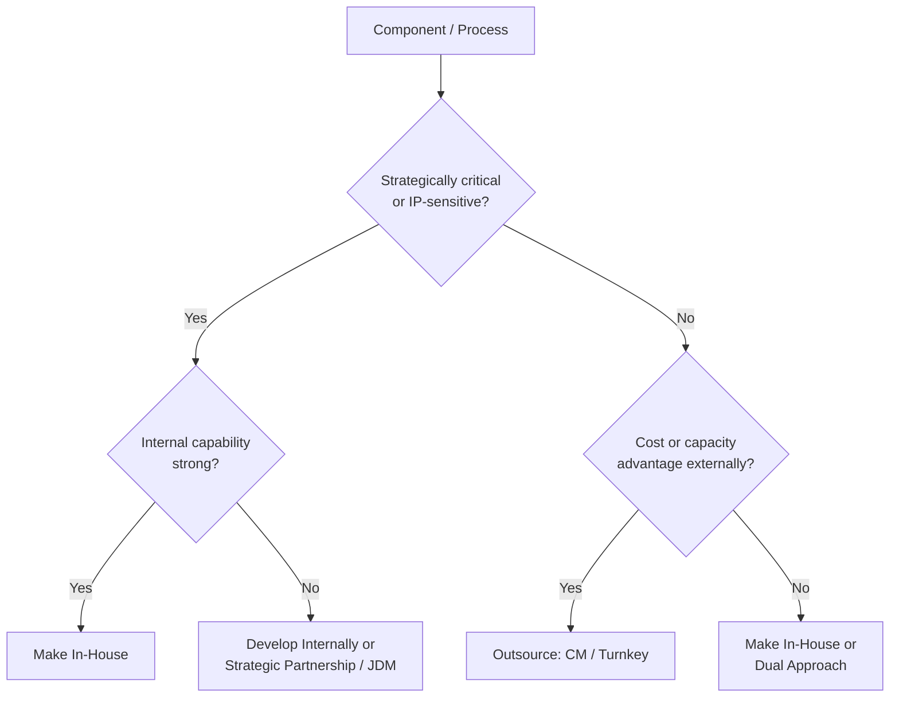
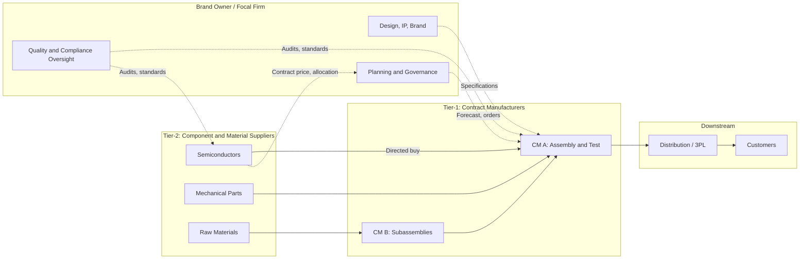
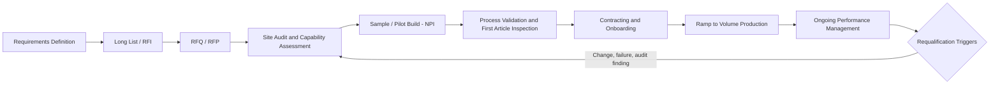
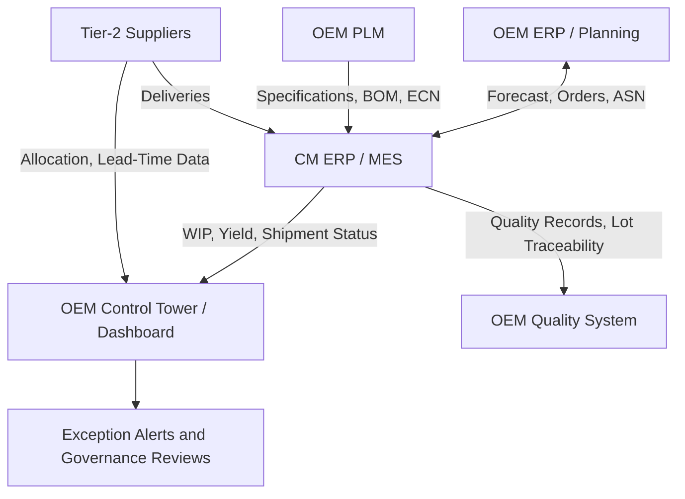
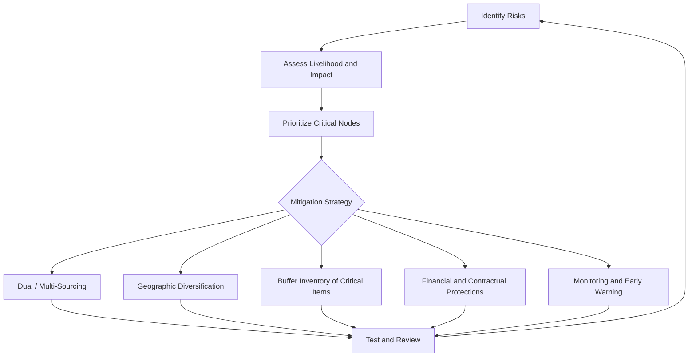

## Contract Manufacturing and Outsourced Production Networks


### Overview

Contract manufacturing (CM) is an arrangement in which a brand owner, often called the **Original Equipment Manufacturer (OEM)**, the **brand owner**, or the **sponsor**, engages a third-party manufacturer to produce components, subassemblies, or finished goods under a formal agreement. An **outsourced production network** extends this idea from a single relationship to a portfolio: multiple contract manufacturers, possibly across tiers and geographies, coordinated by a focal firm that may own few or no plants of its own.

In the context of **Supply Chain Architecture & Tiered Structures**, outsourced production changes the shape of the chain in fundamental ways:

- The manufacturing step of SCOR (Make) is executed by a party outside the focal firm's legal and operational boundary, so the focal firm must architect for **control without ownership**.
- Tier structure becomes more complex: the contract manufacturer sits at Tier-1 (or occupies a "hub" role), while component suppliers may be Tier-2 relative to the OEM but *directly managed* by the OEM through **directed-buy** arrangements.
- Information, quality, intellectual property (IP), and financial flows must all cross an organizational boundary.
- Risk shifts from asset and capacity risk (owned plants) to **dependency, concentration, and governance risk**.

**Key Points**

- Contract manufacturing is a spectrum of arrangements from simple build-to-print to full-package original design manufacturing, not a single model.
- The central architectural decision is *what to keep in-house* (core competence, IP, differentiation) and *what to outsource* (scale, cost, flexibility, geographic access).
- Outsourcing is not the same as delegating accountability: the brand owner remains accountable to customers and regulators for quality, safety, and compliance.
- Successful networks are governed by explicit contracts, shared metrics, data integration, and capability-aligned partner selection, not by price alone.

---

### Terminology and Provider Types

| Term | Meaning | Typical Scope |
| --- | --- | --- |
| **Contract Manufacturer (CM)** | Third party that manufactures to the customer's specification | Build-to-print or build-to-spec production |
| **Electronics Manufacturing Services (EMS)** | CM specialized in electronics assembly, test, and related services | PCB assembly, box build, testing, fulfillment |
| **Contract Development and Manufacturing Organization (CDMO)** | CM that combines development with manufacturing | Common in pharmaceuticals and biotech |
| **Original Design Manufacturer (ODM)** | Manufacturer that designs *and* builds a product that the customer brands | Design, tooling, production; customer applies brand and specifications |
| **Joint Design Manufacturer (JDM)** | ODM variant with shared design responsibility | Co-development with the brand owner |
| **Private-label / white-label manufacturer** | Manufacturer producing goods sold under the retailer's or brand's name | Consumer goods, food, personal care |
| **Toll manufacturer / toll processor** | Processes customer-owned materials for a fee | Chemicals, metals, food processing |
| **Fabless model** | Company designs products but outsources all fabrication | Semiconductors (design firm plus foundry) |
| **Foundry** | Manufacturing specialist serving multiple design firms | Semiconductor wafer fabrication |
| **Third-Party Logistics (3PL) / Fourth-Party Logistics (4PL)** | Logistics service provider / orchestrator of multiple providers | Adjacent to CM; often co-located services |

[Inference] Terminology overlaps across industries and even across companies within an industry; verify definitions in contract documents rather than relying on labels alone.

---

### Outsourcing Models: A Spectrum of Responsibility

The models are best positioned by *who owns design, materials, tooling, and IP*.

| Model | Design Owner | Materials Sourcing | Tooling | Customer's Control | Provider's Value-Add |
| --- | --- | --- | --- | --- | --- |
| **Build-to-print** | Brand owner | Often brand owner directs or supplies | Brand owner | Very high | Capacity, labor, process execution |
| **Build-to-spec** | Brand owner (specification only) | CM sources | Shared or CM | High | Process engineering, sourcing |
| **Consigned / turnkey** | Brand owner | CM buys all materials | CM or shared | Medium | Full material and production management |
| **Toll processing** | Brand owner | Brand owner supplies materials | Brand owner | High | Transformation service only |
| **Joint design (JDM)** | Shared | CM sources | Shared | Medium | Co-engineering, DFM |
| **ODM / private label** | CM | CM | CM | Low to medium | Design, tooling, production |
| **Full outsourcing (virtual manufacturer)** | Varies | CM | CM | Depends on governance | Entire make and often fulfillment |

**Materials responsibility variants** matter for cost, risk, and tiering:

| Variant | Description | Financial Effect |
| --- | --- | --- |
| **Turnkey** | CM procures all materials and bills the customer for finished product | CM carries material inventory and financing; higher piece price |
| **Consignment** | Customer supplies some or all materials free of charge to CM | Customer carries inventory; CM charges conversion cost only |
| **Directed-buy (directed sourcing)** | Customer negotiates price and terms with component suppliers, but CM purchases them | Customer captures scale pricing; CM handles logistics and payment |
| **Buy-sell** | Customer buys components and resells to CM, then buys back finished goods | Transfer pricing and accounting complexity |

---

### Strategic Drivers and Trade-offs

#### Reasons to Outsource

| Driver | Explanation |
| --- | --- |
| **Cost structure** | Lower labor cost, scale economies from pooling multiple customers, avoidance of capital investment |
| **Capacity flexibility** | Ability to scale volumes up and down without owning idle capacity |
| **Speed to market** | Existing capability, qualified processes, and established supply base |
| **Focus on core competence** | Concentrate resources on design, brand, and customer relationships |
| **Geographic access** | Local production for market access, tariff or content requirements |
| **Specialized capability** | Access to technologies or certifications that are costly to build |
| **Risk transfer (partial)** | Shift capital and some operational risk to the provider |

#### Risks and Costs

| Risk | Description |
| --- | --- |
| **Loss of control** | Reduced direct visibility and authority over quality, schedule, and process |
| **IP leakage** | Exposure of designs, process know-how, and formulations |
| **Supplier dependence and hold-up** | Switching costs give the CM bargaining leverage |
| **Quality and compliance failures** | Regulatory accountability stays with the brand owner |
| **Concentration risk** | Reliance on one CM, one site, or one region |
| **Hidden and transaction costs** | Coordination, auditing, logistics, and management overhead |
| **Capability erosion** | Losing internal manufacturing know-how needed for future innovation |
| **Geopolitical and disruption exposure** | Tariffs, trade restrictions, natural disasters affecting provider sites |
| **Cultural and communication gaps** | Time-zone, language, and process differences |

#### Make-or-Buy Framework

A structured make-or-buy analysis weighs strategic importance against capability and cost.



A quantitative comparison uses **Total Cost of Ownership (TCO)** rather than piece price alone.

$$TCO_{outsource} = P_{unit} + C_{logistics} + C_{inventory} + C_{quality} + C_{management} + C_{risk} + C_{tariff}$$


$$TCO_{insource} = C_{materials} + C_{labor} + C_{overhead} + C_{capital} + C_{inventory} + C_{quality}$$

Compare on a per-unit basis at the forecast volume and across volume scenarios. The **break-even volume** between an in-house option with fixed cost $F$ and variable cost $v_{in}$, and an outsourced option with unit price $p_{out}$ (no fixed cost), satisfies:

$$F + v_{in} \cdot Q = p_{out} \cdot Q \;\Rightarrow\; Q^{*} = \frac{F}{p_{out} - v_{in}}$$

for $p_{out} > v_{in}$. Below $Q^{*}$, outsourcing is cheaper; above it, in-house production wins, holding other factors constant. [Inference] This simplified model omits risk, quality, and strategic factors that often dominate the real decision.

---

### Network Architectures for Outsourced Production

#### Single-Source, Multi-Source, and Hybrid

| Architecture | Description | Strengths | Weaknesses |
| --- | --- | --- | --- |
| **Single CM, single site** | One provider, one facility | Simple governance, highest volume leverage | Highest concentration risk |
| **Single CM, multi-site** | One provider across regions | Geographic resilience, one contract | Provider-level dependency |
| **Multi-CM (competitive)** | Several providers for the same product family | Price competition, redundancy | Higher qualification and management cost, split volume |
| **Product-segmented** | Different CMs for different product lines | Match capability to product needs | Complexity, duplicated governance |
| **Hybrid (in-house plus CM)** | Own plants for core, CM for overflow or non-core | Retains capability, flexible capacity | Requires dual operational systems |
| **Regional (local-for-local)** | CMs located near demand regions | Shorter lead time, tariff and content fit | Fragmented volume, harder standardization |

#### Tiered View of an Outsourced Network



Two key observations follow from this structure:

1. The OEM often **contracts directly with critical Tier-2 suppliers** (directed buy), creating a *triangular* relationship: OEM, CM, and Tier-2 supplier.
2. The CM may itself source from **its own sub-tier network**, creating Tier-3 and deeper dependencies that the OEM cannot see without deliberate multi-tier mapping.

#### Hub-and-Spoke and Ecosystem Patterns

- **Hub-and-spoke:** A central CM (hub) aggregates components and assembles, feeding multiple regional finishing or fulfillment sites (spokes).
- **Platform / ecosystem:** A lead firm orchestrates an ecosystem of design, components, contract assembly, and logistics partners with shared standards and data platforms (common in consumer electronics).
- **Virtual manufacturer:** The brand owner owns design and demand; every physical step is outsourced and orchestrated through contracts and digital integration.

---

### Partner Selection and Qualification

#### Selection Criteria

| Category | Example Criteria |
| --- | --- |
| **Technical capability** | Process technology, equipment, engineering depth, DFM support, test capability |
| **Quality systems** | Certifications (for example, ISO 9001, IATF 16949 for automotive, ISO 13485 for medical devices, GMP for pharmaceuticals), defect history, corrective-action performance |
| **Capacity and scalability** | Current utilization, expansion headroom, multi-shift capability |
| **Financial health** | Solvency, liquidity, ownership stability |
| **Supply chain capability** | Purchasing scale, sub-tier management, inventory practices |
| **Cost competitiveness** | Piece price, TCO, transparency of cost models |
| **Geography and logistics** | Location, port and transport access, tariff exposure |
| **IP protection and security** | Information security practices, segregation of customers, legal jurisdiction |
| **Compliance and ethics** | Labor standards, environmental performance, regulatory record, conflict-minerals and forced-labor controls |
| **Cultural and communication fit** | Language, responsiveness, governance transparency |
| **Risk profile** | Site hazards, geopolitical exposure, business continuity plans |

#### Weighted Scoring

A weighted decision matrix aggregates criteria:

$$Score_j = \sum_{i=1}^{n} w_i \cdot s_{ij}, \qquad \sum_{i=1}^{n} w_i = 1$$

where $w_i$ is the weight of criterion $i$ and $s_{ij}$ is the score of candidate $j$ on that criterion.

**Example scoring (illustrative)**

| Criterion | Weight | CM-A | CM-B | CM-C |
| --- | --- | --- | --- | --- |
| Technical capability | 0.25 | 8 | 9 | 7 |
| Quality systems | 0.25 | 9 | 8 | 7 |
| Cost (TCO) | 0.20 | 7 | 6 | 9 |
| Capacity and scalability | 0.10 | 8 | 9 | 6 |
| Financial health | 0.10 | 8 | 7 | 6 |
| IP security | 0.05 | 9 | 7 | 6 |
| Risk profile | 0.05 | 7 | 8 | 6 |

$$Score_{A} = 0.25(8) + 0.25(9) + 0.20(7) + 0.10(8) + 0.10(8) + 0.05(9) + 0.05(7) = 8.05$$


$$Score_{B} = 0.25(9) + 0.25(8) + 0.20(6) + 0.10(9) + 0.10(7) + 0.05(7) + 0.05(8) = 7.90$$


$$Score_{C} = 0.25(7) + 0.25(7) + 0.20(9) + 0.10(6) + 0.10(6) + 0.05(6) + 0.05(6) = 7.00$$

Candidate A leads narrowly over B, and C's price advantage does not offset weaker capability and quality. Scores should be tested with sensitivity analysis on the weights, and **must-have criteria** (for example, a mandatory regulatory certification) should act as pass/fail gates *before* scoring.

#### Qualification Process



---

### Contracting and Commercial Structures

#### Key Contract Components

| Component | Purpose |
| --- | --- |
| **Master Manufacturing / Supply Agreement** | Overall framework of terms and responsibilities |
| **Quality Agreement** | Defines quality responsibilities, change control, deviations, audits, recall roles (essential in regulated industries) |
| **Statement of Work / Product Schedules** | Product-specific scope, specifications, prices |
| **Pricing and cost model** | Piece price, cost-plus, open-book, volume tiers, index-linked material pricing |
| **Forecast and order commitments** | Rolling forecast horizon, frozen window, flexibility bands |
| **Liability for excess and obsolete (E&O) materials** | Who pays for materials purchased against forecasts that do not materialize |
| **IP and confidentiality terms** | Ownership of designs, tooling, process improvements, and derived IP |
| **Tooling and equipment ownership** | Who owns, maintains, and can remove tools |
| **Service levels and remedies** | On-time delivery, quality thresholds, penalties and incentives |
| **Business continuity and exit provisions** | Disaster recovery, second-source rights, transition assistance, termination terms |
| **Compliance clauses** | Regulatory, social, environmental, trade, and anti-corruption requirements |
| **Insurance and indemnification** | Allocation of liability for defects, recalls, and IP claims |

#### Pricing Models

| Model | Description | Best When |
| --- | --- | --- |
| **Fixed piece price** | Agreed price per unit for a period | Stable design and volume |
| **Volume-tiered pricing** | Price steps down at volume breakpoints | Predictable, growing volumes |
| **Cost-plus (open-book)** | Actual cost plus agreed margin | Uncertain costs or early lifecycle |
| **Target costing / gain-share** | Shared savings vs. a target cost | Continuous improvement partnerships |
| **Index-linked pricing** | Material component tied to commodity or component indices | Volatile input costs |
| **Conversion-fee only (toll)** | Fee for processing customer-owned materials | Toll processing, consignment |

#### Forecast, Flexibility, and Liability

A typical arrangement defines a **rolling forecast horizon** with zones of increasing flexibility.

| Zone | Horizon Example | Change Allowed | Financial Commitment |
| --- | --- | --- | --- |
| **Frozen** | 0-4 weeks | None or minimal | Firm purchase order |
| **Slushy** | 5-12 weeks | Within a band (for example, ±20%) | Partial commitment |
| **Liquid** | 13+ weeks | Open | Non-binding forecast |

The **material liability exposure** the OEM accepts for the CM's forecast-driven purchases can be approximated by:

$$E\&O_{exposure} = \sum_{k} \max\left(0,\; Q_k^{on-hand} + Q_k^{on-order} - Q_k^{demand}\right) \times c_k \times \phi_k$$

where $c_k$ is the unit cost of component $k$, and $\phi_k \in [0,1]$ is the share of the excess the contract assigns to the OEM. Contract terms that cap or share this liability strongly influence how aggressively the CM buffers materials, and therefore the network's responsiveness. [Inference] Real agreements often distinguish between cancellable, non-cancellable, and non-returnable (NCNR) components, with different liability rules for each.

---

### Planning and Operational Integration

#### Planning Alignment

| Element | Practice |
| --- | --- |
| **Demand signal** | OEM shares rolling forecast and actual orders; CM plans capacity and materials |
| **Sales and operations planning** | Joint or synchronized S&OP with the CM; capacity commitments reviewed regularly |
| **Capacity reservation** | Fees or take-or-pay clauses guarantee capacity in peak periods |
| **Material planning** | Clear rules for who runs MRP, how long-lead items are handled, and how directed-buy allocations are managed |
| **Inventory positioning** | Agreements on where buffers sit (at the CM, hub, or OEM) and who owns them |
| **Change management** | Engineering change control across organizations with defined cut-in and phase-out |

Inventory models mirror those of the general network, for example safety stock at the CM under a replenishment lead time $L$:

$$SS = z \sqrt{L\sigma_d^2 + \bar{d}^2\sigma_L^2}$$

For outsourced networks, $\sigma_L$ includes the CM's lead-time variability, which frequently dominates the buffer requirement and is a prime target for joint improvement.

#### Information and Systems Integration

| Integration Layer | Typical Mechanisms |
| --- | --- |
| **Order and forecast exchange** | EDI, API, or portal-based order and forecast sharing |
| **Production visibility** | Work-in-progress status, yield, and shipment data from CM's MES/ERP |
| **Quality data** | Inspection results, lot traceability, nonconformance and corrective-action records |
| **Inventory visibility** | Shared views of component and finished-goods stock (including VMI and consigned stock) |
| **Engineering data** | Controlled exchange of drawings, BOMs, and change orders via PLM or secure repositories |
| **Financial integration** | Invoice, payment, and cost-model data; possibly open-book cost transparency |
| **Multi-tier visibility** | Data feeds or mapping from the CM's own suppliers |



---

### Quality, Compliance, and Intellectual Property

#### Quality Governance

| Mechanism | Description |
| --- | --- |
| **Quality agreement** | Documents who is responsible for each quality activity |
| **Supplier audits** | Initial and periodic audits of CM sites (and critical sub-tier sites) |
| **Process validation** | Qualification of processes before volume production (for example, IQ/OQ/PQ in regulated manufacturing) |
| **Statistical process control** | Ongoing monitoring of capability indices |
| **Change control** | Notification and approval of process, material, or site changes |
| **Traceability** | Lot- and serial-level tracking through the CM and its suppliers |
| **Corrective and preventive action (CAPA)** | Structured response to defects and deviations |
| **Recall readiness** | Defined roles and communication paths |

Process capability is commonly summarized by:

$$C_{pk} = \min\left(\frac{USL - \mu}{3\sigma},\; \frac{\mu - LSL}{3\sigma}\right)$$

where $USL$ and $LSL$ are the upper and lower specification limits, $\mu$ is the process mean, and $\sigma$ is the process standard deviation. Contracts often specify a minimum $C_{pk}$ (for example, 1.33 for many industrial characteristics; targets vary by industry and criticality).

#### Regulatory Accountability

In regulated sectors (pharmaceuticals, medical devices, food, automotive, aerospace), the **brand owner or marketing authorization holder retains regulatory accountability** even when production is outsourced. Regulators expect documented oversight of the contract manufacturer, and inspections can extend to the CM's facilities. [Inference] Specific obligations depend on jurisdiction and product class, so confirm requirements with regulatory and legal specialists for each market.

#### Intellectual Property Protection

| Protection Measure | Explanation |
| --- | --- |
| **Segmentation of know-how** | Share only what each partner needs; split critical processes across partners where practical |
| **Retained critical steps** | Keep IP-sensitive steps (for example, proprietary formulation, firmware loading, key calibration) in-house or with trusted sites |
| **Contractual protections** | NDAs, IP ownership clauses, non-compete and non-solicitation terms, audit rights |
| **Information security controls** | Access control, data segregation, secure engineering data exchange |
| **Tooling and master data control** | Ownership of tools, molds, and program files; controls on removal |
| **Anti-counterfeiting and overrun controls** | Reconciliation of materials and finished units to detect unauthorized production |
| **Legal jurisdiction selection** | Choosing enforceable governing law and dispute resolution venues |

---

### Risk Management and Resilience



| Risk Category | Example | Mitigation |
| --- | --- | --- |
| **Concentration** | One CM produces most volume | Qualify a second source; split volume; keep tooling portable |
| **Geographic** | Single-region cluster exposed to disaster or trade action | Multi-region footprint; regional CMs |
| **Financial** | CM insolvency | Financial monitoring, escrowed tooling or data, step-in rights |
| **Sub-tier** | Hidden Tier-3 single-source components | Multi-tier mapping; directed-buy for critical parts |
| **Capacity** | CM prioritizes larger customers in shortages | Capacity reservation agreements; allocation clauses |
| **Quality** | Systemic defect in outsourced process | Audits, SPC, early-warning metrics, containment plans |
| **IP** | Leakage or unauthorized production | Segmentation, controls, reconciliation |
| **Regulatory / trade** | Tariffs, export controls, forced-labor prohibitions | Trade compliance program; supplier due diligence; alternative sites |
| **Cyber** | Data breach at CM | Security requirements, audits, network segmentation |

A simple **concentration measure** across $n$ CMs uses the Herfindahl-Hirschman Index of volume shares $s_i$:

$$HHI = \sum_{i=1}^{n} s_i^2$$

A value near 1 indicates near-total dependence on one provider; lower values indicate diversification. Combine with a *criticality-weighted* view, since a small share of a sole-source, non-substitutable product can be a larger risk than a large share of a commodity item.

**Time-to-recover versus time-to-survive** analysis for a CM node:

$$\text{Critical exposure if } TTR_{CM} > TTS_{OEM}$$

where $TTR_{CM}$ is the time to restore or replace the CM's output and $TTS_{OEM}$ is how long the OEM can sustain supply using inventory and alternatives. [Inference] Estimates of $TTR$ and $TTS$ carry high uncertainty and should be derived from scenario workshops and supplier data rather than assumed.

---

### Performance Management and Governance

#### KPI Framework

| Dimension | KPIs |
| --- | --- |
| **Delivery** | On-time-in-full to commit date, schedule adherence, lead-time attainment |
| **Quality** | Defect rate (PPM), first-pass yield, escape rate, CAPA closure time, audit scores |
| **Cost** | Piece price vs. target, cost-reduction delivery, TCO trend, E&O exposure |
| **Flexibility** | Ability to flex within bands, changeover time, ramp time for new products |
| **Inventory** | Days of supply for materials and finished goods, obsolescence write-offs |
| **Responsiveness** | Quote turnaround, engineering change implementation time, issue response time |
| **Innovation and improvement** | Joint improvement projects, DFM contributions |
| **Compliance and sustainability** | Audit findings, regulatory nonconformances, emissions and labor-standard indicators |
| **Risk** | Financial health indicators, single-source exposure, sub-tier visibility coverage |

A composite supplier scorecard can be formed as:

$$SC = \sum_{i} w_i \cdot \frac{m_i - m_i^{min}}{m_i^{target} - m_i^{min}}$$

with each metric normalized between an unacceptable floor and the target, capped at 1, and weights $w_i$ reflecting priorities. Where lower values are better (for example, defect rate), invert the normalization.

#### Governance Structure

| Level | Participants | Cadence | Focus |
| --- | --- | --- | --- |
| **Operational** | Planners, production and quality leads | Daily / weekly | Schedule, shortages, quality issues |
| **Tactical** | Account and supplier managers, engineering | Monthly | Scorecards, engineering changes, improvement projects |
| **Strategic (executive)** | Senior leadership of both parties | Quarterly / annual | Roadmaps, capacity, investments, relationship health |

Governance should include escalation paths, joint problem-solving forums, and defined processes for dispute resolution.

---

### Worked Example: Outsourcing Decision and Network Design

**Scenario:** A consumer-devices company designs a wearable product. Annual forecast is 600,000 units across three regions. Options:

- **Option 1:** Build a dedicated in-house assembly line.
- **Option 2:** Use a single turnkey EMS provider.
- **Option 3:** Use two EMS providers (primary and qualified backup) with directed-buy for critical chips.

**Cost comparison (illustrative, per unit, at 600,000 units/year)**

| Cost Element | Option 1: In-House | Option 2: Single EMS | Option 3: Dual EMS |
| --- | --- | --- | --- |
| Materials (incl. directed-buy savings) | $42.00 | $44.00 | $42.50 |
| Conversion / labor | $5.50 | $4.00 (included in price) | $4.20 |
| Overhead and facility | $3.00 | (included) | (included) |
| Capital amortization | $2.50 | $0 | $0.40 (tooling duplication) |
| Logistics | $1.20 | $1.60 | $1.60 |
| Management and oversight | $0.80 | $0.90 | $1.30 |
| Risk reserve (E&O, quality, disruption) | $1.00 | $1.40 | $0.90 |
| **Estimated TCO per unit** | **$56.00** | **$51.90** | **$50.90** |

**Interpretation:**

- Option 2 undercuts in-house by $4.10 per unit primarily by avoiding capital and overhead.
- Option 3 costs slightly more in tooling and oversight but wins on total cost through better directed-buy pricing and a lower risk reserve from dual sourcing.
- Annual TCO difference between Option 3 and Option 1: $(56.00 - 50.90) \times 600{,}000 = \$3{,}060{,}000$.

**Volume split for Option 3:** A 70/30 primary/backup split keeps the backup line *warm* (qualified, producing, and experienced) without excessively fragmenting volume leverage.

$$HHI_{split} = 0.70^2 + 0.30^2 = 0.58$$

compared with 1.00 for single sourcing.

**Decision:** Select Option 3 for the hardware, keep firmware loading and final calibration (IP-sensitive) under OEM-controlled procedures or at a controlled site, and use a control-tower dashboard for multi-tier visibility. [Inference] The figures above are illustrative; real analyses should use quoted prices, validated capacity data, and sensitivity analysis across volume and risk scenarios.

---

### Implementation: Contract Manufacturer Scorecard

The following Python example computes weighted qualification scores with pass/fail gates and normalizes KPI performance into a scorecard.

**Example**

```python
from dataclasses import dataclass

@dataclass
class Candidate:
    name: str
    scores: dict          # criterion -> score (0-10)
    certifications: set   # held certifications

WEIGHTS = {
    "technical": 0.25,
    "quality": 0.25,
    "cost": 0.20,
    "capacity": 0.10,
    "financial": 0.10,
    "ip_security": 0.05,
    "risk": 0.05,
}
REQUIRED_CERTS = {"ISO9001"}

def passes_gates(c: Candidate) -> bool:
    return REQUIRED_CERTS.issubset(c.certifications)

def weighted_score(c: Candidate) -> float:
    assert abs(sum(WEIGHTS.values()) - 1.0) < 1e-9
    return sum(WEIGHTS[k] * c.scores[k] for k in WEIGHTS)

def normalize(actual, floor, target, lower_is_better=False):
    if lower_is_better:
        actual, floor, target = -actual, -floor, -target
    val = (actual - floor) / (target - floor)
    return max(0.0, min(1.0, val))

candidates = [
    Candidate("CM-A", {"technical": 8, "quality": 9, "cost": 7, "capacity": 8,
                       "financial": 8, "ip_security": 9, "risk": 7},
              {"ISO9001", "ISO14001"}),
    Candidate("CM-B", {"technical": 9, "quality": 8, "cost": 6, "capacity": 9,
                       "financial": 7, "ip_security": 7, "risk": 8},
              {"ISO9001"}),
    Candidate("CM-C", {"technical": 7, "quality": 7, "cost": 9, "capacity": 6,
                       "financial": 6, "ip_security": 6, "risk": 6},
              {"ISO14001"}),  # missing required ISO9001
]

print("Qualification ranking")
for c in sorted(candidates, key=weighted_score, reverse=True):
    status = "PASS" if passes_gates(c) else "FAIL (gate)"
    print(f"  {c.name}: score={weighted_score(c):.2f}  gates={status}")

# Ongoing scorecard for the selected CM
kpis = {
    # name: (actual, floor, target, lower_is_better, weight)
    "otif_pct":   (94.0, 80.0, 98.0, False, 0.35),
    "defect_ppm": (350.0, 1000.0, 100.0, True, 0.35),
    "cost_var_pct": (1.5, 5.0, 0.0, True, 0.15),
    "capa_days":  (14.0, 30.0, 7.0, True, 0.15),
}
sc = sum(w * normalize(a, f, t, lib) for a, f, t, lib, w in kpis.values())
print(f"\nCM-A composite scorecard: {sc:.2f}")
```

**Output**

```plaintext
Qualification ranking
  CM-A: score=8.05  gates=PASS
  CM-B: score=7.90  gates=PASS
  CM-C: score=7.00  gates=FAIL (gate)

CM-A composite scorecard: 0.79
```

CM-C is excluded by the certification gate regardless of its score, illustrating why pass/fail requirements should precede weighted scoring. The composite scorecard value of 0.79 (on a 0 to 1 scale) can be tracked over time and tied to business reviews.

---

### Transition and Lifecycle Management

| Phase | Key Activities | Watch-outs |
| --- | --- | --- |
| **Strategy and sourcing** | Make-or-buy, partner selection, business case | Underestimating hidden costs |
| **New Product Introduction (NPI)** | DFM reviews, prototypes, pilot builds, test development, first article inspection | Design not manufacturable at CM's process |
| **Transfer of production** | Technology and documentation transfer, training, equipment qualification | Tacit knowledge lost in transfer |
| **Ramp-up** | Volume ramp, yield learning, supplier readiness | Component allocation, early yield issues |
| **Steady state** | Performance management, continuous improvement, cost-downs | Complacency, drift in quality |
| **Change management** | Engineering changes, second-source addition, site moves | Unsynchronized changes across tiers |
| **Exit / transition** | Insourcing or transfer to another CM, end-of-life | Tooling and data retrieval, transition support, last-time buys |

Exit planning should exist *from the start*: a contract that defines tooling ownership, data return, transition assistance, and last-time-buy rights lowers switching risk and strengthens the OEM's negotiating position.

---

### Trends and Evolving Considerations

| Trend | Implication for Outsourced Networks |
| --- | --- |
| **Regionalization / nearshoring / friend-shoring** | Shift toward regional CMs, more multi-region footprints |
| **Dual and multi-sourcing for resilience** | Move from single-lowest-cost to risk-adjusted TCO |
| **Digital integration and control towers** | Real-time visibility into CM production and sub-tier status |
| **Sustainability and ESG requirements** | Expanded audit scope: emissions, labor, materials traceability |
| **Regulatory supply chain due diligence laws** | Greater obligation to map and manage sub-tier compliance |
| **Advanced manufacturing (automation, additive)** | Capability differentiation among CMs; distributed and on-demand production |
| **Vertical integration by some CMs** | Providers offering design, components, and fulfillment; brand owners face stronger provider leverage |
| **Cybersecurity expectations** | Security posture as a selection and monitoring criterion |

[Inference] The pace and direction of these trends differ by industry and region and can shift with trade policy and economic conditions.

---

### Common Pitfalls and Mitigations

| Pitfall | Consequence | Mitigation |
| --- | --- | --- |
| Selecting on piece price alone | Higher hidden costs and quality failures | Use TCO and weighted criteria with pass/fail gates |
| Weak quality agreement | Ambiguous responsibility in defects or recalls | Detailed quality agreement; audit rights; CAPA process |
| Outsourcing core IP | Loss of differentiation or leakage | Retain critical steps; segment know-how; contractual and security controls |
| No visibility below the CM | Hidden sub-tier disruptions and compliance failures | Directed-buy for critical parts; multi-tier mapping; data-sharing clauses |
| Ambiguous E&O liability | Disputes and CM under-buffering or over-buffering | Explicit forecast, cancellation, and liability rules |
| Single-source dependence | Severe disruption exposure | Qualify a backup; keep tooling portable; maintain capacity option |
| Under-resourced oversight | Quality and delivery drift | Staff supplier management, quality, and program roles adequately |
| Poor NPI handoff | Delays, yield problems, rework | Early DFM engagement; structured transfer and validation |
| Misaligned incentives | Local optimization by the CM | Gain-share, joint KPIs, long-term partnership structures |
| No exit plan | Lock-in and hold-up | Define tooling ownership, data return, and transition support upfront |
| Ignoring cultural and time-zone gaps | Slow escalation and misunderstandings | Local presence, liaison roles, clear communication protocols |

---

### Step-by-Step Design Checklist

1. Define strategic intent: what is core (retain) and what is non-core (outsource), using a make-or-buy framework.
2. Choose the outsourcing model (build-to-print, turnkey, consignment, JDM, ODM) matched to IP and control needs.
3. Set network architecture: single, dual, or multi-CM; regional footprint; hybrid with in-house capacity.
4. Establish selection criteria, mandatory gates, and weights; run RFI, RFQ, and site audits.
5. Model TCO across volume scenarios, including risk, logistics, tariffs, and management cost.
6. Decide material strategy (turnkey, consigned, directed-buy) and map critical Tier-2 relationships.
7. Negotiate agreements: master supply, quality, IP, pricing, forecast and flexibility, E&O liability, service levels, business continuity, and exit terms.
8. Plan NPI and production transfer; validate processes before volume ramp.
9. Integrate planning and systems: forecast exchange, production and quality visibility, engineering change control, and multi-tier data.
10. Implement governance: operational, tactical, and strategic cadences with scorecards and escalation paths.
11. Build a risk program: concentration analysis, TTR/TTS scenarios, contingency plans, financial monitoring.
12. Review periodically: re-run make-or-buy, refresh partner benchmarks, and adjust the network as products and markets evolve.

---

**Conclusion**

Contract manufacturing and outsourced production networks let a brand owner separate *design and demand ownership* from *physical production*, gaining scale, flexibility, speed, and geographic reach while shedding fixed assets. The price of that separation is the need to architect for control without ownership: explicit contracts, quality agreements, IP safeguards, integrated planning and data flows, and multi-tier visibility. Network design choices, such as single versus multiple providers, regional versus centralized footprints, and turnkey versus directed-buy materials, determine the balance between cost efficiency and resilience. The most durable outsourced networks are selected on total cost of ownership and capability rather than price alone, governed through shared metrics and structured escalation, and protected by exit provisions and second-source options from the outset.

**Related Topics**

- Make-or-Buy Analysis and Total Cost of Ownership Modeling
- Electronics Manufacturing Services (EMS) and Original Design Manufacturing (ODM) Models
- Contract Development and Manufacturing Organizations (CDMO) in Regulated Industries
- Directed-Buy, Consignment, and Vendor-Managed Inventory Arrangements
- Supplier Quality Agreements, Audits, and Process Validation
- Intellectual Property Protection in Outsourced Production
- Multi-Tier Visibility, Sub-Tier Mapping, and Supply Chain Due Diligence
- Dual Sourcing, Geographic Diversification, and Supply Chain Resilience
- New Product Introduction and Production Transfer Management
- Nearshoring, Reshoring, and Regionalized Manufacturing Networks
- Excess and Obsolete Inventory Liability and Forecast Flexibility Clauses
- Supplier Performance Scorecards and Governance Frameworks