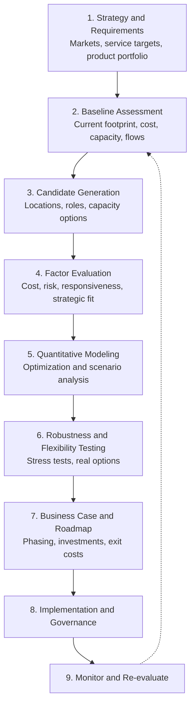
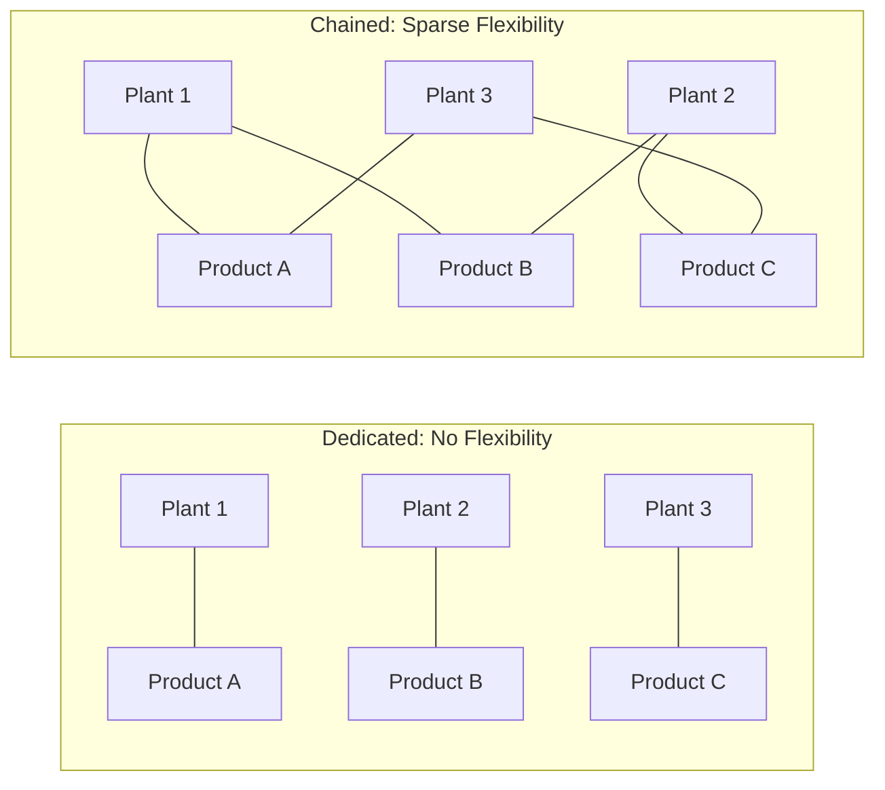
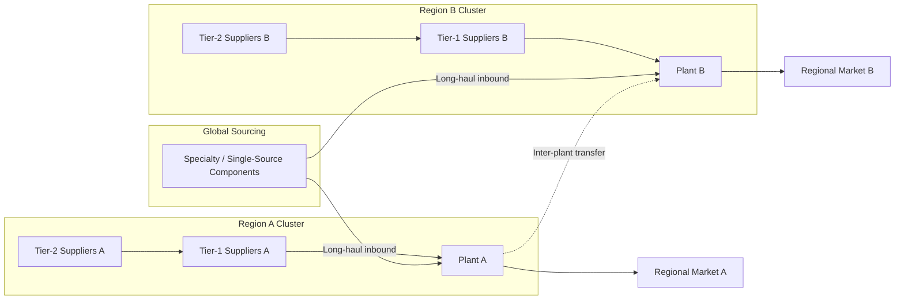

## Global Production Footprint Design


### Overview

A **global production footprint** is the set of manufacturing and assembly sites a firm operates or relies on (owned, joint-venture, or contracted), together with the **role, capability, capacity, and product-market assignment** of each site and the material and information flows that connect them. **Footprint design** is the disciplined process of deciding *where* to produce, *what* to produce at each location, *how much* capacity to install, *what role* each site plays, and *how the sites are linked* to suppliers and markets.

In the context of **Supply Chain Architecture & Tiered Structures**, footprint design is the manufacturing-layer counterpart of network design. It determines:

- The geographic location of the Make step for each product family, and therefore the length and structure of upstream (Tier-1, Tier-2, Tier-N supplier) and downstream (distribution, customer) flows.
- How much the network depends on supplier ecosystems co-located with each plant (supplier clustering, local content).
- The exposure profile of the network to tariffs, exchange rates, labor markets, logistics disruptions, and geopolitical events.
- The degree of standardization, redundancy, and flexibility available to respond to demand shifts.

Footprint decisions are **long-lived and capital-intensive**. Plants typically operate for decades, so decisions embed assumptions about future costs, trade regimes, and demand that may not hold. This makes scenario analysis and flexibility valuation central to good design.

**Key Points**

- Footprint design is a joint decision across four layers: **location** (where), **role** (what mission), **capacity and technology** (how much and with what), and **allocation** (which product-market flows through which plant).
- Landed cost, not factory-gate cost, is the primary economic lens; risk, responsiveness, and strategic factors complement it.
- Optimal footprints are rarely the minimum-cost configuration under a single forecast. They are robust configurations that perform acceptably across scenarios.
- A footprint is a living asset: it requires periodic re-evaluation as cost structures, trade policy, technology, and demand patterns evolve.

---

### Strategic Archetypes of Global Footprints

| Archetype | Description | Strengths | Weaknesses | Typical Fit |
| --- | --- | --- | --- | --- |
| **Centralized (global hub)** | Few large plants serve worldwide demand | Scale economies, concentrated expertise, lowest fixed cost | Long lead times, transport cost, tariff and disruption exposure | High-value, low-weight, stable, standardized products |
| **Regional (region-for-region)** | One or more plants per major region serve that region | Shorter lead time, tariff and local-content fit, reduced logistics risk | Duplicated capacity, lower scale per plant | Bulky, heavy, or regionally tailored products; high trade friction |
| **Local-for-local** | Many small plants close to end markets | Fastest response, cultural fit, minimal transport | Highest fixed cost, capability dispersion | Perishable, highly customized, or heavily protected markets |
| **Hub-and-spoke (focus plus finishing)** | Central plants make core components; regional sites finish and customize | Scale on common parts, late differentiation near market | Coordination complexity, inbound logistics | Products with modular architecture and postponement potential |
| **Product-focused (global product mandates)** | Each plant is the global source for a product family | Deep specialization, learning effects | Concentration risk, cross-border flows | Complex products with distinct process technologies |
| **Hybrid and dual-network** | Low-cost export base combined with regional/local plants | Balance of cost and responsiveness | Highest coordination burden | Multi-segment portfolios |

A simple positioning logic: as **trade friction**, **transport cost share**, **customization**, and **required responsiveness** increase, the optimal footprint shifts from centralized toward regional and local. As **scale economies**, **process complexity**, and **capital intensity** increase, it shifts toward centralization.

---

### Plant Roles and Mandates

Assigning a **strategic role** to each site clarifies investment priorities and capability development. A widely used typology (following Ferdows) distinguishes six site roles.

| Role | Primary Reason for Location | Site Competence | Typical Activities |
| --- | --- | --- | --- |
| **Offshore** | Low-cost labor and inputs | Low | Basic production, low process innovation |
| **Source** | Low cost plus growing capability | Medium | Cost-efficient production, process improvement |
| **Server** | Tariff, tax, or logistics advantages for a market | Low to medium | Serve a national or regional market |
| **Contributor** | Serves market and contributes to development | Medium to high | Process and product adaptation |
| **Outpost** | Access to knowledge, suppliers, or technology clusters | Medium | Learning, monitoring, sourcing insight |
| **Lead** | Creates new products, processes, and technology for the network | High | Innovation, prototyping, process leadership |

[Inference] Role labels and their exact definitions vary somewhat across the literature; treat the typology as a structured vocabulary rather than a fixed taxonomy.

Sites frequently **evolve along a path**, for example from offshore to source to contributor, as local capabilities and supplier bases mature. Footprint design should therefore consider a site's *trajectory*, not only its initial function.

---

### Design Framework



#### Step 1: Strategy and Requirements

Define what the footprint must deliver:

- **Demand:** volumes by product family, market, and channel over the planning horizon; growth and volatility.
- **Service:** target delivery lead times by market and product; service levels.
- **Product portfolio:** modularity, weight and density, value density, process technology, regulatory constraints.
- **Strategic constraints:** IP protection, brand and "made in" requirements, customer proximity, capability roadmap.
- **Risk appetite:** tolerance for concentration, geopolitical exposure, and disruption.

#### Step 2: Baseline Assessment

Document the current network:

| Data Element | Purpose |
| --- | --- |
| Plant capacity, utilization, and technology | Identify slack, constraints, and obsolescence |
| Product-to-plant assignments and volumes | Understand flows and capabilities |
| Full landed cost by product-lane | Establish the cost baseline |
| Supplier locations and tier structure | Reveal upstream dependence and proximity |
| Logistics network, lead times, and modes | Model transport cost and service |
| Fixed and variable cost structures | Support break-even and scale analysis |
| Trade terms (duties, preferential agreements) | Capture tariff exposure |
| Workforce, skills, and labor terms | Assess ramp and cost trends |
| Risk incidents and dependencies | Calibrate risk assessment |

#### Step 3: Candidate Generation

Generate location and configuration options through a **screening funnel**: from countries or regions, to sub-regions or clusters, to specific sites. Use filters (must-have criteria) before scoring (weighted criteria).

#### Steps 4-7 are detailed in the sections that follow.

---

### Location Factors

#### Cost Factors

| Factor | Considerations |
| --- | --- |
| **Labor cost and productivity** | Wage rates, benefits, and productivity-adjusted cost; wage inflation trajectory |
| **Materials and components** | Local availability, import content, price levels |
| **Energy and utilities** | Price, reliability, carbon intensity |
| **Capital and construction cost** | Land, building, equipment installation, infrastructure |
| **Logistics** | Inbound and outbound freight, port access, lead time |
| **Duties and taxes** | Tariffs, VAT, corporate tax, incentives, transfer pricing |
| **Currency** | Exchange-rate level and volatility; natural hedges from local costs and revenue |
| **Overhead and administrative cost** | Management, compliance, and coordination costs |

#### Non-Cost Factors

| Factor | Considerations |
| --- | --- |
| **Supplier ecosystem** | Depth and quality of local Tier-1 and Tier-2 suppliers; cluster benefits |
| **Skills and talent** | Availability of engineers, technicians, management |
| **Infrastructure** | Ports, airports, roads, rail, digital connectivity, power |
| **Market access** | Proximity to demand; trade agreements; local-content rules |
| **Political and regulatory stability** | Rule of law, expropriation and policy risk, permitting speed |
| **IP protection** | Enforcement environment and technology-leakage risk |
| **Environmental and social compliance** | Emissions rules, labor standards, community relations |
| **Natural hazard exposure** | Seismic, flood, storm, water stress |
| **Strategic and knowledge access** | Proximity to technology clusters, customers, and research |

#### Screening and Scoring

Apply **hard gates** first (for example, legal ability to operate, minimum infrastructure, mandatory certifications), then compute a weighted score:

$$Score_j = \sum_{i=1}^{n} w_i \cdot s_{ij}, \qquad \sum_{i=1}^{n} w_i = 1$$

Weights should reflect the product family: labor-intensive goods weight labor cost heavily, while high-value electronics weight supplier ecosystem and skills more heavily. Conduct **sensitivity analysis** on weights to verify that rankings are robust.

---

### Total Landed Cost Modeling

The primary economic lens is **total landed cost** at the point of customer receipt, not factory-gate cost.

$$TLC = C_{materials} + C_{conversion} + C_{overhead} + C_{inbound} + C_{outbound} + C_{duty} + C_{inventory} + C_{risk} + C_{coordination}$$

Where:

- $C_{conversion}$ includes labor and machine costs adjusted for productivity.
- $C_{inventory}$ captures pipeline and safety-stock carrying costs, which scale with lead time.
- $C_{risk}$ is an expected-loss or risk-reserve term.
- $C_{coordination}$ reflects management overhead and quality-assurance effort at distance.

#### Pipeline Inventory Cost

Longer lanes tie up working capital in transit. The carrying cost of pipeline inventory per unit is approximately:

$$C_{pipeline} = c \cdot i \cdot \frac{T_{transit}}{365}$$

where $c$ is unit cost, $i$ is the annual carrying-cost rate, and $T_{transit}$ is transit time in days. Safety stock also grows with lead time variability:

$$SS = z \sqrt{L\sigma_d^2 + \bar{d}^2\sigma_L^2}$$

#### Labor Cost, Productivity, and Learning

Wage differences must be normalized by productivity and quality:

$$C_{labor/unit} = \frac{w \cdot H}{P}$$

where $w$ is the loaded hourly wage, $H$ is hours per unit at reference productivity, and $P$ is a relative productivity index. A plant with half the wage but half the productivity has the same unit labor cost.

Where learning effects apply, unit labor hours decline with cumulative volume $Q$:

$$H(Q) = H_1 \cdot Q^{b}, \qquad b = \frac{\ln(\text{learning rate})}{\ln 2}$$

For a 90% learning rate, $b \approx -0.152$, so each doubling of cumulative volume cuts unit hours by about 10%. [Inference] Realized learning rates vary widely by process and site maturity.

#### Tariff and Trade Effects

Duty cost depends on customs value $V$ and effective rate $\tau$, and on **rules of origin** that determine preferential treatment:

$$C_{duty} = \tau_{eff} \cdot V_{customs}, \qquad \tau_{eff} = \begin{cases}\tau_{preferential} & \text{if origin rules satisfied}\\ \tau_{MFN} & \text{otherwise}\end{cases}$$

Because **local content and regional value content** thresholds can decide whether preferential rates apply, the *tier structure* of suppliers directly influences duty cost. Footprint design must therefore evaluate upstream sourcing together with plant location. [Inference] Actual rules of origin, thresholds, and calculation methods differ by trade agreement and product classification and require specialist verification.

#### Exchange-Rate Exposure

Cost in home currency changes with the exchange rate $e$ (home currency per unit of foreign currency) applied to foreign-currency costs $C_f$:

$$C_{home} = e \cdot C_f$$

Diversified footprints create **natural hedges**: costs incurred in the same currency as revenues reduce net exposure. Net exposure in currency $k$ is:

$$NE_k = R_k - C_k$$

where $R_k$ is revenue and $C_k$ is cost denominated in currency $k$.

#### Break-Even Comparison Between Sites

For two sites with fixed cost $F_A, F_B$ and variable cost per unit $v_A, v_B$ (including logistics to the market), the volume at which they cost the same is:

$$Q^{*} = \frac{F_B - F_A}{v_A - v_B}$$

(valid when the lower-fixed-cost site has the higher variable cost). This shows why high-volume products favor capital-intensive, scale-efficient sites while low or uncertain volumes favor low-fixed-cost options.

---

### Optimization Modeling

#### Capacitated Facility Location and Allocation

A standard mixed-integer formulation selects which sites to open and how to allocate flows.

**Sets and indices:** plants $i \in I$, markets $j \in J$, products $p \in P$.

**Decision variables:**

- $y_i \in \{0,1\}$: 1 if plant $i$ is open.
- $x_{ijp} \ge 0$: quantity of product $p$ produced at plant $i$ and shipped to market $j$.

**Objective (minimize total network cost):**

$$\min \; \sum_{i} f_i y_i + \sum_{i}\sum_{j}\sum_{p} \left(v_{ip} + t_{ijp} + d_{ijp}\right) x_{ijp}$$

where $f_i$ is the annualized fixed cost of plant $i$, $v_{ip}$ is variable production cost, $t_{ijp}$ is transport cost, and $d_{ijp}$ is duty and other lane cost.

**Constraints:**

$$\sum_{i} x_{ijp} = D_{jp} \quad \forall j, p \quad \text{(demand satisfaction)}$$


$$\sum_{j}\sum_{p} a_p x_{ijp} \le K_i y_i \quad \forall i \quad \text{(capacity)}$$


$$x_{ijp} \le M \cdot y_i \quad \forall i,j,p \quad \text{(linking, if needed)}$$


$$x_{ijp} = 0 \quad \text{if lead time}_{ij} > \text{max allowed for } (j,p) \quad \text{(service)}$$

where $a_p$ is capacity consumption per unit of product $p$, $K_i$ is capacity of plant $i$, and $D_{jp}$ is demand.

Additional constraints commonly included: minimum plant scale, product-capability compatibility (plant $i$ can only make product $p$ if qualified), local-content thresholds, maximum share at any one site or country (concentration cap), and budget limits.

#### Extending to Multi-Tier Structure

Include a supplier layer and inbound flows:

$$\min \; \sum_i f_i y_i + \sum_{s}\sum_{i}\sum_{m} \left(c_{sm} + t_{sim}\right) z_{sim} + \sum_{i}\sum_{j}\sum_{p}\left(v_{ip}+t_{ijp}+d_{ijp}\right)x_{ijp}$$

with material-balance constraints linking $z_{sim}$ (material $m$ from supplier $s$ to plant $i$) to production via bill-of-materials coefficients $b_{pm}$:

$$\sum_{s} z_{sim} = \sum_{j}\sum_{p} b_{pm}\, x_{ijp} \quad \forall i, m$$

This ties **supplier tier location** to **plant location**, which is essential when local content and inbound logistics dominate.

#### Multi-Period and Ramp Considerations

Add time index $t$ with open/close decisions $y_{it}$, capacity expansion variables, and switching costs:

$$\min \; \sum_t \frac{1}{(1+r)^t}\left[\sum_i f_i y_{it} + \sum_i \text{Open}_i \cdot o_i + \sum_i \text{Close}_i \cdot k_i + \text{flow costs}_t\right]$$

where $r$ is the discount rate, $o_i$ is the opening cost, and $k_i$ is the closure cost (severance, decommissioning, stranded assets).

#### Stochastic and Robust Formulations

Because demand, costs, and trade policy are uncertain, use **scenario-based stochastic programming**:

$$\min \; \sum_i f_i y_i + \sum_{s \in S} \pi_s \cdot Q_s(y)$$

where $\pi_s$ is the probability of scenario $s$ and $Q_s(y)$ is the optimal operating cost in scenario $s$ given the first-stage location decisions $y$. A **robust** alternative minimizes worst-case or regret:

$$\min_{y} \max_{s \in S} \left[ Cost_s(y) - Cost_s^{*} \right]$$

where $Cost_s^{*}$ is the best achievable cost in scenario $s$. This favors footprints with acceptable performance everywhere over those that excel in one scenario.

---

### Capacity and Technology Decisions

#### Capacity Strategy

| Strategy | Description | Trade-off |
| --- | --- | --- |
| **Lead capacity** | Build ahead of demand | Captures growth; risk of idle capacity |
| **Lag capacity** | Add capacity after demand is proven | Lower risk; risk of lost sales |
| **Match capacity** | Incremental additions tracking demand | Balanced; requires modular expansion |
| **Flexible / dedicated mix** | Flexible lines for uncertain products, dedicated lines for stable volume | Efficiency and adaptability |

#### Economies of Scale

Capital cost typically rises less than proportionally with capacity, often approximated with the **power-law (six-tenths) rule**:

$$\frac{Cost_2}{Cost_1} = \left(\frac{Capacity_2}{Capacity_1}\right)^{\alpha}, \qquad \alpha \approx 0.6\text{ to }0.8$$

Doubling capacity therefore raises cost by roughly $2^{0.6} \approx 1.52$, giving unit capital cost savings. [Inference] The exponent varies considerably by industry and technology; use industry-specific benchmarks.

Scale must be weighed against **diseconomies of scale and complexity**, transport cost of serving a wider area, and concentration risk.

#### Flexibility and Capacity Chaining

Flexibility can be built into the footprint via **product-plant flexibility** (each plant can make several products). Research on **chaining** shows that a sparse, well-structured pattern of flexibility, in which plants and products form a long chain or cycle, captures much of the benefit of full flexibility at much lower cost.



In the chained configuration, an unexpected demand surge for one product can be absorbed by shifting production along the chain. [Inference] The magnitude of benefit depends on demand correlation, capacity slack, and changeover costs, and should be tested by simulation.

#### Technology and Automation

| Consideration | Footprint Implication |
| --- | --- |
| **Automation level** | Higher automation reduces the labor-cost advantage of low-wage regions, favoring proximity to markets and suppliers |
| **Process complexity and yield learning** | Complex processes favor sites with skilled labor and mature ecosystems |
| **Standardization** | Common equipment and processes across sites ease transfer, backup, and scale |
| **Additive and distributed manufacturing** | May enable smaller, more localized production for some parts |
| **Energy and sustainability** | Access to low-carbon power can become a location driver |

---

### Tiered Supply Chain Implications

Footprint design cannot be separated from the supplier network. Each plant operates within an **inbound ecosystem** of Tier-1, Tier-2, and deeper suppliers.



| Implication | Explanation |
| --- | --- |
| **Supplier clustering** | Plants co-located with dense supplier clusters gain shorter inbound lead time and lower inventory; new locations may lack this depth |
| **Local content and origin** | Regional sourcing of Tier-1 and Tier-2 inputs can determine preferential duty and market-access eligibility |
| **Supplier follow-sourcing** | Key suppliers may need to relocate or open sites to serve a new plant, adding cost and timeline |
| **Hidden dependencies** | Even regional plants may depend on a few global single-source inputs, creating shared vulnerability across the footprint |
| **Ramp-up risk** | New sites face supplier qualification, learning curves, and logistics teething problems |
| **Sub-tier visibility** | Footprint risk analysis should map critical Tier-2 and Tier-3 nodes and their geographic concentration |

Footprint evaluation should therefore quantify **inbound cost and lead time** by site, **supplier availability and qualification effort**, and **overlap in upstream dependence** among sites.

---

### Risk, Resilience, and Flexibility

#### Risk Categories

| Risk | Examples | Footprint Response |
| --- | --- | --- |
| **Geopolitical and trade** | Tariffs, export controls, sanctions, nationalization | Diversify across jurisdictions; regional-for-regional |
| **Natural hazard** | Earthquake, flood, typhoon, drought | Avoid co-locating critical sites and suppliers in the same hazard zone |
| **Concentration** | Single site or single country holds most capacity | Concentration caps; qualified backup sites |
| **Logistics** | Port closures, canal or lane disruption | Route diversity; regional supply |
| **Supplier** | Sole-source or sub-tier failure | Dual sourcing; directed-buy; buffer inventory |
| **Currency** | Adverse exchange-rate moves | Natural hedges; multi-currency cost base |
| **Labor and social** | Strikes, unrest, wage inflation | Diversified labor markets; automation options |
| **Cyber and IP** | Data breach, technology leakage | Security controls; retained critical processes |

#### Quantifying Concentration

Capacity or volume concentration across $n$ sites with shares $s_i$:

$$HHI = \sum_{i=1}^{n} s_i^2$$

Also measure concentration **by country** and **by shared upstream supplier**, since sites in different countries may still share a single-source Tier-2 supplier.

#### Time-to-Recover Versus Time-to-Survive

For a critical site or node:

$$\text{Critical exposure if } TTR_{node} > TTS_{network}$$

where $TTR$ is time to restore or replace the site's output and $TTS$ is how long the rest of the network (via inventory and alternative capacity) can sustain service. [Inference] Both quantities are uncertain; estimate through scenario workshops and supplier data.

#### Expected Loss and Risk-Adjusted Cost

$$C_{risk,i} = \sum_{k} P_k \cdot L_{ik}$$

where $P_k$ is the annual probability of disruption scenario $k$ and $L_{ik}$ is the loss for site $i$ (lost margin, expediting, recovery). Adding $C_{risk}$ to TLC converts a pure cost ranking into a **risk-adjusted** ranking.

#### Real Options and the Value of Flexibility

Flexible or modular capacity has option value: the right, not the obligation, to expand, shift, or exit as uncertainty resolves. Examples include:

- Building shells with expansion pads.
- Standardized, movable production modules.
- Contract manufacturing agreements with capacity options.
- Dual-qualified products across sites.

[Inference] Formal real-options valuation (for example, using binomial models) can quantify these benefits, but inputs such as volatility are difficult to estimate and results should inform rather than dictate decisions.

---

### Worked Example: Regional Footprint Decision

**Scenario:** A manufacturer of mid-size industrial equipment serves three regions. Annual demand: Region N (North America) 40,000 units, Region E (Europe) 30,000 units, Region A (Asia) 50,000 units. Total: 120,000 units.

**Options**

- **Option 1: Single Asian hub** serving all regions.
- **Option 2: Three regional plants** (one per region).
- **Option 3: Hybrid**: Asian plant for Asia and Europe; North American plant for North America.

**Cost inputs (illustrative)**

| Item | Asia Site | Europe Site | North America Site |
| --- | --- | --- | --- |
| Annual fixed cost | $18M | $26M | $24M |
| Variable production cost per unit | $620 | $700 | $690 |
| Capacity (units/year) | 120,000 | 45,000 | 55,000 |

Freight and duty per unit shipped (illustrative):

| From \ To | N | E | A |
| --- | --- | --- | --- |
| **Asia** | $95 | $85 | $20 |
| **Europe** | $60 | $15 | $70 |
| **North America** | $18 | $55 | $90 |

**Option 1: Asian hub only**

- Fixed: $18M.
- Variable production: $120{,}000 \times 620 = \$74.4M$.
- Freight and duty: $40{,}000 \times 95 + 30{,}000 \times 85 + 50{,}000 \times 20 = 3.8M + 2.55M + 1.0M = \$7.35M$.
- **Total = 18 + 74.4 + 7.35 = $99.75M.**

**Option 2: Three regional plants**

- Fixed: $18 + 26 + 24 = \$68M$.
- Variable: $50{,}000 \times 620 + 30{,}000 \times 700 + 40{,}000 \times 690 = 31.0 + 21.0 + 27.6 = \$79.6M$.
- Freight and duty (local): $50{,}000 \times 20 + 30{,}000 \times 15 + 40{,}000 \times 18 = 1.0 + 0.45 + 0.72 = \$2.17M$.
- **Total = 68 + 79.6 + 2.17 = $149.77M.**

**Option 3: Hybrid (Asia for Asia and Europe; North America plant for North America)**

- Fixed: $18 + 24 = \$42M$.
- Variable: Asia produces $50{,}000 + 30{,}000 = 80{,}000$ units at $620 = $49.6M; North America produces 40,000 at $690 = $27.6M.
- Freight and duty: Asia to A: $50{,}000 \times 20 = 1.0M$; Asia to E: $30{,}000 \times 85 = 2.55M$; NA to N: $40{,}000 \times 18 = 0.72M$. Sum $4.27M.
- **Total = 42 + 49.6 + 27.6 + 4.27 = $123.47M.**

**Deterministic ranking:** Option 1 ($99.75M) < Option 3 ($123.47M) < Option 2 ($149.77M).

**Adding non-modeled factors**

| Factor | Option 1 | Option 2 | Option 3 |
| --- | --- | --- | --- |
| Average lead time to N and E | Long | Short | Mixed |
| Tariff exposure risk | High | Low | Medium |
| Single-site concentration | Very high | Low | Medium |
| Pipeline inventory cost | Highest | Lowest | Medium |

Suppose a **tariff scenario** adds a 15% duty on goods shipped from Asia into North America and Europe (applied to an assumed customs value of $900 per unit). For Option 1, the added duty is:

$$\Delta = 0.15 \times 900 \times (40{,}000 + 30{,}000) = 135 \times 70{,}000 = \$9.45M$$

giving a scenario total of $99.75 + 9.45 = \$109.2M$. For Option 3, only the 30,000 units shipped from Asia to Europe attract the duty:

$$\Delta = 135 \times 30{,}000 = \$4.05M \Rightarrow 123.47 + 4.05 = \$127.52M$$

Option 1 still ranks first on cost, so a further step is needed: add a **disruption scenario** in which the Asian hub is offline for 8 weeks. Under Option 1, all demand is unserved for that period, losing roughly $\frac{8}{52} \times 120{,}000 \approx 18{,}462$ units. If margin per unit is $400:

$$\text{Lost margin} = 18{,}462 \times 400 \approx \$7.39M$$

Under Option 3, a disruption at the Asian plant affects 80,000 units, or about 12,308 units lost, giving about $4.92M lost margin, while the North American plant is unaffected. With a disruption probability of, say, 10% per year:

$$C_{risk,Option1} = 0.10 \times 7.39 \approx \$0.74M, \qquad C_{risk,Option3} = 0.10 \times 4.92 \approx \$0.49M$$

These risk terms are small relative to the $23.7M cost gap between Options 1 and 3, so a pure expected-cost view still favors Option 1.

**Interpretation:** In this stylized example, the hub wins on cost across the base and tariff scenarios because scale and low variable cost outweigh freight. The decision would change if (a) tariffs were much higher or prohibitive, (b) service-level requirements or lead-time constraints ruled out long-haul supply, (c) Option 1's capacity or strategic risk tolerance were breached, or (d) demand growth in Europe and North America made local plants scale-efficient. The lesson is that **the sensitivity of the ranking to scenario parameters, not the single-point result, guides the decision**. [Inference] All numbers above are illustrative and omit pipeline inventory, working capital, transfer pricing, tax, and qualitative factors that a full analysis would include.

---

### Implementation: Footprint Optimization Model

The following Python example formulates a small capacitated facility location and allocation problem as a mixed-integer program using the PuLP library and solves it for the worked-example data.

**Example**

```python
import pulp

plants = ["Asia", "Europe", "NA"]
markets = ["N", "E", "A"]

demand = {"N": 40000, "E": 30000, "A": 50000}
fixed = {"Asia": 18e6, "Europe": 26e6, "NA": 24e6}
var_cost = {"Asia": 620, "Europe": 700, "NA": 690}
capacity = {"Asia": 120000, "Europe": 45000, "NA": 55000}

lane = {  # freight + duty per unit, plant -> market
    ("Asia", "N"): 95, ("Asia", "E"): 85, ("Asia", "A"): 20,
    ("Europe", "N"): 60, ("Europe", "E"): 15, ("Europe", "A"): 70,
    ("NA", "N"): 18, ("NA", "E"): 55, ("NA", "A"): 90,
}

def solve(max_share=None, extra_duty=None, closed=None):
    """
    max_share: cap on any single plant's share of total demand (concentration limit)
    extra_duty: dict {(plant, market): extra $/unit} for tariff scenarios
    closed: set of plants forced closed (disruption scenario)
    """
    extra_duty = extra_duty or {}
    closed = closed or set()
    prob = pulp.LpProblem("footprint", pulp.LpMinimize)
    y = pulp.LpVariable.dicts("open", plants, cat="Binary")
    x = pulp.LpVariable.dicts("flow", [(i, j) for i in plants for j in markets], lowBound=0)

    prob += (
        pulp.lpSum(fixed[i] * y[i] for i in plants)
        + pulp.lpSum((var_cost[i] + lane[(i, j)] + extra_duty.get((i, j), 0)) * x[(i, j)]
                     for i in plants for j in markets)
    )
    for j in markets:
        prob += pulp.lpSum(x[(i, j)] for i in plants) == demand[j]
    total = sum(demand.values())
    for i in plants:
        prob += pulp.lpSum(x[(i, j)] for j in markets) <= capacity[i] * y[i]
        if max_share:
            prob += pulp.lpSum(x[(i, j)] for j in markets) <= max_share * total
        if i in closed:
            prob += y[i] == 0

    prob.solve(pulp.PULP_CBC_CMD(msg=False))
    opened = [i for i in plants if y[i].value() > 0.5]
    return pulp.value(prob.objective) / 1e6, opened

base_cost, base_open = solve()
print(f"Base case:          cost=${base_cost:,.2f}M  open={base_open}")

tariff = {("Asia", "N"): 135, ("Asia", "E"): 135}
t_cost, t_open = solve(extra_duty=tariff)
print(f"Tariff scenario:    cost=${t_cost:,.2f}M  open={t_open}")

cap_cost, cap_open = solve(max_share=0.6)
print(f"60% concentration cap: cost=${cap_cost:,.2f}M  open={cap_open}")
```

**Output**

```plaintext
Base case:          cost=$99.75M  open=['Asia']
Tariff scenario:    cost=$109.20M  open=['Asia']
60% concentration cap: cost=$113.30M  open=['Asia', 'NA']
```

The base and tariff results reproduce the hand calculations above. Imposing a 60% concentration cap forces a second site (the North American plant) into the solution and raises cost by about $13.6M, which quantifies the **price of diversification**. Cost figures in the last line depend on the solver's optimal allocation and are shown for illustration. In practice, models extend this core with multiple products, multi-tier supplier flows, multi-period open/close decisions, and stochastic scenarios.

---

### KPI Framework for Footprint Performance

| Dimension | Example KPIs |
| --- | --- |
| **Cost** | Total landed cost per unit, conversion cost per unit, freight and duty as percent of sales |
| **Service** | Delivery lead time by market, on-time-in-full, order fulfillment cycle time |
| **Asset use** | Capacity utilization by site, return on invested capital, fixed-asset turnover |
| **Inventory and working capital** | Pipeline inventory, days of supply, cash-to-cash cycle time |
| **Flexibility** | Volume flex range, changeover time, share of products dual-sourced across sites |
| **Resilience** | Concentration index (by site, country, supplier), time-to-recover versus time-to-survive, share of critical inputs single-sourced |
| **Trade and compliance** | Effective duty rate, preferential-origin utilization, audit findings |
| **Sustainability** | Emissions per unit, energy intensity, renewable-energy share |
| **Capability** | Site maturity score, technology transfer cycle time, innovation contribution |

---

### Governance and Re-Evaluation

- **Ownership:** A cross-functional footprint council (operations, supply chain, finance, engineering, legal, tax, risk, and business units) owns the strategy and decision rights.
- **Cadence:** Full strategic review every few years; annual refresh of cost and risk inputs; event-triggered reviews for tariff changes, major disruptions, technology shifts, and M&A.
- **Trigger indicators:** Wage-inflation thresholds, sustained utilization gaps, tariff or trade-policy changes, supplier ecosystem shifts, and service-performance deterioration.
- **Decision discipline:** Stage-gate investment decisions with explicit assumptions, scenario ranges, exit costs, and pre-agreed kill criteria.
- **Transition management:** Sequence site openings, ramp-ups, transfers, and closures to protect service continuity; account for severance, stranded assets, and customer requalification.

---

### Common Pitfalls and Mitigations

| Pitfall | Consequence | Mitigation |
| --- | --- | --- |
| Optimizing on factory-gate or labor cost alone | Hidden logistics, inventory, duty, and quality costs erode savings | Use total landed cost with risk adjustment |
| Single-scenario optimization | Fragile footprint when assumptions shift | Scenario analysis; robust or stochastic models; regret metrics |
| Ignoring supplier ecosystem depth | Ramp delays, high inbound cost, quality problems | Evaluate Tier-1 and Tier-2 availability; plan supplier development |
| Underestimating exit and transition costs | Lock-in and stranded assets | Include closure, severance, and relocation costs in the model |
| Concentration in one country or hazard zone | Correlated failure | Concentration caps; geographic diversification; hazard mapping |
| Overlooking rules of origin and local content | Loss of preferential duty; unexpected tariffs | Model origin rules jointly with sourcing and site decisions |
| Ignoring learning curves and ramp | Optimistic early performance | Include ramp-up yield, productivity, and quality curves |
| Treating the footprint as static | Drift from optimal as conditions change | Institutionalize periodic re-evaluation with trigger indicators |
| Neglecting organizational and management capacity | Coordination failures across distance | Assign plant roles; invest in governance, talent, and systems |
| Chasing subsidies without fundamentals | Sites become uneconomic when incentives expire | Value incentives explicitly but require standalone viability |
| Data quality issues in the baseline | Wrong conclusions from flawed inputs | Validate data, reconcile costs, and sensitivity-test inputs |

---

### Step-by-Step Design Checklist

1. Clarify strategy: markets, service targets, product portfolio, risk appetite, and strategic constraints.
2. Baseline the current footprint: capacity, utilization, product-plant assignments, landed cost, supplier locations, and lane costs.
3. Segment products by weight, value density, customization, process technology, and volume to guide archetype choice.
4. Define plant roles and mandates, including desired capability trajectories.
5. Screen locations using hard gates, then weighted scoring; validate with sensitivity analysis.
6. Build the total landed cost model, including duty, currency, inventory, and risk terms.
7. Formulate and solve the optimization (facility location, allocation, and multi-tier flows), including concentration and service constraints.
8. Run scenarios (demand, cost, tariff, disruption, exchange rate) and evaluate robustness using regret or expected-value measures.
9. Evaluate flexibility options: modular capacity, chaining, dual qualification, contract capacity.
10. Assess supplier ecosystem readiness and plan follow-sourcing or supplier development.
11. Build the business case with phasing, capital, ramp-up, transition, and exit costs.
12. Establish governance, KPIs, trigger indicators, and a periodic re-evaluation cycle.

---

**Conclusion**

Global production footprint design determines where products are made, what each site is responsible for, how much capacity it carries, and how sites connect to supplier tiers and end markets. The most reliable designs treat the decision as a multi-layered problem: choose an archetype consistent with product and market characteristics, assign clear site roles, model total landed cost with risk adjustment, optimize location and allocation subject to service and concentration constraints, and stress-test the result across scenarios. Because supplier ecosystems, trade rules, and cost structures shift over time, the footprint should be built for flexibility (modular capacity, chained product-plant flexibility, dual-qualified products) and revisited on a regular cadence. The goal is not the cheapest configuration under a single forecast but a resilient, responsive, and economically sound network that performs acceptably across the futures it may face.

**Related Topics**

- Facility Location Theory and Mixed-Integer Network Optimization
- Total Landed Cost and Total Cost of Ownership Modeling
- Plant Roles, Mandates, and Site Capability Development
- Rules of Origin, Tariff Engineering, and Trade Agreement Utilization
- Nearshoring, Reshoring, and Regionalization Strategies
- Supplier Clustering, Local Content, and Follow-Sourcing
- Process Flexibility, Chaining, and Capacity Options
- Scenario Planning, Stochastic and Robust Network Design
- Real Options Valuation for Capacity and Footprint Decisions
- Supply Chain Risk Mapping, Concentration Metrics, and TTR/TTS Analysis
- Currency Exposure, Natural Hedging, and Transfer Pricing
- Multi-Period Footprint Transition and Plant Closure Planning