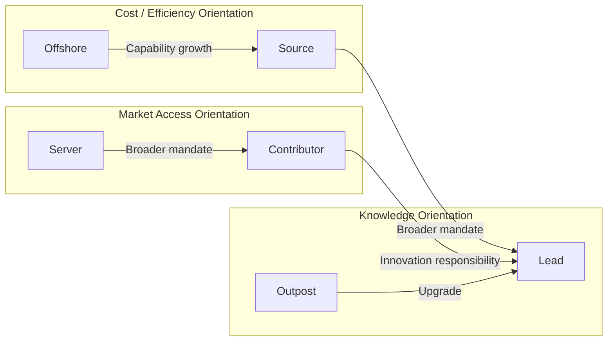
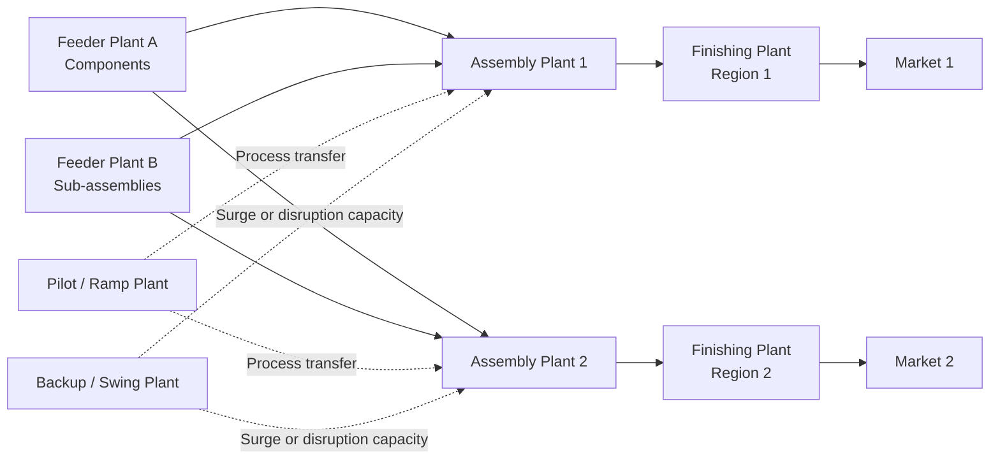
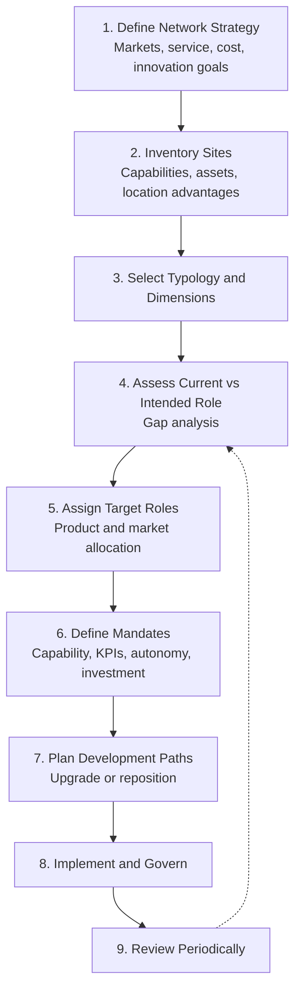
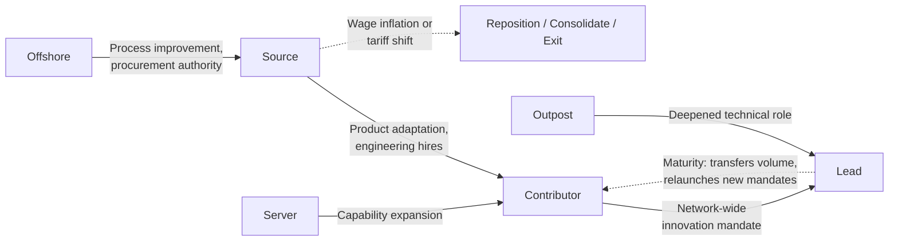
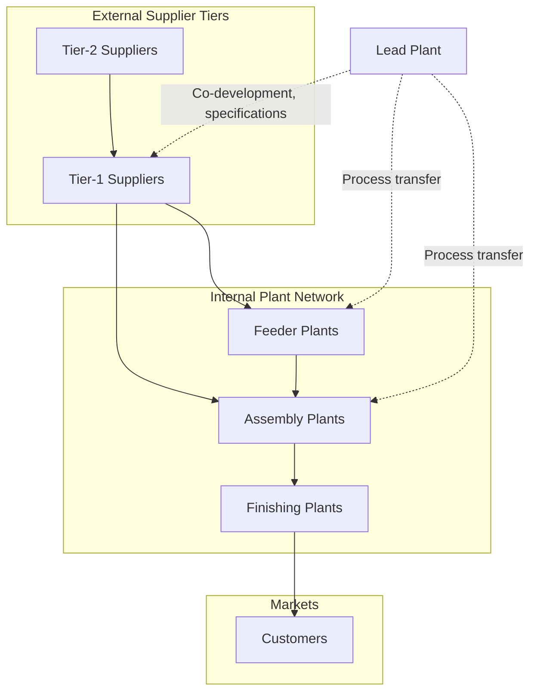

## Plant Role Typologies in Multi-Site Networks


### Overview

A **plant role** (also called a *site mandate*, *strategic role*, or *plant charter*) is the explicit purpose a manufacturing site serves within a multi-site network: what it produces, for which markets, at what level of capability, and what it contributes to the rest of the network beyond output. A **plant role typology** is a structured classification scheme that groups sites into a small number of role types so that management can reason consistently about investment, capability development, product allocation, and governance across dozens of sites.

In the context of **Supply Chain Architecture & Tiered Structures**, plant roles connect the network's *physical footprint* to its *strategic intent*:

- They determine which product families are allocated to which sites and, by extension, which Tier-1 and Tier-2 supplier ecosystems each site must be embedded in.
- They define the flows between sites (component supply, technology transfer, backup capacity), turning a collection of plants into a network with internal tiers (feeder plants, assembly plants, finishing plants).
- They govern how decision rights are split between the site and headquarters (local autonomy versus central control).
- They give a basis for evaluating whether a site is performing *against its mandate*, rather than against a single generic yardstick.

**Key Points**

- Roles are **assigned and evolving**, not intrinsic. A site's role is a management decision, and sites can migrate along development paths as capabilities accumulate.
- Typologies differ on their *organizing dimension*: site **competence** and **location rationale** (Ferdows), **strategic purpose** (Hayes and Wheelwright, Vereecke and Van Dierdonck), **process-technology position** (product-process focus), or **decision authority** (autonomy and coordination models).
- A typology is a *lens*, not a law. Real networks blend types, and labels differ across authors. [Inference] Exact category names and definitions vary between publications, so verify terminology against the source you adopt.
- Misalignment between a site's *assigned role* and its *actual capability* is one of the most common causes of network underperformance.

---

### Why Classify Plant Roles

| Purpose | Benefit |
| --- | --- |
| **Investment prioritization** | Different roles justify different capital, talent, and technology allocations |
| **Product and volume allocation** | Clear rules for which products belong where, reducing ad hoc decisions |
| **Capability roadmapping** | Explicit development paths for sites (for example, cost-focused to contributor) |
| **Performance evaluation** | Roles set appropriate KPIs (a lead plant is judged on innovation, an offshore plant on cost) |
| **Governance design** | Alignment of decision rights and reporting lines to role |
| **Network rationalization** | Identifies redundant, misaligned, or under-utilized sites |
| **Risk management** | Reveals dependencies (for example, sole-source sites) and backup relationships |
| **Communication** | Shared vocabulary between corporate, regional, and plant management |

---

### Dimensions That Define a Role

Most typologies can be understood as positions on a small set of dimensions.

| Dimension | Question | Typical Spectrum |
| --- | --- | --- |
| **Primary location rationale** | Why is the plant where it is? | Low cost, market access, proximity to suppliers, access to skills and knowledge |
| **Site competence** | How broad and deep are its capabilities? | Basic production, through process and product adaptation, to innovation |
| **Market scope** | Whom does it serve? | Local, regional, global |
| **Product scope** | What range does it make? | Narrow and focused, to broad and diverse |
| **Process position** | What part of the value chain does it perform? | Fabrication, sub-assembly, final assembly, finishing/customization |
| **Network contribution** | What does it give the rest of the network? | Output only, learning, technology transfer, backup capacity, innovation |
| **Decision autonomy** | How much does the site decide? | Fully dictated by HQ, to substantial local authority |
| **Integration** | How tightly is it tied to other sites and suppliers? | Stand-alone, to deeply interdependent |

---

### Major Typologies

#### 1. Ferdows: Six Strategic Site Roles

Kasra Ferdows' widely cited framework classifies foreign factories using two axes: the **primary strategic reason for the site's location** (access to low-cost production, access to skills and knowledge, or proximity to the market) and the **site competence** (from basic production to innovation and support for the wider network).

| Role | Primary Location Rationale | Site Competence | Typical Activities | Network Contribution |
| --- | --- | --- | --- | --- |
| **Offshore** | Access to low-cost inputs (labor, materials) | Low | Basic production and assembly of components or products | Cost reduction |
| **Source** | Low cost, plus growing responsibility | Medium | Cost-efficient production, procurement, process improvement | Cost leadership and reliable supply |
| **Server** | Access to a market (tariffs, taxes, logistics) | Low to medium | Serve a specific national or regional market | Market presence, avoidance of trade barriers |
| **Contributor** | Serves market and contributes beyond production | Medium to high | Product customization, process development, supplier development | Local adaptation and improvement |
| **Outpost** | Access to knowledge, suppliers, and technology | Medium | Learning, scouting, prototyping, monitoring advanced practices | Knowledge inflow |
| **Lead** | Access to knowledge and skills; creates innovation | High | New product and process development, network-wide technology leadership | Innovation and know-how for the whole network |



**Key insight:** Ferdows argued that sites tend to migrate to higher competence over time, and that companies benefit from deliberately upgrading selected sites rather than leaving them in low-competence roles indefinitely. [Inference] The strength and inevitability of the upgrade path is context-dependent and not guaranteed.

**Development path (often described):**

$$\text{Offshore} \rightarrow \text{Source} \rightarrow \text{Contributor} \rightarrow \text{Lead}$$

with Server and Outpost as alternate entry points that can also evolve.

#### 2. Hayes and Wheelwright: Manufacturing Network Roles by Strategic Purpose

An earlier and influential distinction views plants by their **strategic contribution** to competitive advantage, commonly summarized in four stages of manufacturing's strategic role (from *internally neutral* to *externally supportive*) and associated plant emphases.

| Emphasis | Description |
| --- | --- |
| **Internally neutral** | Plant avoids causing problems; efficiency and compliance |
| **Externally neutral** | Plant matches competitors and industry standards |
| **Internally supportive** | Plant supports the business strategy through capability aligned to it |
| **Externally supportive** | Plant capability is a source of competitive advantage and shapes strategy |

This view emphasizes the *stage of strategic maturity* more than site geography, and complements location-driven typologies.

#### 3. Vereecke and Van Dierdonck: Plant Roles and Evolution

Building on Ferdows and others, this line of research examined plant roles in international networks and observed that role assignments interact with **plant autonomy, technology-transfer patterns, and knowledge flows**, and that roles frequently differ from headquarters' *intended* roles. It reinforced the idea that **role is a dynamic outcome** of decisions, capability accumulation, and negotiation. [Inference] Detailed category counts and labels differ between studies.

#### 4. Product-Process and Focus-Based Roles

Following Skinner's concept of the **focused factory**, sites are assigned roles by the *type of product or process* they concentrate on.

| Focus Type | Description | Typical Benefit |
| --- | --- | --- |
| **Product-focused** | Site makes one product family for multiple markets | Learning effects, specialized equipment, deep expertise |
| **Process-focused** | Site specializes in a specific process technology (for example, casting, painting, semiconductor fabrication) serving multiple products | Scale and process mastery |
| **Market-focused** | Site serves a defined market or customer segment | Responsiveness, customization |
| **Volume-focused** | Site dedicated to high-volume or low-volume/high-mix work | Alignment of layout and operating model to volume profile |

Focus reduces internal complexity and often improves performance, but increases inter-site dependency and transport flows.

#### 5. Network-Position Roles (Feeder, Assembly, Finishing, and Backup)

Where the network has **internal tiers**, roles describe position in the material flow.

| Role | Function | Flow Pattern |
| --- | --- | --- |
| **Feeder / component plant** | Produces components or sub-assemblies for other plants | One-to-many outbound to assembly sites |
| **Assembly / integration plant** | Combines components into products | Many-to-one inbound, one-to-market outbound |
| **Finishing / customization plant** | Performs final configuration near market (postponement) | Inbound semi-finished, outbound to customers |
| **Distribution-integrated plant** | Co-located with warehousing and fulfillment | Direct-to-customer or channel shipment |
| **Backup / swing plant** | Holds qualified capacity to absorb disruption or peaks | Idle or partially loaded, activated on demand |
| **Pilot / ramp plant** | Launches new products, proves processes, then transfers volume | Outbound process transfer packages |



#### 6. Decision-Authority Typologies (Governance-Based Roles)

Another family classifies subsidiaries by **autonomy and integration**, drawing on the international-business literature (for example, the differentiated network and the global-integration versus local-responsiveness framework).

| Type | Description | Decision Rights |
| --- | --- | --- |
| **Implementer** | Executes centrally defined tasks | HQ decides; site complies |
| **Local innovator** | Develops capabilities and solutions mainly for local use | Site has autonomy for local matters |
| **Global innovator** | Develops capabilities used across the network | Site has strategic influence network-wide |
| **Integrated player** | Contributes and receives knowledge with high coordination | Shared decision making |

[Inference] These governance typologies originate in multinational-subsidiary research and map onto plant roles by analogy; exact correspondence is not one-to-one with Ferdows-style categories.

---

### Comparison Across Typologies

| Typology | Organizing Logic | Strength | Limitation |
| --- | --- | --- | --- |
| **Ferdows six roles** | Location rationale and competence | Clear development paths; widely used | Focuses on foreign sites; less about internal flows |
| **Hayes and Wheelwright stages** | Strategic maturity of the manufacturing function | Links plants to competitive strategy | Less specific on geography and network flows |
| **Focused-factory (Skinner)** | Product/process/market focus | Reduces complexity; improves performance | Increases inter-site flows and dependency |
| **Network-position (feeder/assembly/finishing)** | Position in the material flow | Directly supports network and supplier-tier design | Says less about capability and autonomy |
| **Governance/autonomy** | Decision rights and integration | Clarifies control and knowledge flow | Derived from subsidiary research; needs adaptation |

In practice, organizations often use a **combined typology**: a Ferdows-style capability role, a network-position label, and a focus statement.

**Example combined role statement:**

> *Plant M: Contributor (Ferdows), Assembly plant serving the regional market, product-focused on Family B, with autonomy over local process improvement and supplier development within defined budgets.*

---

### Role Assignment: A Structured Method



#### Step 1: Define Network Strategy

Clarify what the network must deliver: cost position, responsiveness, innovation, resilience, and market access.

#### Step 2: Inventory Sites

Capture, for each site: location advantages, workforce skills, process technology, capacity and utilization, supplier ecosystem, local market position, and historical performance.

#### Step 3: Select Typology and Dimensions

Choose the frameworks most relevant to the decisions at hand. For location-driven decisions use Ferdows-style roles, and for flow-driven decisions add network-position roles.

#### Step 4: Assess Current versus Intended Role

Compare the *role the site actually plays* (revealed by what it does, its competence, and its influence) with the *role management intends*. Gaps indicate either underinvestment or misassignment.

#### Step 5: Assign Target Roles and Allocations

Allocate product families and market responsibilities in line with roles, ensuring that each site has a defensible reason to exist and each critical product has a primary site and a qualified backup.

#### Step 6: Define Mandates

A **site mandate** document typically states:

| Element | Content |
| --- | --- |
| **Role and mission** | Typology label and plain-language purpose |
| **Product and market scope** | Product families, volume ranges, markets served |
| **Capability expectations** | Technologies, certifications, skills to build or maintain |
| **Performance expectations** | Role-specific KPIs and targets |
| **Decision rights** | What the site decides, what requires approval |
| **Resource commitment** | Capital, headcount, and development investment envelope |
| **Network obligations** | Backup roles, technology sharing, supplier development duties |
| **Development path** | Intended evolution and milestones |

---

### Role-Specific Operating Profiles

| Attribute | Offshore | Source | Server | Contributor | Outpost | Lead |
| --- | --- | --- | --- | --- | --- | --- |
| **Main metric emphasis** | Unit cost | Cost and reliability | Market cost and service | Cost, service, local adaptation | Learning outcomes | Innovation, network impact |
| **Typical process scope** | Narrow | Broader (incl. procurement) | Assembly or full local process | Full plus adaptation | Pilot and prototype | Full plus R&D interface |
| **Engineering depth** | Low | Medium | Low to medium | Medium to high | Medium | High |
| **Supplier development role** | Minimal | Some | Local sourcing | Active | Scouting | Leading |
| **Autonomy** | Low | Low to medium | Medium | Medium to high | Medium | High |
| **Key risk** | Wage inflation, quality drift | Capability plateau | Trade or tariff change | Diluted focus | Isolation from network | Overdependence on one site |
| **Investment style** | Minimal, cost-driven | Efficiency projects | Market-driven capacity | Capability building | Selective learning | Strategic technology |

**Key Points**

- Assigning the *wrong KPIs* to a role (for example, judging a lead plant purely on unit cost) drives dysfunctional behavior and can erode the plant's innovation contribution.
- Roles should also determine **how a plant participates in tiered supply**: lead and contributor plants often co-develop with Tier-1 suppliers, while offshore plants typically accept supplier assignments from the center.

---

### Quantitative Support for Role Assignment

#### Role Fit Scoring

Score each site on the dimensions relevant to a candidate role and compare with a role profile.

$$Fit_{j,r} = \sum_{d=1}^{D} w_{r,d} \cdot \left(1 - \frac{|s_{j,d} - p_{r,d}|}{R_d}\right)$$

where $s_{j,d}$ is site $j$'s score on dimension $d$, $p_{r,d}$ is the ideal profile value for role $r$ on that dimension, $R_d$ is the scale range, and $w_{r,d}$ are weights summing to 1 for each role. Higher values indicate a closer match. The role with the highest fit is a candidate; large differences from the *currently assigned* role indicate a misalignment worth investigating.

#### Gap Between Assigned and Demonstrated Competence

$$Gap_j = C^{required}_{r(j)} - C^{actual}_j$$

A positive gap flags a site assigned to a role beyond its demonstrated competence (capability-building need), and a negative gap flags underutilization of a capable site (candidate for role upgrade).

#### Allocation with Role Constraints

Product allocation across sites can be embedded in an optimization model. Let $x_{ip}$ be the share of product $p$ built at site $i$, with role-driven constraints.

$$\min \sum_i \sum_p c_{ip}\, x_{ip}\, D_p + \sum_i f_i y_i$$

subject to

$$\sum_i x_{ip} = 1 \quad \forall p$$


$$x_{ip} \le q_{ip}\, y_i \quad \forall i, p \quad (q_{ip}=1 \text{ if site } i \text{ is qualified and permitted by role for product } p)$$


$$\sum_p a_p\, x_{ip}\, D_p \le K_i\, y_i \quad \forall i$$

The binary qualification matrix $q_{ip}$ encodes **role-based product eligibility** (for example, only lead and contributor plants may launch new products; offshore plants may only run mature products). This connects typology directly to the network optimization model.

#### Network Interdependence

Where feeder plants supply assembly plants, the dependence of site $j$ on site $i$ can be measured by the share of $j$'s inbound component value sourced internally from $i$:

$$Dep_{i \rightarrow j} = \frac{V_{ij}}{\sum_k V_{kj}}$$

High dependence signals a critical internal supply link that warrants backup planning and joint governance.

---

### Evolution and Role Migration

Roles change as capabilities accumulate, as markets shift, and as strategy evolves.



**Drivers of upward migration**

| Driver | Mechanism |
| --- | --- |
| **Local capability accumulation** | Skills, engineering teams, supplier base mature |
| **Management investment** | Deliberate investment in technology, training, and authority |
| **Successful performance** | Track record earns wider responsibility |
| **Supplier ecosystem development** | Local Tier-1 and Tier-2 depth enables more complex work |
| **Strategic need** | Network requires a new center of competence |

**Drivers of downward migration or repositioning**

| Driver | Mechanism |
| --- | --- |
| **Cost erosion** | Wage inflation removes offshore advantage |
| **Policy shifts** | Tariffs or incentives change server logic |
| **Technology change** | Automation shifts value away from labor-based advantage |
| **Capability decay** | Underinvestment or talent loss reduces competence |
| **Consolidation** | Network rationalization reduces the number of sites |

**Migration management checklist:**

1. Define the *target role* and the capability gaps to close.
2. Sequence investments (equipment, people, systems, supplier development).
3. Transfer responsibilities in stages (for example, from production to process engineering to product adaptation).
4. Adjust decision rights and KPIs as the role expands.
5. Establish checkpoints, and be willing to halt or redirect if capability does not develop.

---

### Tiered Supply Chain Implications

Plant roles shape how each site interacts with the supplier tiers and with other plants.

| Role | Upstream Pattern (Suppliers) | Downstream Pattern | Tier Implications |
| --- | --- | --- | --- |
| **Offshore** | Supplier assignments often set centrally; imported inputs | Ships to hub or assembly plants | Sits low in the internal tier, depends on external Tier-1 |
| **Source** | Some local sourcing and supplier consolidation | Global or regional supply | May act as internal Tier-1 to assembly plants |
| **Server** | Local content to satisfy market rules | Local market | Local supplier tiers matter for origin rules |
| **Contributor** | Active local supplier development | Regional supply and adaptation | Builds Tier-1/Tier-2 capability regionally |
| **Outpost** | Scouts advanced suppliers | Limited output | Gateway to technology-cluster suppliers |
| **Lead** | Co-development with strategic suppliers | Launches products, transfers to others | Anchors strategic supplier relationships |
| **Feeder plant** | Global commodity and specialty inputs | Internal customers (assembly plants) | Internal Tier-1 to sister plants |
| **Finishing plant** | Receives semi-finished from network | Final customer delivery | Last internal tier before market |



The network therefore has **two overlapping tier structures**: the *external supplier tiers* and the *internal plant tiers*. Role design should ensure that internal plants are treated with the same rigor as external suppliers, including service-level agreements, transfer pricing rules, and quality expectations.

---

### Worked Example: Classifying and Reassigning Roles

**Scenario:** An industrial-equipment manufacturer operates six plants.

| Site | Location Rationale (Current) | Headcount / Engineers | Products | Observed Behavior |
| --- | --- | --- | --- | --- |
| **P1** | Low labor cost | 900 / 8 | Mature Family C (export) | Runs to specification; no improvement projects |
| **P2** | Low cost, growing base | 700 / 35 | Family A and C components | Leads cost-reduction projects; manages local suppliers |
| **P3** | Serves domestic market behind tariff | 400 / 12 | Family B (local variants) | Assembly to local specification only |
| **P4** | Regional market plus adaptation | 550 / 60 | Family B and D | Adapts designs, develops suppliers, small pilot builds |
| **P5** | Placed near a technology cluster | 80 / 40 | Prototypes | Scouts suppliers and technology; small output |
| **P6** | Historic home plant | 600 / 150 | All families, new launches | Develops new products; trains other plants |

**Classification (Ferdows-style):**

| Site | Assigned Role | Rationale |
| --- | --- | --- |
| P1 | **Offshore** | Cost-driven, low competence |
| P2 | **Source** | Cost location with growing responsibility (procurement, improvement) |
| P3 | **Server** | Market-access motivation, low-to-medium competence |
| P4 | **Contributor** | Market plus adaptation and supplier development |
| P5 | **Outpost** | Knowledge access, prototype-scale production |
| P6 | **Lead** | Innovation and network-wide technology transfer |

**Diagnostic findings:**

- **P2** demonstrates competence beyond a pure offshore role but has no formal authority over product adaptation. Candidate for **upgrade toward Contributor**.
- **P1** faces wage inflation. Its role is fragile: options are automation investment, transfer of volume to P2, or consolidation.
- **P3** depends on a tariff barrier; a policy change could invalidate its Server rationale. Requires a contingency plan and a review of local-content leverage.
- **P5** has high engineering headcount but low output; verify that its knowledge flows are actually reaching P6 and the plants that could use them.

**Role-fit scoring illustration for P2** (dimensions scored 0 to 10; two candidate roles):

| Dimension | Weight (Source) | Weight (Contributor) | P2 Score | Source Profile | Contributor Profile |
| --- | --- | --- | --- | --- | --- |
| Cost efficiency | 0.35 | 0.20 | 8 | 9 | 7 |
| Process engineering | 0.25 | 0.25 | 7 | 7 | 8 |
| Product adaptation | 0.10 | 0.25 | 4 | 3 | 8 |
| Supplier development | 0.20 | 0.20 | 7 | 6 | 8 |
| Autonomy | 0.10 | 0.10 | 4 | 4 | 7 |

Using $Fit = \sum w \cdot (1 - |s - p|/10)$:

**Fit as Source:**

$0.35(1 - 0.1) + 0.25(1 - 0.0) + 0.10(1 - 0.1) + 0.20(1 - 0.1) + 0.10(1 - 0.0)$

$= 0.315 + 0.250 + 0.090 + 0.180 + 0.100 = 0.935$

**Fit as Contributor:**

$0.20(1 - 0.1) + 0.25(1 - 0.1) + 0.25(1 - 0.4) + 0.20(1 - 0.1) + 0.10(1 - 0.3)$

$= 0.180 + 0.225 + 0.150 + 0.180 + 0.070 = 0.805$

P2 currently fits **Source** best (0.935 vs. 0.805). The Contributor gap is concentrated in *product adaptation* (score 4 vs. profile 8) and *autonomy* (4 vs. 7), which defines the **capability-building agenda** for the upgrade: add product-engineering staff, grant authority over local design changes, and transfer a pilot product from P6.

**Decision:** Retain P2 as Source in the near term, launch a two-year upgrade program toward Contributor with staged milestones, and decide on P1's automation-versus-transfer options using a break-even analysis.

---

### Implementation: Role-Fit Scoring and Gap Analysis

The following Python example scores sites against role profiles, identifies the best-fit role, and reports the largest capability gaps for the most promising upgrade target.

**Example**

```python
from dataclasses import dataclass

DIMENSIONS = ["cost", "process_eng", "product_adapt", "supplier_dev", "autonomy"]

# Ideal profiles (0-10) and weights per role
ROLE_PROFILES = {
    "Source": {
        "profile": {"cost": 9, "process_eng": 7, "product_adapt": 3, "supplier_dev": 6, "autonomy": 4},
        "weights": {"cost": 0.35, "process_eng": 0.25, "product_adapt": 0.10, "supplier_dev": 0.20, "autonomy": 0.10},
    },
    "Contributor": {
        "profile": {"cost": 7, "process_eng": 8, "product_adapt": 8, "supplier_dev": 8, "autonomy": 7},
        "weights": {"cost": 0.20, "process_eng": 0.25, "product_adapt": 0.25, "supplier_dev": 0.20, "autonomy": 0.10},
    },
}

@dataclass
class Site:
    name: str
    scores: dict

def fit(site: Site, role: str, scale: float = 10.0) -> float:
    p = ROLE_PROFILES[role]["profile"]
    w = ROLE_PROFILES[role]["weights"]
    return sum(w[d] * (1 - abs(site.scores[d] - p[d]) / scale) for d in DIMENSIONS)

def gaps(site: Site, role: str):
    p = ROLE_PROFILES[role]["profile"]
    out = [(d, p[d] - site.scores[d]) for d in DIMENSIONS if p[d] > site.scores[d]]
    return sorted(out, key=lambda x: x[1], reverse=True)

p2 = Site("P2", {"cost": 8, "process_eng": 7, "product_adapt": 4, "supplier_dev": 7, "autonomy": 4})

for role in ROLE_PROFILES:
    print(f"{p2.name} fit as {role}: {fit(p2, role):.3f}")

best = max(ROLE_PROFILES, key=lambda r: fit(p2, r))
print(f"Best current fit: {best}")

target = "Contributor"
print(f"Capability gaps to reach {target}:")
for dim, g in gaps(p2, target):
    print(f"  {dim}: +{g} points needed")
```

**Output**

```plaintext
P2 fit as Source: 0.935
P2 fit as Contributor: 0.805
Best current fit: Source
Capability gaps to reach Contributor:
  product_adapt: +4 points needed
  autonomy: +3 points needed
  process_eng: +1 points needed
  supplier_dev: +1 points needed
```

The output reproduces the hand calculation and ranks capability gaps to guide the upgrade roadmap. In practice, dimension scores should come from structured assessments (audits, KPI data, and management review) rather than single-person judgments, and profiles should be calibrated to the organization's own role definitions.

---

### KPI Framework by Role

| KPI | Offshore | Source | Server | Contributor | Outpost | Lead |
| --- | --- | --- | --- | --- | --- | --- |
| **Unit cost / conversion cost** | Primary | Primary | Secondary | Secondary | Not primary | Not primary |
| **Quality (PPM, first-pass yield)** | Primary | Primary | Primary | Primary | Secondary | Primary |
| **Delivery reliability** | Secondary | Primary | Primary | Primary | Not primary | Secondary |
| **Local market lead time / service** | Not primary | Secondary | Primary | Primary | Not primary | Secondary |
| **Process improvement savings** | Secondary | Primary | Secondary | Primary | Secondary | Primary |
| **Product adaptation cycle time** | Not applicable | Not primary | Secondary | Primary | Secondary | Primary |
| **Supplier development outcomes** | Not primary | Secondary | Secondary | Primary | Secondary | Primary |
| **Knowledge transfer outputs (documented practices, transfers)** | Not primary | Secondary | Not primary | Secondary | Primary | Primary |
| **New product launch performance** | Not applicable | Not applicable | Not primary | Secondary | Secondary | Primary |
| **Utilization** | Primary | Primary | Primary | Secondary | Low relevance | Secondary |

Tailoring KPIs to roles avoids evaluating every site on cost alone, which can suppress learning and capability-building where they are strategically needed.

---

### Governance, Autonomy, and Coordination

| Governance Element | Design Guidance |
| --- | --- |
| **Decision-rights matrix** | Specify, per role, who decides on capital projects, product changes, supplier selection, hiring, and process changes |
| **Coordination mechanisms** | Global process owners, functional councils, network operations reviews, shared metrics |
| **Transfer pricing and internal contracts** | Clear internal service levels and pricing between feeder, assembly, and finishing plants |
| **Knowledge sharing** | Communities of practice, rotation of engineers, standardized practice libraries, process-transfer playbooks |
| **Standardization versus local adaptation** | Global standards for core processes and data; local latitude where market or supplier conditions demand |
| **Site leadership** | Appoint leaders whose profile matches the role (operational excellence for source plants, innovation and networking for lead plants) |
| **Review cadence** | Annual role review; event-triggered review for tariff shifts, technology changes, or capability breakthroughs |

A useful principle is **"tight-loose" governance**: tight control on network-critical elements (quality standards, safety, data, brand requirements) and loose control on how a site achieves its goals within its mandate.

---

### Common Pitfalls and Mitigations

| Pitfall | Consequence | Mitigation |
| --- | --- | --- |
| Treating roles as permanent | Sites stagnate or become misaligned as conditions change | Periodic role review; explicit development paths |
| Role labels without resources | Mandates exist on paper only | Tie roles to investment, talent, and decision rights |
| Judging all plants by cost | Underinvestment in learning, adaptation, and innovation | Role-specific KPIs and scorecards |
| Ignoring the gap between intended and actual role | Hidden misalignment, missed opportunities | Assess demonstrated competence against assigned role |
| Overconcentrating innovation in one lead plant | Knowledge bottleneck and single point of failure | Outpost and contributor sites; formal knowledge-transfer mechanisms |
| Underestimating internal dependency | Cascading disruption from feeder plant failures | Map internal flows; define backup and swing capacity |
| Poor coordination between plants | Duplication, conflicting local decisions, quality variance | Governance structure, common standards, network operations reviews |
| Capability upgrade without supplier ecosystem | Site cannot sustain higher-complexity work | Plan supplier development alongside role upgrade |
| Rigid typology applied to hybrid sites | Misclassification and forced fit | Use combined labels; treat typology as a guide, not a straitjacket |
| Ignoring workforce and culture | Resistance to role change; talent loss | Change management, career paths, transparent communication |
| No exit or repositioning path for fragile roles | Stranded assets, delayed decisions | Define triggers and options (automate, transfer, consolidate) early |

---

### Step-by-Step Design Checklist

1. Clarify network strategy: cost, service, responsiveness, innovation, and resilience priorities.
2. Choose the typology (or combination) and define role dimensions relevant to your decisions.
3. Inventory each site's competence, location advantages, supplier ecosystem, and current behavior.
4. Compare intended versus demonstrated roles and quantify gaps.
5. Assign target roles and allocate product families, markets, and backup responsibilities consistently with those roles.
6. Write mandates covering scope, capability, KPIs, decision rights, resources, and network obligations.
7. Design internal tier relationships: feeder, assembly, and finishing flows, with service levels and transfer pricing.
8. Define development paths, staged milestones, and go/no-go checkpoints for sites intended to upgrade.
9. Align governance: decision-rights matrix, coordination forums, knowledge-sharing mechanisms.
10. Align supplier development and sourcing strategy with each site's role.
11. Establish role-specific KPIs and dashboards; review performance against mandate, not against a single generic standard.
12. Review roles on a fixed cadence and after trigger events; adjust assignments, resources, and mandates accordingly.

---

**Conclusion**

Plant role typologies give multi-site manufacturing networks a shared language for answering a deceptively simple question: *why does each plant exist, and what should it become?* Ferdows-style roles (offshore, source, server, contributor, outpost, lead) classify sites by location rationale and competence, Hayes-and-Wheelwright and focused-factory perspectives add strategic maturity and product-process focus, network-position roles (feeder, assembly, finishing, backup, pilot) describe material-flow structure, and governance typologies clarify autonomy and integration. Effective networks combine these lenses into concrete mandates with matching KPIs, resources, decision rights, and development paths. Because roles are assigned and evolving, the discipline lies in continuously testing assigned roles against demonstrated capability, funding the upgrades that create strategic value, repositioning fragile sites before conditions force the issue, and integrating plant roles with the external supplier tiers so that internal and external tier structures work as one coordinated system.

**Related Topics**

- Ferdows Site Role Framework and Capability Development Paths
- Focused Factory Concept and Product-Process Focus
- Global Production Footprint Design and Network Optimization
- Site Mandates, Decision Rights, and Subsidiary Autonomy
- Internal Supply Chains: Transfer Pricing and Internal Service Levels
- Technology Transfer and Production Ramp-Up Between Plants
- Knowledge Flows and Communities of Practice in Manufacturing Networks
- Capacity Chaining, Swing Plants, and Backup Capacity Design
- Plant Rationalization, Consolidation, and Exit Planning
- Supplier Development Aligned to Plant Roles
- Role-Based KPI Design and Balanced Scorecards
- Change Management for Plant Role Migration