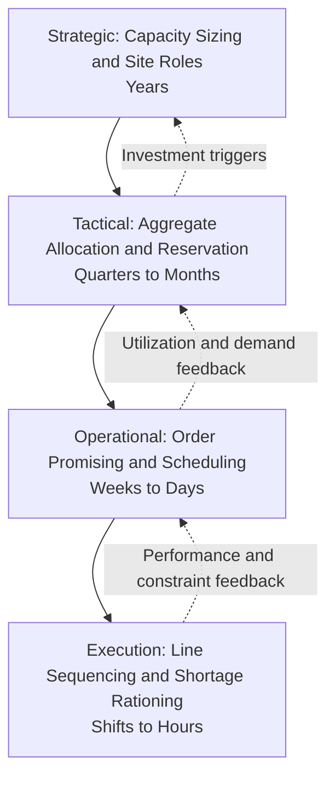
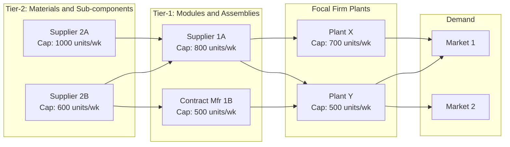
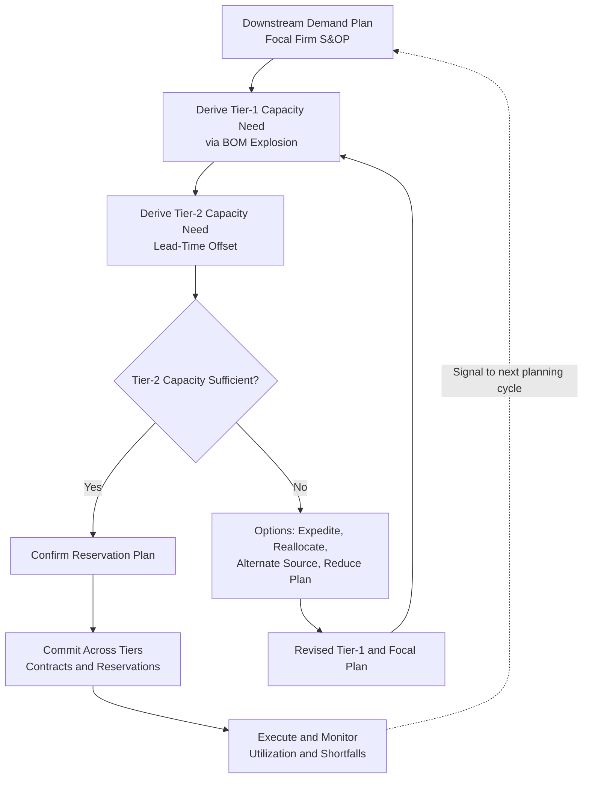

## Capacity Allocation Across Tiered Manufacturing Networks


### Overview

**Capacity allocation** is the set of decisions and mechanisms by which finite productive capacity (machine hours, labor hours, tooling, line slots, shifts, or throughput at a bottleneck) is divided among competing products, customers, orders, and internal or external sites. In a **tiered manufacturing network**, capacity exists at several levels at once: Tier-N and Tier-2 suppliers (raw materials, sub-components), Tier-1 suppliers and contract manufacturers (modules, assemblies), the focal firm's own plants (final assembly, finishing), and downstream postponement or finishing sites. Allocation decisions at one tier constrain what is feasible at the tiers above and below it.

In the context of **Supply Chain Architecture & Tiered Structures**, capacity allocation is where structural design (footprint, plant roles, sourcing) meets operational reality. It answers questions such as:

- How is scarce capacity at a shared Tier-1 supplier divided among several OEM customers when demand exceeds supply?
- How does a focal firm distribute a product family's volume across its own plants and contract manufacturers, given differing costs, capabilities, and constraints?
- How is upstream capacity reserved so that downstream commitments can actually be met (capacity synchronization across tiers)?
- Which customers, products, or orders should receive priority when the network is short of capacity, and by what rule?

**Key Points**

- Capacity is allocated at multiple time scales: **strategic** (years; sizing and site assignment), **tactical** (months; reservation, contracts, aggregate allocation), and **operational** (days and weeks; order promising, scheduling, shortage rationing).
- The **binding constraint** in a tiered network is often not at the focal firm. It can sit at a deep-tier supplier with long expansion lead times (for example, a specialized component or process), so allocation must be *network-wide*, not plant-by-plant.
- Allocation is both an **optimization problem** (who produces what, where) and a **game-theoretic problem** (customers may inflate orders when they expect rationing, distorting the demand signal).
- Contractual mechanisms (reservation fees, take-or-pay, options, priority tiers) transfer risk and align incentives between tiers; without them, capacity is under-invested or hoarded.

---

### Concepts and Definitions

| Term | Meaning |
| --- | --- |
| **Nameplate (design) capacity** | Maximum theoretical output under ideal conditions |
| **Effective capacity** | Output achievable after planned losses (maintenance, changeovers, breaks) |
| **Demonstrated (actual) capacity** | Output actually achieved over a period |
| **Rated capacity** | Effective capacity adjusted for utilization and efficiency |
| **Bottleneck (constraint)** | Resource whose capacity limits system throughput |
| **Capacity load** | Required capacity to fulfill assigned demand |
| **Capacity reservation** | Contractual commitment that capacity will be held for a customer |
| **Capacity option** | Right, but not obligation, to call additional capacity within a defined window |
| **Allocation (rationing) rule** | Formal rule dividing scarce capacity or product among requesters |
| **Available-to-promise (ATP) / capable-to-promise (CTP)** | Order-level commitment logic based on uncommitted supply and capacity |
| **Capacity synchronization** | Aligning capacity commitments across tiers so that upstream supply supports downstream plans |

Effective and rated capacity are commonly related as:

$$C_{effective} = C_{design} \times A$$


$$C_{rated} = C_{effective} \times E \times U$$

where $A$ is availability (after planned downtime), $E$ is efficiency (rate performance), and $U$ is utilization. [Inference] Definitions and factor names differ across companies and software systems; align them before comparing figures between sites or suppliers.

---

### Decision Hierarchy



| Level | Horizon | Typical Decisions | Typical Tools |
| --- | --- | --- | --- |
| **Strategic** | 2 to 10 years | Total capacity per tier, plant roles, supplier capacity investment, long-term agreements | Network optimization, scenario analysis, real options |
| **Tactical** | 3 to 24 months | Product-to-site allocation, reservation contracts, supplier capacity commitments, seasonal build plans | S&OP, aggregate planning (LP/MIP), capacity requirements planning |
| **Operational** | Days to weeks | Order acceptance, due-date quoting, finite scheduling, expediting | APS, ATP/CTP, finite-capacity scheduling |
| **Execution** | Hours to days | Line sequencing, changeover management, shortage rationing | MES, dispatching rules |

---

### Structure of a Tiered Capacity Network

Capacity constraints can appear at every tier, and they interact through bill-of-materials dependencies and lead times.



Three structural properties shape allocation:

1. **Serial dependency:** Output at a downstream tier cannot exceed what the upstream tier can supply. Effective network capacity is limited by the *minimum* across a serial chain (after adjusting for BOM ratios).
2. **Shared resources:** A single supplier or plant may serve multiple products, customers, or plants, creating contention.
3. **Multi-stage lead times:** Capacity must be committed earlier at deep tiers (longer lead times), so upstream allocation decisions are made with less demand certainty than downstream ones.

For a serial chain with capacity $K_t$ at tier $t$ and BOM usage ratio $r_t$ (units of tier-$t$ output per final unit), the maximum final output is:

$$Q_{max} = \min_{t}\left(\frac{K_t}{r_t}\right)$$

The tier that attains the minimum is the **network bottleneck**. Investment or reallocation elsewhere does not raise throughput until that constraint moves.

---

### Allocation Problem Types

#### 1. Product-to-Site Allocation (Internal and Contracted Plants)

Decide which products or volumes each plant or contract manufacturer produces, balancing cost, capability, capacity, and risk.

#### 2. Customer Allocation Under Shortage (Rationing)

When aggregate demand exceeds available capacity or supply, divide it among customers by a rule.

#### 3. Capacity Reservation and Contracting Across Tiers

Determine how much capacity a buyer reserves at a supplier, at what price, with what flexibility.

#### 4. Order-Level Promising

Commit specific quantities and dates to orders based on real-time capacity and material availability.

#### 5. Multi-Echelon Capacity Synchronization

Coordinate capacity commitments across tiers so upstream supply matches downstream plans.

---

### Aggregate Capacity Allocation: Optimization Model

#### Product-to-Site Allocation (Linear or Mixed-Integer Program)

**Indices:** products $p$, sites $i$ (own plants and contract manufacturers), resources $r$ (for example, machine groups), periods $t$.

**Decision variables:**

- $x_{ipt} \ge 0$: quantity of product $p$ produced at site $i$ in period $t$.
- $u_{pt} \ge 0$: unmet demand of product $p$ in period $t$ (shortfall).
- $y_{it} \in \{0,1\}$: 1 if site $i$ is active in period $t$ (when fixed costs or minimum lots apply).

**Objective (minimize total cost):**

$$\min \sum_{i,p,t} \left(c^{prod}_{ip} + c^{trans}_{ip}\right) x_{ipt} + \sum_{i,t} f_i\, y_{it} + \sum_{p,t} \pi_p\, u_{pt}$$

where $c^{prod}_{ip}$ is production cost, $c^{trans}_{ip}$ is transport and duty cost to demand points, $f_i$ is fixed cost, and $\pi_p$ is the shortage penalty (reflecting lost margin and service impact).

**Constraints:**

$$\sum_{i} x_{ipt} + u_{pt} = D_{pt} \quad \forall p, t \quad \text{(demand)}$$


$$\sum_{p} a_{pr}\, x_{ipt} \le K_{irt}\, y_{it} \quad \forall i, r, t \quad \text{(resource capacity)}$$


$$x_{ipt} \le q_{ip}\, M\, y_{it} \quad \forall i,p,t \quad \text{(qualification: } q_{ip}=1 \text{ if site is qualified)}$$


$$\sum_{p} x_{ipt} \ge L_i\, y_{it} \quad \forall i, t \quad \text{(minimum scale)}$$

where $a_{pr}$ is the resource usage per unit of product $p$ on resource $r$ (including changeover-equivalent time where modeled), $K_{irt}$ is available capacity, and $D_{pt}$ is demand.

#### Extension to Tiered Supply

Add supplier capacity and BOM linkage. Let $z_{smt}$ be the quantity of material or component $m$ supplied by supplier $s$ in period $t$, and $b_{pm}$ the BOM quantity of $m$ per unit of $p$:

$$\sum_{s} z_{sm,t-\ell_{sm}} \ge \sum_{i}\sum_{p} b_{pm}\, x_{ipt} \quad \forall m, t \quad \text{(material coverage with lead time } \ell_{sm})$$


$$\sum_{m} g_{sm}\, z_{smt} \le K^{sup}_{st} \quad \forall s, t \quad \text{(supplier capacity)}$$

Adding supplier costs $c_{sm}z_{smt}$ to the objective yields a **multi-tier capacity-constrained planning model** in which allocation at the plant tier is *feasible only if* upstream capacity supports it.

#### Handling Uncertainty

**Scenario-based stochastic formulation:**

$$\min \; \text{FirstStageCost}(y, K^{reserved}) + \sum_{s \in S} \pi_s\, Q_s(y, K^{reserved})$$

where first-stage decisions (capacity reservations, site activations) are made before demand uncertainty resolves, and $Q_s$ is the second-stage operating cost in scenario $s$. A **robust** variant minimizes the maximum regret across scenarios.

---

### Shortage Allocation (Rationing) Mechanisms

When total requested quantity exceeds available capacity or product, a rule must divide supply. Let $A$ be available quantity and $R_j$ the request of customer $j$, with $\sum_j R_j > A$.

| Mechanism | Rule | Properties |
| --- | --- | --- |
| **Proportional (pro rata)** | $a_j = A \cdot \dfrac{R_j}{\sum_k R_k}$ | Simple, transparent; strongly rewards inflated orders |
| **Linear** | Equal share until requests are met: $a_j = \min(R_j, \lambda)$ with $\lambda$ set so $\sum_j a_j = A$ | Protects small customers; ignores strategic importance |
| **Uniform (equal split)** | Same allocation to each customer regardless of request | Discourages padding; may be unfair to large customers |
| **Priority (tiered)** | Fulfill highest-priority classes first | Reflects strategic value; can starve low tiers |
| **Historical-share (turn-and-earn)** | Allocate based on past *sales* (not orders) $a_j = A \cdot \dfrac{H_j}{\sum_k H_k}$ | Reduces gaming, rewards actual sell-through |
| **Contract-based** | Honor reservations first, then allocate the remainder | Aligns with commitments |
| **Auction / price-based** | Highest willingness to pay receives capacity | Efficient allocation; can conflict with relationships |

#### The Rationing Game and Order Inflation

Under **proportional allocation**, customers who anticipate shortage rationally *inflate* orders to secure a larger share. When capacity later recovers, orders are cancelled or reduced, leaving the supplier with excess capacity and inventory built on phantom demand. This is the **rationing game** (Lee, Padmanabhan, and Whang), a key contributor to the bullwhip effect.

Numerical illustration: capacity $A = 100$; three customers with **true** needs 40, 40, 40 (total 120, a shortage).

| Customer | True Need | Order (all truthful) | Allocation (pro rata) |
| --- | --- | --- | --- |
| 1 | 40 | 40 | 33.3 |
| 2 | 40 | 40 | 33.3 |
| 3 | 40 | 40 | 33.3 |

If customer 1 inflates to 80 while others stay truthful:

$$a_1 = 100 \times \frac{80}{160} = 50, \qquad a_2 = a_3 = 100 \times \frac{40}{160} = 25$$

Customer 1 gains 16.7 units over the truthful case at the others' expense. If all inflate proportionally (for example, to 80 each), allocations revert to 33.3 each but the supplier now sees 240 in demand, a distorted signal. Under **historical-share allocation** based on actual past sales, the gain from inflation disappears, which is why it is widely used to restore truthful ordering. [Inference] Real customers respond to allocation rules in complex ways, and behavior depends on repeated-game dynamics, relationship structure, and information available.

#### Priority-Class Allocation

Define classes (for example, *strategic*, *contract*, *standard*, *spot*) with weights or strict ordering. For strict priority with classes $k = 1, \dots, K$ (1 highest) and class demand $R_k$:

$$a_k = \min\left(R_k,\; \max\left(0,\; A - \sum_{h<k} a_h\right)\right)$$

Weighted variants divide capacity by weights $w_k$ within each round, providing a floor for lower classes.

---

### Capacity Reservation and Contract Mechanisms

Reservation and option contracts allocate *risk* between buyer and supplier and encourage supplier investment.

| Contract Type | Mechanism | Risk Allocation | Typical Use |
| --- | --- | --- | --- |
| **Capacity reservation (take-or-pay)** | Buyer pays for reserved capacity whether used or not | Buyer bears demand risk; supplier protected | Long-lead, capital-intensive capacity |
| **Reservation with reservation fee plus unit price** | Fee for holding capacity, price per unit used | Shared | Flexible supply with commitment |
| **Capacity option** | Fee $e$ per unit of option; exercise price $w$ per unit if called | Buyer holds flexibility; supplier is compensated for holding capacity | Volatile demand |
| **Minimum purchase commitment** | Buyer commits to a minimum volume | Buyer bears downside on volume | Scale economies |
| **Flexibility band (rolling forecast)** | Orders may deviate within $\pm x\%$ of forecast | Shared within band | Ongoing supply |
| **Revenue or profit sharing** | Parties share upside and downside | Shared | Align incentives across tiers |
| **Buy-back / return** | Supplier repurchases unsold stock | Supplier bears surplus risk | Product with obsolescence risk |
| **Priority agreement** | Buyer receives priority in shortage in exchange for fees or volume | Buyer secures supply; others deprioritized | Constrained supply |

#### Optimal Reservation Quantity

For a buyer facing uncertain demand $D$ with cumulative distribution $F$, unit selling margin $m$, reservation cost $e$ per unit of capacity, and exercise (or usage) cost $w$ per unit called, a newsvendor-type logic gives the optimal reserved quantity $Q^{*}$ as:

$$F(Q^{*}) = \frac{m - w - e}{m - w}$$

This states that the buyer should reserve up to the point where the marginal reservation cost equals the expected marginal benefit of having capacity available. A higher reservation fee $e$ lowers the critical fractile and therefore the reserved quantity, while higher margin $m$ raises it. [Inference] This single-period result assumes risk-neutral decision-makers and independent demand; multi-period, correlated, and risk-averse settings change the result.

**Numerical example.** Selling margin $m = \$100$, exercise cost $w = \$60$, reservation cost $e = \$8$. Demand $D \sim \text{Normal}(1000, 200^2)$.

$$\text{Critical fractile} = \frac{100 - 60 - 8}{100 - 60} = \frac{32}{40} = 0.80$$


$$Q^{*} = \mu + z_{0.80}\sigma = 1000 + 0.8416 \times 200 \approx 1168\ \text{units}$$

The buyer reserves about 1,168 units. If the reservation fee rose to $16, the fractile falls to $\frac{24}{40} = 0.60$ and $Q^{*} \approx 1000 + 0.2533 \times 200 \approx 1051$ units, showing how reservation pricing shapes the amount of capacity that gets committed.

#### Supplier Capacity Investment Incentives

Absent commitments, a supplier underinvests in capacity relative to the buyer's need because the supplier bears the downside if demand is low (the classic **double marginalization and underinvestment problem**). Contracts with reservation fees or minimum commitments shift enough risk to the buyer to induce investment closer to the system-optimal level. Formally, the supplier's optimal capacity satisfies a critical-fractile condition based on its *own* margin and cost of capacity:

$$F(K_s^{*}) = \frac{w - c - k}{w - c}$$

where $w$ is the wholesale price, $c$ is marginal production cost, and $k$ is the per-unit cost of capacity. Compare with the *integrated-system* optimum using the retail margin $m$ instead of $w$: because $w < m$, $K_s^{*} < K^{system}$, which explains supplier underinvestment and motivates coordination contracts. [Inference] Exact parameterization varies by contract form; the qualitative result (underinvestment without coordination) is robust across many models.

---

### Order-Level Allocation: ATP and CTP

At the operational level, capacity is allocated one order at a time.

#### Available-to-Promise (Materials)

$$ATP_t = OnHand_t + Supply_t - CommittedDemand_t$$

computed cumulatively through the next supply event. Orders are promised against uncommitted supply.

#### Capable-to-Promise (Materials and Capacity)

CTP extends ATP by checking whether capacity exists to *produce* the order within the requested window, possibly across tiers:

$$T_{promise} = \max\left(T^{material}_{avail},\; T^{capacity}_{slot}\right) + T^{process} + T^{ship}$$

For a multi-tier network, the promise date accounts for the *latest* of upstream availability times through the BOM:

$$T^{material}_{avail} = \max_{m \in BOM}\left(T^{avail}_m + \ell_m\right)$$

#### Allocated ATP and Priority Segmentation

To protect priority customers, reserve a portion of ATP by class (allocated ATP, or *ATP by allocation*):

$$ATP_{class\ k} = Allocation_k - Consumed_k$$

with rules for **borrowing** (lower classes may consume unused higher-class allocation only after a release date, and higher classes may borrow from lower ones under defined conditions).

---

### Cross-Tier Capacity Synchronization

The central design challenge is ensuring that capacity commitments at each tier are *consistent*.



#### Capacity Requirements Planning Across Tiers

For final demand $D_t$ of a product and BOM structure, the requirement for component $m$ at tier $\tau$ in period $t - L_m$ (offset by lead time) is:

$$Req_{m,t-L_m} = b_m \cdot D_t$$

Capacity load at resource $r$ in period $t$ is:

$$Load_{rt} = \sum_{m} a_{mr}\, Req_{mt}$$

Utilization and overload are:

$$U_{rt} = \frac{Load_{rt}}{K_{rt}}, \qquad Overload_{rt} = \max(0, Load_{rt} - K_{rt})$$

Resources with $U_{rt} > 1$ are infeasible and must be addressed through overtime, subcontracting, load shifting (leveling), or demand adjustment.

#### Load Leveling and Smoothing

Moving production earlier (build ahead) or later (backlog) can smooth peaks. The trade-off is inventory holding cost versus overtime or lost-sales cost. A simple aggregate plan with **chase**, **level**, and **mixed** strategies uses the following cost structure:

$$\min \sum_t \left(c_r R_t + c_o O_t + c_h I_t + c_b B_t + c_{hire} H_t + c_{fire} F_t\right)$$

with regular ($R_t$), overtime ($O_t$), inventory ($I_t$), backlog ($B_t$), hiring ($H_t$), and firing ($F_t$) variables subject to capacity and inventory balance constraints.

#### Information Sharing and Collaboration

| Mechanism | Purpose |
| --- | --- |
| **Shared rolling forecasts with capacity signals** | Suppliers see downstream plans early enough to build capacity |
| **Supplier capacity dashboards** | Buyers see supplier load and constraints |
| **Joint S&OP with key suppliers** | Reconcile demand and capacity plans across tiers |
| **Multi-tier visibility platforms** | Expose deep-tier constraints before they disrupt |
| **CPFR-style joint planning** | Collaborative forecasting and replenishment |
| **Frozen-window agreements** | Stable near-term plans reduce upstream nervousness |

---

### Network Bottleneck Analysis

#### Theory of Constraints Applied to Tiers

The Theory of Constraints (TOC) holds that system throughput is determined by its constraint. In a tiered network, the constraint may be internal or external. The **five focusing steps** adapt as follows:

1. **Identify** the network constraint (the tier and resource with highest load relative to capacity, adjusted for BOM ratios).
2. **Exploit** it: ensure it is never idle, starved, or blocked; prioritize highest-margin throughput on it.
3. **Subordinate** other resources: align upstream and downstream schedules to the constraint's pace (drum-buffer-rope).
4. **Elevate** the constraint: add capacity, reduce setup time, add alternate sources.
5. **Repeat**: once the constraint moves, re-identify.

#### Throughput Prioritization at the Constraint

Allocate scarce constraint time to products in descending order of **throughput per constraint minute**:

$$TPC_p = \frac{P_p - TVC_p}{t_{p,c}}$$

where $P_p$ is selling price, $TVC_p$ is totally variable cost (materials and other truly variable costs), and $t_{p,c}$ is processing time at the constraint. Rank products by $TPC_p$ and fill constraint capacity accordingly until it is exhausted or demand is met.

**Numerical example.** A shared Tier-1 machining center has 2,400 minutes available per week.

| Product | Price | Materials and Variable Cost | Constraint Minutes | Weekly Demand | Throughput per Minute |
| --- | --- | --- | --- | --- | --- |
| A | $120 | $50 | 5 | 200 | $\frac{70}{5} = 14.0$ |
| B | $90 | $30 | 3 | 300 | $\frac{60}{3} = 20.0$ |
| C | $150 | $60 | 6 | 150 | $\frac{90}{6} = 15.0$ |

Ranking by throughput per constraint minute: B (20.0), C (15.0), A (14.0).

- Product B: 300 units × 3 = 900 minutes. Remaining: 1,500.
- Product C: 150 units × 6 = 900 minutes. Remaining: 600.
- Product A: 600 / 5 = 120 units (out of 200 demanded).

Weekly throughput contribution:

$$300 \times 60 + 150 \times 90 + 120 \times 70 = 18{,}000 + 13{,}500 + 8{,}400 = \$39{,}900$$

Product A is partially served (120 of 200), and rationing decisions for A should be communicated upstream and downstream. This greedy ranking is optimal for a single constraint with linear cost structure; with multiple interacting constraints, use LP.

#### Utilization and Queueing Effects

Even below 100% utilization, lead times rise sharply as utilization approaches capacity. Using the Kingman approximation for expected waiting time in a single-server queue:

$$W_q \approx \left(\frac{\rho}{1-\rho}\right)\left(\frac{c_a^2 + c_s^2}{2}\right)\tau$$

Because of this nonlinearity, allocating capacity so that a critical resource runs at 95% or more of its capacity produces long, variable lead times that propagate to downstream tiers. Targets for planned utilization at shared constraints are therefore typically set below 100%, with the level depending on variability and the cost of delay. [Inference] Appropriate target utilization is context-specific and best established through simulation or queueing analysis of the actual resource.

---

### Worked Example: Multi-Tier Allocation Under Constraint

**Scenario:** A focal firm assembles a product using a module from a Tier-1 supplier. The module requires a specialized component from a Tier-2 supplier. The Tier-1 supplier serves two customers: the focal firm (Customer F) and another OEM (Customer G).

**Capacities and BOM (weekly)**

| Tier / Resource | Weekly Capacity |
| --- | --- |
| Tier-2 component supplier | 1,000 components |
| Tier-1 module supplier | 900 modules |
| Focal firm assembly | 700 final units |

BOM: 1 final unit needs 1 module; 1 module needs 1 component.

**Demand for the module at Tier-1 (next four weeks, per week)**

| Customer | Requested modules |
| --- | --- |
| F (focal firm) | 700 |
| G (other OEM) | 400 |
| **Total** | **1,100** |

**Step 1: Identify the constraint.**

$$Q_{max} = \min\left(\frac{1000}{1}, \frac{900}{1}, \frac{700}{1}\right) = 700$$

for the focal firm's chain alone, but Tier-1's capacity of 900 is *shared*. Total demand at Tier-1 (1,100) exceeds 900, so a shortage of 200 modules per week exists.

**Step 2: Apply candidate allocation rules at Tier-1.**

| Rule | Customer F | Customer G | Comment |
| --- | --- | --- | --- |
| **Pro rata** | $900 \times \frac{700}{1100} = 572.7$ | $900 \times \frac{400}{1100} = 327.3$ | F short by 127 units of assembly capacity utilization |
| **Contract-based (F holds reservation of 650)** | 650 reserved, then share of remaining 250 by pro rata: $650 + 250 \times \frac{50}{50+400} \approx 650 + 27.8 = 677.8$ | $900 - 677.8 = 222.2$ | F receives priority per reservation |
| **Strict priority to F** | 700 | 200 | G is deprioritized |
| **Uniform split** | 450 | 450 | F short by 250 |

**Interpretation for the focal firm:** Under pro rata, the focal firm receives about 573 modules, and its assembly plant (capacity 700) runs at $\frac{573}{700} \approx 82\%$ of capacity, with about 127 units per week of unfilled demand. Under the reservation contract, it receives about 678 modules, running at $\frac{678}{700} \approx 97\%$, which is near full utilization. The reservation agreement therefore secures roughly 105 additional modules per week relative to pro rata.

**Step 3: Value of the reservation.**

If contribution margin per final unit is $220 and the reservation fee is $12 per reserved module (650 reserved):

$$\text{Extra units secured} \approx 678 - 573 = 105\ \text{per week}$$


$$\text{Extra weekly margin} = 105 \times 220 = \$23{,}100$$


$$\text{Reservation cost} = 650 \times 12 = \$7{,}800\ \text{per week}$$


$$\text{Net weekly benefit} \approx 23{,}100 - 7{,}800 = \$15{,}300$$

The reservation is economically justified if the shortage persists and the assumptions hold. [Inference] If the shortage were expected to disappear, the reservation fee would be unrecovered; expected shortage duration and probability must be included in the valuation.

**Step 4: Check the Tier-2 constraint.**

Tier-2 capacity is 1,000 components per week versus total Tier-1 output of 900 modules, so Tier-2 is not currently binding. However, if Tier-1 expands to 1,100 modules per week to eliminate the shortage, Tier-2 (1,000) becomes the *new* bottleneck. Any Tier-1 expansion must therefore be coordinated with Tier-2 capacity, or the investment yields only 100 additional modules per week instead of 200.

$$\text{New network max at Tier 1 and Tier 2} = \min(1100, 1000) = 1000$$

**Decision:** Negotiate the reservation contract with Tier-1, request a capacity expansion plan that includes Tier-2 (or qualify an alternate Tier-2 source), and use historical-share or contract-based rules with Customer G to keep order signals truthful.

---

### Implementation: Multi-Tier Allocation Model

The following Python example combines (1) a rationing-rule calculator and (2) a small linear program that allocates production across sites under supplier capacity constraints.

**Example**

```python
import pulp

# ---------- Part 1: Rationing rules ----------
def pro_rata(available, requests):
    total = sum(requests.values())
    return {k: available * v / total for k, v in requests.items()}

def with_reservation(available, requests, reserved):
    alloc = {k: min(reserved.get(k, 0), requests[k]) for k in requests}
    remaining = available - sum(alloc.values())
    residual_req = {k: requests[k] - alloc[k] for k in requests}
    total_res = sum(residual_req.values())
    if total_res > 0 and remaining > 0:
        for k in requests:
            alloc[k] += remaining * residual_req[k] / total_res
    return alloc

requests = {"F": 700, "G": 400}
print("Pro rata:        ", {k: round(v, 1) for k, v in pro_rata(900, requests).items()})
print("With reservation:", {k: round(v, 1) for k, v in
                            with_reservation(900, requests, {"F": 650}).items()})

# ---------- Part 2: Product-to-site allocation with supplier limit ----------
sites = ["PlantX", "PlantY", "CM1"]
products = ["A", "B"]
demand = {"A": 500, "B": 400}
prod_cost = {("PlantX","A"): 40, ("PlantX","B"): 55,
             ("PlantY","A"): 44, ("PlantY","B"): 50,
             ("CM1","A"): 52,    ("CM1","B"): 58}
hours_per_unit = {"A": 0.5, "B": 0.8}
site_hours = {"PlantX": 300, "PlantY": 250, "CM1": 200}
# Shared Tier-1 module capacity: each unit of A or B needs 1 module
tier1_module_cap = 800
penalty = {"A": 200, "B": 220}

prob = pulp.LpProblem("tiered_alloc", pulp.LpMinimize)
x = pulp.LpVariable.dicts("x", [(i, p) for i in sites for p in products], lowBound=0)
u = pulp.LpVariable.dicts("unmet", products, lowBound=0)

prob += (pulp.lpSum(prod_cost[(i, p)] * x[(i, p)] for i in sites for p in products)
         + pulp.lpSum(penalty[p] * u[p] for p in products))

for p in products:
    prob += pulp.lpSum(x[(i, p)] for i in sites) + u[p] == demand[p]
for i in sites:
    prob += pulp.lpSum(hours_per_unit[p] * x[(i, p)] for p in products) <= site_hours[i]
prob += pulp.lpSum(x[(i, p)] for i in sites for p in products) <= tier1_module_cap

prob.solve(pulp.PULP_CBC_CMD(msg=False))

print("\nStatus:", pulp.LpStatus[prob.status])
for i in sites:
    for p in products:
        v = x[(i, p)].value()
        if v and v > 0.01:
            print(f"  {i} makes {v:.0f} of {p}")
for p in products:
    if u[p].value() > 0.01:
        print(f"  Unmet {p}: {u[p].value():.0f}")
print(f"Total cost: ${pulp.value(prob.objective):,.0f}")
```

**Output**

```plaintext
Pro rata:         {'F': 572.7, 'G': 327.3}
With reservation: {'F': 677.8, 'G': 222.2}

Status: Optimal
  PlantX makes 500 of A
  PlantY makes 300 of B
  CM1 makes 100 of B
  Total cost: $48,200
```

Part 1 reproduces the hand-computed rationing results. Part 2 illustrates the allocation model: the total 900 units of demand exceeds the shared Tier-1 module limit of 800 only if demand were higher; here the total demand (900) exceeds 800, so the model may show unmet demand depending on parameters. In this parameterization the solver's exact assignment and cost depend on the numbers used and should be re-run with real data. The output for Part 2 is shown for illustration of the format; verify by executing the code, since the shared module limit of 800 against 900 units of demand forces about 100 units of unmet demand that the penalty terms determine. In production models, add multi-period inventory, changeovers, minimum lots, and scenario-based demand.

---

### KPI Framework

| Dimension | KPIs |
| --- | --- |
| **Utilization and load** | Capacity utilization by tier and resource; overload hours; bottleneck utilization |
| **Service** | Order fill rate; on-time-in-full to promise date; allocation fulfillment rate (allocated versus requested) |
| **Alignment across tiers** | Capacity coverage ratio (reserved upstream capacity ÷ downstream requirement); synchronization gap |
| **Forecast and signal quality** | Order-to-sell-through ratio (detects inflation); forecast bias at each tier |
| **Flexibility** | Volume flex range achieved; option exercise success rate; changeover time |
| **Financial** | Capacity cost per unit; unused reserved capacity cost; throughput per constraint hour |
| **Inventory** | Days of supply at buffers; build-ahead inventory; obsolescence |
| **Lead time** | Quoted versus actual lead time; queue time at constraint resources |
| **Risk** | Share of capacity at single-source tiers; time-to-recover for critical capacity nodes |

A useful synchronization metric is the **capacity coverage ratio** at tier $\tau$:

$$CCR_{\tau} = \frac{K^{reserved}_{\tau}}{Req_{\tau}}$$

Values below 1 indicate that downstream commitments exceed secured upstream capacity.

---

### Technology and Systems

| Capability | Role |
| --- | --- |
| **S&OP platforms** | Reconcile demand, supply, and capacity at aggregate level |
| **Advanced planning and scheduling (APS)** | Finite-capacity planning, CTP, multi-site allocation |
| **Optimization engines (LP/MIP solvers)** | Product-to-site allocation, aggregate plans, network models |
| **Order management with allocated ATP** | Priority and class-based promising |
| **Supplier collaboration portals** | Share forecasts, capacity commitments, and constraints |
| **Multi-tier visibility and control towers** | Monitor deep-tier capacity and early-warning signals |
| **Digital twins and simulation** | Test allocation rules, disruptions, and utilization targets |
| **MES and shop-floor systems** | Execute schedules; feed back actual capacity |
| **Contract and commitment management** | Track reservations, options, and flexibility bands |

[Inference] Product names and capabilities vary by vendor and version; confirm functionality against current documentation during selection.

---

### Common Pitfalls and Mitigations

| Pitfall | Consequence | Mitigation |
| --- | --- | --- |
| Allocating capacity plant-by-plant | Ignores upstream constraints; infeasible plans | Model the network end to end with BOM-linked supplier capacity |
| Proportional rationing without safeguards | Order inflation, distorted signals, excess capacity later | Use historical-share, contract-based, or capped rules; verify sell-through |
| Ignoring deep-tier constraints | Investment at one tier yields no throughput gain | Run bottleneck analysis across all tiers; coordinate expansions |
| Running critical resources near 100% utilization | Long, variable lead times | Set target utilization with queueing or simulation analysis |
| Reservation without demand-risk analysis | Paying for unused capacity | Use newsvendor-style sizing; option contracts for uncertain demand |
| Static allocation rules | Misallocation as conditions change | Periodic review; dynamic rules tied to performance and contracts |
| Poor information sharing | Suppliers cannot build capacity in time | Shared rolling forecasts, frozen windows, joint S&OP |
| Treating allocation as purely a cost problem | Ignores strategic customers, risk, and relationship value | Incorporate priority classes, penalties, and strategic constraints |
| Unclear priority governance | Internal conflict, ad hoc overrides | Written allocation policy; escalation and exception process |
| Overlooking changeover and setup effects | Overstated effective capacity | Model setup time in capacity consumption; use realistic $a_{pr}$ |
| Single-source dependency at constraint tiers | Disruption cascades across the network | Dual-source or qualify alternates; buffer critical constraints |
| Neglecting lead-time offsets across tiers | Upstream capacity available too late | Offset requirements by lead time in capacity requirements planning |

---

### Step-by-Step Design Checklist

1. Map the tiered network: resources, capacities, BOM relationships, lead times, and shared-resource contention.
2. Measure effective and demonstrated capacity at each critical resource; separate design, effective, and rated figures.
3. Identify the network bottleneck using $Q_{max} = \min_t(K_t / r_t)$ and utilization analysis.
4. Segment products and customers by strategic priority, margin, and service requirements.
5. Choose allocation mechanisms by decision level: aggregate optimization (tactical), reservation contracts, order-level ATP/CTP, and shortage rationing rules.
6. Size capacity reservations and options using demand distributions and cost trade-offs.
7. Define shortage allocation policy (for example, contract-first then historical-share) and document priority classes and exception handling.
8. Synchronize capacity across tiers: explode requirements through the BOM with lead-time offsets and compare with reserved upstream capacity.
9. Set planned utilization targets for shared constraints based on variability and lead-time tolerance.
10. Establish information-sharing mechanisms: rolling forecasts, capacity dashboards, joint S&OP, and frozen windows.
11. Build the optimization and simulation models; test under demand, disruption, and cost scenarios.
12. Implement KPIs and governance; review allocation performance, coverage ratios, and order-signal quality on a regular cadence, and revise rules as conditions evolve.

---

**Conclusion**

Capacity allocation across tiered manufacturing networks is the mechanism that converts a network's structural design into deliverable output. Because throughput is set by the tightest constraint across serial and shared resources, allocation must be planned network-wide, with requirements exploded through the BOM and offset by lead times so that upstream commitments actually support downstream plans. Effective practice combines aggregate optimization for product-to-site assignment, contractual reservation and option mechanisms that share demand risk and induce supplier investment, transparent shortage-allocation rules that resist order inflation, and order-level promising that respects both material and capacity limits. Bottleneck analysis (including Theory of Constraints prioritization by throughput per constraint hour) guides where scarce capacity earns the most value, while utilization targets tempered by queueing effects protect lead-time reliability. Sustained results depend on information sharing across tiers, clear governance of priorities, and periodic re-evaluation as the binding constraint moves.

**Related Topics**

- Theory of Constraints and Drum-Buffer-Rope in Multi-Tier Networks
- Sales and Operations Planning and Aggregate Production Planning
- Capacity Reservation, Option, and Flexibility Contracts
- The Rationing Game, Order Inflation, and the Bullwhip Effect
- Capable-to-Promise and Allocated Available-to-Promise Logic
- Queueing Theory, Utilization Targets, and Lead-Time Variability
- Multi-Echelon Planning and Capacity Requirements Planning
- Supplier Capacity Investment and Coordination Contracts
- Process Flexibility, Chaining, and Swing Capacity
- Multi-Tier Visibility and Deep-Tier Constraint Detection
- Stochastic and Robust Capacity Planning Under Uncertainty
- Priority Classes, Customer Segmentation, and Shortage Governance