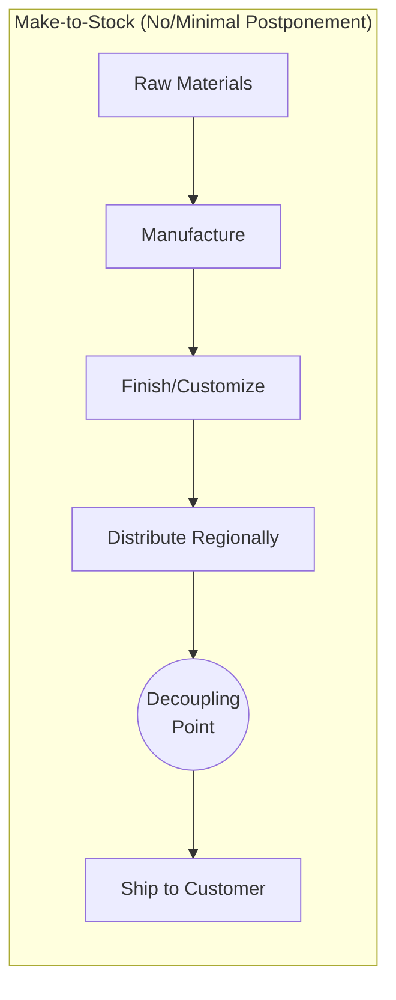
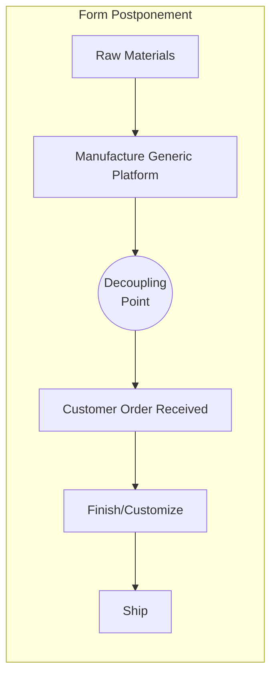
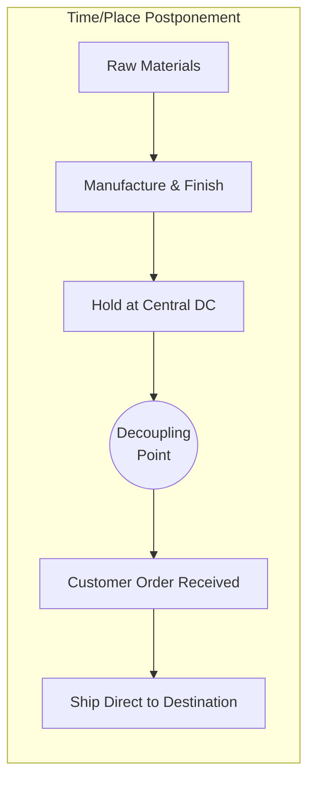

## Form, Time, and Place Postponement Strategies

### Definition

Postponement is a supply chain design strategy that delays specific activities — final manufacturing, customization, packaging, or physical movement of goods — until actual demand information (a confirmed customer order, point-of-sale data, or firm forecast) is available, rather than committing product to a final form or location based on speculative forecasts alone. The objective is to reduce forecast risk exposure by holding inventory in a generic, undifferentiated state for as long as economically feasible, converting speculative "push" inventory into demand-driven "pull" fulfillment at the latest possible point — commonly called the **decoupling point** or **order penetration point (OPP)**.

### The Three Core Postponement Types

**Form Postponement**

Delays the final manufacturing, assembly, configuration, or customization of a product until firm demand is known, keeping inventory in a generic or modular state upstream of the decoupling point.

- Also referred to as **manufacturing postponement** or **assembly postponement**
- Enables mass customization: a common platform or modular components are finished into SKU-specific variants only after order receipt
- Requires modular product architecture designed explicitly to support late differentiation (a prerequisite often called **Design for Postponement** or **Design for Localization**)

**Time Postponement**

Delays the physical movement/shipment of goods toward the final destination until an order is confirmed, keeping inventory centralized (rather than pre-positioned regionally) until actual demand triggers distribution.

- Reduces the number of stocking locations holding speculative inventory
- Trades faster response time (regional inventory) for lower total inventory and reduced obsolescence/markdown risk
- Often paired with premium/expedited transportation to compensate for the compressed delivery window once demand is known

**Place Postponement**

Delays the geographic positioning of inventory, holding stock at a centralized location (e.g., a single central warehouse or the manufacturing site) rather than pre-distributing to regional distribution centers, and only moves goods once an order specifies a delivery destination.

- Closely related to, and sometimes used interchangeably with, time postponement in practitioner literature — the distinction is that place postponement emphasizes *where* inventory sits, time postponement emphasizes *when* it moves. [Inference: the literature is not fully consistent on this distinction; some frameworks (e.g., Bucklin, Pagh & Cooper) treat them as a single combined "logistics postponement" category against "manufacturing/form postponement," while others separate all three]
- Reduces the risk of stocking the wrong product at the wrong regional location

### Pagh & Cooper's Postponement-Speculation Matrix

A widely referenced framework classifying supply chain strategy along two independent axes: manufacturing (form) postponement/speculation and logistics (time/place) postponement/speculation.

|  | Logistics Speculation (pre-position inventory) | Logistics Postponement (centralize, ship on order) |
| --- | --- | --- |
| **Manufacturing Speculation** (make-to-forecast, finish early) | Full Speculation: Traditional make-to-stock, decentralized DCs | Manufacturing Speculation, Logistics Postponement: Centralized warehousing of finished goods |
| **Manufacturing Postponement** (finish late, on order) | Form Postponement, Logistics Speculation: Generic components pre-positioned regionally, finished locally | Full Postponement: Centralized generic inventory, finished and shipped only on order |

### The Decoupling Point / Order Penetration Point

The decoupling point is the boundary in the supply chain upstream of which activity is forecast-driven (speculative, push) and downstream of which activity is order-driven (pull). Postponement strategies work by pushing this boundary as far upstream as the business model and product architecture allow.

$$\text{Total Risk Exposure} \propto \text{Inventory Value Committed Upstream of Decoupling Point} \times \text{Forecast Error}$$

Moving the decoupling point upstream (later differentiation) reduces the volume of forecast-dependent finished-goods inventory, but typically increases order-to-delivery lead time for the customer, since more processing occurs after order receipt. This is the central trade-off governing postponement strategy design.

### Illustration: Decoupling Point Positioning Across Strategies

### Enabling Mechanisms and Prerequisites

**For Form Postponement:**

- Modular, platform-based product architecture with common subassemblies across variants
- Standardized interfaces between modules to allow late-stage combination
- Localized or distributed final-assembly/configuration capability (e.g., regional finishing centers, retail-based customization, or 3PL value-added services)

**For Time/Place Postponement:**

- Reliable, fast information flow (real-time order visibility) to trigger movement without excessive delay
- Responsive logistics capability (expedited freight, cross-docking) to compensate for compressed lead time
- Centralized inventory visibility/control systems to manage a single consolidated stock pool

### Trade-Off Analysis

| Factor | Favors More Postponement | Favors Less Postponement (Speculation) |
| --- | --- | --- |
| Forecast accuracy at SKU level | Low (many variants, high demand uncertainty per SKU) | High (stable, predictable demand) |
| Product variety/customization | High variant count from common platform | Few variants, largely undifferentiated |
| Customer lead-time tolerance | High (willing to wait) | Low (expects immediate availability) |
| Economies of scale in centralized production | Significant | Minimal |
| Transportation cost sensitivity | Lower (can absorb premium shipping post-order) | Higher (needs low-cost bulk pre-positioning) |
| Product obsolescence/perishability risk | High (reduces speculative exposure) | Low |

### **Example**

A computer manufacturer maintains common motherboards, generic chassis, and modular components in centralized inventory (form postponement) rather than pre-building fully configured PCs to forecast. Final configuration — CPU selection, RAM, storage, and regional power adapter/localization — occurs only after a customer places a specific order, combining form postponement (late assembly) with place postponement (the finishing and shipment occur from a facility positioned to reach the customer directly, rather than distributing generic units to regional warehouses in advance). This allows the manufacturer to support thousands of configuration permutations from a small set of common components while avoiding the forecast risk of guessing which exact configuration each region will demand.

### **Key Points**

- Postponement strategies do not eliminate forecast risk — they relocate it from finished-goods inventory to component/raw-material inventory, which is typically more generic and therefore easier to forecast accurately (aggregation reduces relative demand variance, per the statistical pooling principle).
- Form, time, and place postponement are frequently combined rather than applied in isolation; real-world implementations often blend all three along different dimensions of the product/logistics chain.
- The central trade-off is reduced inventory/forecast risk versus increased order-to-delivery lead time — postponement is not universally beneficial and is unsuitable for products where customers expect immediate availability.
- Successful postponement requires product architecture (modularity) and logistics capability (responsiveness) to be designed jointly; retrofitting postponement onto a non-modular product line is often impractical. [Inference: this practical constraint is widely discussed in supply chain design literature, though the specific feasibility depends on the product category in question]

### **Related Topics**

- Modular Product Architecture and Design for Postponement
- Decoupling Point Positioning and Order Penetration Point Analysis
- Mass Customization Strategy and Configure-to-Order Systems
- Risk Pooling and Statistical Aggregation of Demand
- Make-to-Order vs. Make-to-Stock vs. Assemble-to-Order Strategies
- Vendor-Managed Inventory (VMI) as a Complementary Strategy