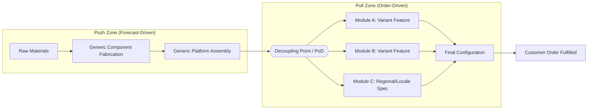

## Late-Stage Differentiation and Modular Design

### Overview

Late-stage differentiation (also called delayed differentiation) is a postponement strategy where a product remains generic and undifferentiated through the majority of its manufacturing and supply chain process, with product-specific features, configurations, or customizations applied as close to the point of customer demand as possible. Modular design is the architectural enabler of this strategy: it decomposes a product into standardized, interchangeable modules whose combinations produce distinct final variants without requiring distinct production paths from the start.

Together these two concepts allow firms to pool demand risk across a common platform (reducing forecast error and inventory holding costs) while still delivering high customer-perceived variety.

### Core Concepts

**Point of Differentiation (PoD)**

The specific node in the supply chain where a generic product becomes an identifiable end variant. Moving the PoD downstream (closer to the customer) is the central lever of postponement strategy. Common PoD locations, roughly in downstream order:

- Raw material stage
- Component fabrication
- Sub-assembly
- Final assembly
- Packaging/labeling
- Distribution center (kitting)
- Point of sale
- Post-sale (customer-executed configuration)

**Decoupling Point**

The point in the value chain separating forecast-driven (push) operations from order-driven (pull) operations. In a well-designed postponement architecture, the decoupling point and the PoD are placed at or near the same node, so that inventory held upstream of that point is generic (low risk, poolable) and only downstream inventory or activity is variant-specific (high risk, but held for a short time or not at all).

**Commonality**

The degree to which components or modules are shared across multiple end products. Commonality is what makes postponement possible: without shared modules, there is no generic stage to postpone from.

### Types of Postponement

**Form Postponement**

Delaying the point at which a product acquires its final physical form. Example: manufacturing a generic paint base and adding pigment at the retail counter.

**Time Postponement**

Delaying production or shipment timing until actual demand is known, often paired with centralized inventory. Reduces the need to forecast at the SKU level far in advance.

**Place Postponement**

Delaying the geographic location of final processing, e.g., shipping generic sub-assemblies to regional hubs and finishing locally to meet regional specifications (voltage, language, regulatory labeling).

**Combination**

Most mature supply chains use a hybrid: generic manufacture (form) is held at a regional DC (place) and only triggered by confirmed orders (time).

### Modular Design Principles

**Function-to-Module Mapping**

Ideally each module maps to a single, well-defined function, with minimal cross-module coupling. This is the manufacturing/product analog of the software engineering principle of separation of concerns.

**Standardized Interfaces**

Modules connect through standardized mechanical, electrical, or data interfaces so that any compliant module can be substituted for another without redesigning adjacent modules. This is what allows late-stage combination without late-stage engineering.

**Platform Architecture**

A common base or "platform" carries the majority of shared components (chassis, core electronics, structural frame), onto which differentiating modules attach. Automotive platform sharing (e.g., a shared vehicle underbody supporting multiple body styles) is the canonical example.

**Degree of Modularity**

Not binary — typically categorized as:

- *Component-swapping modularity*: different modules can be swapped into the same basic platform
- *Component-sharing modularity*: the same module is shared across different platforms
- *Cut-to-fit modularity*: one dimension is scaled or trimmed to customer spec (e.g., cutting fabric or cable lengths to order)
- *Mix modularity*: modules are combined/blended such that individual modules are no longer separately identifiable in the output (e.g., paint mixing, chemical blending)
- *Bus modularity*: modules attach to a common structural "bus" or backbone (e.g., PC expansion slots, modular furniture rails)
- *Sectional modularity*: any module can connect to any other module via a shared standard interface, with no fixed base component (e.g., Lego, sectional sofas)

### Architectural Pattern

The diagram illustrates the structural separation: everything left of the decoupling point is built to forecast against pooled, aggregate demand; everything right of it is built or configured only once a specific order is confirmed, using standardized modules.

### Worked Example: Electronics Manufacturer

Consider a laptop manufacturer serving multiple regional markets with varying power plug standards, keyboard layouts, and language preinstalls.

**Without postponement (traditional push)**:

- Forecast demand separately for US-English, UK-English, German, and Japanese SKUs
- Manufacture and hold finished-goods inventory for each SKU independently
- Forecast error compounds at the SKU level; excess inventory in slow-moving regions, stockouts in fast-moving ones

**With modular postponement**:

- Manufacture a generic laptop platform (motherboard, chassis, display, generic firmware) against an *aggregate* global forecast
- Hold this generic platform as a single pooled inventory pool (statistically, aggregate demand forecasts have lower relative variance than the sum of individually forecast SKU-level variances — a direct consequence of the square-root-of-n pooling effect)
- Postpone keyboard module attachment, power adapter selection, and OS/language image flashing to the regional distribution center, triggered by confirmed regional orders

$$\sigma_{\text{pooled}} = \sqrt{\sum_{i=1}^{n} \sigma_i^2 + 2\sum_{i<j}\rho_{ij}\sigma_i\sigma_j}$$

Where $\sigma_i$ is the demand standard deviation of variant $i$ and $\rho_{ij}$ is the correlation between variant demands. When variant demands are imperfectly correlated ($\rho_{ij} < 1$), pooling strictly reduces total safety stock requirements relative to holding safety stock for each variant separately. [Inference: the magnitude of benefit is scenario-dependent and requires actual demand correlation data to quantify for a specific product line.]

### Enabling Conditions

Late-stage differentiation and modularity are not universally applicable. They tend to work well when:

- **Demand for variants is uncertain but the generic platform's aggregate demand is more stable**
- **Differentiation cost/time at the late stage is low relative to the cost of holding variant-specific inventory** — if late-stage customization is itself slow or expensive, postponement can create a bottleneck rather than remove one
- **Product architecture technically supports modular decomposition** — highly integral (non-decomposable) product architectures resist modularization
- **Customers tolerate or expect some lead time** for the final differentiation step (build-to-order, configure-to-order)
- **Standardized interfaces exist or can be engineered** between modules without unacceptable performance penalties (mechanical, electrical, thermal, tolerance stack-up)

### Trade-offs and Limitations

- **Performance penalty of modularity**: standardized interfaces often impose weight, cost, or performance compromises versus a fully integral design optimized end-to-end (a classic finding in product architecture literature, e.g., Ulrich's work on product architecture).
- **Increased interface complexity**: more modules means more interface specifications to manage, test, and version.
- **Late-stage capacity constraints**: shifting differentiation downstream (e.g., to a DC or retail point) requires that location to have adequate labor, equipment, and space to perform the customization step, which is often a smaller-scale operation than a factory.
- **Loss of scale economies at the module level**: if differentiation work is fragmented across many small local sites instead of consolidated at a factory, the per-unit differentiation cost may rise even as inventory risk falls.
- **Not effective against all uncertainty types**: postponement addresses *demand-mix* uncertainty well; it does less to address *aggregate* volume uncertainty or supply-side (raw material) uncertainty, which require separate strategies (e.g., strategic buffer stock, dual sourcing).

### Relationship to Broader Frameworks

- **Mass Customization**: late-stage differentiation is the primary supply chain mechanism by which mass customization is operationally achieved at near-mass-production cost.
- **Design for Postponement (DFP)**: a design methodology that treats postponement feasibility as a first-class product design criterion, alongside cost and manufacturability, often evaluated during early product architecture decisions rather than retrofitted later.
- **Lean/Agile Hybrid ("Leagile") Supply Chains**: the decoupling point in leagile strategy literature is frequently synonymous with the PoD discussed here — lean (efficient, forecast-driven) practices apply upstream, agile (responsive) practices apply downstream.

### Related Topics

- Decoupling Point Positioning and the Push-Pull Boundary
- Design for Postponement (DFP) Methodologies
- Product Platform Strategy and Commonality Indices
- Configure-to-Order vs. Build-to-Order Fulfillment Models
- Demand Pooling and the Square-Root-of-N Aggregation Effect
- Vendor-Managed Inventory in Modular Supply Networks
- Bill-of-Materials (BOM) Structuring for Modular Product Lines