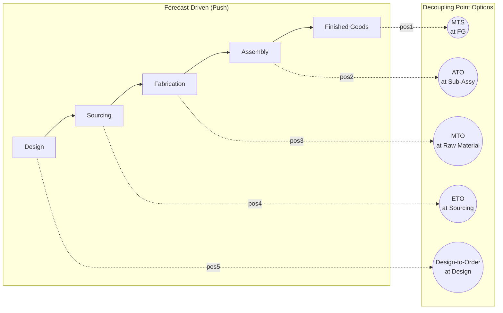

## Decoupling Point Placement for Customization

### Overview

The decoupling point (also called the order penetration point, OPP) is the location in a supply chain where the operating logic shifts from forecast-driven push (upstream) to customer-order-driven pull (downstream). Placement of this point is a strategic design decision that determines how much of the supply chain is exposed to demand uncertainty versus how much operates against smoothed, aggregate forecasts. For customization-oriented supply chains specifically, decoupling point placement is the single most consequential architectural choice: it fixes the boundary between what is made generic and pooled, and what is made-to-order and variant-specific.

### Core Definitions

**Order Penetration Point (OPP)**

The point up to which customer orders "penetrate" into the production/logistics process. Upstream of the OPP, work proceeds on forecast; downstream of it, work proceeds only once a specific, confirmed order exists.

**Customer Order Decoupling Point (CODP)**

Used interchangeably with OPP in most literature; some authors distinguish CODP as referring specifically to the material/inventory buffer position, while OPP refers to the informational trigger point. In practice the two coincide in almost all architectures.

**Push Zone / Speculative Zone**

The portion of the chain upstream of the decoupling point, operated to minimize unit cost and maximize efficiency, buffered by forecast-driven inventory.

**Pull Zone / Reactive Zone**

The portion downstream of the decoupling point, operated to minimize response time and maximize responsiveness/fit-to-order, buffered by time (lead time) rather than inventory.

### The Five Canonical Positions

Supply chain literature (following Hoekstra & Romme's original framework, later extended by others) typically identifies five reference positions for the decoupling point, ordered from most upstream to most downstream:

**1. Make/Engineer-to-Stock (MTS/ETS) — Decoupling point at finished goods**

No customer-order penetration into production at all. All work — including final differentiation — is forecast-driven. Products sit as finished-goods inventory awaiting sale. Fastest fulfillment; highest inventory risk and lowest variety-cost efficiency.

**2. Assemble-to-Order (ATO) — Decoupling point at sub-assembly/component stock**

Components and modules are manufactured to forecast and held as generic inventory; final assembly/configuration is triggered by the customer order. This is the classic postponement position for modular/customizable products.

**3. Make-to-Order (MTO) — Decoupling point at raw material stock**

Raw materials and possibly generic components are stocked, but fabrication itself does not begin until an order is placed. Common where product variety is too high or product lifetime too short to justify component-level stocking.

**4. Purchase/Engineer-to-Order (ETO) — Decoupling point at the supplier/raw material source**

Even raw material procurement is triggered by the order; nothing is held in anticipation. Typical of highly customized, low-volume, engineered products (capital equipment, custom construction).

**5. Design/Engineer-to-Order — Decoupling point pushed back into design**

The product itself is not fully specified until the order; engineering and design work occurs per order. The most extreme rightward (upstream) placement, common in bespoke engineering projects.

Note that moving the decoupling point from position 1 toward position 5 moves the boundary progressively upstream (earlier in the process), which lengthens customer lead time but shrinks the forecast-exposed inventory footprint.

### Placement Trade-off Framework

**Inventory Risk vs. Lead Time**

As the decoupling point moves upstream (toward ETO/design-to-order), speculative inventory risk falls (less is built without a confirmed order) but customer-facing lead time rises (more work happens only after order receipt). As it moves downstream (toward MTS), lead time falls but inventory risk rises. This is the central trade-off curve that placement decisions must navigate.

$$L_{\text{customer}} = L_{\text{upstream-to-DP}}^{\text{forecast-absorbed}} + L_{\text{DP-to-customer}}^{\text{order-exposed}}$$

Only the second term, $L_{\text{DP-to-customer}}$, is visible to the customer as wait time; the first term is hidden because it occurs before the order exists. Placement decisions effectively trade the size of this hidden term against the size of the visible term.

**Customer Tolerance Time (CTT) Constraint**

A hard boundary condition: the pull-zone lead time (decoupling point to delivery) must not exceed the customer's willingness to wait, or the position is commercially infeasible regardless of its efficiency benefits.

$$L_{\text{DP-to-customer}} \leq \text{CTT}$$

If this constraint cannot be satisfied at a given decoupling point position, the point must be moved downstream (closer to finished goods) even if that increases inventory risk — commercial feasibility dominates efficiency optimization.

### Determinants of Optimal Placement

**Demand Predictability**

Higher demand volatility and lower forecast accuracy for finished variants push the decoupling point upstream (more pooling, less speculative finished-variant inventory).

**Product Variety / Combinatorial Explosion**

When the number of theoretically possible end-variants (a function of module combinations) is very large relative to expected order volume per variant, forecasting at the variant level becomes statistically unreliable, favoring an upstream decoupling point.

**Value-Added Profile Along the Process**

If most cost/value is added early in the process (e.g., raw material cost dominates) and differentiation is a comparatively minor final step, keeping the decoupling point downstream (near finished goods, low residual differentiation cost) is often efficient. If value is added roughly evenly or increases sharply near the end, an upstream decoupling point avoids "trapping" high value in speculative, order-uncertain inventory.

**Process Divergence Point**

The decoupling point is generally most effective when placed at or immediately before the point in the process where the bill-of-materials structure diverges (i.e., where a single generic input can become multiple distinct outputs) — this is the natural "branch point" for postponement, since inventory held before it is truly generic across all downstream variants.

**Customer Tolerance Time relative to Total Process Lead Time**

$$\text{Feasible upstream shift} \propto (\text{CTT} - L_{\text{DP-to-customer, current}})$$

Industries with long customer tolerance windows (capital equipment, B2B procurement) can sustain far more upstream decoupling points than industries with near-zero tolerance (retail commodity goods, fast fashion).

### Worked Example: Furniture Manufacturer

A furniture company sells a modular shelving system with 3 finish colors × 4 width options × 2 depth options = 24 combinations.

**Position at MTS (finished goods)**: All 24 SKUs held as finished inventory. High risk of stranded stock in low-demand combinations; zero customer wait.

**Position at ATO (sub-assembly)**: Generic unfinished shelving units and generic hardware kits held in stock; final finish (stain/paint) and width trimming happen after order. Customer waits 2–3 days (finishing + trim + pack) but 24 SKUs collapse to a handful of generic stocked components.

**Position at MTO (raw material)**: Lumber stocked as raw board only; cutting to width, depth, and finish all happen post-order. Near-zero finished-goods risk; customer wait extends to 1–2 weeks.

**Decision logic**: If market research shows customers tolerate a 3–5 day wait for furniture (common in this category) and demand-mix forecasting at the 24-SKU level has historically shown high error, the ATO position is favored: it satisfies the CTT constraint while capturing most of the pooling benefit, whereas MTS captures none of the pooling benefit and MTO likely violates customer wait tolerance for a large share of the customer base. [Inference: the specific optimal position depends on the firm's actual CTT survey data and historical forecast error by SKU, which would need to be measured for a real decision.]

### Interaction with Modular Design

Decoupling point placement and modular product architecture are mutually dependent:

- A downstream-feasible decoupling point (e.g., ATO) is only achievable if the product architecture actually supports clean modular decomposition at that process stage — see *Late-Stage Differentiation and Modular Design*.
- Conversely, a highly modular architecture with weak or poorly standardized module interfaces may still force the decoupling point further upstream than desired, if late-stage assembly of those modules is unreliable, slow, or defect-prone.
- The **process divergence point** (where the BOM structure splits into variants) and the **module interface point** (where standardized module boundaries exist) should ideally coincide; when they do not, the decoupling point is typically constrained to sit at whichever is more upstream of the two.

### Common Pitfalls

- **Placing the decoupling point based on organizational convenience** (e.g., at a departmental or plant boundary) rather than on actual demand/variety/lead-time analysis.
- **Ignoring capacity flexibility downstream of the decoupling point** — an ATO or MTO position requires the downstream stage to absorb variable, order-triggered demand without becoming a bottleneck; if downstream capacity is fixed or inflexible, the theoretical position may not be operationally achievable.
- **Static placement in a dynamic demand environment** — mature products with stable, well-forecast demand may warrant a more downstream decoupling point than new or seasonal products; a single fixed policy across a full product portfolio often under- or over-shoots for individual items.
- **Failing to re-derive CTT empirically** — assuming customer tolerance rather than measuring it can lead to a decoupling point placed too far upstream (losing sales to competitors with faster fulfillment) or too far downstream (carrying unnecessary speculative risk).

### Related Topics

- Late-Stage Differentiation and Modular Design
- Leagile Supply Chain Strategy (Lean Upstream, Agile Downstream)
- Bill-of-Materials Divergence and Convergence Points
- Customer Tolerance Time (CTT) Measurement Methods
- Demand Forecasting Error by SKU Aggregation Level
- Capacity Flexibility Design for Order-Triggered Operations
- Hoekstra–Romme Decoupling Point Framework (Historical Origin)