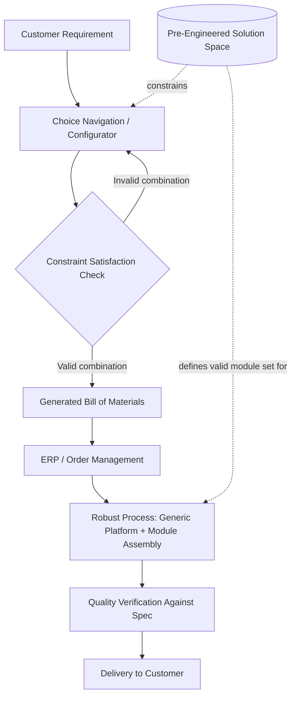

## Mass Customization Architecture

### Overview

Mass customization is a strategy that combines the low unit cost and process efficiency of mass production with the individualized fit of custom-made products. Its "architecture" refers to the coordinated set of product design principles, process choices, and information systems that together make this combination achievable at scale. Unlike pure postponement or pure modularity in isolation, mass customization architecture is the integrated system that links customer-facing configuration to backend production, so that customer choice is translated into a producible, cost-controlled specification without manual per-order engineering.

### Foundational Definition

Mass customization was formalized in the operations management literature (notably by Pine, 1993, and extended by Gilmore & Pine's later strategy typology) as producing individually customized products/services at a cost and speed comparable to standardized mass production. The architecture that enables this rests on three interlocking pillars:

1. **Solution Space Definition** — the constrained, pre-engineered set of options customers may choose from
2. **Robust Process Design** — production/service processes capable of executing any valid combination within the solution space without reconfiguration penalty
3. **Choice Navigation** — the mechanism (typically a configurator) that helps customers articulate their needs and maps them onto valid solution-space combinations

### The Four Approaches to Mass Customization (Gilmore & Pine Typology)

**Collaborative Customization**

A dialogue with individual customers to identify precise needs, then producing a unique output tailored to those needs. Used when customer needs cannot be pre-articulated into a fixed menu (e.g., custom-fit prosthetics, bespoke enterprise software).

**Adaptive Customization**

A single standard product is designed so that end users can alter or reconfigure it themselves post-purchase, without the manufacturer being involved in each act of customization (e.g., adjustable furniture, software with user-configurable settings).

**Cosmetic Customization**

The core product is standardized, but presentation is customized per customer or per channel — packaging, labeling, or superficial appearance vary while the underlying product does not.

**Transparent Customization**

Individual customer needs are inferred (often from behavioral or usage data) and products/services are customized without explicitly involving the customer in a visible configuration process (e.g., algorithmically personalized content or recommendations delivered as if standard).

### Architectural Components

**Solution Space Design**

The engineering task of defining which combinations of features are offered, and critically, which are excluded. A well-designed solution space:

- Maps to real, validated customer needs (avoiding option proliferation that customers don't value)
- Is bounded by what the robust process can actually produce without cost or quality penalty
- Uses modular decomposition (see *Late-Stage Differentiation and Modular Design*) so that solution-space combinatorics arise from module combination rather than from unique end-to-end engineering per variant

**Robust Process Design**

Production and fulfillment processes engineered so that variety-inducing steps are isolated and do not propagate variability into the rest of the system. Key techniques:

- Standardized interfaces between modules (mechanical, electrical, digital) so that swapping modules does not require re-validating the whole assembly
- Process sequencing that defers variety-introducing operations to the latest feasible point (linking directly to decoupling point placement)
- Statistical process control tuned to the invariant portions of the process, since those run at effectively mass-production volume and consistency even though the end product varies

**Choice Navigation / Configuration System**

The interface — human or digital — through which customer requirements are captured and translated into a valid, producible bill of materials. Technical requirements for a configurator:

- **Constraint satisfaction**: the system must only allow combinations that are physically/technically valid (e.g., a given chassis module may only accept a subset of compatible drive-train modules)
- **Real-time feasibility feedback**: infeasible combinations should be rejected or auto-corrected before order confirmation, not discovered on the shop floor
- **Configuration-to-BOM translation**: validated customer selections must deterministically generate a structured bill of materials or work order that downstream systems (ERP, MES) can execute without human re-interpretation

### Configuration Complexity Management

**Combinatorial Explosion**

If a product has $n$ independent binary options, the theoretical solution space size is $2^n$. Even moderate option counts generate solution spaces far exceeding what could ever be individually engineered, tested, or forecast at the SKU level — which is precisely why mass customization architecture relies on modular composition rather than per-variant engineering.

$$|\text{Solution Space}| = \prod_{i=1}^{n} k_i$$

where $k_i$ is the number of valid choices for option/module category $i$. Architecturally, the goal is to make production cost and lead time largely *insensitive* to this product, rather than attempting to plan for each resulting combination individually.

**Constraint Modeling**

Real solution spaces are rarely a full Cartesian product — most combinations of options include compatibility constraints (Module A requires or excludes certain values of Module B). These are typically encoded as:

- Explicit compatibility matrices/tables between module categories
- Rule-based constraint logic (if/then dependency rules) in configurator engines
- Constraint satisfaction problem (CSP) solvers for complex multi-way dependency products (common in industries like enterprise vehicles, industrial equipment, and complex electronics)

### Cost Structure Implications

Mass customization architecture aims to keep the cost curve close to mass-production economics despite variety:

$$C_{\text{unit}}(v) \approx C_{\text{platform}} + \sum_{m \in \text{selected modules}} C_m + C_{\text{config-overhead}}(v)$$

Where $C_{\text{platform}}$ benefits from mass-production scale economics (shared across all variants $v$), $C_m$ is the marginal cost of each selected module (ideally also produced at scale if modules are shared across many end configurations), and $C_{\text{config-overhead}}$ is the incremental cost of the configuration/assembly step itself — the term that architecture explicitly works to minimize, since it is the only cost component that scales with variety rather than volume.

A poorly designed architecture instead exhibits cost behavior closer to:

$$C_{\text{unit}}(v) \approx C_{\text{engineering}}(v) + C_{\text{setup}}(v) + C_{\text{production}}(v)$$

where most terms scale with the number of distinct variants rather than total volume — effectively reproducing custom-manufacturing economics under a mass-customization label. [Inference: the exact cost split between these regimes is highly implementation-specific and would require actual cost accounting data to quantify for a given firm.]

### Information System Requirements

**Configurator-to-Manufacturing Integration**

The configuration output must integrate cleanly with downstream systems: ERP (order and inventory management), MES (manufacturing execution, work instructions per module), and PLM (product lifecycle/engineering data for the modules and their compatibility rules). A common failure mode is a configurator that is only customer-facing (marketing/sales tool) with no structured, machine-readable link to production systems, forcing manual re-entry and re-interpretation of the order — reintroducing the very inefficiency mass customization is meant to eliminate.

**Master Data Management for Modules**

Because modules and their compatibility rules underpin the entire solution space, module master data (specifications, valid combinations, versioning) must be tightly governed. Uncontrolled proliferation of module variants ("variant creep") over time erodes the commonality benefits the architecture depends on.

**Configuration Versioning**

As modules are revised, discontinued, or added, historical configurations (for support, warranty, and repeat orders) must remain resolvable against the module version active at the time of original order — a data architecture concern distinct from, but related to, general product data versioning.

### Worked Example: PC/Server Configurator (Illustrative Pattern)

A common real-world mass customization pattern, generalized from computer hardware configurators (e.g., the build-to-order model long used by Dell and similar vendors):

1. Customer selects from a bounded solution space: chassis size, CPU tier, RAM capacity, storage type/capacity, network interface options
2. Configurator applies constraint rules (e.g., certain chassis sizes cap maximum RAM slots; certain CPU tiers require a specific motherboard chipset module)
3. Valid configuration is translated into a structured build order referencing standardized, pre-stocked modules (motherboards, RAM sticks, drives) held at the assemble-to-order decoupling point
4. Final assembly occurs only after order confirmation, using generic modules that were manufactured to aggregate (pooled) forecast rather than per-SKU forecast
5. The customer receives a functionally custom machine, while the manufacturer never held finished-goods inventory for that specific combination

This pattern directly demonstrates the integration of modular design, decoupling point placement, and constraint-based choice navigation into a single working architecture.

### Common Pitfalls

- **Over-broad solution space**: offering more options than customers actually value, inflating configuration complexity and constraint-management burden without a corresponding increase in perceived value (a documented failure pattern sometimes called "mass confusion").
- **Under-engineered robust process**: treating the manufacturing/assembly process as an afterthought to the configurator, leading to hidden costs or defects concentrated in less-common combinations that were never adequately validated.
- **Configurator disconnected from real production constraints**: allowing the customer to select combinations that are technically valid on paper but infeasible or costly to actually produce, due to the constraint model lagging behind real module compatibility.
- **Ignoring the choice-navigation burden on the customer**: excessive option counts can create decision fatigue, reducing conversion even when the backend architecture is sound — configuration UX and backend architecture are coupled concerns, not independent ones.

### Related Topics

- Late-Stage Differentiation and Modular Design
- Decoupling Point Placement for Customization
- Configure-to-Order vs. Build-to-Order Fulfillment Models
- Constraint Satisfaction Problem (CSP) Modeling for Product Configurators
- Product Data Management (PDM) and Variant Master Data Governance
- Gilmore & Pine Customization Strategy Typology (Historical Origin)
- Configuration Lifecycle Management and Versioning