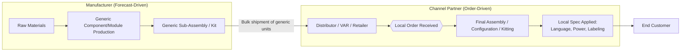

## Channel Assembly and Vendor Postponement Models

### Overview

Channel assembly and vendor postponement models extend postponement strategy beyond the manufacturer's own four walls, shifting the final differentiation step to intermediaries within the distribution channel — distributors, resellers, third-party logistics providers (3PLs), or retail partners — rather than performing it at the factory or at the manufacturer's own distribution center. This is a further downstream extension of the decoupling point concept: instead of asking "how far downstream in *our* process can we push differentiation," channel assembly asks "can differentiation be pushed past our organizational boundary entirely, into the channel itself."

### Core Definitions

**Channel Assembly**

A form postponement strategy in which final assembly, configuration, kitting, or customization work is performed by a channel partner (distributor, VAR/value-added reseller, or retailer) rather than by the original manufacturer, using generic components or sub-assemblies shipped from the manufacturer.

**Vendor Postponement**

A broader term encompassing any arrangement where a vendor (manufacturer or upstream supplier) deliberately delays committing product to a final form/configuration, and delegates or coordinates that final commitment with a downstream party — which may be a channel partner (as in channel assembly) or the manufacturer's own downstream facility.

**Merge-in-Transit**

A related model in which components from multiple sources (manufacturer, third-party suppliers) are shipped independently and consolidated ("merged") at a logistics hub or directly at the customer's delivery point, rather than being physically brought together at a manufacturing facility first.

### Why Push Differentiation Into the Channel

**Proximity to Final Demand Signal**

Channel partners are structurally closer to the actual point of sale and therefore have access to more current, granular, and localized demand information than the manufacturer. Performing final differentiation there means the differentiation decision is made on the freshest available demand signal.

**Reduced Manufacturer-Side Finished Goods Variety**

The manufacturer ships a smaller number of generic SKUs (platforms/components) rather than the full combinatorial set of finished variants, capturing the same demand-pooling benefit described in postponement theory, but now realized at an even larger physical/geographic scale — the pooling occurs across the *entire distribution network* rather than within a single manufacturer-controlled DC.

**Local Market Adaptation**

Regional or country-specific requirements (electrical standards, language, regulatory labeling, unit systems) are often more efficiently and knowledgeably handled by a local channel partner than centrally by the manufacturer, especially across highly fragmented international markets.

**Reduced Manufacturer Capital and Facility Burden**

Final assembly labor, space, and equipment requirements shift to the channel partner's balance sheet and operations, which can reduce the manufacturer's fixed asset investment — though this is a trade-off, not a free efficiency gain (see Governance Challenges below).

### Architectural Pattern

The decoupling point in this model sits at the manufacturer–channel boundary itself: everything upstream (including the manufacturer's own production) is speculative/forecast-driven at the generic-unit level; everything downstream of the handoff is order-driven and executed by an entity outside the manufacturer's direct operational control.

### Common Implementation Models

**Distributor-Performed Final Configuration**

Widely used in electronics and IT hardware distribution: a distributor receives generic units (e.g., unconfigured hardware, generic software images) and performs final configuration, licensing activation, or bundling per the reseller's or end customer's order, rather than the manufacturer pre-configuring every possible combination at the factory.

**Retail-Performed Customization**

The manufacturer ships a generic base product to retail; final differentiation (mixing, cutting, fitting, or simple assembly) happens at or very near the point of sale. The paint-tinting example (generic base delivered to store, pigment added at point of sale) is the textbook case, and generalizes to any category where the retail environment can perform a low-skill, low-equipment final step.

**3PL-Performed Kitting and Postponement**

A third-party logistics provider, operating a distribution center on the manufacturer's behalf (or as an independent postponement service provider), performs late-stage kitting, labeling, bundling, or light assembly as parcels move through the facility — decoupling the manufacturer's production entirely from the final packaged/configured form. This is common where the 3PL already has warehouse-level proximity to final markets that the manufacturer's own factory lacks.

**Merge-in-Transit Fulfillment**

Rather than any single node performing final assembly, multiple independently-sourced components are routed to arrive simultaneously at a common consolidation point (often a carrier hub or the customer's own delivery address), where they are combined into a single shipment or a single physically assembled unit. This model minimizes inventory holding at every node by never allowing the components to "rest" together until the last possible moment.

### Governance and Coordination Challenges

Extending postponement into the channel introduces coordination problems not present in single-firm postponement, because the manufacturer no longer has direct operational control over the differentiation step:

**Quality Control Transfer**

Final product quality now depends partly on channel-partner execution, which the manufacturer must specify, audit, and enforce through contracts, training, and quality standards rather than through direct process control. Defects introduced at the channel-assembly stage can be harder to trace back and correct systematically.

**Information Sharing Requirements**

The channel partner needs accurate, real-time information about which generic components are compatible with which final configurations, and the manufacturer needs visibility into what the channel partner is actually building, to maintain data integrity for warranty, support, and demand-planning purposes. This typically requires EDI (Electronic Data Interchange) or API-based integration between manufacturer and channel partner systems, and is a materially harder integration problem than internal ERP/MES integration within a single firm.

**Incentive Alignment**

The channel partner bears the labor and equipment cost of final assembly; the manufacturer captures the benefit of reduced finished-goods variety and inventory risk. Contractual terms (component pricing, service fees, cooperative advertising/support funds) must be structured so this trade is worthwhile for the channel partner, or the arrangement will not be sustained.

**Compatibility and Version Control at Arm's Length**

Since module/component master data now needs to be governed across an organizational boundary rather than within a single PLM/ERP environment, version mismatches (channel partner using outdated compatibility rules or configuring against a discontinued module) are a more persistent risk than in internally-controlled postponement.

**Brand and Consistency Risk**

When multiple independent channel partners each perform final differentiation, final-product consistency across the market may vary by partner competence, potentially creating inconsistent customer experience for what is nominally the same product line — a risk that does not exist when final assembly is centralized.

### Comparison: Internal Postponement vs. Channel/Vendor Postponement

| Dimension | Internal Postponement (own DC/factory) | Channel Assembly / Vendor Postponement |
| --- | --- | --- |
| Process control | Direct, full control | Indirect, contract/audit-based |
| Demand signal proximity | Regional DC level | Point-of-sale / local market level |
| Capital investment | Borne by manufacturer | Substantially shifted to channel partner |
| Integration complexity | Internal systems (ERP/MES) | Cross-organizational (EDI/API, data governance) |
| Quality consistency | Centrally managed | Partner-dependent, requires active governance |
| Geographic reach of pooling | Limited to manufacturer's DC network | Extends across the full distribution network |

### Worked Example: IT Hardware Distribution

A networking equipment manufacturer produces generic hardware appliances with no pre-loaded software licensing tier and a neutral, unbranded chassis label.

1. Generic appliances are manufactured against an aggregate global forecast and shipped in bulk to regional distributors
2. A distributor receives a confirmed reseller order specifying: software license tier, rack-mount vs. desktop bracket kit, and country-specific power cord/regulatory label
3. The distributor applies the license activation (a data/firmware operation), attaches the correct bracket kit (a physical kitting operation), and affixes the correct regulatory label — all after the order is confirmed
4. The manufacturer never held finished-goods inventory for any specific license-tier/bracket/country combination; only the single generic appliance SKU is held upstream

This mirrors the assemble-to-order decoupling point pattern described in *Decoupling Point Placement for Customization*, but with the pull-zone activity relocated outside the manufacturer's own operations entirely.

### Common Pitfalls

- **Treating channel assembly as a pure cost-shifting exercise** without ensuring the channel partner has adequate capability, training, and incentive to execute the final step reliably — the manufacturer's brand risk does not disappear just because operational responsibility does.
- **Underinvesting in cross-organizational data integration**, leading to configuration errors, warranty/support traceability gaps, or channel partners building against stale compatibility data.
- **Insufficient contractual and audit mechanisms for quality**, especially where multiple channel partners with varying competence perform the same nominal differentiation step.
- **Failing to redesign the product/module architecture for channel-level assembly** — a module or interface that is easy to assemble on a factory line with specialized tooling may not be practical for a distributor or retail employee with generic tools and lower technical training; channel assembly feasibility is a design constraint, not just a logistics decision.

### Related Topics

- Late-Stage Differentiation and Modular Design
- Decoupling Point Placement for Customization
- Merge-in-Transit and Multi-Source Consolidation Logistics
- Third-Party Logistics (3PL) Value-Added Services and Kitting Operations
- EDI and API Integration Standards for Channel Partner Data Exchange
- Vendor-Managed Inventory (VMI) in Distribution Networks
- Contract Design for Channel Incentive Alignment