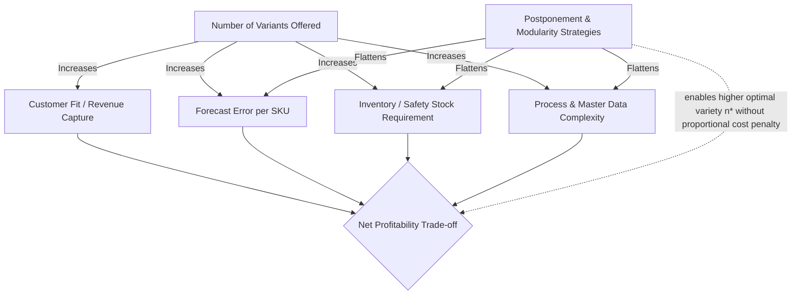

## Trade-offs Between Standardization and Customization

### Overview

Standardization and customization sit at opposite ends of a fundamental supply chain design spectrum. Standardization maximizes commonality, scale efficiency, and forecast reliability by minimizing variety; customization maximizes individual fit to customer needs by maximizing variety. Nearly every architectural decision covered elsewhere in this chapter — postponement type, decoupling point placement, modular design, mass customization systems, and channel assembly — is, at its core, a mechanism for managing this trade-off rather than eliminating it. This item consolidates the trade-off itself as an explicit analytical framework.

### The Core Tension

**Standardization Benefits**

- Economies of scale in procurement, production, and quality control, since volume concentrates on fewer distinct items
- Lower forecast error at the aggregate level (fewer, larger-volume SKUs are statistically easier to forecast accurately than many small-volume SKUs)
- Simplified inventory management, lower total safety stock (via the pooling effect described in *Late-Stage Differentiation and Modular Design*)
- Reduced engineering, quality, and supply-base complexity (fewer part numbers, fewer supplier qualifications, fewer process variants to validate)
- Faster, more predictable lead times, since production processes are optimized for a narrow, repeatable task set

**Customization Benefits**

- Closer fit to heterogeneous customer needs, generally supporting higher willingness-to-pay and stronger customer loyalty
- Competitive differentiation in markets where competitors offer only standardized options
- Ability to serve niche or underserved segments that a one-size-fits-all product cannot satisfy
- Potential for premium pricing tied to perceived exclusivity or personal fit

**The Tension**

Every unit of additional variety offered to satisfy heterogeneous customer needs adds cost, complexity, and forecast uncertainty somewhere in the supply chain; every unit of additional standardization removes potential customer-perceived value somewhere in the market. Neither extreme is generally optimal — pure standardization risks losing customers to competitors offering better fit, while pure customization risks losing to competitors offering lower cost and faster delivery. The postponement and modularity strategies covered throughout this chapter exist specifically to shift this trade-off curve outward, rather than to eliminate the trade-off itself.

### Quantitative Framing: The Variety Cost Curve

A widely used stylized model treats total cost as a function of the number of variants offered, $n$:

$$C_{\text{total}}(n) = C_{\text{fixed}} + n \cdot c_{\text{variant}} + f(n)$$

Where $C_{\text{fixed}}$ is the cost independent of variety (base platform, core process), $c_{\text{variant}}$ is a roughly linear per-variant cost (tooling, master data, minimum stocking quantity), and $f(n)$ is a super-linear complexity cost term (coordination overhead, forecast error growth, quality variance, changeover/setup time) that increases faster than proportionally as $n$ grows, reflecting the empirically observed pattern that complexity costs accelerate once variety exceeds what existing processes and systems were designed to handle.

On the revenue side, a stylized relationship is:

$$R_{\text{total}}(n) = R_{\text{base}} + g(n)$$

where $g(n)$ is typically a concave, diminishing-returns function: each additional variant captures progressively less incremental demand or willingness-to-pay, since the market segments best served by the first few variants are typically the largest and most differentiated, with later variants serving progressively smaller or more marginal segments.

**Optimal Variety Point**

The profit-maximizing variety level $n^*$ occurs where marginal revenue from an additional variant equals its marginal cost:

$$\frac{dR}{dn}\bigg|_{n^*} = \frac{dC}{dn}\bigg|_{n^*}$$

[Inference: this is a stylized analytical framework used for conceptual reasoning about the trade-off; actual $f(n)$ and $g(n)$ functional forms are firm- and market-specific and would need empirical estimation for a real optimization.] The key strategic insight from this framework is not the specific optimum, but that postponement and modularity strategies work by *reshaping* $f(n)$ — flattening the complexity-cost curve so that a higher $n^*$ becomes economically viable without a proportional cost penalty.

### Structural Levers That Shift the Trade-off Curve

**Commonality and Platform Sharing**

Increasing the share of components common across variants directly reduces $c_{\text{variant}}$ and dampens the $f(n)$ complexity term, since shared components benefit from pooled forecasting and shared tooling/process investment regardless of how many end variants they support.

**Postponement (Decoupling Point Placement)**

Moving the decoupling point downstream reduces the number of *distinct finished-good SKUs* that must be forecast and stocked, converting variety-driven forecast error into pooled, generic-component forecast error — directly addressing the inventory and forecast-error terms in the cost curve without reducing the customer-facing variety on offer.

**Modular Architecture**

Converts the combinatorics of variety from "one engineering effort per end variant" to "one engineering effort per module, combined at assembly," which changes $f(n)$ from growing with the number of *end variants* to growing (much more slowly) with the number of *modules* — a materially more favorable complexity curve when the number of modules is small relative to the number of resulting combinations.

**Mass Customization Systems**

Configurators and constraint-based order-to-BOM translation reduce the coordination and error-rate cost that would otherwise accompany high variety, effectively lowering the per-additional-combination cost of the choice-navigation and order-translation steps.

### Segmentation-Based Resolution

Rather than treating standardization vs. customization as a single global choice, many firms resolve the trade-off by applying different positions to different parts of the same portfolio or process:

**Core-Standard, Edge-Custom**

The majority of a product's value/cost (the "core") is fully standardized and mass-produced; a smaller, cheaper-to-vary "edge" (finish, accessory, labeling, configuration) is where customization is concentrated. This is the structural pattern underlying most successful modular mass customization architectures.

**Customer/Segment-Based Differentiation**

High-value or strategically important customer segments may justify collaborative, fully custom engineering (accepting the cost penalty because willingness-to-pay or strategic value is high), while the broader market is served through a standardized or lightly-configurable product — effectively running two different points on the trade-off curve simultaneously for different segments.

**Category-Based Differentiation**

Within a firm's portfolio, categories with low demand predictability or highly heterogeneous customer needs may be architected for higher customization, while categories with stable, homogeneous demand remain standardized — recognizing that the optimal trade-off point is not uniform across an entire product portfolio.

### Risk Considerations Beyond Cost

**Variant Proliferation ("Variety Creep")**

Even when individual customization requests seem locally justified, their cumulative effect over time can push a firm well past its optimal variety point without any single decision appearing unreasonable in isolation — a well-documented organizational failure pattern requiring active portfolio governance (periodic SKU rationalization) rather than a one-time architectural fix.

**Forecast Accuracy Degradation**

As variety increases without corresponding architectural adaptation (postponement, modularity), forecast accuracy at the SKU level tends to degrade, since historical demand data per SKU becomes sparser and more volatile — this is a statistical consequence of variety growth, not merely an operational inconvenience, and it directly increases both stockout and obsolescence risk.

**Customer-Perceived Value Ceiling**

Beyond some point, additional customization options may fail to generate proportional additional willingness-to-pay, and can even reduce conversion due to choice overload — a behavioral economics finding relevant to where the practical optimum sits, independent of the pure supply-side cost curve.

**Standardization Rigidity Risk**

Excessive standardization can create strategic vulnerability if customer needs shift or a competitor introduces meaningfully differentiated offerings — the risk is not purely about cost efficiency but also about the firm's ability to respond to a changing competitive or demand landscape.

### Decision Heuristics

- If demand for individual variants is highly volatile but aggregate/platform-level demand is stable, favor moving toward the customization end of the spectrum **using postponement/modularity mechanisms** rather than pure end-to-end custom engineering, to capture fit benefits without abandoning pooling benefits.
- If the process value-added structure concentrates most cost early (raw material dominant) with cheap, low-risk final differentiation, standardization of the early stages combined with edge-level customization is typically favorable.
- If customer tolerance time is very short (near-zero wait tolerance), the practical customization ceiling is constrained regardless of theoretical cost-curve optimality — commercial feasibility (see *Decoupling Point Placement for Customization*) can dominate the pure cost/revenue trade-off calculation.
- If variant proliferation has occurred organically over time without corresponding architectural investment, a portfolio rationalization exercise (auditing which variants still meet the marginal-revenue-equals-marginal-cost condition) is typically warranted before further customization investment.

### Related Topics

- Late-Stage Differentiation and Modular Design
- Decoupling Point Placement for Customization
- Mass Customization Architecture
- Channel Assembly and Vendor Postponement Models
- SKU Rationalization and Variant Portfolio Governance
- Forecast Error Modeling Under High Product Variety
- Choice Overload and Customer Decision Fatigue in Configuration Systems