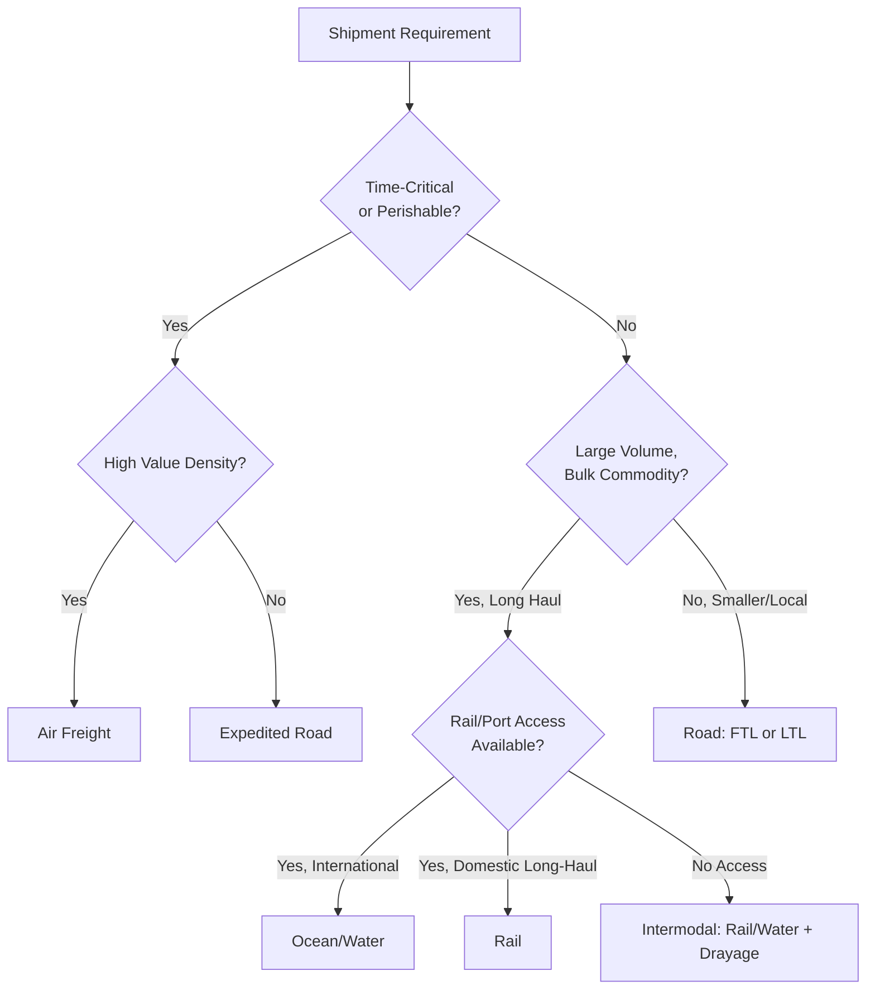

## Transportation Modes and Mode Selection Criteria

### Overview

Transportation mode selection is the decision of which physical means of moving freight — road, rail, water, air, pipeline, or intermodal combinations — best satisfies a given shipment's cost, speed, reliability, and capability requirements. Mode choice is one of the highest-leverage decisions in logistics network design because it simultaneously determines transit time, cost structure, capacity constraints, and the physical/handling characteristics a shipment must be compatible with. Mode selection interacts directly with inventory strategy: faster, more expensive modes reduce in-transit and safety inventory needs, while slower, cheaper modes require more inventory to buffer the longer, often more variable, lead time.

### The Five Primary Transportation Modes

**Road (Trucking)**

The dominant mode for domestic and short-to-medium-haul freight in most economies, due to unmatched door-to-door flexibility (no requirement for fixed terminal-to-terminal movement). Sub-categories include full truckload (FTL, one shipper's freight fills a trailer) and less-than-truckload (LTL, multiple shippers' freight consolidated in one trailer).

- *Strengths*: high accessibility (reaches locations rail/water cannot), moderate speed, flexible scheduling, relatively low capital barrier to entry (supports a fragmented, competitive carrier market)
- *Limitations*: higher cost per ton-mile than rail or water for long distances, subject to road congestion and regulatory hours-of-service driver limits, higher relative emissions per ton-mile than rail or water

**Rail**

Efficient for high-volume, long-haul movement of bulk or heavy freight where speed is less critical than cost per unit. Includes bulk unit trains (single-commodity, single-origin-destination trains) and intermodal rail (containerized freight moved on flatcars).

- *Strengths*: lowest cost per ton-mile among land modes for long distances, high volume/weight capacity per shipment, lower emissions per ton-mile than road
- *Limitations*: fixed infrastructure (origin/destination must have rail access or require drayage to/from rail), lower speed and schedule flexibility, higher variability in transit time due to network congestion and yard/switching operations

**Water (Ocean and Inland Waterway)**

The dominant mode for international trade by volume, and highly efficient for bulk and containerized freight where transit time is not time-critical. Includes deep-sea container shipping, bulk carriers (dry bulk, tankers), and inland barge transport.

- *Strengths*: lowest cost per ton-mile of any mode, by a wide margin, for long-distance bulk/container movement; extremely high capacity per vessel
- *Limitations*: slowest mode by a wide margin, fixed to port/waterway infrastructure requiring additional inland transportation (drayage) on both ends, subject to port congestion, weather, and (for ocean) geopolitical chokepoint risk

**Air**

The fastest mode, reserved for freight where transit time cost outweighs the substantial cost premium — high-value, time-sensitive, or perishable goods, and emergency/expedited shipments.

- *Strengths*: fastest transit time by far, high reliability of scheduled transit time (once in the air), global reach via air cargo networks
- *Limitations*: highest cost per ton-mile of any mode, restrictive weight/volume/hazmat limitations, capacity constrained by aircraft belly-cargo or dedicated freighter availability

**Pipeline**

Used almost exclusively for bulk liquid or gaseous commodities (petroleum products, natural gas, some chemical slurries) moving continuously between fixed points.

- *Strengths*: very low operating cost per unit once infrastructure exists, continuous flow capability, minimal handling/loss, largely weather-independent
- *Limitations*: extremely high fixed infrastructure investment, completely inflexible routing (fixed origin-destination pairs), limited to a narrow set of compatible commodities

### Comparative Mode Characteristics

| Mode | Relative Cost/Ton-Mile | Relative Speed | Flexibility | Typical Use Case |
| --- | --- | --- | --- | --- |
| Pipeline | Lowest | Slow (continuous flow) | Lowest (fixed route) | Bulk liquids/gas |
| Water | Very Low | Slowest | Low (port-to-port) | International bulk/container |
| Rail | Low | Moderate-Slow | Low-Moderate | Long-haul bulk/intermodal |
| Road | Moderate-High | Moderate-Fast | Highest | Door-to-door, short-medium haul |
| Air | Highest | Fastest | Moderate (airport-to-airport) | Time-critical, high-value |

This ordering of cost is broadly the inverse of the ordering of speed — the central trade-off that underlies nearly all mode selection decisions. [Unverified: exact relative cost/speed rankings vary by lane, commodity, fuel price environment, and carrier market conditions at any given time; the table reflects typical, directionally stable relative positioning rather than fixed universal values.]

### Mode Selection Criteria Framework

**Cost**

Total transportation cost, including line-haul rate, fuel surcharges, accessorial charges (detention, drayage, fuel), and — critically — the *total landed cost* impact including the inventory-carrying cost implications of transit time (a slower mode's lower freight rate can be offset by higher in-transit and safety stock carrying costs).

**Transit Time and Reliability**

Both the average transit time and its *variability* matter. A mode with a longer but highly consistent transit time may require less safety stock than a nominally faster mode with high transit-time variance, since safety stock is driven primarily by variability rather than average lead time alone.

$$SS = z \cdot \sigma_{LT} \cdot \bar{D}$$

Where $SS$ is safety stock, $z$ is the service-level factor, $\sigma_{LT}$ is the standard deviation of lead time, and $\bar{D}$ is average demand rate. This relationship shows why transit-time *variability*, not just average transit time, is a first-order mode-selection input.

**Product Characteristics**

- *Value density* (value per unit weight/volume): high value-density goods can more easily absorb air freight's cost premium; low value-density bulk commodities are typically restricted to water, rail, or pipeline for cost viability
- *Perishability/time-sensitivity*: perishable goods, live goods, or goods with short useful shelf life or fast-moving demand trends favor faster modes despite cost premium
- *Physical characteristics*: size, weight, hazmat classification, temperature control requirements, and fragility all constrain which modes/equipment types are technically viable
- *Special handling requirements*: refrigerated (reefer), oversized/overweight, or hazardous materials shipments may eliminate some modes outright due to regulatory or equipment constraints

**Shipment Volume and Frequency**

Full truckload or unit-train economics favor large, consolidated shipment volumes; smaller or less-frequent shipments may be more cost-effective via LTL, parcel, or consolidated intermodal service, since fixed handling/administrative costs are spread over less volume.

**Geographic and Infrastructure Constraints**

Origin/destination accessibility to rail spurs, ports, or airports directly constrains viable modes; landlocked or rail-inaccessible locations require road for at least the first/last mile regardless of the primary long-haul mode selected (a factor that gives rise to intermodal transportation, below).

**Service Level Requirements**

Contractual or competitive delivery-time commitments (e.g., next-day, 2-day) may mandate air or expedited road regardless of underlying cost trade-offs, since failing the service commitment carries its own cost (contractual penalties, customer attrition) that must be weighed against freight savings.

**Risk and Reliability Considerations**

Mode choice also carries risk-exposure implications: single-mode dependency on a mode subject to disruption (port congestion for ocean, weather for air, derailment/embargo for rail) creates network vulnerability that may justify a costlier but more resilient or diversified mode mix — a consideration distinct from routine cost/speed optimization.

### Total Landed Cost Model for Mode Comparison

A rigorous mode comparison should not rely on freight rate alone, but on total landed cost:

$$TLC = C_{\text{freight}} + C_{\text{inventory-in-transit}} + C_{\text{safety-stock}} + C_{\text{handling}} + C_{\text{risk/obsolescence}}$$

Where:

- $C_{\text{inventory-in-transit}}$ is the carrying cost of capital tied up in goods while they are physically moving (a direct function of transit time and product value)
- $C_{\text{safety-stock}}$ is the carrying cost of additional buffer inventory required due to transit-time variability
- $C_{\text{risk/obsolescence}}$ captures the cost of demand/lifecycle risk during longer transit windows (e.g., fashion or technology goods losing value while in transit on a slow mode)

This framework explains why firms sometimes select a nominally more expensive mode (e.g., air over ocean) for goods where inventory carrying cost, obsolescence risk, or service-level penalties outweigh the freight rate differential.

### Intermodal Transportation

**Definition**

The use of two or more transportation modes in a single, coordinated shipment movement, typically using standardized containers that transfer between modes (ship, rail, truck) without unpacking the freight itself — the container, not the goods, is what moves across the mode boundary.

**Rationale**

Intermodal combines the cost efficiency of long-haul modes (rail, water) with the accessibility of road for first-mile/last-mile pickup and delivery, since most origins and destinations lack direct rail or port access. Drayage (short-haul trucking connecting a rail yard or port to the actual shipper/consignee location) is the standard mechanism bridging this gap.

**Trade-offs**

Intermodal generally offers lower cost than pure long-haul trucking for long distances, at the expense of longer and more variable total transit time (due to additional handling/transfer points and potential yard/terminal congestion) compared to a single-mode road movement.

### Common Pitfalls

- **Optimizing on freight rate alone** without accounting for inventory carrying cost, obsolescence risk, or service-level penalty implications of slower/cheaper modes — the total landed cost framework exists specifically to correct this.
- **Ignoring transit-time variability in favor of average transit time** when calculating safety stock or committing to service levels — two modes with identical average transit time can require very different safety stock investment if their variability differs.
- **Single-mode/single-carrier dependency** without contingency planning, increasing vulnerability to mode-specific disruption (port congestion, rail embargoes, air capacity shortages during peak season).
- **Underestimating first/last-mile drayage cost and time** when evaluating rail or water options for locations without direct infrastructure access, leading to underestimated total transit time and cost for intermodal movements.
- **Static mode selection policy** applied uniformly across a product portfolio with heterogeneous value density, perishability, and service-level requirements, rather than a segmented mode strategy matched to shipment/product characteristics.

### Related Topics

- Intermodal Terminal and Drayage Network Design
- Total Landed Cost Modeling for Logistics Decisions
- Safety Stock Determination Under Lead-Time Variability
- Freight Consolidation Strategies (LTL, Pool Distribution)
- Carrier Selection and Freight Procurement
- Network Resilience and Multi-Modal Risk Diversification
- Incoterms and Modal Responsibility Allocation in International Shipping