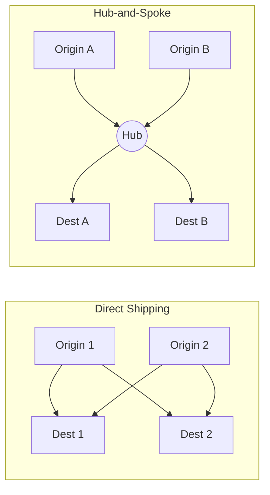

## Freight Network and Routing Design

### Overview

Freight network and routing design is the discipline of determining the physical structure of a logistics network — which nodes (plants, distribution centers, cross-docks, hubs) exist, how they are connected by transportation lanes, and how individual shipments are routed through that structure — to minimize total cost while meeting service-level requirements. Where mode selection determines *how* a shipment moves, network and routing design determines *the path and structure through which* it moves, and is typically a longer-horizon, more capital-intensive decision, since it often implies facility location, fleet sizing, and long-term carrier contracting commitments.

### Core Network Topologies

**Direct Shipping (Point-to-Point)**

Each origin ships directly to each destination with no intermediate consolidation node. Simplest structure, fastest transit time per shipment, but least efficient at low volumes since each origin-destination pair must independently achieve enough volume to justify economical shipment sizes (e.g., full truckload).

**Hub-and-Spoke**

Shipments from multiple origins are routed through a central hub (or small number of regional hubs) where they are consolidated, sorted, and redirected toward final destinations. Reduces the number of distinct lanes that must be operated (from $O(n^2)$ potential origin-destination pairs down to $O(n)$ spoke connections), at the cost of additional handling and typically longer transit time due to the extra node in the path.

**Milk Run / Multi-Stop Routes**

A single vehicle makes sequential pickups or deliveries across multiple locations on one route, consolidating what would otherwise be many small, separate direct shipments into fewer, more efficiently loaded vehicle trips. Common in both inbound supplier collection and outbound multi-customer delivery.

**Cross-Docking**

Freight arriving at a facility is immediately transferred (often within hours) from inbound to outbound transportation with little or no intermediate storage, combining the consolidation benefit of hub-and-spoke with minimal inventory holding, since goods do not rest in storage at the cross-dock node.

**Pool Distribution**

Freight destined for a common regional area from multiple origins is consolidated at a pool point (often operated by a third party) into full truckload shipments for the final leg, then broken down into individual LTL-equivalent deliveries at destination — used to capture FTL economics on the long haul while still serving many small final destinations.

The direct-shipping subgraph shows lane count growing quadratically with the number of origins and destinations, while the hub-and-spoke subgraph shows each origin and destination requiring only a single connection to the hub — this structural difference is the central efficiency argument for consolidation-based topologies at scale.

### Network Design Trade-offs

**Lane Consolidation vs. Transit Time**

Consolidating shipments through fewer, larger nodes (hub-and-spoke, pool distribution) reduces per-unit transportation cost by enabling larger, more efficient load sizes, but adds handling touchpoints and generally increases total transit time and transit-time variability compared to direct shipment.

**Facility Count vs. Total Cost**

$$TC(k) = C_{\text{facility}}(k) + C_{\text{inventory}}(k) + C_{\text{inbound-transport}}(k) + C_{\text{outbound-transport}}(k)$$

Where $k$ is the number of distribution facilities in the network. Increasing $k$ generally increases $C_{\text{facility}}$ (more fixed facility costs) and $C_{\text{inventory}}$ (safety stock must be held at more locations, reducing the demand-pooling benefit — the same square-root-of-n pooling logic discussed in the postponement chapter applies here to *facility count* rather than product variety), while decreasing $C_{\text{outbound-transport}}$ (shorter final-mile distance to customers from more, closer facilities). The optimal $k^*$ balances these opposing cost trends rather than minimizing or maximizing facility count outright.

**Network Density vs. Service Level**

A denser network (more nodes, shorter average lane distances) generally supports faster, more reliable delivery service, but at higher fixed cost. Firms serving markets with short customer tolerance times (see *Decoupling Point Placement for Customization*) often justify a denser network despite the added facility cost, since the revenue/competitive cost of failing to meet delivery expectations can exceed the incremental network cost.

### Routing Optimization Problem Classes

**Vehicle Routing Problem (VRP)**

The classic combinatorial optimization problem: given a set of customer locations with demands, a fleet of vehicles with capacity constraints, and a depot, determine the set of routes that services all customers at minimum total cost (typically distance or time), subject to vehicle capacity and route-length constraints. The base VRP is NP-hard, meaning exact optimal solutions become computationally intractable at scale, and real-world routing systems typically rely on heuristic or metaheuristic methods (e.g., savings algorithms, tabu search, genetic algorithms) rather than exact solvers for large problem instances. [Unverified: computational tractability boundaries depend on specific problem size, constraint complexity, and available solver technology, which evolve over time.]

**Common VRP Variants**

- *VRP with Time Windows (VRPTW)*: each customer must be served within a specified time window, adding a scheduling dimension to the routing problem
- *Capacitated VRP (CVRP)*: vehicles have fixed capacity limits (weight/volume), constraining how many customer stops a single route can serve
- *Multi-Depot VRP*: routes may originate from any of several depots rather than a single fixed depot
- *Pickup and Delivery Problem (PDP)*: each request involves both a pickup and a corresponding delivery location, with precedence constraints (pickup must precede its associated delivery on the route)

**Traveling Salesman Problem (TSP)**

A special case of VRP with a single vehicle and no capacity constraint: find the minimum-distance route visiting a fixed set of locations exactly once and returning to the origin. Serves as the foundational building block underlying most VRP heuristics, since a single route within a larger VRP solution is itself a TSP instance.

**Network Flow Optimization**

For strategic (rather than daily operational) network design, freight movement is often modeled as a minimum-cost flow or facility-location problem across the network graph, determining not just routes but which facility nodes should exist and which lanes should be actively used, typically formulated as a mixed-integer linear program (MILP) incorporating facility fixed costs, lane variable costs, and capacity constraints.

### Key Design Inputs

**Demand Data**

Historical and forecast shipment volumes by origin-destination pair, including seasonality and growth trends, form the foundational input for both strategic network design (facility location, hub placement) and tactical routing (vehicle/route sizing).

**Service Level Constraints**

Maximum allowable transit time or delivery time windows by customer or region, which constrain which network topologies and routing solutions are even feasible, independent of their cost efficiency.

**Cost Parameters**

Per-mile transportation cost (varying by mode, as discussed in mode selection), fixed facility operating costs, handling/labor costs per touchpoint, and inventory carrying costs at each network node.

**Capacity Constraints**

Vehicle capacity (weight, volume, or both), facility throughput capacity, and driver hours-of-service regulatory limits (for road) all bound the feasible solution space for routing.

**Network Topology Constraints**

Existing infrastructure (rail access, port proximity, road network characteristics) constrains which nodes can practically serve as hubs, cross-docks, or facility locations, tying network design back to the mode-selection considerations covered previously.

### Worked Example: Regional Distribution Network Redesign

A company currently ships directly from a single national distribution center to all customers nationwide via road.

**Problem observed**: Long-haul direct shipments to distant regions have high per-unit transportation cost and long, variable transit times, hurting service levels in distant markets.

**Network redesign evaluated**: Introduce two additional regional distribution centers (RDCs), each serving customers within its region via shorter final-mile routes, replenished from the national DC via consolidated, full-truckload or rail intermodal shipments (leveraging the lower-cost, longer-haul modes discussed in mode selection for the inter-facility legs).

**Trade-off analysis using the facility-count cost model**:

$$TC(k=3) = C_{\text{facility}}(3) + C_{\text{inventory}}(3) + C_{\text{inbound}}(3) + C_{\text{outbound}}(3)$$

Adding two RDCs increases $C_{\text{facility}}$ (two more leases/operations) and likely increases $C_{\text{inventory}}$ (safety stock now split across three locations rather than pooled at one, unless a postponement-style generic-inventory strategy is layered on top — see the mass customization chapter for how these two disciplines interact), while substantially reducing $C_{\text{outbound}}$ (shorter final-mile distances from RDCs to their regional customers) and potentially improving service level and reliability in previously underserved regions.

**Decision logic**: The redesign is favorable if the outbound transportation and service-level improvement outweighs the added facility and inventory-pooling cost — a calculation that depends on actual regional demand density and current service-level shortfall, which would need to be measured for a specific network rather than assumed. [Inference: the specific breakeven point is scenario-dependent and requires the firm's actual cost and demand data to resolve.]

### Common Pitfalls

- **Optimizing routing in isolation from network topology decisions** — daily route efficiency is bounded by facility location choices made at a much longer time horizon; a poorly located network cannot be fully corrected by routing optimization alone.
- **Treating facility/hub count as a purely cost-minimization decision** without weighing service-level and demand-pooling implications, particularly the inventory-pooling cost of fragmenting safety stock across more locations.
- **Using exact optimization methods on problem sizes where they don't scale**, rather than appropriately chosen heuristics, leading to excessive computation time in tactical, time-sensitive routing decisions.
- **Static network design in the face of shifting demand geography** — networks designed around historical demand patterns can become misaligned as customer bases, sourcing locations, or channel mix shift over time, requiring periodic network re-optimization rather than a one-time design exercise.
- **Ignoring regulatory constraints (driver hours-of-service, weight limits) in route planning**, producing theoretically optimal routes that are not operationally executable.

### Related Topics

- Transportation Modes and Mode Selection Criteria
- Distribution Center and Facility Location Optimization
- Cross-Docking Operations Design
- Vehicle Routing Problem (VRP) Heuristics and Metaheuristics
- Last-Mile Delivery Network Design
- Network Flow and Mixed-Integer Facility Location Modeling
- Demand Pooling Effects in Multi-Facility Inventory Networks