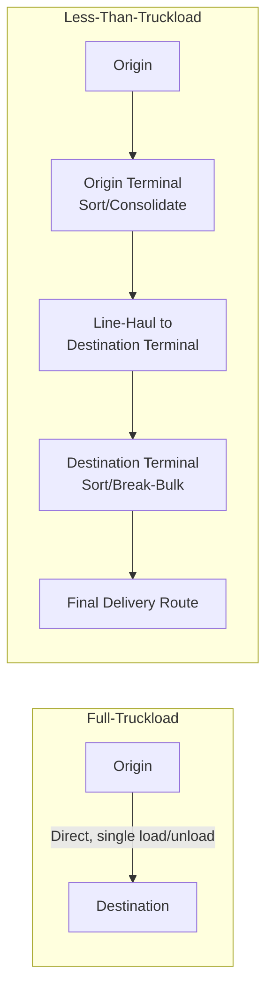

## Less-Than-Truckload versus Full-Truckload Strategies

### Overview

Less-than-truckload (LTL) and full-truckload (FTL) are the two primary service models for road freight transportation, distinguished by whether a single shipper's freight fills an entire trailer or is consolidated with other shippers' freight to share trailer capacity. The choice between them is a recurring tactical and strategic decision within road transportation planning, sitting beneath the broader mode-selection framework as a road-specific sub-decision, and directly shaping cost structure, transit time, handling risk, and network design.

### Core Definitions

**Full-Truckload (FTL)**

A single shipper's freight occupies an entire trailer (or is priced/dispatched as if it does, even if not physically full), moving directly from origin to destination without intermediate consolidation or freight-handling by other shippers' goods. The carrier is compensated for the exclusive use of the trailer/capacity for that movement.

**Less-Than-Truckload (LTL)**

Multiple shippers' freight, typically arranged on pallets, is consolidated into a single trailer by the carrier, moved through the carrier's terminal network (often including one or more intermediate hub/terminal stops for sorting and consolidation with other freight), and eventually broken down for final delivery to each individual shipper's destination.

### Structural and Operational Differences

**Network Structure**

FTL is fundamentally a point-to-point service: the trailer moves from pickup to delivery with no intermediate handling of the freight itself. LTL is fundamentally a hub-and-spoke (or multi-hub) service: freight typically moves from origin to a local terminal, is consolidated with other freight bound for a similar direction, moved line-haul to a destination-area terminal, then broken down and delivered on a local delivery route — mirroring the hub-and-spoke topology discussed in freight network design, applied specifically within the LTL carrier's own operating network.

**Handling Touchpoints**

FTL freight is typically loaded once (at origin) and unloaded once (at destination), minimizing handling-related damage risk. LTL freight is handled multiple times — loaded at origin, unloaded and re-sorted at one or more terminals, reloaded, and finally unloaded at destination — which materially increases handling-related damage and loss risk relative to FTL.

**Pricing Structure**

FTL pricing is typically negotiated per lane (origin-destination pair) or per mile, largely independent of how full the trailer actually is, since the shipper is paying for exclusive trailer capacity regardless of utilization. LTL pricing is based on shipment weight, freight class (a classification system reflecting density, handling difficulty, liability/value, and stowability), and distance, since the carrier's cost basis depends on how much of its shared network capacity a given shipment actually consumes.

### Decision Criteria: When FTL is Favored

**Shipment Volume**

When a single shipment's weight/volume approaches or fills a standard trailer's practical capacity, FTL becomes both operationally natural and typically the lower-cost-per-unit option, since the shipper is not paying a per-unit premium for shared network handling infrastructure it doesn't need.

**Time Sensitivity and Transit Reliability**

FTL's direct, single-touch movement generally provides faster and more consistent transit time than LTL, since there are no intermediate consolidation stops subject to terminal congestion or connection-timing dependencies with other shippers' freight.

**Damage-Sensitive or High-Value Freight**

Fewer handling touchpoints directly reduces damage and loss exposure, making FTL generally preferable for fragile, high-value, or liability-sensitive freight where the cost of damage/loss claims would outweigh any potential LTL cost savings.

**Predictable, Recurring High-Volume Lanes**

Lanes with consistent, high-volume demand support efficient FTL scheduling (including dedicated fleet or contract carriage arrangements) and can justify the fixed relationship/contracting overhead involved in securing reliable FTL capacity.

### Decision Criteria: When LTL is Favored

**Shipment Volume Below Truckload Threshold**

When a shipment's weight/volume is well below a full trailer's capacity, LTL allows the shipper to pay only for the actual capacity consumed (weight/class-based pricing) rather than the fixed cost of an entire trailer, which would otherwise be substantially underutilized.

**Lower Shipment Frequency to a Given Destination**

Destinations that don't generate enough regular volume to justify dedicated FTL scheduling are well served by LTL's shared-network model, which aggregates many shippers' partial-truckload freight to achieve efficient trailer utilization across the carrier's broader network rather than requiring volume from a single shipper.

**Cost Sensitivity Over Speed for Smaller Shipments**

For non-time-critical shipments below truckload volume, LTL's shared-cost model is typically more economical than paying for a full trailer's worth of capacity that isn't needed, even accounting for LTL's typically longer and more variable transit time.

### Quantitative Framing: The Utilization Break-Even Point

A simplified way to frame the FTL/LTL decision is comparing the FTL flat-rate cost against the LTL weight/class-based cost for a given shipment size:

$$C_{\text{FTL}} = R_{\text{lane}} \quad \text{(largely independent of shipment weight, up to trailer capacity)}$$

$$C_{\text{LTL}}(w) = R_{\text{base}} + w \cdot r_{\text{class}}$$

Where $R_{\text{lane}}$ is the negotiated or market FTL rate for the lane, $w$ is shipment weight, and $r_{\text{class}}$ is the per-unit-weight LTL rate for the shipment's freight class. As $w$ increases, $C_{\text{LTL}}(w)$ increases roughly linearly (with some LTL rate structures offering weight-break discounts at higher volumes) while $C_{\text{FTL}}$ remains flat, meaning there exists a break-even weight $w^*$ where:

$$C_{\text{LTL}}(w^*) = C_{\text{FTL}}$$

Beyond $w^*$, FTL becomes the lower-cost option even though the shipment may not literally fill the trailer, since the flat FTL rate is now cheaper than the accumulating per-unit LTL charges. [Inference: the exact break-even point is highly lane-, carrier-, and freight-class-specific and requires current rate data to calculate for a real shipment.]

### Hybrid and Intermediate Strategies

**Volume LTL / Partial Truckload**

An intermediate service tier for shipments larger than typical LTL but not requiring a full dedicated trailer, often priced and handled with fewer intermediate touchpoints than standard LTL while still allowing shared trailer space — used when a shipment falls in the ambiguous zone near the FTL/LTL break-even point.

**Multi-Stop Truckload**

An FTL trailer makes multiple pickup or delivery stops along a single route (effectively a milk-run structure applied within an otherwise FTL arrangement), allowing a shipper to approximate LTL-like consolidation economics for moderate-sized shipments across nearby destinations while retaining most of FTL's reduced-handling benefit.

**Freight Consolidation Programs**

Shippers with multiple LTL-sized shipments to a common region or timeframe may deliberately consolidate them into fewer, larger FTL shipments (sometimes through a third-party pool distribution or consolidation service, as discussed in freight network design), converting what would be several LTL shipments into a single more cost-efficient FTL movement.

### Inventory and Network Design Interactions

**Order Frequency vs. Shipment Size Trade-off**

Favoring FTL to obtain the lowest per-unit transportation cost typically requires larger, less-frequent shipments/orders, which increases average inventory levels (larger order quantities held between replenishments) — directly connecting the FTL/LTL decision to inventory carrying cost trade-offs (an application of the classic economic order quantity logic, where transportation cost behaves similarly to a fixed ordering cost that favors larger batch sizes).

**Service-Level and Responsiveness Trade-off**

Favoring LTL's smaller, more frequent shipment capability can improve responsiveness and reduce average inventory levels, at the expense of higher per-unit transportation cost and typically longer/more variable transit time due to the shared-network handling model.

**Network Design Alignment**

A shipper's underlying distribution network design (see *Freight Network and Routing Design*) affects which strategy dominates: a network with many small-volume destination nodes structurally favors LTL for most individual shipments (with periodic FTL consolidation runs to replenish regional hubs), while a network with a few very high-volume lanes structurally favors FTL as the default mode for most shipments on those lanes.

### Common Pitfalls

- **Defaulting to a single fixed FTL/LTL policy across all shipments**, rather than evaluating each shipment (or shipment category) against the break-even weight and service-level requirements, leaving cost savings unrealized on shipments that fall clearly on one side of the break-even point.
- **Ignoring LTL's higher damage/loss exposure when selecting based on cost alone**, particularly for fragile or high-value freight where the expected cost of claims can exceed the nominal freight-rate savings.
- **Underestimating LTL transit-time variability** in service-level commitments or safety-stock calculations, since LTL's multi-touchpoint network structure introduces more scheduling dependency and potential delay points than direct FTL movement.
- **Failing to periodically re-evaluate consolidation opportunities** as shipment volumes and destination mix evolve, missing opportunities to convert accumulated small shipments into more cost-efficient FTL consolidation, or conversely, over-committing to FTL contracts as volumes shift toward more fragmented, LTL-appropriate shipment sizes.
- **Selecting freight class inaccurately or inconsistently for LTL shipments**, leading to billing disputes, reclassification charges, and unpredictable actual freight cost relative to initial quotes.

### Related Topics

- Transportation Modes and Mode Selection Criteria
- Freight Network and Routing Design
- Freight Consolidation Strategies and Pool Distribution
- Economic Order Quantity (EOQ) and Its Transportation-Cost Analogues
- Freight Classification Systems (NMFC and Density-Based Pricing)
- Total Landed Cost Modeling for Logistics Decisions
- Carrier Contracting and Rate Negotiation Strategies