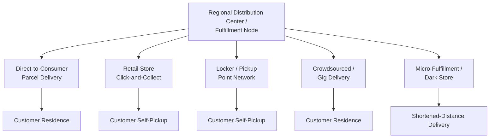

## Last-Mile Delivery Architecture

### Overview

Last-mile delivery architecture is the design of the final leg of the logistics network — the movement of goods from the last distribution node (fulfillment center, local depot, retail store, or micro-hub) to the end customer's specified location. It is widely recognized as the most operationally complex and cost-intensive segment of the overall supply chain on a per-unit basis, because it involves the highest degree of fragmentation (one-to-many delivery from a single node to many dispersed, individually scheduled destinations), the lowest per-stop volume, and the greatest exposure to variability in customer availability, address accuracy, and access conditions.

### Why Last-Mile Is Structurally Different

**Cost Concentration**

Because last-mile delivery involves the smallest shipment sizes, the shortest distances, and the most stops per unit of freight moved, it consistently represents a disproportionately large share of total delivery cost relative to the physical distance covered — a widely cited pattern across e-commerce and parcel delivery operations, since fixed per-stop costs (driver time, vehicle positioning, delivery attempt handling) do not scale down proportionally with shipment size or distance the way they do on line-haul legs.

**Fragmentation of Volume**

Unlike line-haul freight, which can be consolidated into full trailers or containers moving between a small number of high-volume nodes, last-mile volume is inherently fragmented across a large number of low-volume, individually-scheduled destinations, limiting the consolidation economics available in earlier network segments (see *Freight Network and Routing Design*).

**Customer-Facing Variability**

Last-mile delivery uniquely depends on customer-side conditions largely outside the carrier's control: recipient availability, accurate address/access information, delivery time-window preferences, and (for residential delivery) building access constraints — introducing a variability source that does not exist in facility-to-facility movements.

### Core Delivery Models

**Direct-to-Consumer (Parcel) Delivery**

Individual packages delivered directly to a customer's residence or specified address, typically via dedicated last-mile carrier networks (national parcel carriers, regional/local last-mile carriers, or gig-economy delivery platforms). The dominant model for e-commerce fulfillment.

**Click-and-Collect / Buy-Online-Pickup-In-Store (BOPIS)**

The customer completes an order online but retrieves it in person from a retail location, shifting the "last mile" burden from the delivery network to the customer's own travel, while leveraging existing retail store network density as a fulfillment/pickup point rather than requiring dedicated last-mile delivery infrastructure.

**Locker and Pickup Point Networks**

Automated parcel lockers or third-party pickup points (convenience stores, designated locker banks) serve as a consolidated delivery destination for multiple customers in a geographic area, converting many individual residential stops into a single locker-location stop for the delivery vehicle, at the cost of requiring the customer to travel to the pickup point themselves.

**Crowdsourced / Gig-Economy Delivery**

Independent contractor drivers, often coordinated via a mobile app-based dispatch platform, perform individual deliveries on a per-trip or per-hour basis rather than through a fixed employed driver workforce and fixed route structure — offering flexible capacity scaling (particularly valuable for demand peaks) at the cost of less direct operational control over service consistency.

**Micro-Fulfillment and Dark Store Models**

Small-format fulfillment nodes located within or very near dense demand areas (urban dark stores, micro-fulfillment centers embedded in or near retail locations) shorten the physical last-mile distance itself, trading a more distributed, higher-fixed-cost facility network for reduced delivery distance and time per order.

### Route Density and Consolidation Strategies

**Route Density Optimization**

Delivery cost per stop decreases as the number of stops served per unit distance traveled (route density) increases — a direct application of the vehicle routing problem concepts discussed in freight network design, but applied at much finer geographic granularity and typically much higher stop-count-per-route than line-haul routing.

$$C_{\text{per-stop}} \approx \frac{C_{\text{vehicle-fixed}} + C_{\text{distance}} \cdot d_{\text{route}}}{n_{\text{stops}}}$$

Increasing $n_{\text{stops}}$ per route (through higher local demand density or batching multiple orders into a single route) directly reduces per-stop cost, which is the core economic rationale behind time-window batching, zone-based routing, and geographic demand concentration strategies.

**Delivery Time Window Management**

Offering (or algorithmically assigning) delivery time windows allows routing systems to batch and sequence deliveries more efficiently than fully on-demand, unscheduled delivery, since predictable windows enable route planning in advance rather than reactive, one-off dispatch.

**Dynamic Routing and Real-Time Re-optimization**

Modern last-mile systems increasingly re-optimize routes dynamically as new orders arrive, delivery conditions change (traffic, failed delivery attempts), or promised time windows must be met, requiring computational routing approaches capable of near-real-time re-solution rather than only static, pre-planned daily routes.

### First-Attempt Success Rate and Failed Delivery Cost

**First-Attempt Delivery Success (FADS)**

The percentage of deliveries successfully completed on the first attempt, without requiring a re-delivery attempt, customer pickup redirect, or return-to-sender. A key last-mile performance metric because failed first attempts impose substantial additional cost: a second delivery attempt effectively duplicates most of the fixed per-stop cost (driver time, vehicle trip) without generating corresponding incremental revenue.

**Failed Delivery Mitigation Strategies**

- Proactive delivery notifications and time-window confirmation to improve recipient availability
- Alternative delivery location options (neighbor, locker, pickup point) as a fallback when the primary recipient is unavailable
- Address verification and geocoding accuracy improvements to reduce misdelivery and access-failure incidents
- Signature/contactless delivery policy choices that trade delivery confirmation certainty against first-attempt completion likelihood

### Urban vs. Rural Last-Mile Architecture

**Urban Density Considerations**

Higher population and order density generally supports higher route density and lower per-stop cost, but introduces its own challenges: traffic congestion, limited parking/loading zone access, building access complexity (multi-unit residential, security systems), and increasing municipal regulation of delivery vehicle access (e.g., low-emission zones, delivery curfews in some markets) — considerations that favor smaller, more maneuverable vehicles or non-vehicle delivery modes (cargo bikes, on-foot delivery) in dense urban cores in some implementations. [Unverified: the specific regulatory and infrastructure constraints vary significantly by city and jurisdiction and would need to be verified for a specific market.]

**Rural/Low-Density Considerations**

Lower population density fundamentally limits achievable route density, making per-stop cost structurally higher regardless of routing optimization sophistication, since the fixed distance-per-stop cannot be reduced below the actual dispersion of customer locations. Rural last-mile strategies more often rely on lower-frequency, batched delivery schedules (e.g., specific delivery days per rural route rather than daily delivery availability) to partially offset the inherent density disadvantage.

### Emerging and Alternative Delivery Technologies

**Autonomous Ground Delivery Vehicles (Sidewalk Robots)**

Small, low-speed autonomous or semi-autonomous robots designed for short-range, sidewalk-based delivery in dense, geographically constrained service areas (e.g., university campuses, dense urban districts) — generally most viable where the delivery radius is small and pedestrian infrastructure is well-suited to robot navigation.

**Drone Delivery**

Aerial delivery for lightweight, small-volume shipments, potentially bypassing ground traffic and road-network constraints entirely, but constrained by payload capacity limits, airspace regulation, weather sensitivity, and current-stage technology/regulatory maturity. [Unverified: regulatory frameworks and operational scale for drone delivery are evolving and market-specific; claims about current commercial viability and scale should be verified against current sources given the pace of regulatory change in this area.]

**Electric and Alternative-Fuel Last-Mile Fleets**

Increasing adoption of electric delivery vehicles for last-mile operations, driven by total-cost-of-ownership improvements at scale, urban emissions regulation, and corporate sustainability commitments — a fleet architecture decision layered on top of, rather than replacing, the routing and network design considerations above.

### Cost and Service-Level Trade-off Summary

| Delivery Model | Relative Cost per Order | Relative Speed | Customer Effort Required |
| --- | --- | --- | --- |
| Direct-to-consumer parcel | High | Fast (same/next-day capable) | None |
| Click-and-collect | Low | Customer-dependent | High (customer travels) |
| Locker/pickup point | Moderate-Low | Moderate | Moderate (customer travels) |
| Crowdsourced/gig delivery | Variable (demand-dependent) | Fast, especially at peak | None |
| Micro-fulfillment + delivery | Moderate (shorter distance) | Very fast | None |

[Inference: relative cost/speed positioning is directionally representative based on the underlying structural drivers described above (route density, distance, consolidation); exact figures are highly market-, geography-, and provider-specific and would require current operational data to quantify precisely.]

### Common Pitfalls

- **Treating last-mile cost as a fixed, unavoidable expense** rather than an addressable design variable through route density improvement, delivery model diversification (lockers, click-and-collect), and failed-delivery mitigation.
- **Underinvesting in address/geocoding data quality**, which directly drives failed-delivery rates and disproportionately impacts last-mile cost given how expensive re-delivery attempts are relative to first-attempt cost.
- **Applying a single delivery model uniformly across heterogeneous geographic and demand-density conditions**, rather than architecting a segmented approach (e.g., dense urban micro-fulfillment plus locker networks, versus lower-frequency batched rural routes).
- **Optimizing delivery speed in isolation from cost and route-density trade-offs**, since faster promised delivery windows generally reduce the batching and consolidation flexibility that drives per-stop cost efficiency.
- **Ignoring the customer-experience and operational implications of emerging delivery technologies' current maturity level**, adopting robot or drone delivery based on long-term potential rather than current, verified operational and regulatory readiness for the specific market in question.

### Related Topics

- Freight Network and Routing Design
- Vehicle Routing Problem (VRP) Heuristics and Metaheuristics
- Micro-Fulfillment Center Design and Dark Store Operations
- Delivery Time Window Optimization and Dynamic Dispatch Systems
- Reverse Logistics and Returns Management
- Urban Freight Regulation and Low-Emission Zone Compliance
- E-Commerce Fulfillment Network Architecture