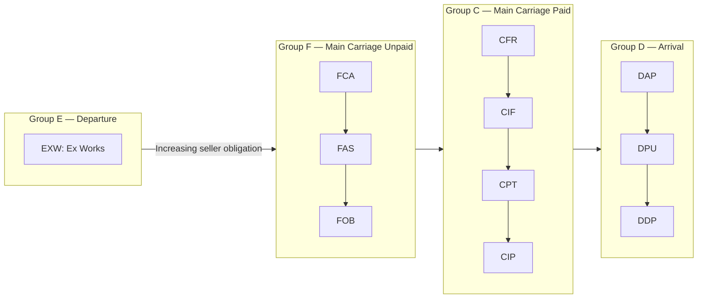

## Incoterms and International Trade Terms

### Overview

Incoterms (International Commercial Terms) are a set of standardized three-letter trade terms published by the International Chamber of Commerce (ICC) that define the respective obligations, costs, and risk transfer points between buyer and seller in international (and increasingly domestic) sales contracts. Incoterms are a standardised set of international trade terms which are published by the ICC, and are a common and internationally recognised set of rules that traders in different countries can choose to incorporate into contracts for the sale of goods, designed to be jurisdiction-neutral so that no legal system is favoured over another. Within logistics and transportation network design, Incoterms matter because they determine which party — buyer or seller — is responsible for arranging and paying for transportation, insurance, and customs clearance at each stage of an international shipment, directly shaping how a firm's transportation network design and mode-selection decisions extend (or don't extend) across an international border. [21digital](https://fsp.21digital.agency/international-chamber-of-commerce-announces-date-of-release-for-new-incoterms-2020/)

### Legal Status and Applicability

Although designed for international contracts of sale, Incoterms can also be used for domestic contracts. Critically, the Incoterms do not have the force of law and are not mandatory rules — they are regarded as general terms and conditions and only apply if they are expressly included in the respective contract by the buyer and seller. This means Incoterms function as a shared reference vocabulary that parties opt into by explicit contractual reference, not an automatically-applicable legal framework — a distinction with direct practical consequences for contract drafting, since omitting explicit reference to an Incoterm (and its version year) leaves the underlying cost/risk allocation ambiguous or subject to default local law instead. [21digital](https://fsp.21digital.agency/international-chamber-of-commerce-announces-date-of-release-for-new-incoterms-2020/)[gmp-compliance](https://www.gmp-compliance.org/gmp-news/overview-of-the-incoterms-rules)

### Current Version

The first set of Incoterms was published in 1936, and they have been updated periodically since then. The current version of the Incoterms is indicated by the year; the current version, Incoterms 2020, came into force on 01 January 2020. As of this writing, Incoterms 2020 remains the actively in-force edition; industry commentary indicates the ICC is in the process of preparing a further revision, but no new edition has yet superseded the 2020 version. Because multiple versions can remain in simultaneous use, the applicable version is always the one explicitly stated in the contract, and correct usage requires specifying the Incoterm, the precise location, and the version — for example, "CIF Le Havre (Incoterms 2020 ICC)." Incoterms 2010 and 2020 coexist in practice, since older contracts remain valid under their original terms. [Overview of the 2020 Incoterms Rules +3](https://fsp.21digital.agency/international-chamber-of-commerce-announces-date-of-release-for-new-incoterms-2020/)

### The 11 Incoterms 2020 Rules

According to Incoterms 2020, there are 11 different rules: EXW (Ex Works), FCA (Free Carrier), FAS (Free Alongside Ship), FOB (Free On Board), CFR (Cost and Freight), CIF (Cost, Insurance and Freight), CPT (Carriage Paid To), CIP (Carriage, Insurance Paid To), DAP (Delivered At Place), DPU (Delivered At Place Unloaded), and DDP (Delivered Duty Paid). [gmp-compliance](https://www.gmp-compliance.org/gmp-news/overview-of-the-incoterms-rules)

**Classification by Mode of Transport**

A classification can be made according to mode of transport: Incoterms that apply to any mode of transport (EXW, FCA, CPT, CIP, DAP, DPU, DDP), and Incoterms that apply to sea and inland waterway transport only (FAS, FOB, CFR, CIF). This distinction directly matters for logistics network design, since the sea/inland-waterway-only terms reference risk transfer points defined in relation to a vessel (alongside ship, on board), which are meaningless concepts for air, rail, or road-only shipments — using a sea-specific term for a non-maritime shipment is a common and consequential drafting error. [gmp-compliance](https://www.gmp-compliance.org/gmp-news/overview-of-the-incoterms-rules)

**Classification by Group (E, F, C, D)**

Incoterms 2020 define 11 standardised commercial terms grouped into four categories (E, F, C, D) that determine the respective obligations of seller and buyer regarding delivery, risk transfer, cost allocation, customs formalities, and insurance. [thetradehub](https://www.thetradehub.eu/en/glossary/incoterms-2020)

- **Group E (Departure)**: EXW — the seller's minimum obligation, making goods available at their own premises
- **Group F (Main Carriage Unpaid)**: FCA, FAS, FOB — the seller delivers to a carrier nominated by the buyer, but the buyer arranges and pays for main carriage
- **Group C (Main Carriage Paid)**: CFR, CIF, CPT, CIP — the seller arranges and pays for main carriage, but risk transfers to the buyer before that carriage begins (a distinctive feature: cost and risk transfer at different points)
- **Group D (Arrival)**: DAP, DPU, DDP — the seller bears risk and cost all the way to a named destination

The four groups form a spectrum of increasing seller obligation and decreasing buyer obligation, from EXW (minimum seller responsibility — buyer arranges essentially everything from the seller's premises onward) to DDP (maximum seller responsibility — seller bears cost and risk, including import duty, all the way to the buyer's named destination).

### What Incoterms Actually Govern

Incoterms address: location of delivery, transfer of risk, packaging and marking, responsibility for loading and unloading of the goods, arrangement of contract of carriage, allocation of costs of carriage, responsibility for export and import clearance, and responsibility for supply chain security measures. [21digital](https://fsp.21digital.agency/international-chamber-of-commerce-announces-date-of-release-for-new-incoterms-2020/)

**What Incoterms Do Not Govern**

Incoterms do not deal with transfer of ownership/title, price, payment method, applicable law, or dispute resolution. This is a frequently misunderstood point: an Incoterm determines who bears the cost and risk of physical loss/damage during transit and who is responsible for which logistics/customs tasks, but it says nothing about when legal title to the goods passes — that is governed separately by the underlying sales contract and applicable law. Conflating "risk transfer point" (an Incoterms concept) with "title transfer point" (a separate contractual/legal concept) is a common and consequential error in contract drafting. [thetradehub](https://www.thetradehub.eu/en/glossary/incoterms-2020)

### Key Changes from Incoterms 2010 to 2020

Changes from the 2010 to the 2020 edition were mainly presentational, with several non-extensive substantive changes. [21digital](https://fsp.21digital.agency/international-chamber-of-commerce-announces-date-of-release-for-new-incoterms-2020/)

**DAT Replaced by DPU**

The DAT (Delivered at Terminal) term was removed and a new DPU term introduced; under the previous DAT term, the seller delivered the goods once unloaded from the arriving means of transport into a terminal, whereas the DPU term emphasises that the place of destination where the seller unloads the goods could be a place other than a terminal. This generalizes the delivered-and-unloaded concept beyond fixed terminal infrastructure to any agreed destination point. [21digital](https://fsp.21digital.agency/international-chamber-of-commerce-announces-date-of-release-for-new-incoterms-2020/)

**Insurance Obligation Under CIP Raised**

Under CIP, the insurance level required was raised to ICC (A) — an "all risks" level of coverage — up from the lower ICC (C) level required under the 2010 edition; CIF's insurance requirement remained at the lower level. This asymmetry reflects CIP's more common use in higher-value, non-bulk goods trade versus CIF's continued association with bulk commodity shipping. [thetradehub](https://www.thetradehub.eu/en/glossary/incoterms-2020)

**FCA On-Board Bill of Lading Option**

A new option under FCA allows the parties to agree that the buyer will instruct the carrier to issue an "on board" bill of lading to the seller after loading — addressing a practical gap where sellers using FCA sometimes needed documentary proof of on-board loading (typically for letter-of-credit purposes) despite FCA's risk transfer point occurring before loading. [thetradehub](https://www.thetradehub.eu/en/glossary/incoterms-2020)

**Explicit Security Obligations**

Safety-security obligations are now explicitly mentioned within each individual term, rather than being addressed only in general introductory guidance. [thetradehub](https://www.thetradehub.eu/en/glossary/incoterms-2020)

### Practical Application to Logistics Network Design

**Determining Who Controls Mode and Carrier Selection**

The Incoterm selected for a given transaction directly determines which party has the contractual right and responsibility to select the transportation mode and carrier for a given leg — a seller operating under EXW has essentially no say over the buyer's chosen inbound transportation, while a seller operating under DDP controls carrier and mode selection across the entire journey. This means a firm's international logistics network design capability is partly a function of which Incoterms it typically transacts under with its trading partners, not solely an internal operational choice.

**Risk and Insurance Cost Allocation**

Because risk transfer points vary by term (and can occur at a different point than cost responsibility, as in the Group C terms), a firm's cargo insurance strategy and transportation risk management approach must be Incoterm-specific rather than uniform across all shipments — the same physical shipment can carry very different risk exposure for the seller depending solely on which Incoterm governs the transaction.

**Customs and Import Duty Responsibility**

DDP places import duty and customs clearance responsibility on the seller, which requires the seller to have (or contract for) import-side customs expertise and registration in the buyer's country — a materially more complex operational requirement than EXW or FCA, where the buyer handles import formalities in their own jurisdiction using their own established customs processes. Firms expanding into DDP-based sales models for international e-commerce, for instance, take on customs and duty-calculation obligations that a purely EXW/FCA-based export model does not require.

### Common Pitfalls

- **Using a sea/inland-waterway-specific term (FAS, FOB, CFR, CIF) for a containerized or non-maritime shipment**, when the goods are handed to a carrier at a container yard or inland point rather than physically alongside or on board a vessel — the more common error being use of FOB for containerized cargo, where FCA is the more precise multimodal-appropriate term.
- **Omitting the Incoterms version year in the contract**, leaving ambiguity as to whether 2010, 2020, or a future edition's rules apply, particularly problematic since multiple versions can be simultaneously valid and referenced in ongoing trade relationships.
- **Conflating Incoterms risk-transfer point with title/ownership transfer**, since Incoterms explicitly do not address title transfer — firms sometimes incorrectly assume the Incoterm also determines when legal ownership passes.
- **Selecting DDP without adequate import-country customs capability**, exposing the seller to customs delays, duty miscalculation, or compliance risk in a jurisdiction where it lacks established import operations.
- **Failing to specify a sufficiently precise named place/port** alongside the Incoterm — since risk and cost allocation are anchored to a specific named location, an imprecise location reference can create the same practical ambiguity that using no Incoterm at all would create.
- **Assuming Incoterms function as legally binding rules independent of contract reference** — since they only apply when expressly incorporated into the contract, silence on Incoterms in a contract does not default to any particular Incoterm's allocation of cost and risk.

### Related Topics

- Transportation Modes and Mode Selection Criteria
- Customs Clearance and Import/Export Compliance Processes
- International Freight Insurance and Cargo Risk Allocation
- Bill of Lading Types and Documentary Trade Requirements
- Cross-Border E-Commerce Fulfillment and Duty Management
- Letter of Credit Mechanics in International Trade Finance
- Free Trade Agreements and Tariff Classification (Harmonized System)