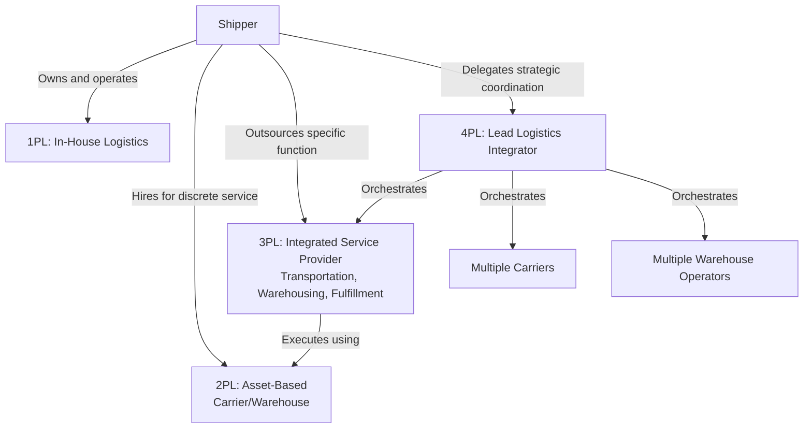

## Third-Party and Fourth-Party Logistics Models

### Overview

Third-party logistics (3PL) and fourth-party logistics (4PL) are outsourcing models in which a firm delegates some or all of its logistics operations — transportation, warehousing, distribution, or overall supply chain coordination — to an external specialist provider, rather than performing those functions with owned assets and internal staff. These models sit alongside the broader "make vs. buy" decision that runs throughout supply chain design, applied specifically to the logistics function, and represent a spectrum of increasing outsourcing scope and strategic delegation.

### The Logistics Party Framework

**First-Party Logistics (1PL)**

The shipper (manufacturer, retailer) manages its own logistics operations entirely in-house — owning or leasing its own trucks, warehouses, and logistics staff. Not a distinct "outsourcing model" per se, but the baseline reference point against which 3PL and 4PL represent increasing degrees of externalization.

**Second-Party Logistics (2PL)**

An asset-based transportation or warehousing provider is used for a specific, discrete service — e.g., hiring a trucking company for line-haul transport or leasing warehouse space — without that provider taking on broader coordination, planning, or management responsibility. This is closer to a simple vendor/carrier relationship than a strategic logistics partnership.

**Third-Party Logistics (3PL)**

An external provider manages one or more specific logistics functions (transportation, warehousing, freight forwarding, customs brokerage, order fulfillment) on the shipper's behalf, typically integrating multiple discrete services (e.g., warehousing plus outbound transportation plus returns processing) into a coordinated operational package, but generally executing within a scope and strategy still substantially defined by the shipper.

**Fourth-Party Logistics (4PL)**

A 4PL provider takes on a broader, more strategic coordination role: managing and integrating the resources, capabilities, and technology of multiple logistics providers (including 3PLs, carriers, and the shipper's own assets) to design and operate an end-to-end supply chain solution. Critically, a 4PL is often (though not always) asset-light or entirely non-asset-based itself — it does not necessarily own trucks or warehouses, but instead orchestrates a network of providers that do, acting as an integrator and single point of accountability across the entire logistics function.

### 3PL Service Categories

**Asset-Based 3PLs**

Own and operate their own transportation fleets and/or warehouse facilities, providing services using their own physical infrastructure. Generally offer more direct operational control and often more competitive pricing for high-volume, standardized services, but with less flexibility to scale capacity beyond owned assets or to easily switch modes/providers.

**Non-Asset-Based (Management) 3PLs**

Do not own transportation or warehousing assets themselves, instead brokering and managing capacity from a network of asset-owning carriers and facility operators on the shipper's behalf. Generally offer greater flexibility and mode/carrier choice, since they are not constrained to utilizing their own fixed asset base, but introduce an intermediary layer between the shipper and the actual physical operator.

**Integrated/Hybrid 3PLs**

Combine owned assets for core, high-volume lanes or services with brokered/managed capacity for overflow, specialized, or geographically dispersed needs — a common structure among larger 3PL providers seeking to balance asset utilization efficiency with network flexibility.

**Service Scope Variants**

- *Transportation management*: freight brokerage, carrier selection, rate negotiation, freight bill audit and payment
- *Warehousing and distribution*: storage, pick/pack, order fulfillment, cross-docking
- *Freight forwarding*: coordinating international shipments across multiple modes and customs jurisdictions
- *Value-added services*: kitting, labeling, light assembly, returns processing (directly connecting to the channel assembly/vendor postponement models discussed in the mass customization chapter)

### 4PL Operating Models

**Reinvented/Non-Asset Model**

The 4PL owns no logistics assets at all and derives its value purely from network design, technology/visibility platforms, and management of a portfolio of 3PL and carrier relationships on the shipper's behalf — the "pure" orchestration model.

**Solution Integrator Model**

A single logistics provider (often a large 3PL with a dedicated 4PL-style management arm) takes on the 4PL coordination role while itself also acting as one of the executing service providers within the network it manages — blending strategic integration with direct operational execution.

**Industry Innovator / Joint Venture Model**

The 4PL relationship is structured as a joint venture or deeply integrated long-term partnership between the shipper and the logistics provider, often with shared risk/reward structures and embedded staff, reflecting a strategic partnership rather than a conventional buyer-supplier contract.

### Decision Criteria: When to Use 3PL vs. 4PL vs. In-House

**Scope of Outsourcing Sought**

If the goal is to outsource specific, well-defined logistics *functions* (e.g., "manage our warehousing" or "handle our LTL freight") while the shipper retains overall supply chain strategy and coordination internally, 3PL is the appropriate model. If the goal is to outsource the *coordination and strategic management* of an entire, multi-provider logistics network, 4PL is the more appropriate model.

**Internal Logistics Management Capability**

Firms with limited internal logistics management expertise or bandwidth, particularly those managing complex, multi-modal, multi-provider networks, may derive more value from a 4PL's integration and coordination capability than from directly managing several separate 3PL/carrier relationships themselves.

**Asset Ownership Preference**

Firms seeking to convert fixed logistics costs into variable costs (avoiding capital investment in trucks/warehouses) and/or seeking flexibility to scale logistics capacity up or down with demand typically favor 3PL or 4PL over in-house (1PL) operation, since outsourced capacity can be adjusted more readily than owned fixed assets.

**Volume and Network Complexity**

Very high-volume, single-lane, predictable freight may be efficiently handled through direct carrier contracts (2PL-style) or asset-based 3PL relationships; highly complex, multi-modal, multi-region networks with significant coordination overhead are where 4PL's integration value proposition is strongest.

**Strategic Control Requirements**

Functions considered core to competitive differentiation (e.g., a company whose brand promise depends on distinctive delivery experience) may be retained in-house or managed under closer, more prescriptive 3PL contracts, while more commoditized logistics functions are more readily and fully delegated, including to a 4PL's broader coordination authority.

### Total Cost and Value Proposition

**Cost Structure Shift**

Outsourcing to 3PL/4PL providers typically converts fixed logistics costs (owned fleet, warehouse leases, dedicated staff) into variable, volume-based costs (per-shipment, per-pallet, or service-fee-based pricing), which can improve capital efficiency and reduce fixed-cost risk exposure during demand downturns, though often at a higher per-unit cost during steady-state high-utilization periods compared to a well-utilized owned asset base.

**Network Effects and Scale Access**

3PL and especially 4PL providers can offer access to network scale, carrier relationships, and technology infrastructure that would be costly or slow for an individual shipper to replicate independently — particularly valuable for firms whose own shipment volume is insufficient to negotiate favorable direct carrier rates or justify owned infrastructure investment.

**Reduced Management Overhead**

Especially in the 4PL model, the shipper reduces the internal management burden of coordinating multiple separate logistics relationships, consolidating accountability into a single strategic partner — though this concentration of dependency is itself a risk consideration (see below).

### Governance and Risk Considerations

**Loss of Direct Operational Control**

Outsourcing logistics functions, particularly under a 4PL model where the shipper may have limited direct visibility into which specific carriers or 3PLs are executing a given shipment, reduces the shipper's direct operational control and requires robust service-level agreements (SLAs), performance monitoring, and data-sharing arrangements to maintain adequate visibility and accountability.

**Data and Systems Integration**

Effective 3PL/4PL relationships require reliable data integration (order data, inventory visibility, shipment tracking, performance reporting) between the shipper's systems and the provider's systems — a technical and organizational integration challenge analogous to the channel-partner data-sharing requirements discussed in channel assembly/vendor postponement models, but extended to logistics execution rather than product configuration.

**Single Point of Dependency Risk**

Particularly in a 4PL relationship where one provider orchestrates the entire logistics network, the shipper becomes significantly dependent on that single provider's performance, financial stability, and continuity — a concentration risk that a more fragmented, directly-managed multi-3PL approach would not carry to the same degree, though at the cost of the shipper bearing the coordination burden itself.

**Contractual and SLA Design**

Because outsourced logistics performance directly affects customer-facing service levels (on-time delivery, order accuracy, damage rates), SLA design — including performance metrics, penalty/incentive structures, and escalation procedures — is a critical governance mechanism, particularly important in 4PL relationships where the shipper has less direct line-of-sight into day-to-day execution.

### Common Pitfalls

- **Treating 3PL/4PL outsourcing as a pure cost-reduction exercise** without accounting for the reduced direct control, increased coordination/integration requirements, and dependency risk that come with delegation.
- **Under-specifying SLAs and performance metrics**, leaving ambiguity about accountability when service failures occur, particularly problematic in 4PL arrangements involving multiple sub-tier providers.
- **Insufficient data integration investment**, resulting in poor shipment visibility and slow exception management — undermining much of the coordination value a 4PL model is meant to provide.
- **Outsourcing logistics functions considered strategically differentiating** without adequate governance to preserve the specific service characteristics that create competitive advantage, effectively commoditizing what was intended to remain a differentiator.
- **Failing to assess a 4PL provider's actual sub-tier network quality**, since the shipper's service experience ultimately depends on the performance of carriers and 3PLs the 4PL orchestrates, not solely on the 4PL's own coordination capability.
- **Static outsourcing structure despite evolving volume/network needs** — a 3PL relationship appropriate for a smaller, simpler network may become a coordination bottleneck as the shipper's logistics complexity grows, at which point migration toward a 4PL model may become warranted (or vice versa, if complexity is later reduced).

### Related Topics

- Freight Network and Routing Design
- Channel Assembly and Vendor Postponement Models
- Third-Party Logistics (3PL) Value-Added Services and Kitting Operations
- Service-Level Agreement (SLA) Design for Outsourced Operations
- Supply Chain Visibility and Track-and-Trace Technology
- Make-vs-Buy Decision Frameworks in Supply Chain Design
- Freight Brokerage and Carrier Management Platforms