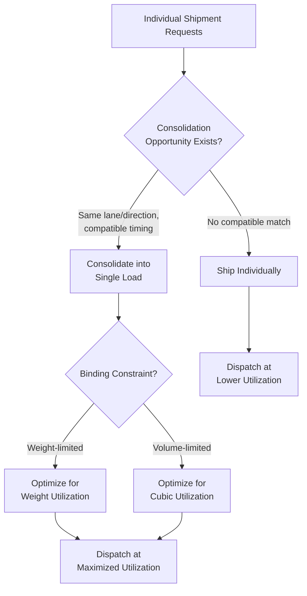

## Freight Consolidation and Load Optimization

### Overview

Freight consolidation and load optimization is the practice of combining multiple smaller shipments into larger, more efficiently loaded units, and maximizing the utilization of available transportation capacity (vehicle weight, volume, or space) for each movement. Where mode selection determines *which* transportation mode to use and network design determines the *structure* through which freight flows, consolidation and load optimization address the finer-grained question of how to fill the capacity actually purchased or dispatched as efficiently as possible — since transportation cost is typically incurred largely independent of how full a given vehicle, container, or trailer actually is.

### Core Rationale

**Fixed-Cost Nature of Transportation Capacity**

Much of the cost of dispatching a truck, rail car, ocean container, or aircraft cargo hold is effectively fixed once the decision to move it is made — fuel, driver/crew time, equipment usage, and terminal handling costs do not scale down proportionally with how much freight is actually loaded. This means underutilized capacity represents a direct efficiency loss: the same fixed cost is incurred whether the vehicle is 40% or 95% full.

$$C_{\text{per-unit}} = \frac{C_{\text{fixed}} + C_{\text{variable}} \cdot d}{U \cdot Q_{\text{capacity}}}$$

Where $U$ is the utilization rate (fraction of capacity actually used) and $Q_{\text{capacity}}$ is total available capacity. Since $C_{\text{fixed}}$ and much of $C_{\text{variable}}$ (fuel, distance-based costs) are largely independent of $U$, increasing utilization directly reduces per-unit cost — the central economic argument for consolidation.

**Connection to Mode and Network Decisions**

Consolidation directly interacts with the FTL/LTL decision (aggregating multiple LTL-sized shipments into a single FTL movement, as discussed in that item) and with network topology choices (hub-and-spoke and pool distribution structures exist specifically to create consolidation opportunities that would not exist under pure point-to-point shipping).

### Dimensions of Load Optimization

**Weight Utilization**

Maximizing the proportion of a vehicle's or container's maximum weight capacity actually used — critical for dense, heavy commodities where weight limits (not physical space) are the binding constraint.

**Cubic/Volume Utilization**

Maximizing the proportion of available physical space (cubic capacity) used — the binding constraint for lightweight, bulky freight where weight limits are reached well before space is exhausted (a mismatch commonly described as "cubing out" before "weighing out").

**Load Planning and Stacking Configuration**

The physical arrangement of freight within a vehicle or container — pallet configuration, stacking height, weight distribution for vehicle stability and axle-weight compliance, and loading sequence (often reverse-delivery-order for multi-stop routes, so that the last items loaded are the first unloaded).

### Consolidation Strategies

**Multi-Shipper Consolidation**

Combining freight from multiple, unrelated shippers bound for a similar direction or destination region into a single vehicle or container — the fundamental mechanism underlying LTL carriage and freight forwarding consolidation services, allowing shippers with individually sub-truckload/sub-container volumes to collectively achieve full-load economics.

**Multi-Order Consolidation (Single Shipper)**

A single shipper combines multiple separate customer orders or purchase orders — which might otherwise ship as several smaller, separate shipments — into fewer, larger, better-utilized loads, typically by holding orders for a brief consolidation window or aligning shipment timing with a common outbound schedule.

**Pool Distribution and Break-Bulk Consolidation**

Freight from multiple origins destined for a common regional area is consolidated (pooled) into a full truckload for the long-haul leg, then broken down (deconsolidated) into individual smaller deliveries at a regional distribution point — capturing FTL economics on the expensive long-haul portion of the movement while still serving fragmented final destinations, as discussed in freight network design.

**Cross-Docking-Enabled Consolidation**

Freight arriving from multiple inbound sources is immediately re-sorted and consolidated onto outbound loads based on destination, without intermediate storage — enabling consolidation benefits without the inventory-holding cost that a traditional warehouse-based consolidation model would incur.

**Time-Window Consolidation**

Deliberately delaying dispatch of a partially-filled load for a bounded time window to allow additional compatible freight to be added before shipping, trading a modest increase in average order-to-ship time for improved load utilization — a direct application of the classic trade-off between responsiveness and efficiency that recurs throughout supply chain design.

### Load Optimization Techniques

**Cargo Load Planning / Bin-Packing Optimization**

Determining the optimal physical arrangement of items (pallets, boxes, irregular items) within a fixed vehicle/container space to maximize utilized volume and/or weight while respecting stacking, fragility, and stability constraints — mathematically related to the classic bin-packing and container-loading problem classes in combinatorial optimization, which like the vehicle routing problem are generally NP-hard at scale and addressed via heuristic algorithms in practical software systems.

**Weight Distribution and Axle Compliance**

For road transport specifically, load planning must respect not only total vehicle weight limits but also axle-weight distribution limits (regulatory limits on how much weight can rest on each axle group), which can constrain loading configuration even when total weight and volume capacity are not yet exhausted.

**Mixed-Load Optimization**

When combining freight with different physical characteristics (varying density, stackability, fragility, temperature requirements) into a single load, optimization must account for compatibility constraints (e.g., heavy/dense freight loaded at the bottom, temperature-sensitive freight positioned appropriately relative to the vehicle's refrigeration zone) in addition to pure space/weight maximization.

**Route-Sequenced Loading**

For multi-stop delivery routes, load configuration should generally follow reverse-delivery-sequence loading (last-delivered items loaded first, first-delivered items loaded last and thus most accessible), minimizing unnecessary in-vehicle freight handling and re-positioning at each stop — directly connecting load optimization to the routing decisions discussed in freight network design.

### Quantitative Framing: Utilization and Consolidation Value

**Utilization Rate**

$$U = \frac{\text{Actual Load (weight or volume)}}{\text{Maximum Capacity (weight or volume)}}$$

A shipment or route with low $U$ represents an opportunity for consolidation gain: combining it with additional compatible freight to raise $U$ toward its practical maximum without incurring a proportional increase in total dispatch cost.

**Consolidation Savings Estimate**

For two shipments individually dispatched at utilization $U_1$ and $U_2$ (each requiring a full separate dispatch cost $C_{\text{fixed}}$), combining them into a single load (assuming combined weight/volume remains within capacity) can approximate:

$$\text{Savings} \approx C_{\text{fixed}} \cdot (1 - \max(U_1, U_2, \text{combined utilization constraint}))$$

The precise savings depend on whether the combined shipment fits within a single vehicle's capacity without exceeding it (in which case one full fixed cost is avoided entirely) or whether consolidation only partially improves utilization without eliminating a dispatch. [Inference: this is a simplified illustrative framework; real consolidation savings calculations require actual capacity constraints, rate structures, and compatibility rules specific to the shipments and carrier involved.]

### Interaction with Inventory and Service-Level Trade-offs

**Consolidation Window vs. Order Cycle Time**

Holding shipments for a consolidation window to improve load utilization directly extends the time between order placement and dispatch, trading transportation cost efficiency against faster order-to-delivery cycle time — the same fundamental trade-off discussed in the FTL/LTL item, but framed here as a tunable operational parameter (the consolidation window length) rather than a binary mode choice.

**Inventory Positioning Implications**

Effective multi-order or multi-shipper consolidation often requires inventory or orders to be physically co-located (at a shared origin, cross-dock, or pool point) at the time of consolidation, meaning consolidation strategy is not purely a transportation decision but is coupled to facility/network design decisions about where inventory and orders converge before final dispatch.

### Common Pitfalls

- **Pursuing maximum utilization without regard to service-level commitments**, extending consolidation windows beyond what committed delivery timeframes can absorb, trading unrealized cost savings for missed service commitments and their associated penalty/attrition costs.
- **Ignoring compatibility constraints in mixed-load consolidation** (temperature, fragility, hazmat separation requirements, odor/contamination risk between product categories), leading to product damage or regulatory non-compliance despite achieving high nominal utilization.
- **Optimizing for volume utilization when weight is the actual binding constraint (or vice versa)**, missing that the true capacity ceiling for a given freight mix may be reached on one dimension well before the other — requiring load planning tools/processes to correctly identify which constraint actually binds for a given freight profile.
- **Underestimating axle-weight and regulatory loading constraints** in pursuit of maximum total weight utilization, producing loads that are compliant on total weight but non-compliant on distribution, risking regulatory penalties and safety issues.
- **Treating consolidation as a one-time load-planning exercise** rather than an ongoing operational discipline requiring continuous re-evaluation as shipment mix, volume, and destination patterns evolve over time.

### Related Topics

- Less-Than-Truckload versus Full-Truckload Strategies
- Freight Network and Routing Design
- Vehicle Routing Problem (VRP) Heuristics and Metaheuristics
- Cross-Docking Operations Design
- Bin-Packing and Container Loading Optimization Algorithms
- Third-Party and Fourth-Party Logistics Models
- Transportation Cost Modeling and Total Landed Cost Analysis