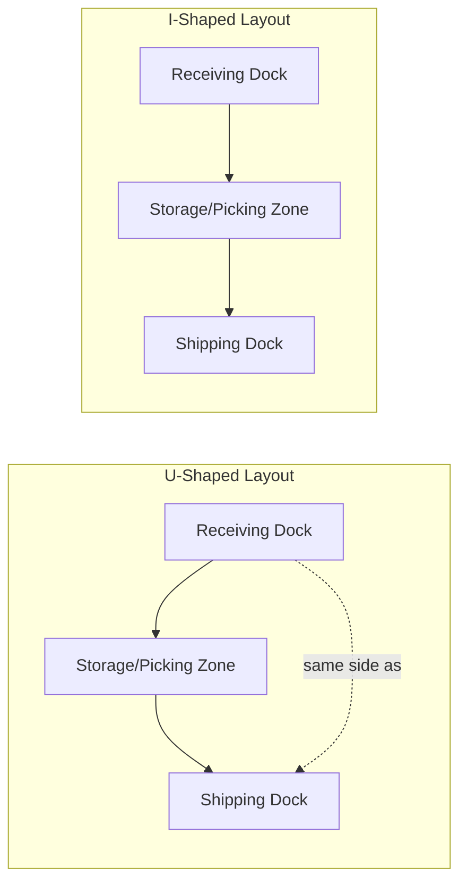

## Warehouse Layout and Slotting Strategy

### Overview

Warehouse layout and slotting strategy is the design of the physical arrangement of a warehouse or distribution center — the placement of storage zones, aisles, and material-handling infrastructure — and the assignment of specific stock-keeping units (SKUs) to specific storage locations within that layout. Together these decisions determine how efficiently product moves through the facility from receiving to shipping, directly driving labor productivity, order-picking accuracy, throughput capacity, and space utilization, and represent one of the highest-leverage operational design decisions within a distribution center.

### Core Layout Configurations

**U-Shaped (Flow-Through) Layout**

Receiving and shipping docks are located on the same side of the building, with product flowing in a U-shaped path from receiving, through storage/picking, to shipping. Allows dock doors to be flexibly reassigned between inbound and outbound use as daily volume patterns shift, and tends to minimize the average travel distance between receiving and shipping for cross-docked freight.

**I-Shaped (Straight Flow-Through) Layout**

Receiving and shipping docks are located on opposite sides of the building, with product flowing in a single straight-line direction from one side to the other. Simplifies material flow logic and can support higher-volume, more linear process flows, but offers less flexibility to reallocate dock capacity between inbound and outbound functions as demand patterns shift.

**L-Shaped Layout**

Receiving and shipping are located on adjacent (perpendicular) sides of the building, offering an intermediate compromise between the flow-simplicity of I-shaped layouts and the dock-flexibility of U-shaped layouts, often used when building footprint or site constraints make either pure configuration impractical.

### Warehouse Zoning Principles

**Functional Zoning**

Dividing the facility into distinct functional areas: receiving/inbound staging, bulk reserve storage, forward/active picking area, value-added services (kitting, labeling), packing, and shipping/outbound staging — each zoned to support its specific process flow and equipment requirements.

**Forward Pick Area vs. Reserve Storage Separation**

A common design pattern separates a smaller, easily-accessible "forward pick" area (holding a limited quantity of each SKU, optimized for fast, ergonomic order picking) from a larger "reserve storage" area (holding bulk inventory, replenished into the forward pick area as it depletes). This separation allows picking efficiency to be optimized independently of bulk storage density efficiency, since the two areas serve different operational objectives.

**Velocity-Based Zoning**

Physically grouping product by movement velocity (fast, medium, slow-moving) into distinct zones, typically placing the fastest-moving zone closest to shipping/packing to minimize aggregate travel distance for the highest-volume picking activity — directly connecting layout design to the slotting strategy discussed below.

**Value-Density and Security Zoning**

High-value or theft-prone SKUs may be zoned into secured, access-controlled areas regardless of their movement velocity, reflecting that security/loss-prevention requirements can override pure travel-distance optimization for a subset of inventory.

### Slotting Strategy Fundamentals

**Slotting Definition**

The assignment of specific SKUs to specific storage/pick locations within the warehouse, determining which product sits in which slot, at which height, and in which zone — a decision made (and periodically re-optimized) largely independent of the physical layout itself, though constrained by it.

**ABC Velocity-Based Slotting**

The most foundational slotting principle: classifying SKUs by pick frequency or volume (commonly using Pareto/ABC analysis, where a small percentage of SKUs — the "A" items — account for a disproportionately large share of total picks) and assigning the fastest-moving A items to the most accessible, shortest-travel-distance locations, with progressively slower-moving B and C items placed in progressively less accessible locations.

$$\text{Travel Time Savings} \propto \sum_{i} f_i \cdot (d_{\text{original}, i} - d_{\text{optimized}, i})$$

Where $f_i$ is the pick frequency of SKU $i$ and $d_i$ is the travel distance to its assigned location. Because this is a frequency-weighted sum, relocating high-frequency ($f_i$) SKUs to shorter-distance locations yields disproportionately larger aggregate travel-time savings than making equivalent distance improvements for low-frequency SKUs — the core mathematical justification for velocity-based slotting.

**Golden Zone Placement**

Within the forward pick area, the "golden zone" refers to the ergonomically optimal height range (roughly waist-to-shoulder height for manual picking) that minimizes picker bending, reaching, and associated fatigue and injury risk. Fastest-moving, heaviest, or most frequently handled SKUs are typically prioritized for golden-zone placement, combining velocity-based and ergonomic slotting objectives.

**Complementary/Affinity Slotting**

Locating SKUs that are frequently ordered together in physical proximity, reducing travel distance for orders containing multiple such items — requires order/market-basket data analysis to identify genuine co-occurrence patterns rather than assuming affinity based on product category alone.

**Family Grouping**

Slotting related product families or variants together (e.g., all sizes/colors of a given product line in adjacent locations), which can simplify replenishment, reduce picking errors (since similar items requiring careful SKU discrimination are co-located and can be handled with more deliberate attention), and support certain put-away efficiency patterns, though this can sometimes conflict with pure velocity-based optimization if a product family has mixed velocity across its variants.

**Cube-Per-Order-Index (COI) Slotting**

A refinement of pure velocity-based slotting that also accounts for the physical space (cube) each SKU requires relative to its order frequency, assigning locations to minimize a combined space-and-travel-distance objective rather than optimizing travel distance alone — relevant because a high-velocity but bulky SKU may not be efficiently slotted using the same logic as a high-velocity, compact SKU.

### Storage Method Selection

**Static (Dedicated) Slotting**

Each SKU is permanently assigned to a fixed location, regardless of current inventory level. Simplifies picker memorization and location-finding over time (returning pickers learn fixed locations), but can result in wasted space when a SKU's on-hand quantity is low relative to its allocated slot size, and doesn't adapt to velocity changes without a deliberate re-slotting exercise.

**Dynamic (Random/Chaotic) Slotting**

SKUs are assigned to whichever available location best fits their current inventory quantity at the time of putaway, typically directed and tracked by a warehouse management system (WMS) rather than fixed human-memorized locations. Improves space utilization (since slot size can flexibly match current inventory level) at the cost of requiring reliable, real-time location-tracking technology (barcode/RFID scanning, WMS direction) rather than picker memory.

**Hybrid Slotting**

Common in practice: a fixed/dedicated approach for the forward pick area (supporting picker familiarity and ergonomic/velocity optimization) combined with dynamic/random slotting in bulk reserve storage (where space-utilization efficiency matters more than picker familiarity, since reserve locations are visited less frequently and always under WMS direction).

### Slotting Optimization Considerations Beyond Pure Velocity

**Seasonal and Promotional Demand Shifts**

SKU velocity is not static — seasonal products, promotional items, and trending SKUs can experience significant velocity shifts that render a previously optimal slotting configuration suboptimal, necessitating periodic re-slotting analysis rather than a one-time optimization.

**Replenishment Frequency and Labor Trade-off**

Placing a high-velocity SKU in a very small forward-pick slot may optimize picking travel distance but require very frequent replenishment trips from reserve storage, potentially shifting labor cost from picking to replenishment rather than genuinely reducing total labor — slotting decisions should account for total labor across both picking and replenishment activity, not picking efficiency in isolation.

**Physical and Handling Constraints**

Product weight, size, fragility, and handling equipment compatibility (e.g., items requiring a forklift vs. items suited to manual/each-picking) constrain which locations and zones are physically and safely viable for a given SKU, independent of pure velocity or space-optimization logic.

**Cross-SKU Interaction Effects**

Beyond simple affinity slotting, some SKU combinations carry contamination, odor-transfer, or regulatory separation requirements (e.g., food-grade vs. chemical products) that constrain co-location regardless of velocity or order-affinity considerations.

### Layout and Slotting Interaction with Picking Methodology

The chosen layout and slotting strategy directly shapes which order-picking methodologies (discussed in depth elsewhere) are viable and efficient: a well-executed velocity-based slotting scheme substantially reduces average travel distance for any picking method used, but the *specific* picking methodology (single-order picking, batch picking, zone picking, wave picking) further determines how that reduced-travel-distance layout is actually traversed during order fulfillment operations.

### Common Pitfalls

- **Treating slotting as a one-time setup exercise** rather than an ongoing operational discipline requiring periodic re-optimization as SKU velocity, seasonality, and product mix evolve — a facility slotted correctly at launch can become significantly suboptimal within a year or two without re-slotting review.
- **Optimizing pure travel distance without accounting for replenishment labor trade-offs**, potentially shifting rather than reducing total warehouse labor cost.
- **Ignoring ergonomic (golden zone) considerations in pursuit of pure space-utilization efficiency**, increasing picker fatigue, injury risk, and associated productivity/turnover costs.
- **Applying uniform slotting logic across SKUs with fundamentally different handling, size, or regulatory requirements**, rather than segmenting slotting rules by product category where physical or compliance constraints genuinely differ.
- **Underinvesting in the data infrastructure (WMS, accurate pick-frequency data) required to support dynamic slotting**, attempting a dynamic/random slotting approach without the tracking reliability it depends on, leading to location errors and picking inefficiency rather than the intended space-utilization gains.

### Related Topics

- Order Picking Methodologies (Batch, Zone, and Wave Picking)
- Warehouse Management System (WMS) Architecture and Functionality
- Cross-Docking Operations Design
- ABC/Pareto Inventory Classification Analysis
- Ergonomics and Safety Design in Manual Material Handling
- Replenishment Strategy for Forward Pick Areas
- Distribution Center and Facility Location Optimization