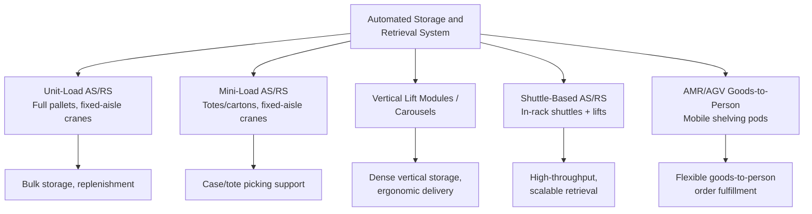

## Automated Storage and Retrieval Systems

### Overview

Automated Storage and Retrieval Systems (AS/RS) are computer-controlled systems that automatically place (store) and retrieve loads from defined storage locations, using dedicated machinery — cranes, shuttles, or robotic vehicles — rather than manual forklift or picker travel. AS/RS technology directly addresses the same core objective as manual warehouse layout and slotting strategy (minimizing travel time and maximizing space utilization), but does so by substituting automated, precisely-controlled machine movement for human or manually-driven vehicle movement, typically enabling substantially higher storage density and throughput consistency than manual operations at the cost of significant upfront capital investment.

### Core AS/RS Categories

**Unit-Load AS/RS**

Handles large, palletized, or unitized loads (typically full pallets or large containers), using fixed-aisle storage-and-retrieval cranes that travel vertically and horizontally within a single aisle to store and retrieve loads from very tall, dense racking structures. Optimized for bulk storage and replenishment operations rather than individual item picking.

**Mini-Load AS/RS**

Handles smaller loads — totes, cartons, or trays — rather than full pallets, typically used to automate storage and retrieval for piece-picking or case-picking operations where individual SKU quantities are smaller than full-pallet volume. Commonly paired with a "goods-to-person" picking workflow (see below).

**Vertical Lift Modules (VLM) and Vertical Carousels**

Compact, enclosed automated storage units that store trays or shelves in a dense vertical configuration, delivering a requested tray to an operator at an ergonomic access point via a vertical lift or rotating carousel mechanism, rather than requiring the operator to travel to the storage location.

**Shuttle-Based AS/RS**

Uses automated shuttle vehicles that travel within storage racking levels (horizontally within a level, with a separate lift mechanism moving loads between levels) to store and retrieve loads, offering an alternative to fixed crane-per-aisle systems with potentially greater flexibility in throughput scaling (adding shuttles can increase throughput without requiring a full additional aisle-crane installation).

**Autonomous Mobile Robot (AMR) and Automated Guided Vehicle (AGV) Systems**

Mobile robots that navigate the warehouse floor (rather than being confined to a fixed rail or aisle structure) to transport shelving units, totes, or pallets to a stationary picker or workstation — the defining example being the goods-to-person model where entire mobile shelving pods are brought to a picker rather than the picker or a fixed crane traveling to the shelving.

### Goods-to-Person vs. Person-to-Goods Paradigm

**Person-to-Goods (Traditional Manual Model)**

The picker travels through the warehouse to the storage location where a required SKU resides — the model underlying traditional manual slotting and picking strategies. Travel time is the dominant component of picking labor time in this model, which is precisely why velocity-based slotting (minimizing travel distance for high-frequency SKUs) is such a high-leverage manual-warehouse optimization.

**Goods-to-Person (Automated Model)**

Rather than the picker traveling to inventory, the automated system (AS/RS crane, shuttle, or mobile robot) brings the required inventory (a tray, tote, or mobile shelving pod) to a stationary picker workstation. This fundamentally restructures the labor time equation: picker travel time is largely eliminated, replaced by picker wait time for the system to deliver the next required item, and the automated retrieval system itself becomes the primary throughput bottleneck/driver rather than picker walking speed.

$$T_{\text{pick, manual}} \approx T_{\text{travel}} + T_{\text{search}} + T_{\text{pick}}$$

$$T_{\text{pick, goods-to-person}} \approx T_{\text{wait for delivery}} + T_{\text{pick}}$$

Since $T_{\text{travel}}$ and $T_{\text{search}}$ are typically the largest components of manual picking time, goods-to-person systems can substantially increase individual picker productivity (picks per hour) by eliminating them — but total system throughput becomes bounded by how many totes/pods the automated retrieval mechanism can deliver per hour, shifting the bottleneck from human walking speed to machine retrieval capacity.

### Key Performance Drivers

**Storage Density**

AS/RS systems, particularly unit-load and mini-load crane-based systems, typically achieve substantially higher storage density than manual racking accessible by forklift, because aisle widths can be minimized (no need for a forklift or picker to physically maneuver within the aisle — only the automated crane, which requires much less clearance) and vertical storage height can be extended well beyond typical manual reach or forklift lift height.

**Throughput Capacity**

System throughput (storage/retrieval transactions per hour) is generally determined by the number of independent retrieval mechanisms (cranes, shuttles, or robots) operating in parallel, rather than by storage capacity itself — meaning throughput and storage capacity can, within certain system architectures, be scaled somewhat independently (adding storage locations without necessarily adding retrieval mechanisms, or vice versa), a flexibility that differs from purely manual systems where storage capacity and picker travel time are more tightly coupled.

**Retrieval Time Consistency**

Automated systems generally provide highly consistent, predictable retrieval times compared to manual picking, where travel time can vary substantially based on picker location, congestion with other pickers, and individual picker pace — a reliability characteristic valuable for accurate throughput planning and service-level commitment.

**Accuracy**

Automated storage and retrieval, combined with system-directed picking confirmation (barcode/RFID scanning at the pick point), typically reduces picking errors compared to manual location-finding and SKU selection, since the system directs exactly which item is presented and can verify the pick electronically.

### Investment and Trade-off Considerations

**Capital Intensity**

AS/RS systems require substantial upfront capital investment in racking, cranes/shuttles/robots, control systems, and integration with warehouse management and control software — a materially higher capital barrier than manual racking and forklift/picker-based operations, requiring a longer-horizon volume and throughput commitment to justify the investment.

**Flexibility and Reconfigurability**

Fixed-aisle crane-based AS/RS systems (unit-load and mini-load) are generally less flexible to reconfigure than manual racking once installed, since the crane infrastructure is physically built to specific aisle dimensions and storage configurations. AMR/AGV-based systems generally offer greater reconfiguration flexibility, since mobile robots and shelving pods can be redeployed or reconfigured without structural/civil changes to the facility.

**Scalability Pattern**

Shuttle-based and AMR-based systems often support more incremental scalability (adding shuttles or robots to increase throughput/capacity in smaller increments) compared to crane-based unit-load or mini-load systems, where capacity additions may require a larger discrete investment (an additional full aisle-and-crane installation).

**Maintenance and Reliability Dependency**

Automated systems introduce a dependency on mechanical and software system reliability that manual operations do not carry to the same degree — a crane, shuttle, or robot failure can halt operations for the affected zone or system entirely, whereas a manual picker's absence or slowdown affects throughput only proportionally, not systemically. This makes maintenance program design and system redundancy planning a materially more significant operational consideration for AS/RS-equipped facilities.

**Labor Model Shift**

AS/RS adoption shifts the facility's labor profile from primarily manual, mobile picking labor toward stationary picking/packing labor at automated workstations, plus a smaller number of higher-skilled technical/maintenance staff supporting the automated systems — a workforce composition and skill-requirement change that has organizational and change-management implications beyond the pure engineering/throughput analysis.

### Applicability Considerations

**Volume and Throughput Justification**

AS/RS investment is generally justified by sufficiently high and sustained throughput volume to amortize the substantial capital investment over the system's operating life — facilities with lower or highly variable volume may not achieve sufficient utilization to justify automation relative to the flexibility of manual or semi-automated operations.

**SKU and Product Characteristics**

AS/RS systems, particularly standardized tote/tray-based mini-load and goods-to-person systems, generally favor product assortments with relatively standardized, containerizable dimensions; highly variable, oversized, or irregularly-shaped product mixes may be less suited to fully automated storage without significant system customization or hybrid manual/automated zoning.

**Facility Lifespan and Flexibility Requirements**

Given AS/RS's relatively lower reconfigurability (particularly for fixed crane-based systems) and high capital intensity, facilities anticipating significant future changes in product mix, order profile, or throughput requirements may weigh this rigidity against the throughput and density benefits when evaluating automation investment, especially relative to more flexible AMR-based alternatives.

### Common Pitfalls

- **Justifying AS/RS investment purely on labor cost reduction without accounting for the shifted bottleneck to machine throughput capacity**, potentially underestimating the number of retrieval mechanisms needed to achieve a target overall system throughput.
- **Underestimating integration complexity with existing warehouse management and control systems**, since AS/RS requires tight, real-time coordination between the automated equipment control system and the WMS/WCS software layer.
- **Selecting a fixed-aisle crane-based system for an operation with significant anticipated future reconfiguration needs**, foreclosing flexibility that a shuttle-based or AMR-based alternative would have preserved.
- **Underinvesting in maintenance program design and redundancy planning**, exposing the facility to the concentrated operational risk that automated system downtime represents relative to manual operations.
- **Assuming automation is universally superior to manual operations regardless of volume/throughput profile**, when facilities with lower, highly variable, or highly seasonal volume may not achieve the utilization needed to justify AS/RS's capital intensity relative to more flexible manual or semi-automated approaches.

### Related Topics

- Warehouse Layout and Slotting Strategy
- Order Picking Methodologies (Batch, Zone, and Wave Picking)
- Warehouse Management System (WMS) and Warehouse Control System (WCS) Architecture
- Robotics and Automation ROI Analysis in Distribution Centers
- Micro-Fulfillment Center Design and Dark Store Operations
- Material Handling Equipment Selection Criteria
- Facility Capital Investment and Throughput Capacity Planning