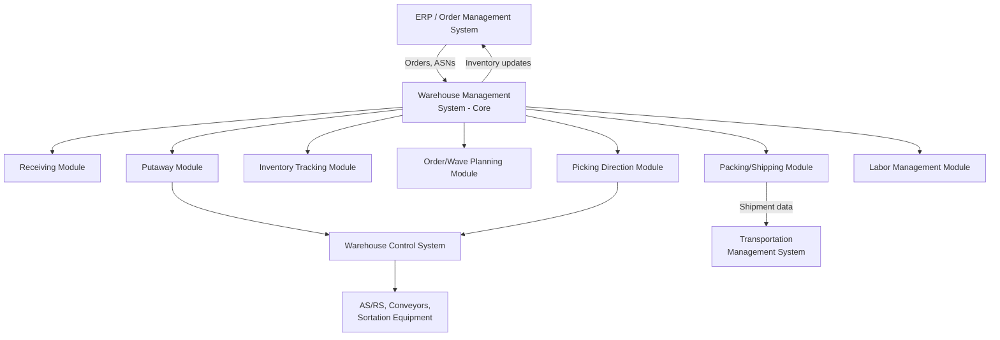

## Warehouse Management System Architecture

### Overview

A Warehouse Management System (WMS) is the software platform that directs, tracks, and optimizes the physical execution of warehouse operations — receiving, putaway, inventory tracking, order picking, packing, and shipping — serving as the operational control layer that translates upstream planning and order data into concrete, executable instructions on the warehouse floor. Where warehouse layout and slotting strategy establish the physical design and AS/RS systems provide automated execution mechanisms, the WMS is the software architecture that coordinates and directs both, functioning as the system of record and control for real-time warehouse execution.

### Core Functional Modules

**Inbound/Receiving Management**

Manages the process of receiving inbound shipments against expected purchase orders or advance shipment notices (ASNs), including quantity verification, quality inspection triggers, and cross-dock eligibility determination (identifying inbound freight that can bypass storage and move directly to an outbound shipment, as discussed in cross-docking operations).

**Putaway Management**

Directs where received inventory should be stored, applying the facility's slotting strategy (velocity-based, dynamic/random, or hybrid, as discussed in warehouse layout and slotting) to generate specific putaway location instructions, and in automated facilities, interfacing with warehouse control systems to direct AS/RS or robotic putaway execution.

**Inventory Management and Tracking**

Maintains real-time, location-level visibility into inventory quantity, location, lot/serial number, and status (available, allocated, quarantined, damaged) — the core system-of-record function that all other WMS modules and most external systems (ERP, order management) depend on for accurate inventory visibility.

**Order Management and Wave Planning**

Receives outbound order requirements (from an order management system or ERP) and organizes them into pick waves — batches of orders released for picking together based on criteria such as carrier cutoff time, picking zone, or order priority — to optimize labor and equipment utilization across a picking shift.

**Picking Direction**

Generates and directs specific picking tasks to warehouse labor or automated systems, supporting various picking methodologies (discrete/single-order picking, batch picking, zone picking, cluster picking), and typically integrating with mobile scanning devices, pick-to-light systems, voice-directed picking, or automated goods-to-person workstations to communicate and confirm picking instructions.

**Packing and Shipping Management**

Directs and verifies the packing process (which items go into which shipping container, cartonization logic to minimize packaging material and shipping cost), generates shipping documentation and carrier labels, and confirms shipment completion, often integrating with a transportation management system (TMS) for carrier selection and rate shopping at this stage.

**Labor Management**

Tracks and analyzes individual and team labor performance against engineered standards (time expected for each task type), supporting labor planning, performance management, and incentive program administration — a module increasingly integrated directly into modern WMS platforms rather than operated as a fully separate system.

### WMS vs. WCS: The Control Layer Distinction

**Warehouse Management System (WMS)**

Operates at the business-logic and task-direction level: determining *what* should happen (which SKU should be putaway where, which orders should be picked in which wave, which picking method to apply) based on inventory data, order priorities, and configured business rules.

**Warehouse Control System (WCS)**

Operates at the equipment-orchestration level: translating the WMS's task-level directions into the specific, real-time commands that drive physical material handling equipment (conveyors, sortation systems, AS/RS cranes/shuttles, automated guided vehicles), managing the low-level sequencing and coordination that the WMS itself does not typically handle directly.

**Architectural Significance of the Distinction**

This separation of concerns allows a WMS to remain relatively equipment-agnostic (focused on business logic) while the WCS handles the equipment-specific, often vendor-proprietary integration and control logic — a facility can in principle change or add automated equipment types by primarily updating or extending the WCS layer, without requiring a full WMS replacement, though in practice this separation is cleaner in some system architectures than others, and some vendors offer combined WMS/WCS platforms rather than maintaining a strict architectural separation. [Unverified: the degree of separation and interoperability between WMS and WCS layers varies significantly by vendor and specific system implementation.]

### System Integration Architecture

**Upstream Integration: ERP and Order Management**

The WMS typically receives inbound shipment notifications (ASNs) and outbound order requirements from an enterprise resource planning (ERP) system or dedicated order management system (OMS), and returns inventory status updates, shipment confirmations, and completed transaction data back to those systems — requiring reliable, typically near-real-time or batch-interval data synchronization to keep enterprise-level inventory and order status accurate.

**Downstream Integration: Transportation Management System (TMS)**

Upon order completion within the warehouse, the WMS typically hands off shipment-ready order data to a TMS for carrier selection, rate shopping, and shipment execution — an integration point connecting warehouse execution to the broader transportation network design and mode-selection decisions discussed elsewhere in this domain.

**Lateral Integration: Warehouse Control Systems and Automation**

As discussed above, the WMS interfaces with WCS-layer systems to direct automated material handling equipment, and in facilities without a distinct WCS layer, may integrate more directly with individual pieces of automated equipment (AS/RS controllers, conveyor PLCs, sortation systems).

**Data Capture Integration: Scanning and IoT Devices**

Mobile barcode/RFID scanners, voice-recognition picking devices, pick-to-light/put-to-light systems, and increasingly IoT sensors (weight verification, dimension capture) feed real-time transaction confirmation data into the WMS, closing the loop between directed tasks and confirmed physical execution.

### Deployment and Technical Architecture Models

**On-Premises Deployment**

The WMS software and supporting infrastructure (servers, databases) are hosted and maintained within the company's own data center or facility infrastructure, offering maximal control over system configuration and data residency, at the cost of the company bearing infrastructure maintenance, upgrade, and scaling responsibility directly.

**Cloud/SaaS Deployment**

The WMS is hosted and maintained by the vendor (or a cloud infrastructure provider) and accessed as a service, typically with the vendor responsible for infrastructure scaling, maintenance, and software updates — increasingly the dominant deployment model for new WMS implementations, offering faster initial deployment and reduced internal infrastructure burden, though introducing dependency on the vendor's service reliability and typically less deep customization flexibility than some on-premises alternatives. [Unverified: the relative prevalence and specific trade-offs of cloud versus on-premises WMS deployment continue to evolve and would benefit from verification against current market data for a specific vendor evaluation.]

**Standalone vs. ERP-Embedded WMS**

Some WMS functionality is offered as a module embedded within a broader ERP suite, while other implementations use a dedicated, standalone best-of-breed WMS integrated with the ERP via defined interfaces. The embedded approach can simplify integration (since data flows within a single vendor's platform) at the potential cost of less specialized warehouse-execution functionality compared to a purpose-built standalone WMS; the standalone approach typically offers deeper warehouse-specific capability at the cost of requiring robust, actively-maintained integration with the separate ERP system.

### Configuration and Business Rule Architecture

**Rules-Based Task Direction**

Modern WMS platforms are typically configured (rather than custom-coded) using business rule engines that determine putaway location logic, wave release criteria, picking method selection, and packing/cartonization logic — allowing warehouse operations teams to adjust operational logic through configuration rather than requiring software development for common operational changes.

**Multi-Client and Multi-Facility Support**

WMS platforms serving third-party logistics providers or multi-facility operations typically require robust multi-tenancy or multi-client configuration capability, supporting distinct business rules, inventory segregation, and reporting for different clients or facilities within a single system instance — a materially more complex configuration architecture than a single-client, single-facility deployment.

**Real-Time vs. Batch Processing Architecture**

Inventory and task-status updates within modern WMS architectures are increasingly processed in real-time (immediate system reflection of scan/confirmation events) rather than in periodic batch cycles, supporting more accurate real-time inventory visibility and more responsive wave/task re-planning — though the specific real-time processing requirements and achievable latency depend on the underlying system architecture and integration design.

### Key Architectural Considerations for Implementation

**Scalability**

The system architecture must support the facility's (or network's) transaction volume, user concurrency, and data volume requirements, including anticipated growth — a particularly important consideration for cloud-based multi-tenant architectures where resource allocation and performance isolation between clients/facilities must be architecturally sound.

**Configurability vs. Customization**

A key architectural trade-off in vendor selection is the balance between rules-based configurability (generally lower-risk, easier to maintain through version upgrades) and deep custom code modification (potentially addressing more specific operational requirements, but generally increasing upgrade complexity and long-term maintenance burden).

**Integration Resilience**

Given the WMS's central position in the data flow between ERP, TMS, WCS, and physical execution systems, the architecture's approach to integration failure handling (retry logic, error queuing, manual intervention workflows) is a significant reliability consideration, since integration failures can directly halt physical warehouse operations if not gracefully handled.

**Downtime and Business Continuity Planning**

Because the WMS directs live, time-sensitive physical operations, system downtime (whether from the WMS itself, its hosting infrastructure, or critical integrations) can directly halt warehouse throughput — making disaster recovery planning, failover architecture, and defined manual-fallback procedures a materially important architectural and operational planning consideration, particularly for facilities incorporating significant automation dependency (see *Automated Storage and Retrieval Systems*).

### Common Pitfalls

- **Underestimating integration complexity and ongoing maintenance burden** between the WMS and adjacent systems (ERP, TMS, WCS), particularly in standalone best-of-breed architectures requiring custom-built or continuously-maintained interfaces.
- **Over-customizing a WMS platform** in ways that complicate future software version upgrades, effectively locking the organization into an increasingly outdated platform version to avoid re-implementing customizations.
- **Insufficient business continuity/failover planning** for a system whose downtime directly halts physical operations, particularly in highly automated facilities with significant WCS/equipment dependency.
- **Selecting a WMS platform based primarily on feature checklist comparison** without adequately assessing the platform's fit with the facility's specific automation architecture, multi-client/multi-facility requirements, and integration ecosystem.
- **Treating WMS implementation as a purely technical project** rather than an operational change-management effort, since the business-rule configuration (slotting logic, wave planning criteria, picking methodology) requires deep collaboration between technical implementers and warehouse operations expertise to configure effectively.

### Related Topics

- Warehouse Layout and Slotting Strategy
- Automated Storage and Retrieval Systems
- Order Picking Methodologies (Batch, Zone, and Wave Picking)
- Transportation Management System (TMS) Architecture and Integration
- Cross-Docking Operations Design
- Enterprise Resource Planning (ERP) and Supply Chain System Integration
- Inventory Accuracy and Cycle Counting Programs