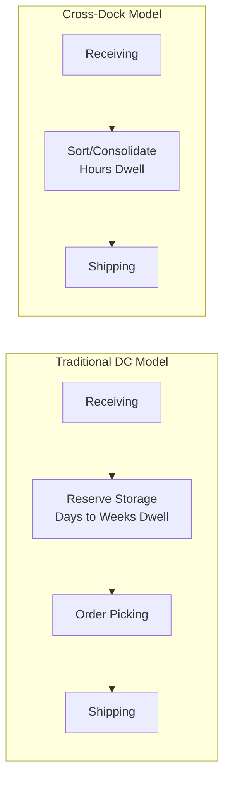

## Cross-Docking Operations Design

### Overview

Cross-docking is a warehouse/distribution center operating model in which inbound freight is received and moved directly (or with minimal delay) to outbound transportation, bypassing put-away into long-term storage entirely. Rather than functioning as an inventory-holding node, a cross-dock facility functions primarily as a consolidation and sortation point — freight typically spends hours, not days or weeks, within the facility. This directly operationalizes several concepts introduced elsewhere in this domain: it is the physical mechanism underlying pool distribution and hub-and-spoke network topologies, and represents a deliberate design choice to minimize inventory-holding cost in exchange for tighter synchronization requirements between inbound and outbound transportation schedules.

### Core Operating Principle

**Minimal Dwell Time**

The defining characteristic of cross-docking is that inbound freight dwell time within the facility is deliberately minimized — ideally freight arrives, is sorted/consolidated, and departs within the same operating shift or day, rather than being placed into reserve storage and picked/replenished on a separate, decoupled timeline as in a traditional distribution center model.

**Inventory Cost vs. Coordination Cost Trade-off**

Cross-docking trades reduced inventory carrying cost (since goods are not held in storage, they avoid the capital and space cost of holding inventory) for increased coordination and synchronization requirements (inbound and outbound transportation schedules must be tightly aligned, since there is little or no buffer inventory to absorb timing mismatches between when freight arrives and when it needs to depart).

### Cross-Dock Type Classifications

**Pre-Distribution (Pre-Allocated) Cross-Docking**

Inbound freight already carries destination-level allocation information at the time of shipment from the origin (e.g., cases are pre-labeled or pre-picked for a specific downstream store or customer before departure), so the cross-dock facility's role is essentially pure sortation and consolidation — routing already-allocated freight to the correct outbound load without needing to make allocation decisions on-site.

**Post-Distribution (Opportunistic) Cross-Docking**

Inbound freight arrives without pre-determined destination allocation, and the cross-dock facility determines allocation to specific outbound destinations based on real-time demand or inventory information at the time of processing — requiring more on-site decision-making capability (typically WMS-directed) than pre-distribution cross-docking, but offering greater flexibility to respond to the most current demand signal rather than a decision made further upstream and earlier in time.

**Manufacturing Cross-Docking**

Inbound components or sub-assemblies from suppliers are received and immediately staged for outbound movement directly into a production process (rather than into finished-goods distribution), synchronizing inbound supply with production consumption timing — closely related to just-in-time (JIT) supply and lean manufacturing material flow principles.

**Retail/Distribution Cross-Docking**

The most common form in retail and consumer goods distribution: inbound freight from multiple suppliers is consolidated and re-sorted by destination store or customer, converting many separate supplier-to-store shipments into fewer, more efficient consolidated movements — directly implementing the pool distribution network topology discussed in freight network design.

**Transportation (Hub) Cross-Docking**

Freight is transferred between transportation modes or vehicles for network/routing efficiency reasons (e.g., LTL freight consolidated at a hub terminal, or freight transferred from a long-haul trailer to local delivery vehicles) without necessarily involving multiple suppliers or destination-level allocation logic — the operational mechanism underlying hub-and-spoke network topology.

### Physical and Operational Requirements

**Facility Layout Requirements**

Cross-dock facilities are typically designed with a distinctive layout emphasizing dock door density and flow-through efficiency over storage density: a high ratio of dock doors to total facility square footage (often significantly higher than a traditional storage-oriented DC), a relatively shallow building depth (minimizing the travel distance freight must move between inbound and outbound doors), and often a U-shaped or similar configuration allowing flexible door assignment between inbound and outbound functions as daily flow patterns require.

**Dock Door Assignment and Scheduling**

Because the facility's core function is synchronizing inbound arrivals with outbound departures, dock door scheduling (which inbound trailers unload at which doors, and how those doors relate physically to the outbound doors serving the freight's destination) is a central operational planning activity, directly affecting how far freight must travel within the facility and how tightly inbound-outbound timing can be synchronized.

**Staging Area Design**

Even with minimal dwell time, cross-dock operations typically require some staging space to accommodate short-term timing mismatches between inbound arrival and outbound departure — sized to balance the facility's core low-inventory objective against realistic variability in carrier arrival times.

**Labor and Equipment Flow**

Cross-dock labor is organized around rapid unload-sort-reload cycles rather than the storage/retrieval and order-picking labor model of a traditional DC, typically using forklifts, pallet jacks, and conveyor/sortation equipment optimized for high-velocity, short-distance movement rather than the vertical storage-access equipment (reach trucks, order pickers) common in storage-oriented facilities.

### Information System Requirements

**Advance Shipment Notice (ASN) Dependency**

Effective cross-docking is heavily dependent on accurate, timely advance shipment notices from inbound suppliers or origin facilities, since the cross-dock facility must know what is arriving, when, and (for pre-distribution cross-docking) its destination allocation, with enough lead time to plan dock door assignment, staging, and outbound load-building before the freight physically arrives.

**Real-Time Inbound-Outbound Synchronization**

The WMS/WCS architecture supporting a cross-dock operation must provide real-time visibility into inbound arrival status and outbound departure schedules, since the facility's core value proposition depends on tight timing coordination that a batch-oriented or delayed-visibility system could not adequately support.

**Exception Management**

Because cross-docking carries minimal buffer inventory to absorb disruptions, the information system architecture must support rapid exception identification and resolution when inbound freight is delayed, mis-allocated, or does not match expected ASN data — a materially more time-critical exception-handling requirement than in a traditional storage-buffered DC, where a delayed inbound shipment might be absorbed by existing reserve inventory without immediately affecting outbound shipments.

### Enabling Conditions for Successful Cross-Docking

**Demand and Supply Predictability**

Cross-docking works best when inbound supply and outbound demand are both reasonably predictable and synchronized in timing, since the model's minimal-buffer design offers little tolerance for significant, unplanned mismatches between inbound arrival timing and outbound requirement timing.

**High and Consistent Volume**

Sufficient volume moving through the facility on a consistent basis is generally needed to justify the specialized facility design and tight operational coordination cross-docking requires, and to make the door-scheduling and load-building process operationally efficient rather than sparse and difficult to consolidate.

**Reliable Inbound Transportation**

Since cross-docking depends on accurate, timely arrival of inbound freight to meet outbound departure windows, transportation reliability (of the inbound carriers/suppliers feeding the cross-dock) is a more critical enabling condition than in a storage-buffered model, where transportation variability can be partially absorbed by existing on-hand inventory.

**Supplier/Partner Data Integration Capability**

Because pre-distribution cross-docking in particular depends on accurate upstream allocation and ASN data, the broader supply chain partners feeding the cross-dock facility must have the data integration capability (EDI or API-based ASN transmission, accurate labeling/allocation at origin) to support the model — an external dependency not required to the same degree in a traditional DC model where the facility itself determines allocation at time of order fulfillment.

### Relationship to Broader Supply Chain Strategy

**Connection to Postponement and Decoupling Point Placement**

Cross-docking is compatible with, but distinct from, postponement strategy: a cross-dock facility can serve as the physical location where late-stage consolidation, light kitting, or final sortation occurs (connecting to the decoupling point concepts discussed in the postponement chapter), though pure cross-docking (no processing beyond sortation) and postponement-oriented processing (some value-added differentiation before outbound dispatch) represent somewhat different operational models sharing the same minimal-storage-dwell principle.

**Connection to Freight Consolidation**

Cross-docking is one of the primary physical mechanisms enabling the freight consolidation strategies discussed in load optimization — since freight from multiple inbound sources can be immediately re-sorted and combined onto more efficiently-utilized outbound loads without the delay and cost of intermediate storage.

### Common Pitfalls

- **Attempting cross-docking without adequate inbound transportation reliability or ASN data accuracy**, resulting in either operational chaos when freight doesn't match expectations, or a de facto reversion to storage-buffered operations that undermines the model's core cost advantage.
- **Underinvesting in dock door scheduling and facility layout design**, since a poorly configured facility (insufficient dock doors, poor inbound-to-outbound door proximity) directly limits the throughput and efficiency gains cross-docking is meant to provide.
- **Insufficient staging capacity for realistic timing variability**, either creating operational bottlenecks when even modest inbound delays occur, or conversely over-sizing staging space in a way that erodes the facility's cost-efficiency advantage over a traditional DC.
- **Applying cross-docking to product/demand profiles with insufficient predictability or volume**, where the tight coordination requirements cannot realistically be met, leading to service failures or a costly hybrid operation that captures neither the storage-buffer flexibility of a traditional DC nor the low-cost efficiency of a well-functioning cross-dock.
- **Neglecting exception-handling process design**, since the minimal-buffer nature of cross-docking means disruptions propagate to outbound operations more quickly and directly than in a storage-buffered facility, requiring correspondingly faster and more robust exception resolution capability.

### Related Topics

- Freight Network and Routing Design
- Freight Consolidation and Load Optimization
- Warehouse Management System Architecture
- Just-in-Time (JIT) Manufacturing and Supply Synchronization
- Channel Assembly and Vendor Postponement Models
- EDI and Advance Shipment Notice (ASN) Standards
- Distribution Center and Facility Location Optimization