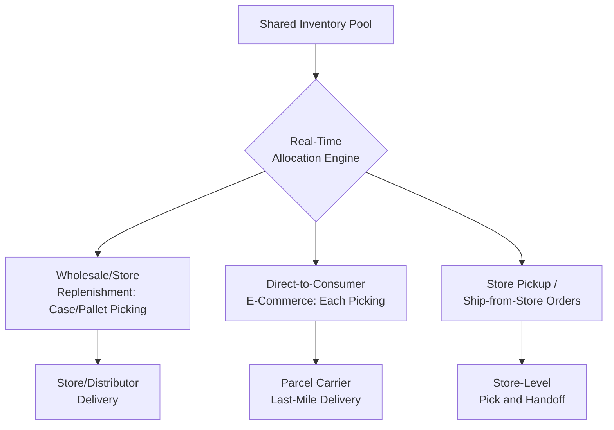

## Fulfillment Center Design for Omnichannel Distribution

### Overview

Fulfillment center design for omnichannel distribution addresses the architectural challenge of a single facility (or coordinated facility network) supporting multiple, structurally different order-fulfillment channels — traditional wholesale/retail-store replenishment, direct-to-consumer e-commerce, and store-fulfilled or facility-fulfilled options like buy-online-pickup-in-store (BOPIS) and ship-from-store — from a shared or overlapping inventory pool. This represents a significant departure from single-channel distribution center design, since the order profiles, unit-of-measure requirements, and service-level expectations of each channel differ substantially, yet the omnichannel model typically seeks to serve them from common inventory and, often, common physical infrastructure.

### Why Omnichannel Fulfillment Differs Structurally from Single-Channel Design

**Order Profile Heterogeneity**

Traditional store/wholesale replenishment orders are typically large, full-case or full-pallet quantities with relatively predictable, batch-oriented timing. Direct-to-consumer e-commerce orders are typically small (often single-unit or few-unit), highly time-sensitive, and arrive continuously rather than in predictable batches — a fundamentally different picking, packing, and throughput profile that a facility designed purely around case/pallet-level store replenishment is poorly suited to handle efficiently.

**Unit-of-Measure Mismatch**

Store replenishment operates predominantly at the case or pallet level; e-commerce fulfillment operates predominantly at the each/piece level. A facility supporting both must support both granularities of picking, storage, and handling — often requiring materially different equipment, slotting strategy, and labor skill sets within the same building or network.

**Service-Level Divergence**

E-commerce customers frequently expect same-day, next-day, or narrowly-windowed delivery commitments; traditional store replenishment typically operates on longer, more flexible planning cycles. This divergence in customer tolerance time (see *Decoupling Point Placement for Customization*) means the two channels can impose very different urgency and prioritization requirements on shared facility resources.

**Inventory Visibility and Allocation Complexity**

Serving multiple channels from a shared inventory pool requires real-time, accurate inventory visibility and allocation logic capable of reserving/allocating the same physical inventory pool across channels without creating oversell risk in one channel due to consumption by another — a materially more complex inventory management requirement than single-channel operation, where inventory need only be tracked against a single demand stream.

### Facility Design Approaches

**Dedicated Channel Facilities**

Separate, purpose-built facilities are operated for each channel — a traditional case/pallet-oriented DC for wholesale/store replenishment, and a distinct, each-pick-optimized fulfillment center for e-commerce. This approach allows each facility to be optimized (layout, slotting, equipment, labor model) specifically for its channel's order profile, at the cost of inventory fragmentation across separate physical inventory pools (unless connected by a real-time inventory-visibility and allocation layer), and duplicated fixed facility investment.

**Unified/Combined Facility**

A single facility supports multiple channels from a shared inventory pool and shared (or zoned) physical infrastructure, typically requiring internal zoning (e.g., a case/pallet-oriented zone for wholesale picking and an each-pick-optimized zone for e-commerce, potentially including automated goods-to-person or AS/RS infrastructure for the each-pick zone) within a single building. This approach maximizes inventory pooling benefits (a single unit of inventory can fulfill demand from any channel) at the cost of more complex internal zoning, equipment, and labor-model coordination within one facility.

**Hybrid Network Model**

A tiered network combining large, centralized fulfillment centers (optimized for cost-efficient, higher-latency fulfillment) with smaller, more numerous, or more geographically distributed nodes — including micro-fulfillment centers, dark stores, or store-based fulfillment (using retail store inventory to fulfill nearby e-commerce or BOPIS demand) — positioned to reduce last-mile distance and delivery time for time-sensitive channels, while less time-sensitive demand is served from more centralized, storage-efficient nodes.

**Store-as-Fulfillment-Node Model**

Retail store inventory is used to fulfill e-commerce orders (ship-from-store) or serve as a pickup point (BOPIS/click-and-collect), leveraging the existing retail store network's geographic density to reduce delivery distance without requiring dedicated fulfillment-center capital investment. This approach converts existing retail infrastructure into a distributed fulfillment network node, but requires store operations to take on fulfillment-center-like tasks (picking, packing, staging for pickup or carrier handoff) that are structurally different from traditional in-store retail operations, and introduces potential conflict between in-store customer service priorities and fulfillment task completion.

### Internal Zoning Strategy for Unified Facilities

**Case/Pallet Zone**

Configured similarly to a traditional wholesale distribution center: bulk storage, forklift-accessible racking, and case/pallet-level picking optimized for large, predictable replenishment orders.

**Each-Pick Zone**

Configured for high-velocity, small-quantity picking, often incorporating automated goods-to-person systems (mini-load AS/RS, AMR-based mobile shelving) or dense, ergonomically-optimized manual each-pick modules, reflecting the fundamentally different labor and throughput profile of individual e-commerce order fulfillment relative to case/pallet picking.

**Shared vs. Segregated Inventory Buffer**

A key architectural decision within a unified facility is whether forward-pick inventory is physically shared between zones (with replenishment feeding both case-pick and each-pick locations from common reserve storage) or maintained as segregated buffer pools per channel — the shared approach maximizes inventory pooling benefit but requires more sophisticated replenishment and allocation logic; segregated buffers simplify operational logic at the cost of reduced pooling benefit.

**Returns Processing Integration**

Omnichannel operations, particularly with significant e-commerce and BOPIS volume, typically generate materially higher return volumes and complexity (returns from carrier shipment, in-store returns of items purchased online, and vice versa) than pure wholesale distribution, often warranting a dedicated returns-processing zone or workflow integrated into the facility design rather than treated as an afterthought.

### Inventory Allocation and Visibility Architecture

**Available-to-Promise (ATP) Logic**

The system architecture supporting omnichannel fulfillment must implement real-time or near-real-time available-to-promise logic, determining which channel(s) a given unit of inventory can be committed to at order-acceptance time, preventing oversell across channels drawing from a shared pool.

**Inventory Segmentation and Safety Buffers**

Some omnichannel architectures deliberately segment a portion of shared inventory as a channel-specific safety buffer (e.g., reserving a minimum quantity exclusively for e-commerce fulfillment even when store-replenishment demand might otherwise consume it), trading some pooling benefit for protection against one channel's demand fully depleting inventory needed to meet another channel's service commitments.

**Order Orchestration and Fulfillment Node Selection**

For networks with multiple potential fulfillment nodes (centralized DC, regional fulfillment center, store-based fulfillment), an order orchestration layer determines which node should fulfill a given order based on factors such as inventory availability, distance/delivery-time to the customer, node capacity/congestion, and cost — a decision-routing function that sits architecturally above individual facility WMS instances, coordinating fulfillment node selection across the broader network.

### Labor and Throughput Model Implications

**Cross-Trained vs. Specialized Labor**

Unified facilities require a decision about whether labor is cross-trained to work across both case/pallet and each-pick zones (offering staffing flexibility to shift labor toward whichever channel has peak demand at a given time) or specialized by zone (potentially achieving higher per-zone productivity through task specialization, at the cost of reduced cross-channel staffing flexibility).

**Peak Demand Synchronization Risk**

Because e-commerce demand (particularly around promotional events) and wholesale replenishment demand (often tied to separate seasonal or planning cycles) do not necessarily peak at the same time, a unified facility may face the operational challenge of balancing labor and equipment capacity across channels whose peak periods sometimes coincide and sometimes diverge, requiring more sophisticated labor and capacity planning than a single-channel facility with a single, more predictable demand pattern.

### Common Pitfalls

- **Retrofitting a traditional case/pallet-oriented DC for e-commerce each-picking without adequate zone redesign**, resulting in poor each-pick productivity because the facility's underlying layout and slotting logic remains optimized for a fundamentally different order profile.
- **Underinvesting in real-time inventory allocation/ATP architecture**, leading to oversell incidents when multiple channels draw from a shared inventory pool without adequate real-time synchronization.
- **Treating store-as-fulfillment-node initiatives as a pure technology rollout** without adequately redesigning in-store labor processes and incentives to accommodate fulfillment tasks alongside traditional retail customer-service responsibilities.
- **Failing to plan for materially higher return volume and complexity** that omnichannel operations typically generate, treating returns processing as an operational afterthought rather than a designed-for workflow.
- **Applying a single, uniform facility design pattern network-wide** rather than a segmented network strategy (centralized nodes for cost-efficient standard fulfillment, distributed micro-fulfillment or store-based nodes for time-sensitive channels) matched to each channel's actual service-level requirements and demand density.

### Related Topics

- Warehouse Layout and Slotting Strategy
- Automated Storage and Retrieval Systems
- Last-Mile Delivery Architecture
- Micro-Fulfillment Center Design and Dark Store Operations
- Reverse Logistics and Returns Management
- Order Orchestration and Available-to-Promise (ATP) Systems
- Warehouse Management System Architecture