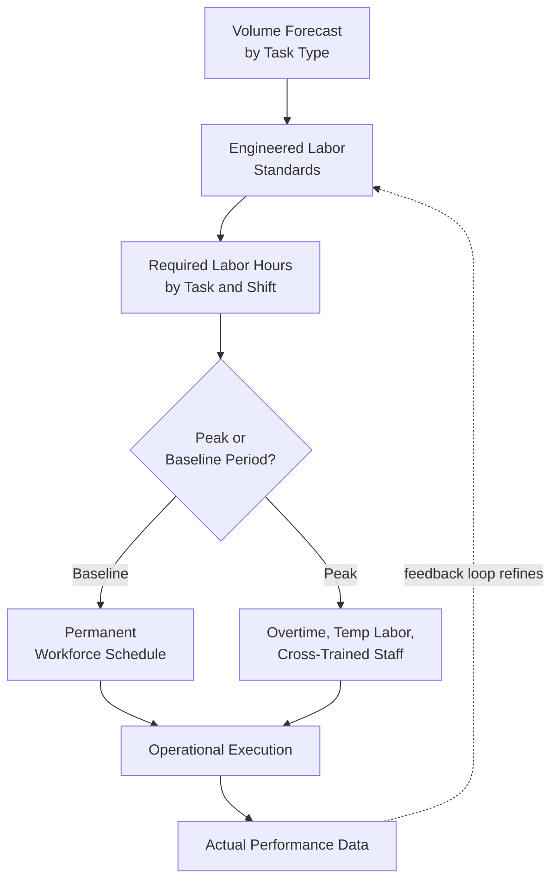

## Labor and Material Handling Equipment Planning

### Overview

Labor and material handling equipment planning is the discipline of determining the workforce size, scheduling, and skill composition, together with the selection and deployment of physical equipment (forklifts, pallet jacks, conveyors, sortation systems), needed to execute a warehouse or distribution center's operational workload reliably and cost-effectively. It sits downstream of layout, slotting, and automation architecture decisions (which establish the physical and systemic environment) and translates those decisions into the concrete human and mechanical capacity required to actually operate the facility day to day.

### Labor Planning Fundamentals

**Engineered Labor Standards**

Time-and-motion-based standards specifying the expected time to complete a defined unit of work (e.g., seconds per each-pick, minutes per pallet putaway, minutes per case pack), typically developed through direct time study, predetermined motion time systems, or statistical analysis of historical performance data. These standards form the foundational input for labor capacity planning, staffing calculations, and individual/team performance management.

**Labor Demand Forecasting**

Translating forecasted order volume (by order type, channel, and picking method — connecting directly to the omnichannel demand-profile considerations discussed elsewhere) into required labor hours by task type and shift, using engineered standards to convert volume forecasts into staffing requirements.

$$H_{\text{required}} = \sum_{t} \frac{V_t}{R_t}$$

Where $H_{\text{required}}$ is total labor hours needed, $V_t$ is forecasted volume for task type $t$ (picks, putaways, cases packed), and $R_t$ is the engineered rate (units per hour) for that task type. This calculation is typically performed at a granular task-type level and then aggregated, since different task types (each-picking, case-picking, replenishment) carry materially different productivity rates.

**Shift Scheduling and Workforce Sizing**

Converting calculated labor-hour requirements into actual shift schedules and headcount, accounting for shift-length constraints, break/rest period regulations, part-time/full-time mix, overtime cost thresholds, and workforce availability — a scheduling optimization problem balancing labor cost against the requirement to have adequate staffing to meet throughput and service-level commitments across variable daily and intraday demand patterns.

**Peak and Seasonal Capacity Planning**

Since warehouse demand is rarely uniform across the year (or even across a week or day), labor planning must address how to flex capacity for peak periods — commonly through a combination of overtime, temporary/seasonal labor, cross-training staff to cover multiple task types, and (where volume justifies it) permanent capacity investment sized to a level between average and peak demand, with peak gaps covered by more flexible/variable capacity sources.

### Labor Model Considerations

**Cross-Training vs. Specialization**

As discussed in the context of omnichannel fulfillment, a workforce can be cross-trained across multiple task types (offering scheduling flexibility to shift labor toward whichever task/zone has the greatest current need) or specialized by task/zone (potentially achieving higher individual productivity through repetition and task mastery, at the cost of reduced flexibility to reallocate labor as demand mix shifts intraday).

**Incentive and Performance Management Structures**

Labor plans commonly incorporate incentive structures (piece-rate or gain-sharing incentives tied to productivity above engineered standard) alongside base compensation, requiring careful design to avoid incentivizing speed at the expense of accuracy or safety — a recurring tension in warehouse labor management design.

**Ergonomics and Safety Integration**

Labor planning is directly connected to the ergonomic slotting considerations discussed in warehouse layout strategy (golden-zone placement, minimizing repetitive strain risk) and to safe equipment operation training and certification requirements — since labor capacity planning that ignores injury risk and associated absenteeism/turnover will tend to overestimate sustainable long-term productivity based on short-term engineered-standard performance alone.

**Turnover and Retention Considerations**

High labor turnover, common in many warehouse/fulfillment environments, imposes ongoing recruiting, onboarding, and training costs, and new employees typically perform below engineered standard during a ramp-up period — meaning labor capacity plans should realistically account for a workforce productivity mix that includes ramping and tenured staff, rather than assuming full engineered-standard productivity uniformly across the entire workforce.

### Material Handling Equipment Categories

**Manual and Powered Hand Trucks/Pallet Jacks**

Used for short-distance, lower-volume movement of palletized or unitized loads, requiring minimal capital investment and training relative to powered lift equipment, generally suited to lower-throughput movement needs or as a supplementary tool alongside primary lift equipment.

**Forklifts (Counterbalance, Reach Trucks, Order Pickers)**

The core powered lift equipment category for most manual/semi-automated warehouse operations: counterbalance forklifts for general-purpose pallet handling and loading/unloading, reach trucks for higher-density narrow-aisle pallet storage and retrieval, and order pickers (allowing an operator to be elevated to access product at height) for case or each-level picking from elevated storage locations.

**Conveyor Systems**

Fixed or semi-fixed material handling infrastructure moving product along a defined path (belt, roller, or accumulation conveyors), commonly used to connect processing stages (receiving to putaway staging, picking to packing, packing to shipping) without requiring powered vehicle movement for that connection, and often integrated with sortation systems for automated destination-based routing.

**Sortation Systems**

Automated systems that route individual items or cartons to designated destinations (specific outbound lanes, order-consolidation locations) based on scanned identification, commonly used in high-volume parcel and e-commerce fulfillment operations where manual sortation would not scale to required throughput.

**Automated Guided Vehicles (AGVs) and Autonomous Mobile Robots (AMRs)**

As discussed in the AS/RS item, mobile robotic systems that transport loads (pallets, totes, or mobile shelving) without requiring a human operator to directly drive the vehicle — representing a capital-intensive but increasingly common alternative or supplement to traditional forklift-based material movement for defined, repeatable transport tasks.

### Equipment Selection Criteria

**Throughput and Volume Requirements**

The required movement volume and velocity (pallets per hour, items per hour) constrains which equipment categories are viable — manual equipment may be entirely adequate for lower-volume operations, while high-volume operations typically require powered equipment, conveyance, or automation to achieve required throughput without impractically large labor headcount.

**Facility Layout and Storage Density Compatibility**

Equipment selection is tightly coupled to the facility's storage configuration: narrow-aisle high-density storage generally requires reach trucks or automated systems rather than wide-turning-radius counterbalance forklifts, directly connecting equipment planning back to the warehouse layout and slotting decisions discussed elsewhere.

**Product Characteristics**

Product weight, dimensions, and handling requirements (fragility, hazmat classification, temperature sensitivity) constrain equipment suitability — for example, certain order-picker or clamp-attachment configurations are required for specific case or unit configurations that standard forklift forks cannot safely or efficiently handle.

**Capital Investment vs. Labor Cost Trade-off**

As with automation decisions generally (see *Automated Storage and Retrieval Systems*), equipment planning involves a trade-off between capital investment in more capable/automated equipment (higher upfront cost, potentially lower ongoing per-unit labor cost) versus lower capital investment in more labor-intensive manual or semi-manual equipment (lower upfront cost, higher ongoing labor cost per unit of throughput) — a decision that should be evaluated against the facility's expected volume, throughput stability, and planning horizon.

**Total Cost of Ownership**

Equipment selection should account not only for acquisition cost but also for fuel/energy costs (including the operational and infrastructure trade-offs between internal combustion, propane, and electric-powered lift equipment), maintenance costs, expected equipment lifespan, and operator training/certification requirements — a total-cost framework analogous to the total landed cost concept applied to transportation decisions.

### Equipment Fleet Sizing and Utilization

**Fleet Sizing Methodology**

Similar in structure to labor capacity planning: forecasted movement volume by task type is converted into required equipment-hours using engineered productivity rates per equipment type, then translated into fleet size accounting for shift patterns, equipment availability/uptime, and desired utilization buffer to avoid equipment shortages during peak periods.

**Equipment Utilization and Idle Time**

Fleet sizing must balance the cost of excess equipment capacity (idle equipment representing unproductive capital investment) against the operational risk of insufficient capacity during peak demand periods — a trade-off directly analogous to labor capacity planning's balance between permanent staffing and flexible/peak capacity.

**Preventive Maintenance Planning**

Equipment fleet planning should incorporate scheduled preventive maintenance downtime into effective capacity calculations, since unplanned equipment failure during peak operational periods can create acute capacity shortfalls with limited ability to quickly substitute alternative capacity, particularly for specialized equipment types.

### Integration with Facility Architecture Decisions

**Connection to Automation Investment Decisions**

Labor and equipment planning decisions are directly interdependent with the automation investment decisions discussed in the AS/RS item — a facility's choice to invest in automated storage/retrieval or goods-to-person systems directly reduces manual material-handling equipment and associated mobile-equipment-operator labor requirements, while shifting labor demand toward stationary picking/packing roles and specialized maintenance technician roles.

**Connection to Warehouse Management System Direction**

The WMS/WCS architecture discussed elsewhere directly generates the task assignments that labor and equipment capacity planning must be sized to execute — meaning labor and equipment planning is not an independent exercise but must be calibrated against the specific task-generation logic (wave planning, picking methodology, putaway rules) the WMS implements.

### Common Pitfalls

- **Using engineered labor standards without periodic validation against actual performance data**, allowing standards to drift out of alignment with real operating conditions (layout changes, product mix shifts) over time.
- **Sizing permanent labor and equipment capacity to peak demand rather than a more cost-efficient baseline-plus-flex model**, resulting in excess idle capacity during non-peak periods.
- **Underestimating new-hire ramp-up time in labor capacity planning**, particularly in high-turnover operations, leading to a persistent gap between planned and actual achievable productivity.
- **Selecting equipment based on acquisition cost alone without total-cost-of-ownership analysis**, potentially selecting lower-upfront-cost equipment that carries higher long-term maintenance, energy, or productivity-limitation costs.
- **Failing to integrate preventive maintenance downtime into effective equipment capacity planning**, creating capacity shortfall risk during periods when maintenance-related downtime coincides with peak operational demand.
- **Treating labor and equipment planning as independent of layout/slotting and automation architecture decisions**, rather than as an integrated capacity-planning exercise calibrated to the facility's specific physical design and task-generation logic.

### Related Topics

- Warehouse Layout and Slotting Strategy
- Automated Storage and Retrieval Systems
- Warehouse Management System Architecture
- Order Picking Methodologies (Batch, Zone, and Wave Picking)
- Workforce Scheduling Optimization and Peak Capacity Planning
- Total Cost of Ownership Analysis for Capital Equipment
- Ergonomics and Safety Design in Manual Material Handling