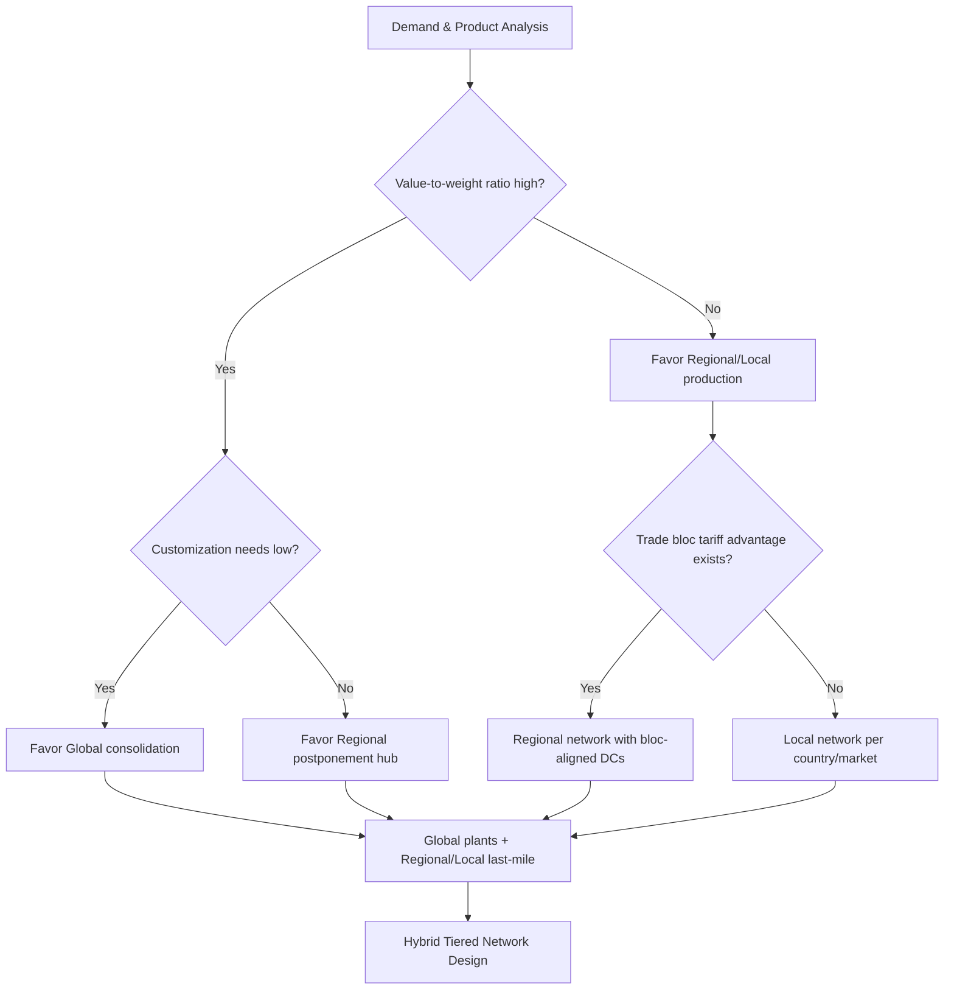

## Global versus Regional versus Local Network Strategies

### Overview

Supply chain network strategy determines the geographic scope at which a company designs, sources, manufactures, stores, and distributes its products. The three archetypal strategies—global, regional, and local—represent points on a spectrum trading off cost efficiency, responsiveness, risk exposure, and regulatory complexity. Most real-world networks are hybrids that blend elements of all three depending on product category, market maturity, and demand volatility.

### Core Definitions

**Global Network Strategy**

A small number of large-scale facilities (often one to three per function—manufacturing, distribution) serve demand across multiple continents. Production is centralized in low-cost or high-capability locations, and finished goods or components travel long distances to reach end markets.

**Regional Network Strategy**

The network is segmented into distinct geographic blocs (e.g., North America, EMEA, APAC), each with its own manufacturing and/or distribution infrastructure sized to serve demand within that bloc. Cross-regional shipment is minimized except for specialized or high-value items.

**Local Network Strategy**

Production and distribution occur close to the point of consumption, often at a country or even city/metro level. This maximizes responsiveness and minimizes lead time and cross-border friction at the cost of scale economies.

### Comparative Framework

| Dimension | Global | Regional | Local |
| --- | --- | --- | --- |
| Facility count | Few, large | Moderate, per-region | Many, small |
| Unit production cost | Lowest (economies of scale) | Moderate | Highest |
| Lead time to market | Longest (weeks) | Moderate (days) | Shortest (hours-days) |
| Inventory pooling benefit | Highest | Moderate | Lowest |
| Transportation cost/emissions | Highest | Moderate | Lowest |
| Tariff/customs exposure | Highest | Moderate | Lowest |
| Responsiveness to local demand shifts | Lowest | Moderate | Highest |
| Currency/geopolitical risk concentration | Highest | Moderate | Lowest |
| Capital intensity | High per facility, low aggregate | Balanced | Low per facility, high aggregate |

### Underlying Economic Trade-offs

**Economies of scale vs. economies of scope/proximity**

A global plant achieves lower marginal cost through scale:

$$C_{unit} = \frac{F}{Q} + v$$

where $F$ is fixed facility cost, $Q$ is output volume, and $v$ is variable cost per unit. As $Q$ grows, fixed cost per unit shrinks—this favors consolidation into fewer, larger global plants.

Against this, the **total landed cost** model captures why consolidation is not always optimal:

$$TLC = C_{production} + C_{transport} + C_{tariff} + C_{inventory} + C_{risk}$$

A global network minimizes $C_{production}$ but inflates $C_{transport}$, $C_{tariff}$, and $C_{inventory}$ (pipeline and safety stock held to buffer long lead times). Regional and local strategies invert this balance.

**Inventory pooling (square root law)**

Consolidating inventory across $n$ locations into fewer, larger hubs reduces aggregate safety stock according to approximately:

$$SS_{consolidated} \approx SS_{single} \times \sqrt{n}$$

This is a primary quantitative justification for global/regional consolidation: fewer, larger stocking points reduce total safety inventory needed to hit a given service level, since demand variability partially cancels out across pooled locations (assuming imperfectly correlated regional demand).

### Decision Drivers

**Factors favoring a Global strategy**

- Product is standardized with minimal regional customization (commodities, semiconductors, basic electronics)
- High capital intensity per plant makes duplication prohibitively expensive (e.g., wafer fabs, chemical crackers)
- Demand is relatively stable and forecastable at the aggregate level
- Low-cost labor or specialized expertise is concentrated in specific geographies
- Product has high value-to-weight ratio, making long-distance freight economically viable

**Factors favoring a Regional strategy**

- Trade blocs (USMCA, EU Single Market, ASEAN) create tariff-free zones that reward regional consolidation
- Products require moderate localization (voltage standards, language, regulatory labeling)
- Demand volatility is high enough that some responsiveness is needed, but not to the local level
- Regional certification/compliance regimes (e.g., FDA vs. EMA vs. PMDA) make cross-region shipment costly regardless of tariffs

**Factors favoring a Local strategy**

- Product is perishable, fragile, or has low value-to-weight ratio (beverages, cement, bread)
- Local content requirements or "Buy Local" regulations mandate domestic production
- Demand is highly volatile, seasonal, or requires same-day/next-day fulfillment (e-commerce last mile)
- Political risk, trade restrictions, or protectionism make cross-border dependency unacceptable
- Cultural/preference variation across markets is high (food, apparel, personal care formulations)

### Illustrative Network Topologies (svg_diagram)

<svg xmlns="http://www.w3.org/2000/svg" viewBox="0 0 900 320" font-family="Arial, sans-serif">
<text x="450" y="20" font-size="16" font-weight="bold" text-anchor="middle">Global vs Regional vs Local Network Topologies (svg_diagram)</text>

<text x="120" y="45" font-size="13" font-weight="bold" text-anchor="middle">Global</text>

<circle cx="120" cy="90" r="18" fill="`#2c6e91`" />

<text x="120" y="95" font-size="9" fill="white" text-anchor="middle">Plant</text>

<circle cx="50" cy="180" r="10" fill="`#a3c9dc`" />

<circle cx="120" cy="200" r="10" fill="`#a3c9dc`" />

<circle cx="190" cy="180" r="10" fill="`#a3c9dc`" />

<circle cx="60" cy="260" r="10" fill="`#a3c9dc`" />

<circle cx="180" cy="260" r="10" fill="`#a3c9dc`" />

<line x1="120" y1="108" x2="50" y2="170" stroke="#555" stroke-width="1" />

<line x1="120" y1="108" x2="120" y2="190" stroke="#555" stroke-width="1" />

<line x1="120" y1="108" x2="190" y2="170" stroke="#555" stroke-width="1" />

<line x1="50" y1="190" x2="60" y2="250" stroke="#555" stroke-width="1" />

<line x1="190" y1="190" x2="180" y2="250" stroke="#555" stroke-width="1" />

<text x="450" y="45" font-size="13" font-weight="bold" text-anchor="middle">Regional</text>

<circle cx="390" cy="90" r="14" fill="`#2c6e91`" />

<circle cx="510" cy="90" r="14" fill="`#2c6e91`" />

<text x="390" y="94" font-size="8" fill="white" text-anchor="middle">DC-A</text>

<text x="510" y="94" font-size="8" fill="white" text-anchor="middle">DC-B</text>

<circle cx="360" cy="180" r="9" fill="`#a3c9dc`" />

<circle cx="420" cy="200" r="9" fill="`#a3c9dc`" />

<circle cx="480" cy="180" r="9" fill="`#a3c9dc`" />

<circle cx="540" cy="200" r="9" fill="`#a3c9dc`" />

<line x1="390" y1="104" x2="360" y2="172" stroke="#555" stroke-width="1" />

<line x1="390" y1="104" x2="420" y2="192" stroke="#555" stroke-width="1" />

<line x1="510" y1="104" x2="480" y2="172" stroke="#555" stroke-width="1" />

<line x1="510" y1="104" x2="540" y2="192" stroke="#555" stroke-width="1" />

<text x="770" y="45" font-size="13" font-weight="bold" text-anchor="middle">Local</text>

<circle cx="700" cy="120" r="10" fill="`#2c6e91`" />

<circle cx="760" cy="100" r="10" fill="`#2c6e91`" />

<circle cx="820" cy="130" r="10" fill="`#2c6e91`" />

<circle cx="730" cy="190" r="10" fill="`#2c6e91`" />

<circle cx="800" cy="200" r="10" fill="`#2c6e91`" />

<circle cx="700" cy="140" r="6" fill="`#a3c9dc`" />

<circle cx="760" cy="120" r="6" fill="`#a3c9dc`" />

<circle cx="820" cy="150" r="6" fill="`#a3c9dc`" />

<circle cx="730" cy="210" r="6" fill="`#a3c9dc`" />

<circle cx="800" cy="220" r="6" fill="`#a3c9dc`" />

<text x="120" y="300" font-size="10" text-anchor="middle" fill="#444">Few large plants, long lanes</text>

<text x="450" y="300" font-size="10" text-anchor="middle" fill="#444">Bloc-level DCs, medium lanes</text>

<text x="770" y="300" font-size="10" text-anchor="middle" fill="#444">Many micro-nodes, short lanes</text>

</svg>

### Hybrid Strategy: The "Global-Local" (Glocal) Model

Most mature multinational supply chains adopt a **hybrid tiered architecture**:

- **Tier 1 (Global):** Upstream, capital-intensive, low-differentiation stages—raw material sourcing, core component manufacturing, R&D—centralized globally to capture scale economies.
- **Tier 2 (Regional):** Mid-stream consolidation and semi-finished goods staging, aligned to trade blocs to optimize duty treatment (e.g., regional distribution centers, postponement/customization hubs).
- **Tier 3 (Local):** Final assembly, packaging, and last-mile fulfillment localized to meet lead time and customization requirements.

This pattern is often called **"global platform, regional configuration, local delivery"** and underlies strategies like Dell's build-to-order model and automotive OEMs' regional final-assembly plants fed by globally sourced components.

### Network Design Decision Process

### Risk and Resilience Considerations

**Global networks** concentrate single points of failure: a disruption at one mega-plant or a chokepoint (e.g., a canal or strait) can halt worldwide supply. [Inference] Post-2020 supply chain disruptions accelerated corporate interest in dual-sourcing and regionalization strategies (often termed "friendshoring" or "nearshoring"), though the pace and extent of this shift vary significantly by industry and have been debated among analysts.

**Regional networks** contain disruption to a bloc, allowing other regions to continue operating, at the cost of some duplicated capital investment.

**Local networks** offer the highest resilience to global shocks but expose the firm to concentrated local risks (a single country's labor strike, natural disaster, or regulatory change disrupts only that market, but with no fallback capacity elsewhere unless deliberately built in).

### Quantitative Trade-off Example

Consider a firm deciding between one global plant (fixed cost $500M, unit variable cost $8) versus three regional plants (fixed cost $220M each, unit variable cost $9, due to smaller scale) for a demand of 10 million units/year split evenly:

- Global: $\frac{500{,}000{,}000}{10{,}000{,}000} + 8 = 58$ per unit, plus estimated freight and tariff of $6/unit average → **$64/unit landed**
- Regional: $\frac{220{,}000{,}000}{3{,}333{,}333} + 9 = 75$ per unit, plus estimated freight/tariff of $1.50/unit → **$76.50/unit landed**

[Inference] In this illustrative example the global option is cheaper on landed cost, but this calculation excludes inventory carrying cost, lead-time-driven lost sales, and tariff volatility risk—factors that frequently reverse the conclusion in practice and must be modeled explicitly (e.g., via total cost of ownership or Monte Carlo simulation of tariff/currency scenarios) before a real sourcing decision is made.

### Key Points

- Global, regional, and local are not mutually exclusive; production tiering allows different stages of the value chain to sit at different geographic scopes.
- The core trade-off is between production/scale economies (favoring global) and responsiveness/risk mitigation (favoring local), with regional strategies acting as a middle ground often aligned to trade-bloc boundaries.
- The square root law of inventory pooling provides a quantitative rationale for consolidation, while total landed cost models (including tariffs and transport) provide the counterbalancing rationale for regionalization/localization.
- Real-world strategy selection depends heavily on product characteristics (value density, perishability, customization needs) and external factors (trade policy, geopolitical risk, demand volatility).

**Related Topics**

- Total landed cost modeling and tariff engineering
- Postponement and delayed differentiation strategies
- Trade bloc architecture (USMCA, EU, ASEAN, RCEP) and rules of origin
- Nearshoring, friendshoring, and reshoring trends
- Facility location optimization (center-of-gravity, mixed-integer programming models)
- Multi-echelon inventory optimization across tiered networks
- Risk pooling and network resilience design
- Free trade zones and bonded warehousing strategies