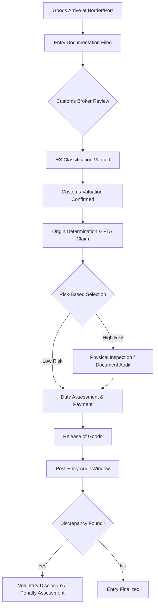

## Customs, Tariffs, and Trade Compliance


### Overview

Customs, tariffs, and trade compliance form the regulatory and financial layer governing the cross-border movement of goods. This domain determines landed cost, transit time, and legal exposure for any supply chain that crosses national boundaries. It encompasses classification of goods, valuation, duty calculation, country-of-origin determination, and adherence to import/export control regimes.

### Core Components

**Customs**

The government function (and associated documentation/process) that controls, inspects, and taxes goods crossing a border. Customs authorities enforce classification, valuation, and origin rules, and can detain, inspect, or reject shipments that fail compliance.

**Tariffs (Duties)**

Taxes imposed on imported (and occasionally exported) goods, typically calculated as a percentage of declared value (ad valorem), a fixed amount per unit (specific duty), or a combination of both (compound duty).

**Trade Compliance**

The broader discipline of ensuring that all cross-border transactions—imports, exports, re-exports—adhere to applicable laws: customs regulations, export controls, sanctions, anti-dumping measures, and free trade agreement (FTA) requirements.

### Harmonized System (HS) Classification

Every traded good is assigned a **Harmonized System (HS) code**, an internationally standardized numerical classification maintained by the World Customs Organization (WCO).

**Structure**

- First 6 digits: internationally standardized (HS6) — identical across all WCO member countries
- Digits 7–10: country-specific extensions for finer classification and statistical tracking (e.g., the US uses the **Harmonized Tariff Schedule (HTS)** at 10 digits; the EU uses the **Combined Nomenclature (CN)** at 8 digits)

**Example structure**



```
8471.30.01.00
│   │  │  └── National statistical suffix
│   │  └───── National tariff line
│   └──────── HS subheading (international)
└──────────── HS heading (international)
```

Misclassification is one of the most common sources of customs penalties, back-duty assessments, and shipment delays. Classification determines the applicable duty rate, so it is often contested between importers seeking favorable rates and customs authorities protecting revenue.

### Customs Valuation

Duties are typically assessed on the customs value of goods, not simply the invoice price. The WTO Customs Valuation Agreement establishes a hierarchy of valuation methods, applied in order:

1. **Transaction value** — price actually paid or payable for the goods (primary method, used in the vast majority of cases)
2. **Transaction value of identical goods**
3. **Transaction value of similar goods**
4. **Deductive value** — based on resale price in the importing country, working backward
5. **Computed value** — based on cost of production plus profit and general expenses
6. **Fall-back method** — flexible application of the above when none apply cleanly

**Key valuation adjustments (additions to transaction value)**

- Assists (tooling, molds, materials provided free or at reduced cost by the buyer)
- Royalties and license fees related to the imported goods, if paid as a condition of sale
- Packing costs
- Selling commissions (buyer's, not seller's)
- International freight and insurance (under CIF-based valuation regimes; not required under FOB-based regimes like the US)

### Rules of Origin

Origin determines which country's trade agreements, tariff rates, and quotas apply—**this is distinct from the country of shipment.**

**Two primary origin determination methods**

- **Wholly obtained** — goods entirely produced/grown/mined in a single country
- **Substantial transformation** — for goods with inputs from multiple countries, origin is assigned to the country where the last substantial transformation occurred, typically evaluated via:
  - **Tariff shift rule**: input HS classification must change to a specified degree (e.g., from raw material heading to finished good heading)
  - **Regional Value Content (RVC) threshold**: a minimum percentage of value must originate in the FTA region, calculated via build-up or build-down methods:

$$RVC = \frac{TV - VNM}{TV} \times 100$$

where $TV$ is the transaction value and $VNM$ is the value of non-originating materials.

**Preferential vs. non-preferential origin**

- *Preferential origin* qualifies goods for reduced/zero tariffs under an FTA (e.g., USMCA, EU-Korea FTA)
- *Non-preferential origin* is used for general trade statistics, anti-dumping duty application, and country-of-origin labeling, independent of any trade agreement

### Free Trade Agreements (FTAs) and Preferential Tariff Treatment

FTAs eliminate or reduce tariffs between member countries, conditional on meeting rules-of-origin requirements and providing proper documentation (Certificate of Origin, or self-certification under agreements like USMCA).

| Agreement | Members | Key mechanism |
| --- | --- | --- |
| USMCA | US, Mexico, Canada | RVC thresholds (e.g., 75% for autos), self-certification |
| EU Single Market | 27 EU states | No internal tariffs; common external tariff (CET) |
| RCEP | 15 Asia-Pacific nations | Cumulative rules of origin across members |
| CPTPP | 11 Pacific Rim nations | Tariff elimination schedules, IP/labor provisions |

**Tariff engineering** [Inference] refers to the legitimate practice of designing products, sourcing, or final assembly location specifically to qualify for a lower duty classification or preferential origin status; this is legal when it reflects genuine changes to the product or process, but becomes fraudulent (transshipment/origin-washing) when documentation misrepresents where substantial transformation actually occurred.

### Duty Types Beyond Standard Tariffs

- **Anti-dumping duties (ADD)**: imposed when a foreign producer sells goods below fair market value (dumping), calculated as the margin between export price and normal value
- **Countervailing duties (CVD)**: offset foreign government subsidies to exporters
- **Safeguard tariffs**: temporary protection against import surges, regardless of fairness of trade practice
- **Section 301/232 tariffs (US-specific)**: retaliatory or national-security-based tariffs applied outside standard WTO tariff schedules
- **Most-Favored-Nation (MFN) rate**: the standard non-preferential tariff a WTO member applies to imports from other WTO members absent a specific FTA

### Trade Compliance Program Components

**Import compliance**

- HS classification database and periodic re-validation
- Customs valuation documentation and transfer pricing alignment (particularly for related-party transactions)
- Certificate of origin management and FTA qualification audits
- Broker/customs agent management and power of attorney documentation
- Post-entry audit and voluntary disclosure procedures for identified errors

**Export compliance**

- **Export Control Classification Number (ECCN)** assignment (US) or equivalent dual-use goods classification
- **Denied party screening** against restricted/sanctioned entity lists (e.g., OFAC SDN list, BIS Entity List, EU consolidated sanctions list)
- **End-use/end-user checks** to prevent diversion to prohibited uses (military, WMD-related)
- Export license determination and application where required

**Program infrastructure**

- Global Trade Management (GTM) systems for automated classification, screening, and duty calculation (e.g., SAP GTS, Oracle GTM, Thomson Reuters ONESOURCE)
- Customs bonded warehouses and Foreign Trade Zones (FTZs) for duty deferral or elimination on re-exported goods
- Binding rulings from customs authorities to lock in classification/origin treatment in advance of shipment

### Customs Clearance Process Flow



### Landed Cost Calculation

Total landed cost integrates all customs and compliance-related costs into the true cost of an imported good:

$$LC = P + F + I + D + B + O$$

where $P$ = product price, $F$ = freight, $I$ = insurance, $D$ = duty (tariff), $B$ = brokerage/customs fees, $O$ = other charges (port fees, currency conversion, compliance overhead).

Duty itself, under an ad valorem system, is calculated as:

$$D = CV \times r$$

where $CV$ is customs value and $r$ is the applicable tariff rate (which depends on HS classification, origin, and any special duty regime such as ADD/CVD).

### Risk and Penalty Exposure

- **Strict liability regimes**: in many jurisdictions (including the US under 19 U.S.C. § 1592), importers are held to a "reasonable care" standard; even unintentional misclassification or undervaluation can trigger penalties
- **Penalty tiers** typically scale with culpability: negligence, gross negligence, and fraud carry progressively higher penalty multiples of the duty loss
- **Prior disclosure programs** allow importers who self-identify errors to receive reduced penalties, incentivizing proactive compliance audits
- [Inference] Given the complexity and jurisdiction-specific nature of these regimes, most compliance programs in practice combine automated GTM software with periodic legal/customs broker review, since manual classification alone does not scale reliably across large SKU catalogs.

### Key Points

- HS classification and country of origin—not shipment origin—are the two determinants that unlock preferential tariff treatment; both require rigorous, auditable documentation.
- Customs valuation follows a strict hierarchy of methods, with transaction value (adjusted for assists, royalties, and commissions) used in the overwhelming majority of cases.
- Trade compliance spans both import-side obligations (classification, valuation, origin) and export-side obligations (denied party screening, export licensing), and failures in either can produce civil or criminal liability.
- Total landed cost, not invoice price, is the correct basis for network and sourcing decisions, since duties, anti-dumping margins, and compliance overhead can materially change the economics of a sourcing location.

**Next Steps**

- Free Trade Zones (FTZs) and bonded warehouse duty deferral strategies
- Denied party screening and export control classification (ECCN/EAR/ITAR)
- Anti-dumping and countervailing duty investigation procedures
- Global Trade Management (GTM) system architecture and automation
- Transfer pricing and related-party customs valuation alignment
- Incoterms and their interaction with duty/tax liability allocation
- Section 301/232 tariff exposure and supply chain tariff mitigation strategies