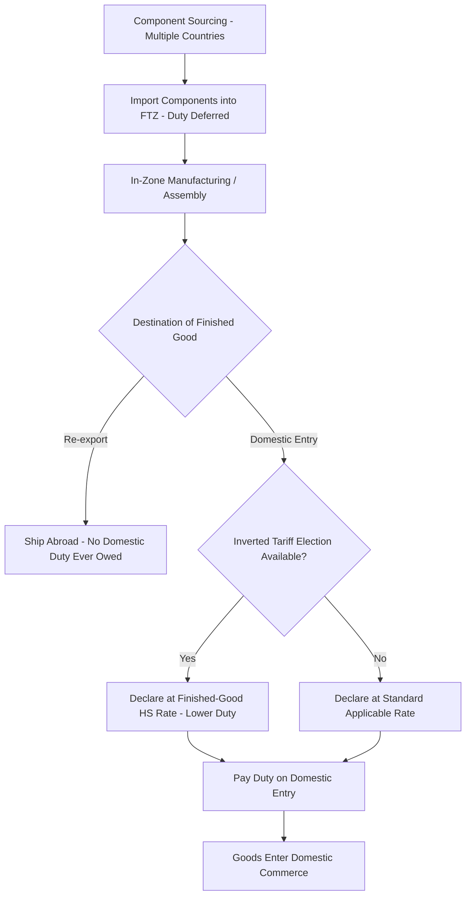

## Free Trade Zones and Tariff Engineering

### Overview

Free Trade Zones (FTZs) and tariff engineering are complementary tools used to legally minimize duty exposure and defer customs liability within a global supply chain. FTZs are designated physical/legal spaces where normal customs duty rules are suspended or modified; tariff engineering is the practice of designing products, sourcing, or processes to qualify for more favorable tariff treatment. Both require rigorous documentation to remain within legal bounds and avoid being recharacterized as duty evasion.

### Free Trade Zones (FTZs)

**Definition**

A Free Trade Zone (also called a Foreign Trade Zone in the US, Free Zone in the UAE, or Special Economic Zone in China) is a geographically defined area, typically near a port or border, treated as being outside the customs territory of the host country for duty purposes. Goods can enter, be stored, manipulated, assembled, or manufactured within the zone without triggering duty liability until they formally enter the domestic commerce of the host country (or are re-exported, in which case no domestic duty is ever owed).

**Core Mechanisms**

1. **Duty deferral** — duty is not paid at the moment goods enter the FTZ, only when (and if) goods leave the zone into the domestic market. This improves cash flow, especially for high-duty or high-volume importers.
2. **Duty elimination on re-export** — goods that enter an FTZ and are subsequently re-exported (with or without further processing) never incur domestic import duty, since they never formally enter the customs territory.
3. **Inverted tariff relief** — when a finished good carries a *lower* duty rate than its component parts (an "inverted tariff" or "tariff inversion"), a manufacturer can import components duty-free into the FTZ, assemble the finished product there, and pay duty at the finished-good rate upon entry to domestic commerce—capturing the rate differential as savings.
4. **Weekly/consolidated entry filing** — in some FTZ regimes (notably US FTZs), companies can file a single consolidated customs entry per week rather than per shipment, reducing Merchandise Processing Fee (MPF) exposure, since MPF in the US is capped per entry rather than assessed per shipment.
5. **No duty on scrap/waste/yield loss** — manufacturing waste generated within the zone (e.g., material scrapped during machining) is typically not subject to duty, since it never becomes part of a good that formally enters commerce.

**Illustrative Inverted Tariff Example**

Suppose a company imports steel components at a 10% duty rate but the finished assembled product (a machine) carries only a 3% duty rate under the destination country's tariff schedule.

- Without FTZ: duty paid on components at import = 10% of component value
- With FTZ: components enter zone duty-free, assembly occurs in-zone, and the finished machine is declared for domestic entry using the finished good's HS classification at 3%

$$\text{Savings} = CV_{component} \times (r_{component} - r_{finished})$$

[Inference] This benefit depends on the FTZ regime's specific "privileged foreign status" vs. "non-privileged foreign status" election rules, since some jurisdictions require the importer to elect in advance which duty rate (component or finished good) will apply, and elections may be irrevocable per entry.

### FTZ Types Compared

| Zone Type | Jurisdiction Example | Primary Use Case |
| --- | --- | --- |
| Foreign Trade Zone (FTZ) | United States | Manufacturing, assembly, distribution with duty deferral |
| Bonded Warehouse | Most countries (WCO framework) | Storage only, limited manipulation, duty deferred until withdrawal |
| Free Zone | UAE (Jebel Ali, DMCC) | Full foreign ownership, tax holidays, re-export hub |
| Special Economic Zone (SEZ) | China, India | Broader incentives: tax, labor, land, plus customs benefits |
| Maquiladora / IMMEX | Mexico | Duty-free import of inputs for export-oriented manufacturing |
| Export Processing Zone (EPZ) | Various developing economies | Export-focused manufacturing with duty/tax incentives |

**Bonded warehouse vs. FTZ distinction**: bonded warehouses generally permit storage and minor operations (repacking, labeling) but not full manufacturing/assembly; FTZs typically permit substantial manufacturing operations, including combining foreign and domestic inputs.

### Tariff Engineering

**Definition**

Tariff engineering is the deliberate design of a product's composition, assembly sequence, packaging, or sourcing location to achieve a more favorable HS classification, duty rate, or origin determination—while remaining truthful about what the product actually is at the time of customs declaration.

**Legal Basis**

Tariff engineering is well-established in customs law: multiple jurisdictions' courts and customs rulings have held that importers may legally structure products to minimize duty as long as the declared condition of the goods at entry is accurate and not a sham. [Unverified] The often-cited illustrative principle is that a manufacturer may choose to import an item in an unfinished or modified state specifically to obtain a lower tariff classification, provided the item is genuinely in that state at the border—this principle traces to historical customs case law but exact case citations should be verified against current jurisdiction-specific rulings before being relied upon.

**Common Tariff Engineering Techniques**

1. **Component-level import splitting** — importing a product disassembled (Semi-Knocked-Down, SKD, or Completely-Knocked-Down, CKD) to qualify for a different, often lower, classification than the fully assembled item, then completing final assembly domestically or in an FTZ.
2. **Material substitution** — changing a minor material component to shift HS classification into a heading with a lower duty rate, when the substitution does not compromise product function (e.g., adjusting fiber content percentages in textiles to cross a classification threshold).
3. **Value-content restructuring** — reallocating where value-added activities occur across the supply chain to meet Regional Value Content (RVC) thresholds under an FTA, thereby qualifying for preferential origin.
4. **Assembly location selection** — placing final, substantial-transformation assembly steps in a country with favorable trade agreement access, ensuring the "last substantial transformation" origin test is met there rather than in a non-preferential country.
5. **Packaging and set classification** — under General Rules of Interpretation (GRI) 3, "goods put up in sets for retail sale" are classified according to the component giving the set its essential character; deliberate bundling/unbundling can shift the applicable rate.

**Boundary Between Legal Engineering and Illegal Evasion**

| Legal Tariff Engineering | Illegal Duty Evasion |
| --- | --- |
| Genuine physical/functional change to product or process | Cosmetic relabeling with no real transformation |
| Accurate declaration of goods' actual condition at entry | Misrepresenting origin, value, or classification |
| Assembly/transformation genuinely occurs where claimed | Transshipment through a third country with minimal processing ("origin washing") |
| Documented, auditable process changes | Falsified certificates of origin or invoices |

[Inference] Regulatory scrutiny in this area has intensified, particularly around anti-dumping circumvention where goods are routed through a third country with only minimal finishing to disguise true origin; enforcement actions (e.g., under the US Enforce and Protect Act, EAPA) specifically target this pattern, so tariff engineering strategies should be validated with customs counsel or binding ruling requests before implementation at scale.

### FTZ and Tariff Engineering Combined Workflow

### Binding Rulings and Advance Certainty

To de-risk both FTZ operations and tariff engineering strategies, importers can request **binding classification rulings** or **binding origin rulings** from customs authorities in advance of importation (e.g., CBP's ruling program in the US via CROSS database, or EU Binding Tariff Information (BTI)). These rulings lock in the customs authority's position on classification/origin, providing legal certainty and protection against retroactive penalty assessment for the specific facts presented.

### Financial Impact Modeling

The value of an FTZ/tariff engineering strategy should be evaluated against total implementation cost, not just gross duty savings:

$$NPV_{FTZ} = \sum_{t=1}^{n} \frac{DS_t - OC_t}{(1+r)^t} - I_0$$

where $DS_t$ is duty savings in period $t$, $OC_t$ is incremental operating cost (zone fees, compliance overhead, security requirements), $I_0$ is initial setup investment (zone activation, bonding, facility retrofit), and $r$ is the discount rate.

[Inference] FTZ activation carries meaningful fixed and ongoing costs (zone application, customs bonding, inventory control system requirements, annual compliance audits), so the strategy is generally only economical above a certain volume/duty-savings threshold; smaller importers more commonly achieve similar benefits through bonded warehousing or duty drawback programs instead of a full FTZ designation.

### Related Mechanism: Duty Drawback

Distinct from FTZs but often used alongside them, **duty drawback** allows an importer to reclaim up to 99% of duties paid on imported goods that are subsequently exported (either unchanged or after further manufacturing), providing similar economic benefit to FTZ re-export treatment but applied retroactively via refund claim rather than prospectively via deferral.

### Key Points

- FTZs shift the *timing* and, in inverted-tariff cases, the *rate* of duty liability, while tariff engineering shifts the *classification or origin outcome* itself through genuine product/process design.
- Both tools are legal only when the underlying physical, functional, or locational facts are real and accurately declared; the dividing line from evasion is substance over form.
- Inverted tariff relief and duty deferral are the two primary FTZ economic levers; re-export elimination provides the largest benefit for export-oriented manufacturers.
- Binding rulings are the standard risk-mitigation tool for locking in tariff engineering and FTZ classification positions before committing capital to a strategy.

**Related Topics**

- Duty drawback program mechanics and documentation requirements
- Enforce and Protect Act (EAPA) and anti-circumvention investigations
- General Rules of Interpretation (GRI) for HS classification of composite goods and sets
- Bonded warehouse vs. FTZ operational and legal distinctions
- Regional Value Content (RVC) calculation methods (build-up vs. build-down)
- Maquiladora/IMMEX program structure for Mexico-based manufacturing
- Customs binding ruling request procedures (CBP CROSS, EU BTI)