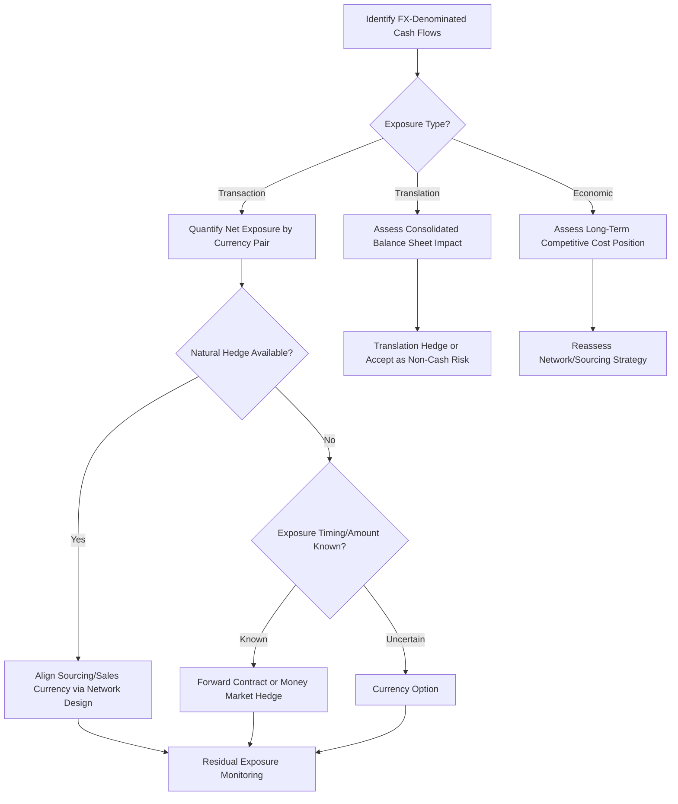

## Currency and Financial Risk in Global Networks

### Overview

Global supply chain networks expose firms to financial risks arising from operating across multiple currencies, jurisdictions, and payment terms. These risks affect procurement cost, revenue recognition, contract value, and capital allocation decisions independent of underlying operational performance. Managing this exposure requires distinguishing risk types, quantifying exposure, and applying appropriate hedging and contractual mechanisms.

### Categories of Currency Exposure

**Transaction Exposure**

Arises from specific, contracted cash flows denominated in a foreign currency—e.g., a purchase order to a supplier invoiced in EUR while the buyer's functional currency is USD. The risk materializes between contract signing and cash settlement, as exchange rate movement changes the actual cost/revenue in the firm's home currency.

**Translation Exposure**

Arises when consolidating financial statements of foreign subsidiaries into the parent company's reporting currency. Balance sheet items denominated in foreign currency are translated at period-end exchange rates, creating reported gains/losses that do not reflect actual cash flow but affect reported earnings and equity.

**Economic (Operating) Exposure**

The longer-term impact of exchange rate movements on a firm's competitive position and future cash flows, even absent specific contracted transactions—e.g., a manufacturer sourcing in a currency that appreciates relative to competitors' sourcing currencies becomes structurally less cost-competitive over time.

### Quantifying Exposure

**Net transaction exposure** for a given currency pair over a period:

$$NE_{FX} = \sum{Receivables_{FX}} - \sum{Payables_{FX}}$$

A positive net exposure means the firm is a net receiver of the foreign currency (benefits from its appreciation); negative net exposure means the firm is a net payer (benefits from its depreciation).

**Value at Risk (VaR) for FX exposure**, commonly used to size hedging programs, estimates the maximum expected loss over a given time horizon at a given confidence level:

$$VaR = NE_{FX} \times \sigma \times z$$

where $\sigma$ is the historical or implied volatility of the currency pair and $z$ is the z-score corresponding to the desired confidence interval (e.g., 1.65 for 95% confidence, one-tailed).

### Hedging Instruments

| Instrument | Mechanism | Typical Use Case |
| --- | --- | --- |
| Forward contract | Locks exchange rate for a future date | Known-date, known-amount payables/receivables |
| Currency option | Right (not obligation) to exchange at a set rate | Uncertain-timing or uncertain-amount exposure; asymmetric protection |
| Currency swap | Exchange of principal and/or interest in different currencies | Long-term financing across currencies (e.g., intercompany loans) |
| Money market hedge | Borrow/invest in foreign currency to offset exposure | Alternative to forwards when derivative markets are illiquid |
| Natural hedge | Matching foreign currency costs with foreign currency revenue | Structural, no-cost hedge via operational design (e.g., regional sourcing to match regional sales) |

**Forward contract payoff (from the perspective of a firm hedging a foreign-currency payable)**

$$Payoff = (F - S_T) \times Q$$

where $F$ is the contracted forward rate, $S_T$ is the spot rate at settlement, and $Q$ is the notional quantity. If the foreign currency has appreciated ($S_T > F$), the forward contract offsets the increased cost of the payable.

### Natural Hedging Through Network Design

Because natural hedges are cost-free and reduce reliance on financial derivatives, supply chain network design itself becomes a risk management lever:

- **Currency-matched sourcing**: sourcing inputs in the same currency as sales revenue in a given market (e.g., a European automaker sourcing EUR-denominated components to match EUR-denominated European sales) reduces net transactional exposure without any financial instrument.
- **Regional production footprint**: aligning manufacturing location with the region of final sale (a regional network strategy, as opposed to global consolidation) inherently reduces cross-currency exposure, since costs and revenues are denominated in the same or correlated currencies.
- **Multi-currency supplier diversification**: sourcing the same input from suppliers in different currency zones creates a portfolio effect, since currency movements across zones are imperfectly correlated.

[Inference] This is a key reason network strategy and treasury/financial risk management are interdependent decisions rather than separate functions—the choice between global, regional, and local sourcing footprints (see network strategy topic) directly determines the magnitude of currency exposure that must otherwise be hedged financially.

### Contractual Risk-Sharing Mechanisms

Beyond financial hedging, currency risk can be allocated contractually between supply chain partners:

- **Currency clauses**: contracts specify the currency of invoicing, shifting exposure entirely to one party (whichever party's functional currency differs from the invoice currency bears the risk)
- **Price adjustment/indexation clauses**: contract price automatically adjusts based on a reference exchange rate or index, sharing risk between buyer and seller rather than concentrating it
- **Currency risk-sharing agreements**: buyer and supplier agree to split any exchange rate movement beyond an agreed band (e.g., movements within ±3% are absorbed by the invoiced party; movements beyond that band are split 50/50)

### Other Financial Risks in Global Networks

**Payment and Credit Risk**

- **Letters of Credit (LC)**: bank-guaranteed payment instrument reducing counterparty payment risk in international trade, particularly where buyer and seller lack an established trust relationship
- **Documentary collection**: bank-mediated exchange of shipping documents for payment, offering less protection than an LC but lower cost
- **Trade credit insurance**: protects against buyer non-payment/insolvency, commonly used when extending open account terms internationally

**Inflation and Interest Rate Risk**

- Differential inflation rates between countries erode the real value of fixed-price long-term contracts denominated in a depreciating currency
- Interest rate differentials affect the cost of trade finance (e.g., factoring, supply chain finance programs) differently across currency zones, per interest rate parity:

$$F = S \times \frac{1 + i_{domestic}}{1 + i_{foreign}}$$

This relationship (covered interest rate parity) explains why forward rates diverge from spot rates in proportion to the interest rate differential between the two currencies, and is the basis for forward contract pricing.

**Sovereign and Political Risk**

- Capital controls restricting currency conversion or repatriation of profits
- Expropriation or contract repudiation risk in politically unstable jurisdictions
- Sanctions-driven sudden inability to transact in a given currency or with a given counterparty

### Financial Risk Management Decision Flow

### Supply Chain Finance and Working Capital Considerations

Global networks with long transit times and multiple currency conversions extend the **cash conversion cycle**, tying up working capital across the extended supply chain:

$$CCC = DIO + DSO - DPO$$

where $DIO$ is days inventory outstanding, $DSO$ is days sales outstanding, and $DPO$ is days payables outstanding. Longer international transit and customs clearance times increase $DIO$, while cross-border payment terms and currency settlement delays can extend $DSO$, both of which extend the CCC and increase working capital requirements—a further argument for regional/local network configurations where responsiveness and cash conversion cycle length are priorities.

**Supply chain finance (SCF) / reverse factoring** programs are frequently used to mitigate this in global networks: a financial institution pays suppliers early (at a discount reflecting the buyer's, not the supplier's, credit rating) while the buyer retains extended payment terms, improving liquidity for smaller international suppliers who might otherwise face expensive local financing.

### Key Points

- The three exposure types—transaction, translation, and economic—require different management approaches: transaction exposure is hedgeable with derivatives, translation is largely an accounting phenomenon, and economic exposure requires strategic (often network design) responses.
- Natural hedging through currency-matched sourcing and regional network design is generally preferable to financial hedging where operationally feasible, since it is cost-free and does not require ongoing derivative management.
- Network strategy decisions (global vs. regional vs. local, per the related topic) are inseparable from currency risk management, since geographic footprint directly determines the currency-matching of costs and revenues.
- [Inference] Firms with sophisticated global networks typically combine all three approaches—natural hedging via network design, contractual risk-sharing with trading partners, and residual financial hedging via derivatives—rather than relying on any single mechanism, since no single approach eliminates all exposure types simultaneously.

**Related Topics**

- Global vs. Regional vs. Local Network Strategies (network design as a natural hedge)
- Incoterms and their allocation of cost, risk, and currency exposure between parties
- Supply chain finance and reverse factoring program structures
- Letters of credit and documentary trade payment mechanisms
- Sovereign risk assessment frameworks for supplier/market selection
- Transfer pricing and intercompany currency exposure in multinational structures
- Working capital optimization across extended international supply chains